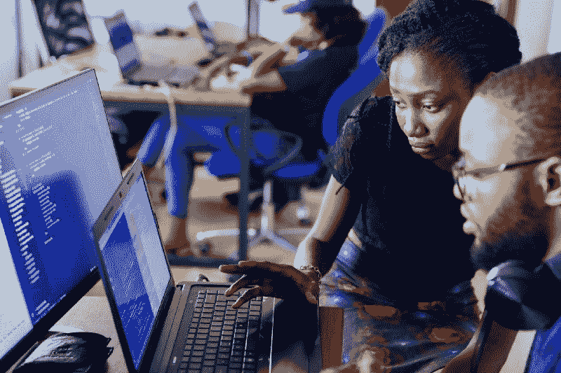
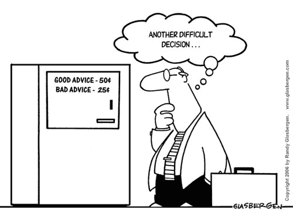
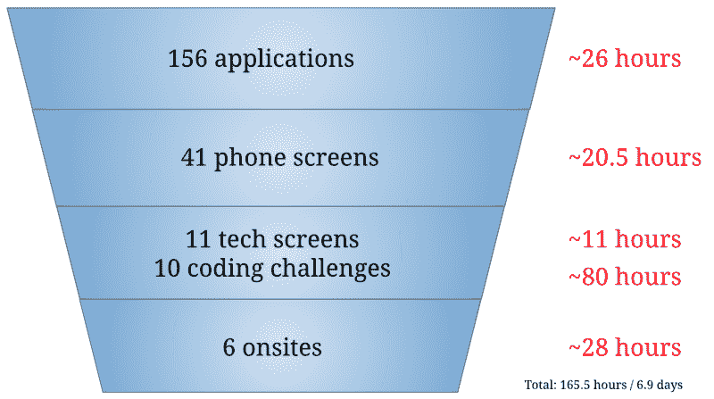

# 我如何在 11 个月内转行成为一名软件工程师(你也可以)

> 原文：<https://www.freecodecamp.org/news/how-i-switched-careers-to-become-a-software-engineer-in-11-months-and-how-you-can-too-9849afabc126/>

阿曼达·布林顿

# 我如何在 11 个月内转行成为一名软件工程师(你也可以)

Photo by [NESA by Makers](https://unsplash.com/photos/kwzWjTnDPLk?utm_source=unsplash&utm_medium=referral&utm_content=creditCopyText) on [Unsplash](https://unsplash.com/search/photos/developer-female?utm_source=unsplash&utm_medium=referral&utm_content=creditCopyText)

在我决定进入软件工程之前，我是一名技术领域的营销人员。我尝试了相当多类型的营销活动，公共关系，搜索引擎优化，内容创作，数字广告，电子邮件营销，但从来没有找到一个完美的适合。

我的上一家公司是一家个人金融初创公司，拥有很高的品牌认知度。他们的座右铭是**内容为王**。与大多数科技公司不同，这里有大量的编辑和记者，只有少数软件工程师。

我入职一年后，公司决定调整战略。内容已经不够了。那一年，大量新的个人金融初创公司推出了移动应用，承诺帮助消费者跟踪他们的财务状况，学习预算，消除学生贷款债务，并整合信用卡支付。我的公司不想落后，开始精简业务的编辑部门，同时快速招聘产品人员、工程师和设计师。

一种内在的感觉让我意识到，是时候换挡了。⚙️

在这篇文章中，我将从头到尾讲述我是如何转行成为一名软件工程师的。所以让我们开始吧。

#### **第一步:研究沉浸式节目**

我开始研究软件工程中的沉浸式课程。我喜欢的是 [App Academy](https://www.appacademy.io/) 和 [Hack Reactor](https://www.hackreactor.com/) 都提供免费的面对面介绍课程，帮助未来的学生准备入学考试。我也听到了关于 [Hackbright](https://hackbrightacademy.com/) 的正面评价，并在那之后遇到了许多参加他们项目的有才华的女性。

最终，Hack Reactor 说服了我，因为它提供了为期一个月的严格的结构化学习计划(SSP)课程。该计划旨在将参与者从初学者转变为黑客反应堆沉浸式准备。

课程似乎很实用。我认识三个熟人，他们在完成这个项目后成功地获得了软件工程的职位，这很有帮助。

#### 步骤 2:沉浸式编码

一旦我把注意力集中到破解反应堆，我需要准备 SSP 和入学考试。为此，我完成了 uda city[JavaScript](https://www.udacity.com/course/intro-to-javascript--ud803)入门课程以及其他一些 JavaScript 在线课程。

在 SSP 和 Hack Reactor 的沉浸式项目之间，我花了**四个月**编写代码，每周 **6 天**，每天 **12 个多小时**。我提高了解决问题的技能，增强了对 JavaScript 的理解，学习了前端和后端框架，并练习了与其他工程师一起工作。

#### 第三步:通过网络课程为求职做准备

尽管我在 Hack Reactor 的经历很紧张，但这只是开始。在这个项目中，我有一个越来越长的概念清单，我一直在与之斗争。最重要的是算法和数据结构。

软件沉浸式项目非常适合教你在工程师工作中需要的技能。工作面试培训有点不同，掌握算法和数据结构通常是获得现场面试的关键。我试着申请那些放弃传统白板的公司，但是这些公司少之又少。

[破解编码面试](http://www.crackingthecodinginterview.com/)被视为学习算法的倒数第二资源。然而，我个人认为这不是最有用的资源。相反，这些是我用来准备技术面试和现场采访的资源:

*   CodePath -为期 8 周的课程，涵盖了从数据结构到系统设计的所有最常见的面试问题
*   [面试蛋糕](https://www.interviewcake.com/) -解释算法思维中最常见模式的指南
*   [LeetCode](https://leetcode.com/) -没完没了的练习题
*   [钻研系统设计面试](https://www.educative.io/collection/5668639101419520/5649050225344512) -解释常见系统设计问题中涉及的权衡，例如如何设计 Instagram

Never stop learning

#### 第四步:听取经验丰富的工程师的建议

我向我关系网中的许多高级工程师寻求求职建议。每个人都对他们的时间感到亲切，并对看到新型人才进入该行业感到兴奋。以下是一些最有帮助的建议:

*   **迈出第一步:**每个工程师都必须从某个地方开始。许多工程师在小的无名公司工作后进入了名牌公司。如果你没有马上找到合适的，也不要担心。
*   重写你的简历:如果你是一名新工程师，你的简历可能会让你看起来很初级。关注你做出的权衡和技术决策，而不是你实现了什么。
*   寻找指导机会:瞄准一个有 30 多名工程师的团队，因为这将教会你最好的编码实践，并提供指导机会。否则，要知道你的经理是谁，并确保他们能够帮助你做出技术决策(年轻的工程经理经常被抛入人员或领导经验有限的角色)。
*   从事个人项目:这将在求职过程中展示你对工程的热情，并让你在面试中有独特的话题。

#### 第五步:忽略招聘人员和其他人的无用建议

我的求职发生在 2018 年夏天。我学会了对许多善意但无益的建议不予理睬。这些信息来自招聘人员、工程师同事和关心他们的朋友。以下是其中的一些:

*   在过去的几年里，初级工程师的就业市场已经放缓。中型公司只招聘高级职位，并冻结了初级候选人的招聘。
*   不仅市场已经饱和，而且训练营的毕业生质量在过去几年里也有所下降。找工作会很难。
*   你是一个强有力的候选人，但我们公司没有资源来指导你。请保持联系，等你有了更多的经验，我们很乐意再面试你。
*   祝你在夏天找到工作。你在和所有暑期实习的计算机科学学生竞争。秋季有更多职位空缺时再试一次。
*   祝你在秋季找到工作。随着公司临近第四季度，招聘将会放缓。如果你今年夏天找不到工作，你将不得不等到明年。
*   试试成为产品经理或者找实习。也许当你准备好的时候，你可以转向软件工程。

我确信许多有抱负的工程师听到过类似的反馈。关键是学会不去理会它，保持专注，否则很容易筋疲力尽。

#### 第六步:制定学习计划

在 Hack Reactor 之后，我花了很多时间回顾技术概念，为技术筛选和采访做准备。以下是我粗略的学习计划:

*   学习算法和数据结构。
*   学习系统设计。
*   举办一次黑客马拉松(它不会教你工程最佳实践，但这是一次有趣的集体经历)。
*   建立一个个人投资组合(或者另一个你可以谈论的项目)。
*   记下每个电话屏幕和现场的每个面试问题。复习你不知道的答案。
*   和别人一起练习。当你在一个小团队中研究算法时，会更有趣。( [Pramp](https://www.pramp.com/dashboard) 和 [CodePath](http://codepath.com/) 是我找到练习伙伴的两种方式)。

#### 第七步:建立网上形象

让招聘人员很容易找到你。通过以下网站上的项目截图和 GitHub 链接，构建强大的个人资料。请随意点击链接查看我的示例(或与我联系):

*   [LinkedIn](http://linkedin.com/in/albull)
*   [录用](https://hired.com/x/63p98)
*   [AngelList](https://angel.co/amanda-bullington)
*   [个人投资组合](http://www.albull.us/)
*   [GitHub](https://github.com/albullington)

向未来的雇主展示你的工作质量是很重要的。照片、视频、实时项目的链接、[详细记录的阅读材料](https://github.com/matiassingers/awesome-readme)以及干净的编码实践，让招聘人员更容易抓住你的机会。

#### 第八步:记住，这是一个数字游戏

我经常从工程师、职业教练和导师那里听到重复的话，“这只是一个数字游戏”。最终，这是我的数据:

我的申请大多是前台的，有一些推荐，一些招聘人员联系了我，还有一些来自雇佣者或天使投资者的外联。

了解这些数字有助于你采取分析方法。例如:

*   我的全部申请(冷申请、热申请、推荐申请)中有 26%转化为初始电话屏幕。
*   我 51%的手机屏幕转换为技术屏幕或任务
*   我 28%的技术屏幕和任务转换为现场

从这一点上，我了解到，我在让自己的简历引起招聘人员的兴趣方面相当稳定，在最初的电话交谈中取得了成功(还有改进的空间)，但在展示我的技术技能方面有些薄弱。

分析这些数字让我可以不去制造更多的应用程序。相反，我花了额外的时间温习技术弱点，目的是提高我从技术屏幕到现场的转化率。

#### 第九步:掌握现场

一旦你足够幸运地找到一两个现场，还有很多东西需要掌握。就我个人而言，我发现大多数网站都非常累人。他们持续了 2 - 6 个小时，涉及的话题范围很广。有些公司忘了给我任何优惠。

因为我正在接受技术知识的测试，很少有闲聊，我经常被一连几个小时的问题所困扰。

一家公司告诉我，他们不会和我一起前进，因为在数小时的成功算法后，我在最后一个问题上挣扎。我仍然不确定他们从最后一个问题中学到了什么，他们不可能从技术屏幕或之前的几个小时中收集到，但反馈很刺痛。

我现场采访的主题包括:

*   算法
*   系统设计
*   使用该公司的 API 构建一个应用程序
*   关于我的编码语言(JavaScript)的知识深度问题
*   关于 HTML/CSS 的知识深度问题
*   关于前端框架的知识深度问题
*   关于各种数据库的知识深度问题(SQL/noSQL)
*   脑筋急转弯(想想高中的 SAT 备考)
*   克隆并解释你创建的 X GitHub 项目，你做了什么权衡，以及你将来会做什么不同
*   给我们一个 1 小时的陈述，你可以选择任何话题(把这当成一个危险信号，除非你的工作特别需要与客户沟通或推销你的想法)

这种多样性使得人们很难知道该学什么。

在每次技术筛选和现场考察后，我都记下了每次面试中被问到的所有问题的清单。这成了我今后在现场的学习指南。

当我错过问题时，我试着把它视为一个学习的机会。

#### 第十步:带零食

也许只是我，但是在一群新人中回答技术问题让我感到饥饿。

在我的第一个网站上，随着我的血糖下降，我回答问题的能力越来越差。毫不奇怪，这些并没有导致要约。

在我的第三份工作中，他们安排我从 10 点到下午 2 点，没有午休时间，所以我特别要求了一个。这在某种程度上是有效的，直到招聘经理跟着我去了一个午餐地点，并连珠炮似的问了我 50 多个 JavaScript 问题。他无视我(一再)提出的快速精神放松的要求。又一次失败。

最后，我找到了一个可行的解决方案——每次面试都带一大杯绿色思慕雪。这比在洗手间试图偷偷把花生 M & Ms 巧克力豆塞进我嘴里好多了(此外，我通常被护送进出洗手间，所以那不是一个真正的选择)。

No, really. Tired but blood-sugared after onsite 5.

#### 步骤 11:提炼行为问题的答案，避免筋疲力尽

你认为自己五年后会怎样？

面试中难住我的一个问题是，“你认为自己 5 年后会怎么样？”说实话，我还是不知道。

有一个经理轨道和个人贡献者轨道。

有很多工程职业道路我仍然没有完全理解——网络、移动、网站可靠性和 DevOps，仅举几例。

然后是后端、前端和全栈。有时候这些角色之间的界限很清晰，有时候又很模糊。我在寻找的过程中了解到，虽然我不知道我会走哪条路，但有些任务我比其他人更喜欢或更不喜欢。

我不喜欢在网站上玩像素游戏，但为移动设备设计很有趣。设计架构和建立数据库有点乏味，但我喜欢获取大量数据，并对其进行操作或将其转化为有趣的可视化内容。

所以谁知道我会在哪里结束。现在，我要试着做有趣和令人兴奋的事情。

### 一些一般想法

#### **编码挑战是一个学习的机会**

我尝试了很多编码挑战，但最终都不好意思上交。然后，有一些我没有完成，但还是上交了，还有一个关于我在调试过程中所采取的步骤的解释。

起初，我认为不完整的编码挑战是我自身无能的标志——有时候我怀疑自己是否不适合做工程师。但是当我改变了我的思维模式，开始思考我从每一个人身上学到了什么时，他们变得有趣了。

例如，其中一个让我对异步 API 调用有了更深的理解，而另一个帮助我认识到解决边缘情况和错误消息的重要性。其中一个教我如何调试 Ruby on Rails。

#### 从容应对拒绝

每个技术屏幕和现场也是如此。起初，拒绝刺痛并加剧了我的不安全感。然后，拒绝变得很正常。当我能够抛开自我怀疑，并对每位工程师花时间与我交谈能学到什么感到好奇时，我学到了更多。

This was not how I felt most of the time, but I tried

每个人处理问题的方式都不一样，我有幸在采访过程中从几十位业内工程师那里学到了一些东西。

#### 找一个导师

我很幸运在整个面试过程中有一个全明星导师。三个月来，我的导师每周都会打电话和发电子邮件来询问求职进展如何，以及我面临着哪些阻碍。

我听到很多工程师同事说导师听起来不错，但他们不知道该问什么问题。有时我们会谈到策略，比如发送多少应用程序，如何编写有效的 Git commit，或者如何在编码挑战中超越自我。其他时候，她只是提醒我，尽管遭到了(许多)拒绝，但我正在成为一名更强的工程师，因此每天都更接近找到我梦想的公司。

导师可以让你对自己的目标负责，帮助你度过筋疲力尽的感觉，并为你提供更深入学习的正确资源。我很感激在整个求职过程中有一个倡导者，我期待着能够作为一名新工程师向前支付它！

#### 结论

有时候，转行比我想象的要困难得多。我的导师可以肯定地证明，有很多天我不确定自己能做到。

成为一名工程师需要很多努力。这意味着拓展我的职业网络，坦然面对前方有一条巨大的学习曲线，忽略所有的反对者。这意味着找到适合我学习风格的在线资源。这意味着让我大脑中告诉我自己没有能力的那部分安静下来，转而专注于收集新知识。每一天我从事一个新的项目，研究一个新的算法，或者在面试中回答问题，我都成为一个更好的工程师。

这场斗争值得吗？绝对的。

我很高兴地说，我找到了一个非常适合我的角色，在那里我可以继续学习和成长。我的职业网络比以往任何时候都强大，最重要的是，我获得了信心，知道我可以投入工作，使我的梦想成为现实。