# 我如何使用深度学习对 Fast.ai 的医学图像进行分类

> 原文：<https://www.freecodecamp.org/news/how-i-used-deep-learning-to-classify-medical-images-with-fast-ai-cc4cfd64173c/>

詹姆斯·迪特尔

卷积神经网络(CNN)在过去两年中迅速发展，有助于医学图像分类。即使是业余爱好者，我们如何利用这些最新的进展，并将它们应用于新的数据集？我们将走完这个过程，它比你想象的要容易得多。

当我们家搬到奥马哈时，我的妻子(她是儿科胃肠病学的研究员)回家后说她想在她的研究中使用图像分类。

哦，我准备好了。

两年多来，我一直将深度学习作为一种爱好。我甚至写了几篇文章([这里](https://medium.com/@JamesDietle/part-of-the-fun-of-learning-data-science-is-seeing-how-quickly-it-can-relate-to-your-usual-roles-ceb7b0ff5f13)和[这里](https://medium.com/@JamesDietle/9-months-in-the-hobby-of-deep-learning-d688cce4fa2e))。现在我对一个问题有了一些方向。不幸的是，我对胃肠道一无所知，而且我妻子从高中起就没编程过。

### **从头开始**

我进入深度学习的整个旅程经历了 [Fast.ai](https://www.fast.ai/) 过程。这始于 2 年前，当时我试图验证我们在安全领域使用的所有“人工智能”和“机器学习”没有被过度宣传或带有偏见。是的，我们避开了这些技术。最发人深省的事实是，要成为该领域的专家需要做一些实验。

#### **设置**

我在所有步骤中都使用了 Fast.ai，最新版本使这比以往任何时候都更简单。创造学习环境的方法正在迅速增加。现在有了 docker images、Amazon amis 和服务(如 [Crestle](https://www.crestle.com/) )使设置变得前所未有的容易。

无论你是最绿色的编码初学者，还是经验丰富的忍者，[从 Fast.ai 网站上的这里](https://course.fast.ai/)开始。

在课程的前一次迭代中，我选择了构建我的机器学习平台。然而，这不是必要的，我建议使用另一种服务。选择对你来说最容易的路线，并开始尝试。

#### **第 3 版 Fast.ai 变更**

我已经参加了 Fast.ai 的其他迭代，在回顾了最新的课程后，我注意到笔记本上的所有内容都简单多了。文档和示例随处可见。

让我们深入到“ [lesson1-pets](https://github.com/fastai/course-v3/blob/master/nbs/dl1/lesson1-pets.ipynb) ”中，如果你已经设置了 Fast.ai，请随意使用你的 jupyter 实例。

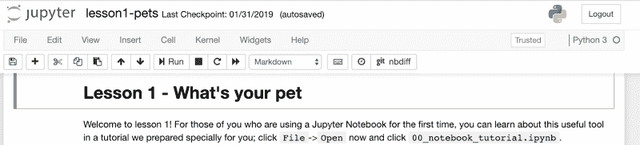

lesson1-pets from Fast.ai

我为第一课做了准备(通常定义两个类——猫和狗——就像我以前多次做的那样。然而，我发现这次我们用更少的代码行做了一些更复杂的关于 33 种猫狗的事情。

CNN 正在学习 7 行代码！！

这不是唯一的重大变化。另一个巨大的进步是显示错误。例如，我们可以从下面的数据集中快速看到一组最高损失(我们确信预测错误的项目)和相应的 pet 图片。

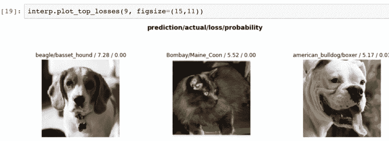

Incorrect cat and dog breed predictions

这个函数相当于对坏数据的抽查。确保狮子、老虎或熊不会溜进片场。我们还可以看到是否有明显的错误。

混乱矩阵对我更有好处。这让我可以在 33 个品种中寻找错误分类的模式。

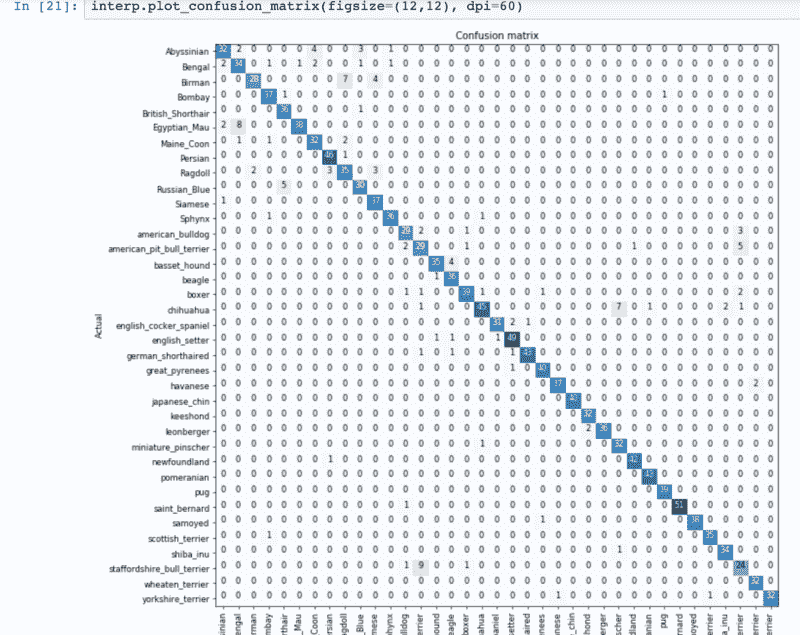

在展示的 33 个品种中，我们可以看到我们的数据在哪里出现分歧，并问自己这是否有意义。有几个品种特别突出，下面是一些常见混淆图像的例子:

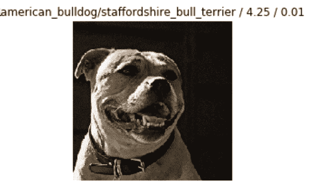

Staffordshire terrier and American terrier.

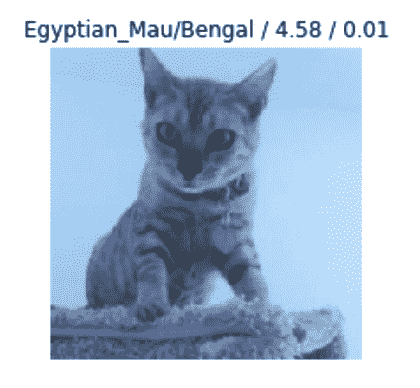

Egyptian Mau and Bengal

不是一个宠物主人或爱好者，我不可能弄清楚这些关于一个品种的细微特征的细微细节。这个模型比我能做的要好得多！虽然我确实得到了答案，但我也很想找到缺失的特征或数据来改进模型。

有一个重要的警告。我们现在正处于模型向我们传授数据的阶段。有时我们会陷入一种思维定势，认为产出是过程的终点。如果我们陷入这个陷阱，我们可能会错过一个创造积极反馈循环的绝佳机会。

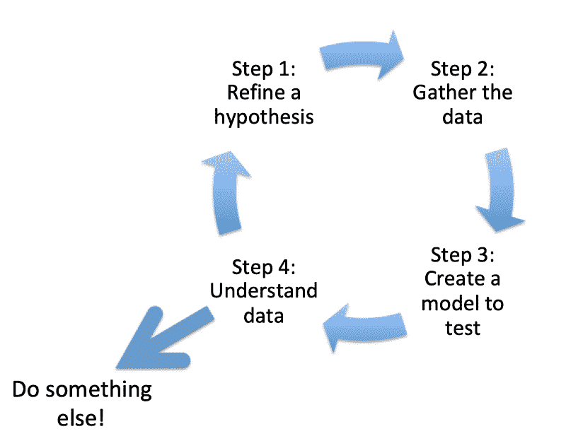

30-second powerpoint drawing

因此，在第四阶段，我们变得更加明智和自信。给定这些数据，我应该通过哪些决策来提高准确性？

*   更多培训
*   更多图像
*   更强大的架构

绝招问题！我将查看一个不同的数据集。让我们站起来，用内窥镜检查人们的内脏。

### **得到数据集，看到一大堆东西**

对于其他对胃肠病学感兴趣的人，我建议查看 Kvasir 数据集。他们网站的一个很好的描述是:

> 该数据集包含来自胃肠道内部的图像。图像集合被分类为三个重要的解剖标志和三个有临床意义的发现。此外，它还包含两类与内窥镜息肉切除相关的图像。由医生(有经验的内窥镜专家)对数据集进行分类和注释

还有一篇由专家(Pogorelov 等人)撰写的研究论文，描述了他们是如何解决这个问题的，其中包括他们的发现。

太好了，这是一个从宠物转移到人类的极好的数据集。尽管这个数据集不那么令人喜欢(也包括粪便样本)，但它是令人兴奋和完整的。

当我们下载数据时，我们注意到的第一件事是在这个数据集中有 8 个类需要我们分类，而不是之前的 33 个。然而，它不应该改变我们的任何其他业务。

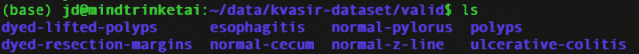

附注:最初，我花了几个小时编写如何将文件夹移动到验证文件夹中的脚本，并花了一些时间来设置一切。编写脚本的努力被证明是浪费时间，因为已经有了一个简单的函数来创建验证集。

这个教训就是“如果某件事很棘手，那么很可能 Fast.ai 社区的某个人已经为你编写了代码。”

### 一头扎进笔记本

你可以在这里的 [GitHub 上拿到我的 Jupyter 笔记本。](https://github.com/jamesdietle/fastaipart3/blob/master/Kvasir-Dataset2.ipynb)

#### **为速度和实验而建造**

当我们开始试验时，获得正确的框架是至关重要的。尝试设置使其工作所需的最小值，以便以后可以扩大规模。确保数据被接收、处理，并提供有意义的输出。

这意味着:

*   使用较小的批次
*   使用较低数量的纪元
*   限制变换

如果跑步时间超过 2 分钟，想办法跑得更快。一旦一切就绪，我们就可以疯狂了。

#### 数据处理

数据的优先化、组织、整理和处理是深度学习最重要的方面。这里有一个粗略的图片显示数据处理是如何发生的，或者你可以阅读[文档](https://docs.fast.ai/basic_data.html)。

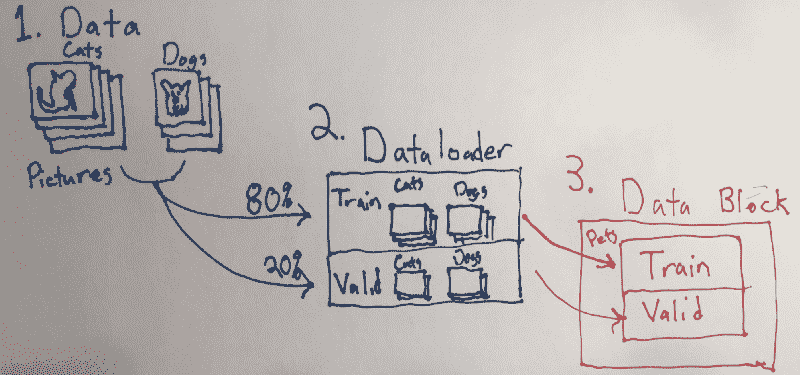

因此，我们需要对内窥镜数据做同样的事情，这是一行代码。

解释变量:

*   路径指向我们的数据(#1)
*   验证设置为 20%,以正确创建数据加载器
*   默认转换
*   图像大小设置为 224

就是这样！数据块已经设置完毕，可以进入下一阶段了。

#### Resnet

我们有数据，我们需要决定一个架构。目前，Resnet 广泛用于图像分类。它后面有一个数字，等于层数。许多[更好的文章](https://medium.com/@14prakash/understanding-and-implementing-architectures-of-resnet-and-resnext-for-state-of-the-art-image-cf51669e1624)存在[关于 Resnet](https://medium.com/@14prakash/image-classification-architectures-review-d8b95075998f) 的问题，因此，对这篇文章进行简化:

> 更多层=更准确(万岁！)

> 更多层=需要更多计算和时间(嘘..)

因此 Resnet34 具有 34 层图像查找良好性。

#### 准备好了吗？我准备好了！

有了结构化的数据、架构和默认的误差度量，我们就有了学习者开始适应所需的一切。

让我们看一些代码:

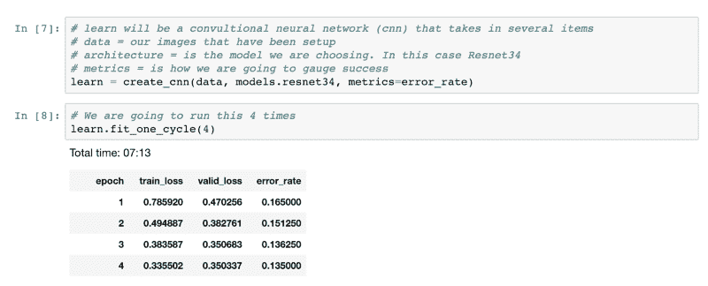

我们看到，在循环 7 分钟后，我们达到了 87%的准确率。还不错。一点也不差。

我不是医生，所以我没有受过专业训练。我不知道该找什么，分类错误，或者数据是否有用。所以我直接去了混乱矩阵，看看哪里出错了。

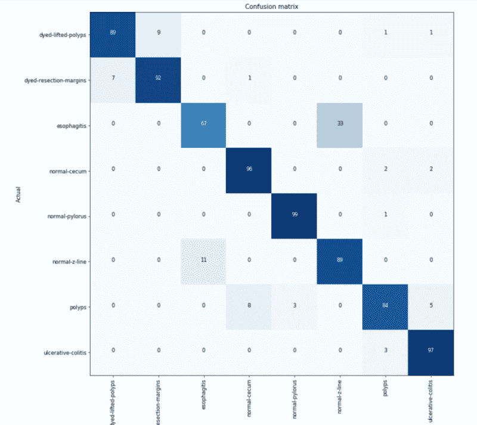

8 类中，2 组 2 经常相互混淆。作为基线，我只能看到他们是否被染色，息肉，或其他东西。因此，与我个人 30%的准确率相比，这台机器的准确率达到了惊人的 87%。

看了这两组图片后，你就知道为什么了。(因为它们是医学图像，所以它们可能是 NSFW，并且存在于 Jupyter 笔记本中。)

1.  染色的切片相互混淆。这种类型的错误是可以预料的。它们都是蓝色的，看起来非常相似。
2.  食管炎和正常的 Z 线很难区分。也许食管炎呈现比 Z 线更红？我不确定。

不管怎样，一切看起来都很好，我们需要加强我们的比赛。

### 更多层，更多图像，更强大！

现在，我们看到我们的超高速模型工作，让我们切换到发电站。

*   我将数据集的大小从 v1 增加到 v2。更大的图像集使可用图像的数量翻倍，从 4000 增加到 8000。*(注:本文所有例子均显示 v2。)*
*   改造一切有意义的东西。有很多事情你可以调整。我们很快会深入探讨这一点。
*   由于数据集中的图像相对较大，我决定试着将图像放大。虽然这会慢一些，但我很好奇它是否能更好地挑出小细节。这个假设仍然需要一些实验。
*   越来越多的时代。
*   如果您还记得之前的内容，Resnet50 会有更多的层(更精确)，但需要更多的计算时间，因此会更慢。所以我们将型号从 Resnet34 改为 Resnet50。

#### **变换:充分利用图像**

图像变换是提高精确度的一个很好的方法。如果我们对图像进行随机更改(旋转、改变颜色、翻转等)。)我们可以让它看起来像我们有更多的图像来训练，我们不太可能过度适应。和获取更多图像一样好吗？不，但是它又快又便宜。

当选择使用哪种变换时，我们想要有意义的东西。如果我们在看狗的品种，这里有一些相同图像的正常变换的例子。如果这些中的任何一个单独出现在数据集中，我们会认为这是有意义的。现在我们有 8 张图片，而不是每 1 张。

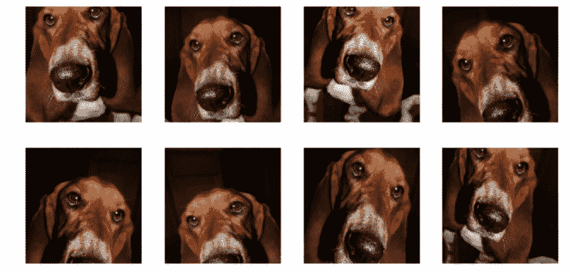

如果我们在疯狂转型中走得太远了怎么办？我们可以看到下面的图片，有点太极端了。我们不想使用其中的许多，因为它们不清楚，也没有正确地指向我们期望数据进入的方向。虽然一只狗可能是倾斜的，但它永远不会倒过来。

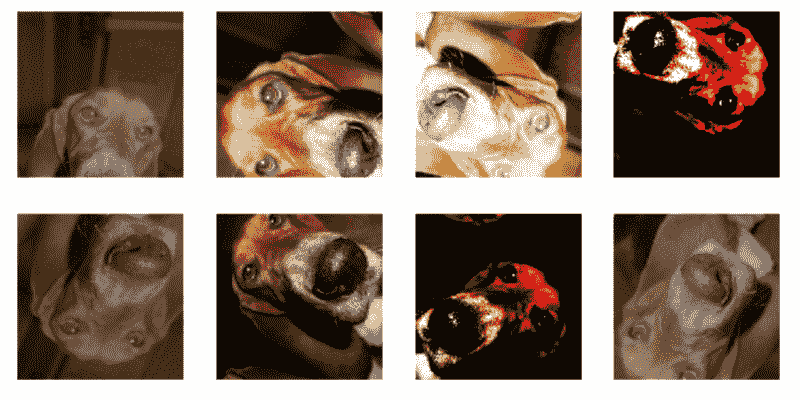

对于内窥镜图像，我们并不担心它被颠倒或过度倾斜。内窥镜无处不在，可以 360 度旋转，所以我疯狂地进行旋转变换。即使是一点点的颜色，因为身体内部的照明会有所不同。所有这些似乎都有可能。

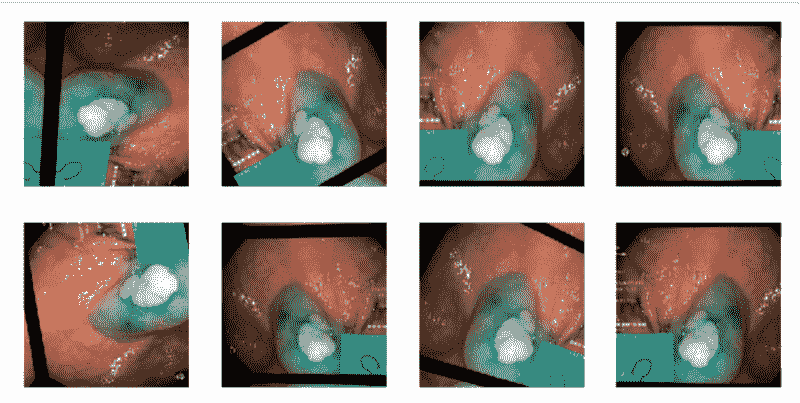

Example of dyed polyps

*(注意:绿色方框表示示波器移动了多远。因此，这种技术可能会切断本可以提供的价值。)*

#### 重建数据并启动

现在，我们可以看到如何添加转换，以及如何为数据转换其他变量:

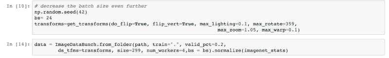

然后我们改变学习者:

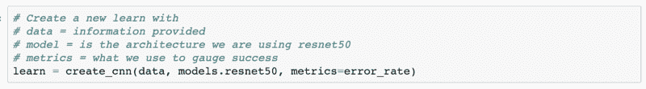

It really is that easy

然后我们准备开火！

*许多时代之后……*

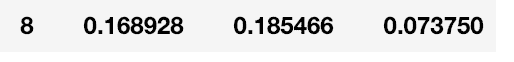

Just worry about the number of the right here

93%准确！还不错，让我们再看一遍混淆矩阵。

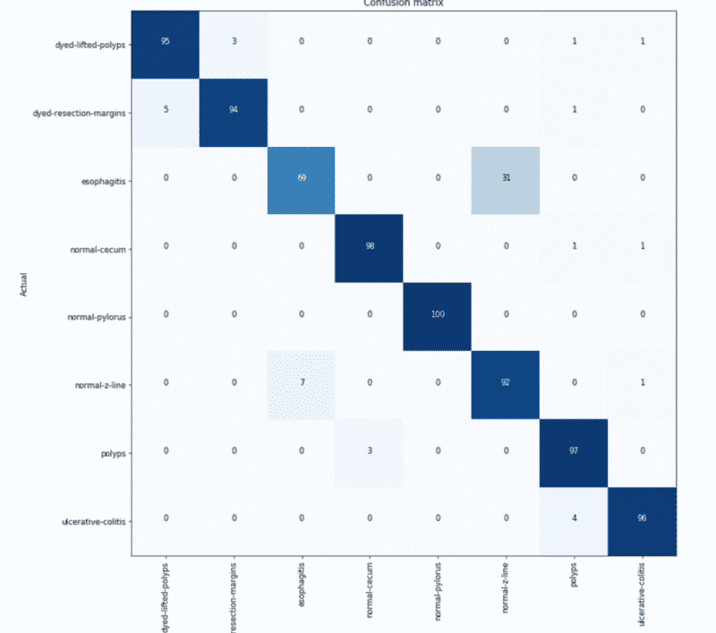

看起来染色分类的问题已经消失了，但是食管炎的错误仍然存在。事实上，在我的一些迭代中，错误的数量变得更糟。

### 这能在生产中运行吗？

是的，有将这些信息作为 web 服务快速托管的说明。只要许可证还没有到期，并且你不介意等待…你可以在这里的 [Render 上试试！](https://kvasir-demo.onrender.com/)

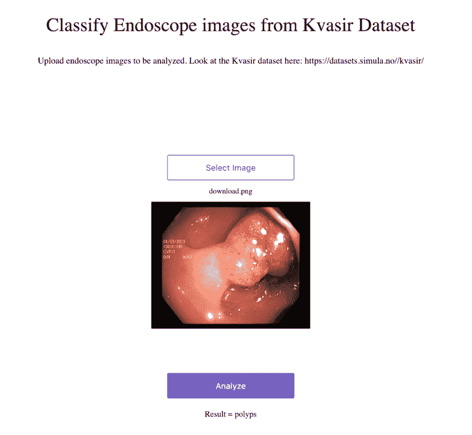

### 结论和后续行动:

如你所见，将新课程从 Fast.ai 转移到不同的数据集非常简单。比以往任何时候都更容易接近。

当进行测试时，确保你从一个快速的概念开始，以确保一切都在正确的道路上，然后再打开电源。创建一个正反馈循环，以确保你既正确定位，又作为一种机制，迫使你学习更多关于数据集的知识。这样做你会有更丰富的经历。

对这个数据集的一些观察。

*   我正在尝试错误地解决这个问题。当这些幻灯片有多个分类时，我使用的是单个分类器。我后来在阅读研究论文时发现了这一点。*不要等到最后才看论文！*
*   作为一个多分类问题，我应该包括基本特征的包围盒。
*   分类可以受益于描述内窥镜在体内有多远的特征。身体中的重要标志将有助于对图像进行分类。图片左下方的小绿框是一张地图，描述了内窥镜的位置，这可能是一个有用的探索特征。
*   如果你没有看过新的 fast.ai 课程，看看吧，我写这篇文章花的时间比编写程序还多，就这么简单。

**资源**

*   [Github 笔记本](https://github.com/jamesdietle/fastaipart3/blob/master/Kvasir-Dataset2.ipynb)
*   [Kvasir 数据集](https://datasets.simula.no/kvasir/#data-collection)
*   [KVASIR:用于计算机辅助胃肠疾病检测的多类图像数据集](https://www.researchgate.net/publication/316215961_KVASIR_A_Multi-Class_Image_Dataset_for_Computer_Aided_Gastrointestinal_Disease_Detection)(波戈廖夫、康斯坦丁&兰德尔、克里斯汀&格里沃兹、卡斯滕&德朗格、托马斯&艾斯凯兰、西格伦&约翰森、达格&斯潘皮纳托、康索奥&当阮、德田&勒克斯、马蒂亚斯&施密特、彼得&里格勒、迈克尔&哈尔沃森)
*   [FastAI](https://docs.fast.ai/)
*   [指针](https://pytorch.org/docs/master/)
*   [Youtube 上关于这个话题的视频](https://youtu.be/GXuqT4uMKZk)