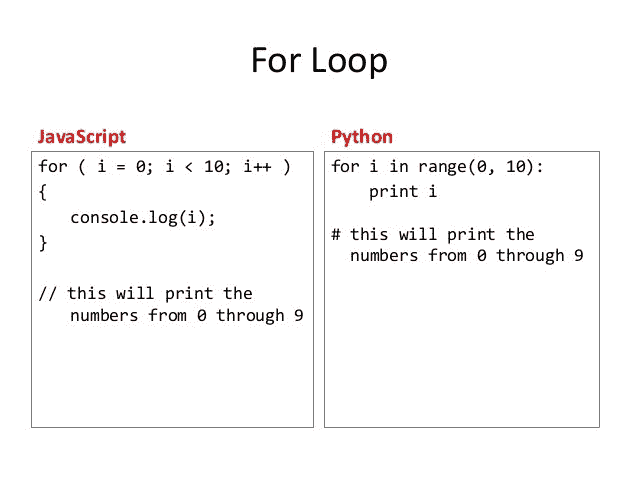
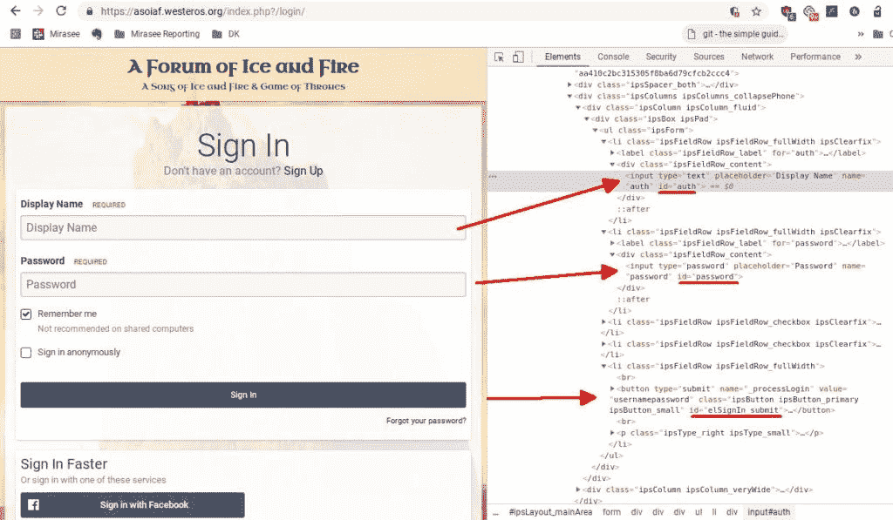
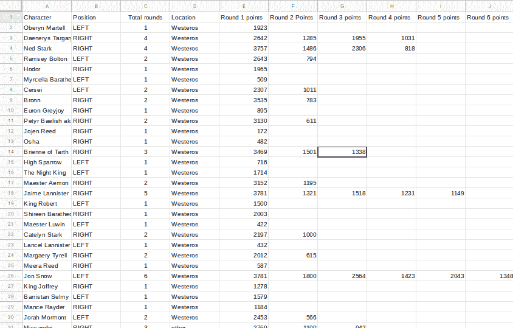
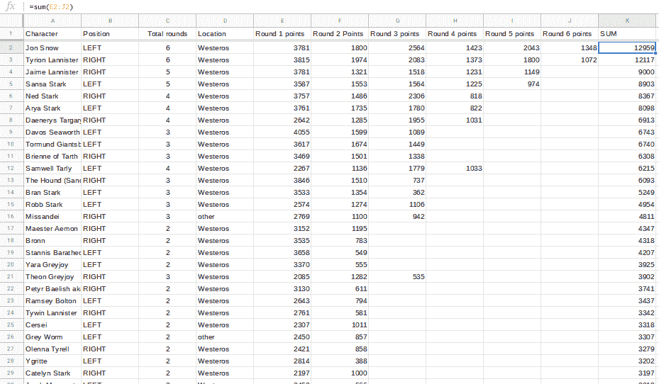
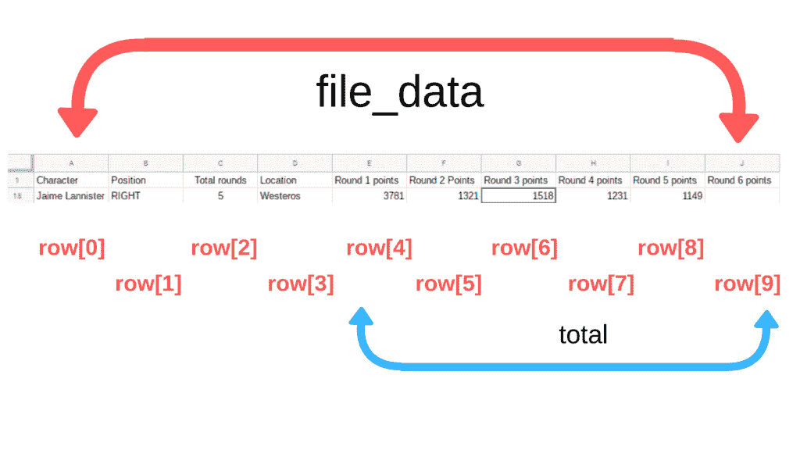
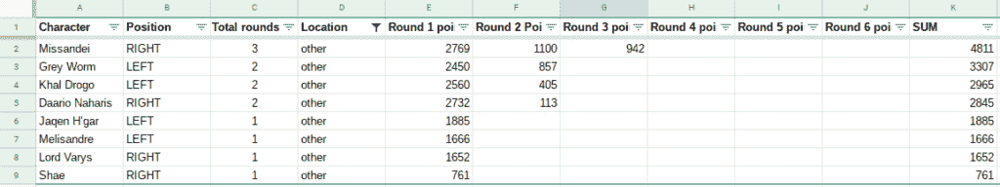

# 我是如何用 Python 分析《权力的游戏》的

> 原文：<https://www.freecodecamp.org/news/how-i-used-python-to-analyze-game-of-thrones-503a96028ce6/>

作者洛奇·凯文

我想学 Python 很久了，但是一直找不到理由。当我的公司有一堆需要生成的日常报告时，我意识到我有机会探索 Python 来减少所有的重复。

这篇文章是我花了几周时间学习 Python，使用各种库，并在工作中自动完成一些任务的结果。

现在我想分享一下 Python 的能力。

与其给出*无聊的办公室相关例子*，不如把它们放在一个《权力的游戏》的框架里！


Any excuse to nerd out about Game of Thrones

在这篇文章中，我将使用 [Selenium 库](https://selenium-python.readthedocs.io/)实现 web 自动化，使用 BeautifulSoup 库实现 [web 抓取，使用](https://rockykev.com/python-and-game-of-thrones-part-2-of-3/)CSV 模块生成报告——这在某种程度上模拟了 Python 的整个熊猫/数据科学方面。

就像我之前提到的，所有的例子都会用到《权力的游戏》。

### 一些快速注意事项:

1.  您不需要任何 Python 经验就可以做到这一点。我会解释代码，你应该有足够的开始。
2.  我不是 Python 的超级专家。 ****这大致是几周的 Python 体验。**** 这足以让我的工作自动化并创造这些例子。
3.  Python 是有据可查的。有很多免费的学习 Python 的指南，像[自动化枯燥的东西](https://automatetheboringstuff.com/)、[面向初学者的 Python](https://www.pythonforbeginners.com/)，以及令人惊叹的 [Dataquest.io 数据科学](https://www.dataquest.io/)赛道。在 [freeCodeCamp](https://guide.freecodecamp.org/python/) 知识库中有更多的链接。

### Python，最好的基于爬行动物的计算机语言


Python is nowhere near as intimating. Honest.

****对于不熟悉编程的人—****

> Python 是一种通用编程语言，它具有严格的类型和解释，并以其可读性强和设计原则好而著称。
> *经【Freecodecamp.com】导*

根据 [Stack Overflow 的 2018 年开发者调查](https://insights.stackoverflow.com/survey/2018)，Python 是大多数开发者都想学习的语言(也是发展最快的主要编程语言之一)。

Python 支持 Reddit、Instagram 和 Dropbox 等网站。它也是一种真正可读的语言，有许多强大的库。

Python 是以巨蟒命名的，而不是爬行动物。但是——尽管如此，它仍然是最受欢迎的基于爬行动物的编程语言，击败了 Serpent、Gecko、Cobra 和 Raptor！(我不得不研究那个笑话！)

****如果你有一定的编程背景(比如说 JavaScript)——****

关于 Python 的一些事情:

*   Python 使用缩进和花括号。查看下面的示例:



Via the [JavaScript 101 slides, from Professor Mindy McAdams](https://www.slideshare.net/macloo/javascript-101-16754994)

*   Python 使用基于类的继承——所以它更像 C 语言。JavaScript 可以模拟类。
*   Python 也是强类型的。没有混搭。例如，如果你把一个字符串和一个整数加在一起，它会开始抱怨。

### 让我们直接开始吧！

我会把它分成三份。

*   ****《权力的游戏》与 Python #1**** : Web 自动化
*   ****《权力的游戏与 Python #2**** :网页抓取
*   ****《权力的游戏》和 Python #3**** :用 CSV 模块生成报表


### 《权力的游戏》和 Python # 1——网络自动化

使用 Python 可以做的最酷的事情之一就是 web 自动化。

例如，您可以编写一个 Python 脚本:

1.  打开浏览器
2.  自动访问特定网站
3.  让你登录那个网站
4.  转到该网站的另一部分
5.  查找最近的博客文章。
6.  打开那篇博文。
7.  提交评论说，“写得好！击掌！”
8.  最后把你从那个网站上注销

这似乎并不难做到。那需要什么…20 秒？

但是如果你不得不一遍又一遍地这样做，你会疯掉的。

例如，如果您有一个仍在开发中的包含 100 篇博客文章的暂存站点，并且您想要在每个页面上发布评论以测试其功能，该怎么办？

那就是 100 篇博文* 20 秒= ****大致 33 分钟****

如果有多个测试阶段，并且您不得不重复测试六次以上呢？

****web 自动化的其他用例包括**** :

*   您可能希望在您的网站上自动创建帐户。
*   你可能想在你的在线课程中从头到尾运行一个机器人。
*   你可能想用一个脚本推动 100 个机器人在你的网站上提交一个表单。

### 我们将要做什么

在这一部分，我们将自动登录所有我们喜爱的《权力的游戏》粉丝网站。

当你不得不浪费时间登录 westeros.org、自由人网站、winteriscoming.net 和你所有其他的粉丝网站时，你不讨厌吗？


Literally… THE WORST.

有了这个模板，就可以自动登录各种网站了！

现在，为了《权力的游戏》!

### 代码

您需要安装 Python 3、Selenium 和 Firefox webdrivers 才能开始。*如果你想继续学习，可以看看我的教程* [*如何用 Python*](https://rockykev.com/how-to-automate-form-submissions-logins/) *自动化表单提交。*

这个可能会变得复杂。所以我强烈建议坐好，享受旅程。

```
## Game of Thrones easy login script## ## Description: This code logs into all of your fan sites automaticallyfrom selenium import webdriverfrom selenium.webdriver.common.keys import Keysfrom selenium.webdriver.support.ui import WebDriverWaitfrom selenium.webdriver.support import expected_conditions as ECfrom selenium.common.exceptions import TimeoutExceptionimport timedriver = webdriver.Firefox()driver.implicitly_wait(5)    ## implicity_wait makes the bot wait 5 seconds before every action    ## so the site content can load up# Define the functionsdef login_to_westeros (username, userpass):    ## Open the login page    driver.get('https://asoiaf.westeros.org/index.php?/login/')        ## Log the details    print(username + " is logging into westeros.")        ## Find the fields and log into the account.     textfield_username = driver.find_element_by_id('auth')    textfield_username.clear()    textfield_username.send_keys(username)    textfield_email = driver.find_element_by_id('password')    textfield_email.clear()    textfield_email.send_keys(userpass)    submit_button = driver.find_element_by_id('elSignIn_submit')    submit_button.click()    ## Log the details    print(username + " is logged in! -> westeros")		def login_to_reddit_freefolk (username, userpass):    ## Open the login page    driver.get('https://www.reddit.com/login/?dest=https%3A%2F%2Fwww.reddit.com%2Fr%2Ffreefolk')        ## Log the details    print(username + " is logging into /r/freefolk.")        ## Find the fields and log into the account.     textfield_username = driver.find_element_by_id('loginUsername')    textfield_username.clear()    textfield_username.send_keys(username)
```

```
 textfield_email = driver.find_element_by_id('loginPassword')    textfield_email.clear()    textfield_email.send_keys(userpass)    submit_button = driver.find_element_by_class_name('AnimatedForm__submitButton')    submit_button.click()    ## Log the details    print(username + " is logged in! -> /r/freefolk.")    ## Define the user and email combo. login_to_westeros("gameofthronesfan86", PASSWORDHERE)time.sleep(2)driver.execute_script("window.open('');")Window_List = driver.window_handlesdriver.switch_to_window(Window_List[-1])login_to_reddit_freefolk("MyManMance", PASSWORDHERE)time.sleep(2)driver.execute_script("window.open('');")Window_List = driver.window_handlesdriver.switch_to_window(Window_List[-1])## wait for 2 secondstime.sleep(2)print("task complete")
```

#### 破解密码

首先，我将导入 *Selenium* 库来帮助完成繁重的工作。

我还导入了*时间*库，所以每次动作后，都会等待 x 秒。添加等待允许页面加载。

```
from selenium import webdriverfrom selenium.webdriver.common.keys import Keysfrom selenium.webdriver.support.ui import WebDriverWaitfrom selenium.webdriver.support import expected_conditions as ECfrom selenium.common.exceptions import TimeoutExceptionimport time
```

#### 硒是什么？

Selenium 是我们用于 web 自动化的 Python 库。Selenium 开发了一个 API，因此第三方作者可以开发 web 驱动程序来与浏览器通信。这样，Selenium 团队可以专注于他们的代码库，而另一个团队可以专注于中间件。

例如:

*   Chromium 团队为 Selenium 制作了自己的 web 驱动程序，名为 [chromedriver](http://chromedriver.chromium.org/) 。
*   Firefox 团队为 Selenium 开发了自己的 web 驱动程序，名为 [geckodriver](https://github.com/mozilla/geckodriver) 。
*   Opera 团队为 Selenium 制作了自己的 web 驱动程序，名为 [operadriver](https://github.com/operasoftware/operachromiumdriver) 。

```
driver = webdriver.Firefox()
```

```
driver.get('
```

driver.close()

在上面的代码中，我让 Selenium 做一些事情，比如“ ****将 Firefox 设置为选择的浏览器**** ”，以及“ ****将该链接传递给 Firefox**** ”，最后“ ****关闭 Firefox**** ”。我用壁虎驱动器做到了。

#### 登录网站

为了更容易阅读，我写了一个单独的功能登录到每个网站，以显示我们正在制作的模式。

```
def login_to_westeros (username, userpass):    ## Log in    driver.get('https://asoiaf.westeros.org/index.php?/login/')        ## Log the details    print(username + " is logging into westeros.")        ## 2) 
```

```
textfield_email = driver.find_element_by_id('password')    textfield_email.clear()    textfield_email.send_keys(userpass)    submit_button = driver.find_element_by_id('elSignIn_submit')    submit_button.click()    ## Log the details    print(username + " is logged in! -> westeros")
```

如果我们进一步细分，每个函数都有以下元素。

我告诉 Python:

1.  访问特定页面。
    `driver.get('https://asoiaf.westeros.org/index.php?/login/')`

2.寻找登录框
*清除文本，如果有
*提交我的变量

```
textfield_username = driver.find_element_by_id('auth')    textfield_username.clear()    textfield_username.send_keys(username)
```

3.寻找密码框
*清除文本，如果有
*提交我的变量

```
textfield_email = driver.find_element_by_id('password')    textfield_email.clear()    textfield_email.send_keys(userpass)
```

4.找到提交按钮，然后单击它

```
submit_button = driver.find_element_by_id('elSignIn_submit')    submit_button.click()
```

注意:每个网站都有不同的方法找到用户名/密码和提交按钮。你将不得不做一些搜索。

#### 如何找到任何网站的登录框和密码框

Selenium Library 有许多在网页上查找元素的简便方法。这里有一些我喜欢用的。

*   按标识查找元素
*   按名称查找元素
*   通过 xpath 查找元素
*   按类名查找元素

要获得完整的列表，请访问用于定位元素的 Selenium Python 文档。

以[asoiaf.westeros.com 为例](https://asoiaf.westeros.org/index.php?/login/)，当我检查元素时——它们都有 id……这太棒了！那使我的生活更容易。



Inspect Element, and look for the code. That will give you clues on targeting.

### 运行代码

#### 享受旅程

有了 web 自动化，你就在玩一个“我如何让 Selenium 找到元素”的游戏。一旦你找到它，你就可以操纵它。

### 权力的游戏和 Python # 2——网络抓取

在这篇文章中，我们将探讨网络报废。

总体流程是:

1.  我们将让 Python 访问一个网页。
2.  然后我们将使用 BeautifulSoup 解析该网页。
3.  然后设置代码来获取特定的数据。

****例如:**** 你可能想抓取所有的 h1 标签。或者所有的链接。或者在我们的例子中，一页上的所有图像。

****网页抓取的其他一些用例:****

*   你可以抓取一个网页上的所有链接。
*   你可以抓取论坛中所有的文章标题
*   你可以用它来获取纳斯达克的每日价值，而无需访问该网站。
*   你可以用它来下载一个没有“全部下载”功能的网站中的所有链接。

简而言之，网页抓取允许你通过 Python 自动抓取网页内容。

****总的来说，一个很简单的过程。除非它不是！****

### **图像网络抓取的挑战**

我的目标是将我对网络抓取内容的了解转化为抓取图像。

虽然针对链接、正文和标题的 web 抓取 ****非常简单，但针对图像的**** web 抓取要复杂得多。让我解释一下。

作为一名网页开发人员，在一个网页上放置多个全尺寸图片会降低整个网页的速度。相反，使用缩略图，然后只在缩略图被点击时加载全尺寸图像。

例如:想象一下，如果我们的网页上有 20 张 1 兆字节的图片。登陆后，访问者必须下载价值 20 兆字节的图像！比较常见的方法是制作二十张 10kb 的缩略图。现在，你的有效载荷只有 200kb，大约是大小的 1/100！

那么这跟网络抓取图片和这个教程有什么关系呢？

这意味着编写一个对每个网站都有效的**通用代码块非常困难。网站实现了所有不同的方法来将缩略图变成全尺寸图像，这使得创建“一刀切”的模型成为一个挑战。**

**我还是会教我所学的。你仍然会从中获得很多技能。请注意，在其他网站 ****上尝试该代码将需要进行重大修改**** 。最近开发区万岁。**

### **Python 和《权力的游戏》**

**本教程的目标是我们将收集我们最喜爱的演员的图像！这将允许我们做一些奇怪的事情，比如制作一个青少年迷恋的演员拼贴画，我们可以挂在我们的卧室里(就像这样)。**

**

I was making this collage while my partner walked in. She then promptly walked out.** 

**为了收集这些图像，我们将使用 Python 来做一些网络搜集。我们将使用 [BeautifulSoup 库](https://www.crummy.com/software/BeautifulSoup/)访问一个网页，并从中获取所有的图像标签。**

**注意:在许多网站条款和条件中，他们禁止对他们的数据进行任何网络搜集。一些公司开发 API 来允许你利用他们的数据。其他人没有。此外，要注意你正在占用他们的资源。所以，一次只处理一个请求，而不是并行打开大量的连接，让他们的网站陷入瘫痪。**

### **代码**

```
`# Import the libraries neededimport requestsimport timefrom bs4 import BeautifulSoup# The URL to scrapeurl = 'https://www.popsugar.com/celebrity/Kit-Harington-Rose-Leslie-Cutest-Pictures-42389549?stream_view=1#photo-42389576'#url = 'https://www.bing.com/images/search?q=jon+snow&FORM=HDRSC2'# Connectingresponse = requests.get(url)# Grab the HTML and using Beautifulsoup = BeautifulSoup (response.text, 'html.parser')#A loop code to run through each link, and download itfor i in range(len(soup.findAll('img'))):    tag = soup.findAll('img')[i]    link = tag['src']    #skip it if it doesn't start with http    if "http" in full_link:         print("grabbed url: " + link)        filename = str(i) + '.jpg'        print("Download: " + filename)        r = requests.get(link)        open(filename, 'wb').write(r.content)    else:        print("grabbed url: " + link)        print("skip")        time.sleep(1)`
```

#### **让 Python 访问网页**

**我们首先导入所需的库，然后将网页链接存储到一个变量中。**

*   **[请求库](https://realpython.com/python-requests/)用于处理各种 HTTP 请求**
*   **[时间库](https://docs.python.org/3/library/time.html)用于在每次请求后等待 1 秒钟。如果我们不包括这一点，整个循环将尽可能快地启动，这对我们抓取的网站来说不是很友好。**
*   **[BeautifulSoup 库](https://www.crummy.com/software/BeautifulSoup/)用于使探索 DOM 树更加容易。**

#### **用 BeautifulSoup 解析网页**

**接下来，我们将我们的 URL 推入 BeautifulSoup。**

#### **查找内容**

**最后，我们使用一个循环来获取内容。**

**它从一个 FOR 循环开始。BeautifulSoup 做了一些很酷的过滤，我的代码要求 BeautifulSoup 找到所有的‘img’标签，并将其存储在一个临时数组中。然后， ****len**** 函数询问数组的长度。**

```
`#A loop code to run through each link, and download itfor i in range(len(soup.findAll('img'))):`
```

**所以用人类的话来说，如果数组包含 51 个元素，那么对于在范围(50)中的 I 来说，代码将类似于*:***

**接下来，我们将返回到我们的汤对象，并做真正的过滤。**

```
`tag = soup.findAll('img')[i]   link = tag['src']`
```

**记住我们是在 For 循环中，所以[i]代表一个数。**

**因此，我们告诉 BeautifulSoup 找到所有的“img”标签，将其存储在一个临时数组中，并根据我们在循环中的位置引用一个特定的索引号。**

**因此，我们没有像 allOfTheImages[10]那样直接调用数组，而是使用 soup.findAll('img')[10]，然后将其传递给 ****标签**** 变量。**

******标签中的数据**** 变量会是这样的:**

```
``
```

**这就是为什么下一步是拔出“src”。**

****

### **下载内容**

**最后——这是有趣的部分！**

**我们进入循环的最后一部分，下载内容。**

**这里有一些奇怪的设计元素，我想指出来。**

1.  **IF 语句实际上是我为我测试的其他网站做的一个黑客。有时候，我会抓取一些我不想要的根站点的图片(比如 favicon 或社交媒体图标)。所以使用 IF 语句允许我忽略它。**
2.  **我还强迫所有的图像都是. jpg 格式。我可以编写另一段 IF 语句来检查数据类型，然后附加正确的文件类型。但是这增加了大量的代码，使得本教程变得更长。**
3.  **我还添加了所有的打印命令。如果你想抓取一个网页的所有链接或特定内容，你可以在这里停下来！你做到了！**

**我还要指出的是 ****【链接】**** 和 ****open(文件名，‘WB’)。编写****(r . content)代码。**

```
`r = requests.get(link)open(filename, 'wb').write(r.content)`
```

**工作原理:**

1.  **[请求](https://realpython.com/python-requests/)获取链接。**

**2. [Open](https://docs.python.org/3/library/functions.html#open) 是一个默认的 python 函数，它打开或创建一个文件，赋予它写&二进制模式的访问权限(因为图像只有 1 和 0)，并将链接的内容写入该文件。**

```
`#skip it if it doesn't start with http    
if "http" in full_link:         
print("grabbed url: " + link)        filename = str(i) + '.jpg'        print("Download: " + filename)        r = requests.get(link)        open(filename, 'wb').write(r.content)    else:        print("grabbed url: " + link)        print("skip")        time.sleep(1)`
```

**网络抓取有很多有用的功能。**

**对于大多数有图片的网站来说，这些代码并不是现成的，但是它可以作为在不同网站上抓取图片的基础。**

### **权力的游戏和 Python #3 —生成报告和数据**

**收集数据很容易。解释这些数据很困难。这就是为什么对能够理解这些数据的数据科学家的需求激增。数据科学家使用 R 和 Python 这样的语言来解释它。**

**在本教程中，我们将使用 csv 模块，它足以生成一个报告。如果我们正在处理一个巨大的数据集，一个像 50，000 行或更大的数据集，我们必须利用熊猫图书馆。**

**我们要做的是下载一个 CSV，让 Python 解释数据，根据我们想要回答的问题发送一个查询，然后把答案打印出来给我们。**

### **Python 与基本电子表格函数**

**你可能想知道:**

***“当我可以很容易地使用电子表格函数，如=SUM 或=COUNT，或者手动过滤掉我不需要的行时，我为什么要使用 Python？”***

**像第 1 部分和第 2 部分中的所有其他自动化技巧一样，您肯定可以手动完成这项工作。**

**但是想象一下，如果你必须每天生成一个新的报告 ****。******

**比如:我建在线课程。我们要每个学生的每日进度报告。今天有多少学生开始了？这个星期有多少学生是活跃的？有多少学生完成了模块 2？有多少学生提交了他们的模块 3 作业？有多少学生点击了移动设备上的完成按钮？**

**我可以花 15 分钟整理数据，为我的团队生成一份报告。或者编写每天都做的 Python 代码。**

******使用代码代替默认电子表格函数的其他用例:******

*   **您可能正在处理一组庞大的数据(比如 50，000 行和 20 列)**
*   **你需要多层面的过滤和分割来得到你的答案。**
*   **您需要对重复变化的数据集运行相同的查询**

### **使用《权力的游戏》生成报告**

**每年，[Winteriscoming.net，](https://winteriscoming.net/)一个权力的游戏新闻网站，都有他们一年一度的疯狂三月。游客们会投票选出他们最喜欢的角色，获胜者会上升一级，与另一个人竞争。经过 6 轮投票，获胜者被宣布。**

**

This is 2018’s Thrones Madness** 

**由于 2019 年的投票仍在进行，我抓取了 2018 年的所有 6 轮数据，并将其编译成 CSV 文件。要了解 winteriscoming.net 的投票情况，[点击这里](https://winteriscoming.net/2018/03/11/game-of-thrones-march-madness-round-1-vote-for-your-favorite-character/)。**

**

You can see the whole CSV as a [Google Sheets file](https://docs.google.com/spreadsheets/d/12XU-Ce5uF_wlWmFrzHLPm524Wl6y6wZefI8fBBEgsV8/edit?usp=sharing)** 

**我还添加了一些额外的背景数据(比如他们来自哪里)，让报告更有趣一些。**

### **问问题**

**为了生成报告，我们必须提出一些问题。**

******顾名思义**** :记者的主要职责是回答问题。**

**所以让我们现在就弥补吧。**

**基于这个数据集…下面是一些问题。**

1.  **谁赢得了人气投票？**
2.  **根据平均值，谁赢了？**
3.  **最受欢迎的非维斯特洛人是谁？(不是出生在维斯特洛的角色)**

### **在回答问题之前，让我们先设置一下 Python 代码**

**为了更简单，我在我最喜欢的在线 IDE repl . it 中编写了所有的代码，包括修订版。**

```
`import csv# 
Import the dataf_csv = open('winter-is-coming-2018.csv')headers = next(f_csv) f_reader = csv.reader(f_csv)file_data = list(f_reader)

# Make all blank cells into zeroes# https://stackoverflow.com/questions/2862709/replacing-empty-csv-column-values-with-a-zero

for row in file_data:  for i, x in enumerate(row):    if len(x)< 1:      x = row[i] = 0`
```

**这是我的代码流程。**

1.  **我导入了 csv 模块。**

**2.我导入了 csv 文件，把它变成了名为 ****file_data**** 的列表类型。**

*   **Python 读取文件的方式是首先将数据传递给一个对象。**
*   **我去掉了标题，因为它会篡改数据。**
*   **然后，我将对象传递给一个读取器，最后是一个列表。**
*   **注意:我刚刚意识到我是通过 Python 2 的方式做到的。Python 3 *中有一种* [*更清洁的方法。哦好吧。仍然有效。*](https://docs.python.org/3.7/library/csv.html)**

**3.为了合计任何总数，我让所有空白单元格都变成 0。**

*   **这是找到一个比我的原始版本更好的[堆栈溢出](https://stackoverflow.com/questions/2862709/replacing-empty-csv-column-values-with-a-zero)解决方案的时刻之一。**

**有了这个设置，我们现在可以循环通过数据列表，并回答问题！**

#### **问题 1——谁赢得了人气投票？**

******电子表格方法:******

**最简单的方法是使用公式将每个单元格相加。
以第 2 行为例，在空白列中，您可以编写公式:**

```
`=sum(E2:J2)`
```

**然后，您可以为其他行拖动该公式。**

**然后，按总数排序。你有一个赢家！**

**

It’s Jon Snow — with 12959 points** 

```
`## Include the code from above
# Push the data to a dictionarytotal_score = {}
# Pass each character and their final score into total_score dictionaryfor row in file_data:  total = (int(row[4]) +           int(row[5]) +           int(row[6]) +           int(row[7]) +           int(row[8]) +           int(row[9]) )  total_score[row[0]] = total# Dictionaries aren't sortable by default, we'll have to borrow from these two classes.
# https://stackoverflow.com/questions/613183/how-do-i-sort-a-dictionary-by-valuefrom operator import itemgetterfrom collections import OrderedDictsorted_score = OrderedDict(sorted(total_score.items(), key=itemgetter(1) ,reverse=True))
# We get the name of the winner and their scorewinner = list(sorted_score)[0] 
#jon snowwinner_score = sorted_score[winner] #scoreprint(winner + " with " + str(winner_score))
## RESULT => Jon Snow with 12959`
```

**我采取的步骤是:**

1.  **数据集只是一个大列表。通过使用 for 循环，您可以访问每一行。**
2.  **在 for 循环中，我添加了每个单元格。(模拟整个" =sum(E:J)"公式)**
3.  **因为字典不完全是可排序的，所以我必须导入两个类来帮助我根据它们的值从高到低对字典进行排序。**
4.  **最后，我传递了获胜者，并将获胜者的值作为文本。**

**为了帮助理解这个循环，我画了一个图表。**

****

**总的来说，与电子表格方法相比，这个过程要长一些。但是等等，事情变得更简单了！**

**

Congrats Jon, you’re the most popular character on GOT!** 

#### **问题 2——根据平均值，谁赢了？**

**你可能已经注意到，排名靠前的人显然会获得更多的选票。**

**例如:如果*琼恩·雪诺*在第一轮中获得 500 分，在第二轮中获得 1000 分，他已经击败了*山*，山只有 1000 分，并且从未通过他的括号。**

**所以下一个最好的方法是合计总数，然后根据他们参加了多少轮来划分。**

******电子表格方法:******

**这很简单。B 栏是他们参加了多少轮。你可以用总数除这些回合，然后很快！**

```
`## OLD CODE FROM QUESTION 
1# Pass each character and their final score into total_score dictionaryfor row in file_data:  total = (int(row[4]) +           int(row[5]) +           int(row[6]) +           int(row[7]) +           int(row[8]) +           int(row[9]) )  total_score[row[0]] = total
## NEW CODE
Pass each character and their final score into total_score dictionaryfor row in file_data:  total = (int(row[4]) +           int(row[5]) +           int(row[6]) +           int(row[7]) +           int(row[8]) +           int(row[9]) )  
# NEW LINE - divide by how many rounds  new_total = total / int(row[2])  total_score[row[0]] = new_total
# RESULT => Davos Seaworth with 2247.6666666666665`
```

**注意到变化了吗？我只是多加了一行。**

**回答这个问题就这么多了！下一个！**

**

On Average, Davos Seaworth has the most points.** 

#### **问题 3——谁是最受欢迎的非维斯特洛人？**

**对于前两个例子，使用默认的电子表格函数计算总数非常容易。对于这个问题，事情就有点复杂了。**

******电子表格方法:******

1.  **假设你已经有了这笔钱**
2.  **你现在必须根据他们是维斯特洛人还是其他人来过滤**
3.  **然后按总和排序**

****

```
`## OLD CODE FROM QUESTION
1# Pass each character and their final score into total_score dictionaryfor row in file_data:  total = (int(row[4]) +           int(row[5]) +           int(row[6]) +           int(row[7]) +           int(row[8]) +           int(row[9]) )  

# NEW LINE - divide by how many rounds  new_total = total / int(row[2])  total_score[row[0]] = new_total## NEW CODE# Pass each character and their final score into total_score dictionaryfor row in file_data:  

# Add IF-THEN statement  if (row[3] == 'other'):    total = (int(row[4]) +             int(row[5]) +             int(row[6]) +             int(row[7]) +             int(row[8]) +             int(row[9]) )  else:    total = 0  total_score[row[0]] = total

# RESULT => Missandei with 4811`
```

**在问题 2 中，我添加了一行代码来回答这个新问题。**

**在问题 3 中，我添加了一个 IF-ELSE 语句。如果他们不是维斯特洛人，那就数一数他们的分数。否则，给他们 0 分。**

**

Whoa, huge upset! I was hoping it was Grey Worm!** 

### ****回顾这段:****

**虽然电子表格方法看起来没有很多步骤，但它确实需要更多的点击。Python 方法的设置时间要长得多，但是每个额外的查询都需要修改几行代码。**

**想象一下，如果利益相关者再问十几个问题。**

**例如:**

1.  **名字以 L 开头的字符有多少分？**
2.  **或者说第 3 轮谁住维斯特洛大家都得了多少分？**
3.  **或者是 640 个字符而不是 64 个？**

**但是想象一下，你有一个大约 50 兆字节的数据集(我们的《权力的游戏》csv 文件只有 50 千字节，大约是它的 1/1000)。那么大的 50mb 文件可能需要 Excel 几分钟才能加载完毕。此外，数据科学家使用 10gb 范围内的数据集并不罕见！**

**总的来说，随着数据集的扩展，处理时间会越来越长。这就是 Python 的强大之处。**

### **结论**

**在第 1 部分中，我用 Selenium 库介绍了 web 自动化。在第 2 部分中，我用 BeautifulSoup 库介绍了 web 抓取。在第 3 部分中，我介绍了用 csv 模块生成报告。**

**虽然我把它们分成了几个部分，但它们之间也有协同作用。想象一下，如果你有一个项目，你必须根据节目中演员的评论来判断谁是《权力的游戏》中的下一个死者。你可以从网上搜集 IMDB 上所有演员的名字开始。您可以使用 Selenium 自动登录各种社交媒体平台，并搜索它们的社交媒体名称。然后你可以编译所有的数据，并把它解释成 csv 格式，或者，如果它真的很大，使用 Pandas 库。**

**我们甚至没有涉足机器学习、人工智能、Web 开发或人们使用 Python 做的许多其他事情。**

**让这成为你 Python 之旅的垫脚石吧！**

* * *

**？ ****绝对巨大喊出**** 给[乔丹](https://mjordan.codes/)在[小狗和作品集](https://mjordan.codes/puppies-and-portfolios)见面会上验证我的作品。她是我见过的最有才华的 CSS 开发人员之一。**

***？如果你喜欢对课程建设、在线教育和教育的未来感兴趣，请在我的* [*Linkedin*](https://www.linkedin.com/in/rockykev/) *或*[*Twitter*](http://twitter.com/rockykev)*上联系我。***