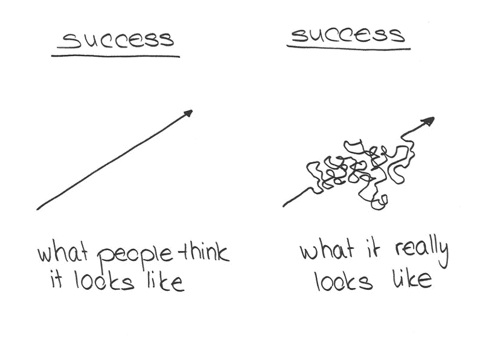

# 在发现自由代码营之前，我是如何浪费了两年时间去学习 web 开发的

> 原文：<https://www.freecodecamp.org/news/how-i-wasted-2-years-of-my-life-trying-to-learn-web-development-prior-to-discovering-freecodecamp-916cbdcf8a1/>

作者 Sophanarith Sok

# 在发现自由代码营之前，我是如何浪费了两年时间去学习 web 开发的

那是两年前的事了。在自由代码营出现之前。我在谷歌上搜索“如何成为一名 web 开发人员”，出现了一长串语言。我做了一些研究，看起来 Ruby 是最流行的语言。

“如果我在 4 个月内学会了 Ruby，我就能做出很酷的东西！甚至可能被聘为初级开发人员，学习更酷的东西！”我心想。

这是我的大脑曾经想到的最荒谬的想法。请记住，在这一点上我几乎没有接触过 HTML，更不用说 CSS 和 JavaScript 了。

在搜索了一些书籍之后，我找到了一本非常受欢迎的关于编程的初学者的书，书名是克里斯·派恩的《学会编程》。它向我介绍了编程的基础知识。

每章都有几个简单的算法问题，你可以在复习时完成。在大约一个月的时间里，我每天花几个小时看完这本书，最终我能够在一天内看完整本书，并在几分钟内解决所有问题。

在这一点上，我有一个相当大的自我，我觉得我很擅长做一名程序员。我想，“嘿，我可以在一天内看完这本书。我是程序员！对不对？”

我大错特错了。我只是触及了一座巨大冰山的表面，这座冰山从来没有真正的底部，而是随着你越深入下去而不断扩大。

就像几千年前的一位祖先探索了整个岛屿，并意识到在海洋的另一边，有一个完整的世界，在云层之上，有一个完整的宇宙。

凭借 Sublime Text 2、Ruby 和一本书的力量，我认为我可以创造任何我想象的东西。现在，两年过去了，我意识到这与现实相去甚远。

如果我能回到过去，与过去的自己交谈，我会告诉他，他的野心比他所能理解的还要大，这是一个漫长而艰苦的旅程，应该认真对待。“不要把编程当成游戏，因为你的生活依赖于它。两年后，你会意识到这有多严重，你浪费了多少时间。”

也许我不应该对自己太苛刻。毕竟，我真的不知道从哪里开始。我有一本书，会在 Codecademy 上从头到尾读一遍。

这段时间我不知道什么是开发栈，更不知道后端开发和前端开发的范围。我当时的想法是，你选择一种语言，编写一些东西，一切都应该像魔法一样工作。没有人告诉我构建 web 应用程序的开发过程是怎样的。

即使在完成《学习编程》这本书后，我知道如何编写一些算法，但我不知道它们在应用程序中有什么用途，除了在一章结束时解决愚蠢的挑战。

这基本上是我两年来的学习经历。我只是盲目地从一个在线资源跳到下一个，不确定每项技术如何与其他技术结合在一起，或者我可以用它来构建什么。

然后发生了很棒的事情。我发现了自由代码营。我记得读过头版的描述。我心想:“完成这个课程就能找到工作了？！你确定吗？试试也无妨。我已经完成了 Codecademy 的所有课程，我可以在一天之内看完一整本书！这能有多难？小菜一碟。如果我完成了免费代码营，我找不到工作，那么我会写一篇可怕的评论，并称之为骗局！我就这么办！”

### **于是我开始…**

我看了一眼课程安排。很简单，但是有一件事引起了我的注意。在课程结束时，一旦你完成了所有的事情，就有了…获得非营利组织的机会，这将使我获得真实的世界经验，并对世界产生积极的影响！这听起来太棒了！我真的想在这方面努力！

HTML 和 CSS 上的前几个方法点是小菜一碟。我在翻它们。我当然是。“我是这方面的专家，咄，”我心想。

然后我遇到了 JavaScript 挑战。“哇，所有这些只是回顾我已经知道的东西！噗噗……我已经完成一半了！”我无知地相信。

### **然后我打了算法挑战赛……**

开始的几个很简单。但是到了第五集，现实来了。这是一项简单的任务。只需大写每个单词的第一个字母。从逻辑上讲，这很容易。但是我做不到。那时我意识到我不适合做一名网页开发员。

“如果我不能告诉我的计算机简单地将每个单词中的每个字符都大写，我将如何能够构建真正的应用程序来做更多的事情呢？”我以为。

当然，我不会那么容易放弃。我永远不会让电脑打败我。我是人类——与创造这台机器的物种相同。如果我想命令它做什么，我会找到办法的。我是它的指挥官。

经过几个小时的谷歌搜索，我设法想出了一些我自己输入的代码，我点击了绿色的“提交”按钮，它通过了。

就在那时，一些特别的事情发生了。我感受到了那种成就感，只有当你花了几个小时试图弄清楚一些事情，然后最终看到所有的测试都通过了，你才会有这种成就感。这确实是我一生中最满意的时刻之一。

比我玩过的任何游戏中的任何时刻都更令人满意。我被迷住了。我*希望*完成每一个算法，因为对我来说，每一个算法都是我必须打败的 boss，我打败的每一个 boss 都会为我赢得经验值，这些经验值可以让我成为更熟练的程序员。

我*知道*我会打败每个老板，成为更好的程序员。我不知道的是这将花费我六个月的时间。

### 是的，我花了六个月完成所有的算法。但是我也完成了所有的前端项目，所以我想我还不算太差。

此时，我已经在 FreeCodeCamp 投入了大约 1000 个小时的工作。我对 JavaScript 编码的理解远胜于我刚开始的时候。我确实发现自己盯着电脑看了很长时间，在很多情况下，我会看到日出。

我学会了如何编写算法来检查格式是否正确，操作句子，破译代码，计算行星在其轨道周期内的平均高度，建立一个功能齐全的计算器，等等。仅仅六个月，我就学会了做所有这些事情。

我尝试了 Node、Express 和 Angular，并通过查看示例项目研究了 MEAN stack。我开始了解 web 应用程序是如何制作的。那时我意识到自由代码营才是真正的交易。

自从我开始在自由代码营工作以来已经快一年了，我仍然没有到达我心仪的非营利部门。但这没关系，因为从我第一次发现自由代码营到现在，我所取得的技能飞跃是惊人的。如果我在高中的时候有免费代码营，我只能想象我现在的水平，或者在我的职业生涯中我会走多远。

最可笑的是，自由代码营是免费的。他们提供了一个令人惊叹的社区，一整套不断更新的课程，以及在帮助非营利组织的同时获得实际工作经验的机会。他们甚至有自己的招聘版块！我怀疑许多收费的编码训练营提供的内容和机会是否和免费代码训练营一样多。

最后我想说，自由代码营很辛苦。但这正是它的伟大之处。它提供了成为一名开发人员的现实概述。完成课程，你将成为一名开发人员。很简单。很难。是真的。你所要做的就是继续前进，直到地图上的每一个挑战都被检查完毕。

因为他们新增加的内容，我还有大约 1000 个小时要走。但是每一个小时都转化为我可以获得的更多技能，所以我可以成为我努力成为的开发人员。

这是一个相当长的旅程，我可能会偏离计划或挣扎，但我很享受它的每一点。