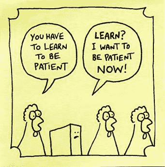

# 从 Twitter 实习生到全职 Twitter 软件工程师，我学到了什么

> 原文：<https://www.freecodecamp.org/news/how-i-went-from-a-twitter-intern-to-full-time-software-engineer-twitter-7906bfc10984/>

乔丹·杰克逊

# 从 Twitter 实习生到全职 Twitter 软件工程师，我学到了什么

#### 更多的编码和成长！

Photo by [Joshua Earle](https://unsplash.com/@joshuaearle?utm_source=medium&utm_medium=referral) on [Unsplash](https://unsplash.com?utm_source=medium&utm_medium=referral)

*看日历*哇！已经六个月了吗？！在我在 Twitter 实习的第一天，我知道要看到隧道的尽头还需要很长时间，但是我们还是来了。我是 Twitter 的全职工程师！！？

这绝对是一次冲刺，我学到了超乎想象的东西。我很高兴我能吸收大部分知识。现在我想花点时间写一下我完成这个项目的经历。我知道大多数实习项目都有通向全职工作的简单途径。所以我想强调我经历的一些阶段，我面临的陷阱，并反思我学到的一切。如果我能从这篇文章中帮助一个人踏上编码之旅，那么→？！！

注:如果你想知道我是如何获得 Twitter 实习机会的，可以在这里找到这个故事:[我是如何从空军入伍成为软件工程师实习生的@Twitter](https://medium.freecodecamp.org/from-enlisted-air-force-to-a-software-engineer-intern-twitter-d3f90b8ea1af)

### 激动人心

当我发现我将在 Twitter 实习时，我感觉自己是世界上最大的引擎。精力充沛，并准备好征服任何不幸落在我道路上的项目。

除此之外，如果没有汽车的其他部分，发动机就什么都不是，你也不太可能以一辆完整的汽车出现。即使你以前做过工程师，也有因公司而异的事情。但是在职培训将会是你新的最好的朋友。有了这一点，你会在任何时间巡航！

Me pulling up to the Twitter HQ on my first day. Image [source](https://www.zmescience.com/science/biggest-most-poweful-engine-world/).

制造汽车其余部分的第一步是新员工培训。正是在这里，我意识到科技公司 XYZ 并没有将他们的栈建立在 FreeCodeCamp 计算器项目的基础上。

在 Twitter 的迎新周期间，工程师们会得到 Twitter 如何工作的概述，以及如何将各个部分结合起来实现它的细节。

首先，它唤起了一种“哇，这真是太复杂了”的情感。？在你真正开始工作之后，它会变得更有意义。突然之间，你将会在一个项目中工作，并且碰到你记得在迎新会上听到的东西。确保你不会去感觉、思考、想要或考虑深入到每一个堆栈的需要。

尽管如此，这些高层次的解释还是有帮助的。他们帮助你看到全局，以及你的团队如何为公司的使命做出贡献。因此，当我急于开始时，给自己时间安顿下来会让我更顺利地起步。

### 新手

在一家**新公司**开始一个完全**的新行业**做一份完全**的新工作**对我来说是一个巨大的转变。我突然觉得自己又回到了基础训练阶段。当我开始的时候，我甚至不知道如何使用苹果电脑。？我一生都是一个电脑人。这是一种非常可怕的感觉，因为作为一名新员工，你想提供价值，但有时你会觉得自己一无是处。对自己有耐心就好。当我刚开始工作时，没有这种耐心是最具挑战性的事情之一。

[Source](http://runningonfullblog.com/what-running-has-taught-me/patience/)

如我所说，你有一个准备全力以赴的引擎。但是在你接管这个世界之前，还需要做一点工作！耐心会帮助你更快地变得富有成效。这也会帮助你在学习的时候不觉得浪费氧气。？

### 集结

为了提高我变得高效所需的技能，我知道我必须把它们分成几个阶段。我想先学习最必要的技能，一些提高生产力的技能，等等。

我最初的问题是弄清楚在这些阶段应该先学习哪种技能。可以学习的东西多得令人不知所措。我周围充满了新奇的事物！然而，我知道只有一小部分与我试图完成的事情有关。

作为参考，我从未使用过我将在未来六个月内使用的大多数技术。好吧好吧，除了 [Git](https://git-scm.com/) ，但除此之外我觉得我好像在一个[新星球](https://www.google.com/search?q=twitter+hq&oq=twitter+hq&aqs=chrome..69i57j0l3j69i60j69i61.2641j1j7&sourceid=chrome&ie=UTF-8)上！

最终，我把学习如何使用新的 IDE 作为我的第一个目标。我将使用的编辑器叫做 [IntelliJ](https://www.jetbrains.com/idea/) ，上面有大量的按钮，我之前使用的是 [Atom](https://atom.io/) 。所以另一个巨大的转变！

This is how IntelliJ looked to me at first. [Source](https://www.nationalmuseum.af.mil/Visit/Museum-Exhibits/Fact-Sheets/Display/Article/195851/boeing-c-17-globemaster-iii/)

当我终于准备好写一些代码的时候，我的第一反应是弄清楚如何做一个我熟悉的小项目。实际上是用我的新工具做一个翻译项目。所以，在这里我试图得到一个 helloWorld Scala 程序(是的，我认为这是一个小项目？)打印到控制台。我觉得好像又是自由代码营的第一天。

在我完成那个项目后，我接受了一个更大的实践项目。唯一的问题是我不知道如何用我的新工具来构建和测试这个项目。更疯狂的是，我之前已经建立了这个实践项目(Bit.ly 风格的 URL Shortener)。所以我知道如何实现逻辑，我甚至可以持久化数据。但是，没有了 Atom、NPM、MongoDB 和 NodeJS，我迷失了方向！至少在这一点上，我在 Mac 上导航还算不错。

同时学习一门新语言(Scala)和 IDE (IntelliJ)让我慢了一点。不用说，对我来说,“感觉”到富有成效是一个缓慢的过程。

回顾过去，我明白了对现在要学的主题和以后要深入研究的主题进行分类和优先排序是非常有用的。实际上，剔除所有你不需要学习的东西，把注意力放在剩下的东西上可能更容易。

回头看，至少有两三件事是我钻研过的，我没有必要花时间去做。如果我可以重新开始，我会从一些 IntelliJ 教程开始**专门**。这样，我至少可以运行简单的程序，并修改它们以在环境中进行实验。我知道这听起来很容易，但是当你被 50 种你从未听说过的东西轰炸时，筛选它们有点困难。

无论你走哪条路，都会随着时间走到一起。不要停下来。这只是你想变得多有效率的问题！([普锐斯](https://www.toyota.com/prius/)还是 [Hellcat](https://www.dodge.com/challenger.html) ？)在我知道之前，我实际上是在建设项目！我感受到的快乐棒极了。我在编写 Scala 代码，使用 IntelliJ，甚至在没有搜索如何使用简单功能的情况下使用我的 Mac 电脑。绝对是“W”但还不是休息的时候！

### 冒名顶替者

这一部分涉及到一个许多人可能都经历过的话题。如果你还没有，这里有一个小提示，以防有一天你会有！这个题目是冒名顶替综合症。它有很多种形式，但是它们都让你觉得你没有能力。奇怪的是，当你有完成事情的记录或者反复向自己证明自己是**的时候，你也会经历这种情况。**

几乎每次我开始一个新项目时都会经历这种情况。我很快发现，几乎每一个项目都有提升的空间，不管它有多小。我在每个项目之前的这种知识差距让我觉得自己不够格。这自然让我想到“我属于这里吗？”精神状态。我相信我终于找到了原因！

事实上，我没有接受过正式的 CS 教育，甚至没有代码训练营培训。我的意思是，我知道我不是一个完全的初学者，但我也知道我正在丢失一些核心的 CS 知识。有那么一会儿，我的计算机科学知识就像一块瑞士奶酪。然而，随着时间的推移，我填补了许多知识空白，获得了更多的自信。

但这并不是说像一个骗子的感觉结束了！几乎每次我面对一个新项目时，冒名顶替综合征都会再次出现。？我最终了解到，这次重新露面只是因为我对某个项目或代码库的熟悉程度只有 0%-25%。这听起来像是一个“嗯咄”类型的事情，但当我被分配一个项目时，我的大脑就会开始思考如何解决它。我的大脑正在思考终点线，同时它知道我并不理解这个项目所有错综复杂的部分。所以我的大脑会说“兄弟，我们不知道这里发生了什么，我们该怎么做？!"。

在深入研究代码和阅读文档之后，我们会回到“我明白了！”。请让你们其他人赶上来。？对我来说，上面的类比是我为什么会觉得，有时仍然觉得自己是个骗子的主要原因。现在我更明白这一点，我可以和我的大脑争论，然后放松赶上。任何经历过冒名顶替综合症的人都知道，我们总是会“赶上”的！

### 我的建议

现在我的实习棒极了！我学到了很多。但是，如果我忽略了我收到的最重要的反馈，那我就帮了大家一个大忙。我当然不完美！？以下是我在实习的六个月中收到的最常见的反馈。

1.  记笔记(我的记性很好，但在关于不同事情的会议之后，你可能会忘记一些事情)。在 [Slack](https://slack.com/) 和队友聊天感觉很爽。我可以随时滚动屏幕查看细节。要是我每次谈话都能这样就好了。？哦，是的，一个笔记本或者一个 G [oogle Doc。](https://www.google.com/docs/about/)
2.  提问时给队友更多的语境。我觉得这是新工程师的通病。我有时会问一些问题，就好像其他人一直在处理同一个文件和我一直在处理的同一行代码。毫不奇怪，这将导致混乱，如果不是一个错误的答案，我的问题。这几乎就像用你的手机给某人打电话说“嘿！你能告诉我回家的路吗？”。(当然是在谷歌地图、全球定位系统之类的东西出现之前)但是如果你说“我在废话连篇的十字路口向西走，想回家，你能帮忙吗？”他们肯定能提供更多帮助！如果他们有地图，也就是他们更高级的工程大脑！
3.  不要成为角斗士！软件开发是一项团队运动。然而，我无法摆脱我必须证明自己的感觉。不是说我不想团队合作，而是我觉得我需要证明我可以独立完成一个项目。唯一的问题是…..我不需要这么做。这种证明自己的强迫性任务只让我在第二次实习中收到了我认为唯一的主要负面反馈。我的意思是，除非你正在创业，否则你会有一个团队来支持你！与他们合作，每个人都会受益！

额外收获:除了在提问时更加具体之外，确保你问了所有你可能有的问题。对于我们这些自学编码的人来说，这是非常有用的建议。

没有测验可以检验你的知识是否比得上现在的初级软件工程师。坦白地说，你不知道你不知道的事。我觉得我们大多数人都认为这是真的**。**

这不是问题，直到你听到一些**听起来**像普通工程知识的东西。如果你听到其他工程师聊天，你会想“我可能应该知道？”这就是我所说的。

事实证明，如果你不知道，完全没关系。事实上，一些更高级的工程师问了我正在想的问题。然后你意识到每个工程师并不知道所有的事情。然后你会看到团队的每个成员都知道很多，这是团队强大的原因。剩下的就交给提问和分享吧！不要害怕这个话题是你应该知道的基础知识。问吧！！

### 结论

老实说，开始实习的时候，我不知道会发生什么。只是说我会在某个时候写代码。我从未从事过技术工作，也没有在团队中开发过软件。

总的来说，我认为进行得很完美。从我取得的成功以及收到的建设性反馈中。来自军队肯定使它变得有趣！尤其是在你被训练多年听从命令之后，突然之间你不得不决定你的大部分日常工作流程。

When you ask when to come into work and your manager says “When do you want to come in?”.

一如既往，虽然，我知道我会弄清楚。就像基础军事训练时，我们是秃头和困惑，必须在 1.5 秒内解决随机的东西。只是现在我不是秃头了。

事实上，我从军队中学到了很多东西，我觉得这些东西在技术上对我帮助很大。不过，我们将在另一篇文章中讨论这个问题。我还想感谢在我旅途中帮助我的每一个人，以及我的家人，感谢他们在我不在的时候帮我度过的时光。我真的觉得有一个小村庄在培养我成为一名伟大的工程师。我非常感谢和幸运我拥有的支持系统。感谢您的阅读！