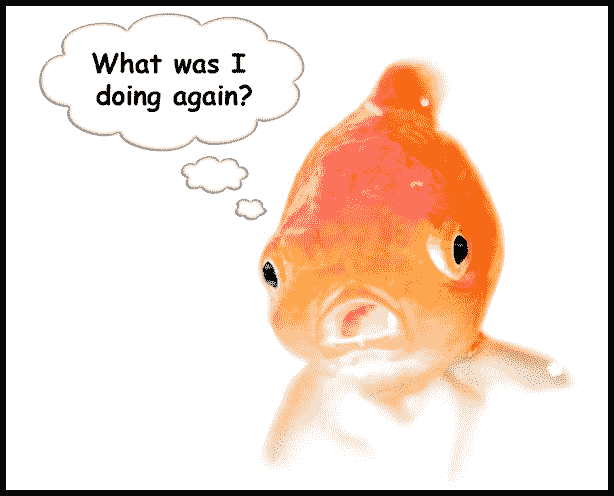

# 我是如何从一个完全的初学者变成软件开发人员的——你也可以

> 原文：<https://www.freecodecamp.org/news/how-i-went-from-complete-beginner-to-software-developer-and-how-you-can-too-dd36ed08e11b/>

麦迪逊·卡纳

# 我是如何从一个完全的初学者变成软件开发人员的——你也可以

Camped out in a coffee shop.

两年前，我就在你今天的位置上。

我想成为一名职业程序员。但我不知道如何让它发生。

我没有大学文凭，没有编程经验，数学也很差。

还有一个挥之不去的疑问:像我这样的人能成为一名开发者吗？

嗯，是我让它发生的。我有我梦想的工作。我是一名软件开发人员。

经常有人问我是怎么做到的。

以下是我采取的三个重要行动，它们帮助我从一个完全的初学者成为一名软件开发人员。

### 1.构建您的路线图

有抱负的开发人员犯的最大错误是他们没有计划。

没有路线图。

当你没有计划时，你会感到失落。你学习编码教程，也许建立一两个项目。几个月过去了。你想，*我会成为一名开发者吗？这一切太令人困惑了*。你不知道该走哪条路。

解决办法？现在就建立一个路线图。为你如何成为一名开发人员制定一个计划。

你的第一步:决定你是去参加编码训练营还是参加在线课程。

对我来说，我决定不参加训练营。我创建了自己的课程，自学了一切。

因为我是在家自学长大的，所以我很喜欢自学，所以我决定利用从 freeCodeCamp 到 Udacity 的各种在线课程自学编程。

这种方法的成本远低于训练营，但它有一个缺点:我没有*编码导师或编码课程可遵循。从网上资源中学习意味着你不需要支付任何费用或者只需要支付很少的费用，但是正如我所发现的，你并没有得到太多的支持。你会像我一样独自奋斗。*

像我一样，人们喜欢从在线资源中学习编码，但这并不总是最好的方法。低成本是一个很大的好处，但要确保你能自己学好，并能对自己负责——不需要太多的指导或支持。

训练营很贵，但通常会有更多的支持和责任。

仔细决定哪条路最适合你。

如果你确实在没有训练营的情况下学习编程，我建议选择一个负担得起的在线项目，至少有一些导师和课程可以遵循。这样做将确保你少挣扎，并得到你需要的反馈。Udacity 的 nanodegrees 和 Treehouses techdegrees 提供一些指导和代码审查。

如果你决定免费学习编码，freeCodeCamp 的课程非常棒，如果你参与到他们的社区中，你将会出类拔萃。

一旦你选择了你的道路，通过回答这些问题来完成你的路线图:

*   我想成为全栈、前端还是后端开发人员？决定你将重点学习什么。知道你需要学习什么语言和库。
*   我每周要学习多少小时，何时学习？划出一周的时间来练习编程，永远不要错过这些学习时间。
*   我从哪一天开始申请工作？为你申请设定一个截止日期。
*   **我会放弃什么**？想象自己作为一名开发人员工作是很棒的，但是到达那里的道路意味着清晨、周末和深夜的艰苦工作。

现实一点:看看你每周花了多少时间，放弃一件事。对我来说，我不愿意放弃和家人在一起的时间，但我决定放弃和朋友出去玩。在大多数周六，我没有像往常一样和朋友在一起，而是呆在家里编程。

在构建你的路线图时，请记住:与你看到的许多营销宣传相反，没有*神奇的编码课程，没有神奇的程序，没有神奇的训练营会让你成为开发者。很多人问我以前学习编程的在线课程，好像有一张“黄金门票”可以让你成为一名开发人员。*

没有。

**只有*你*才能让自己成为开发者。**

你的勇气和决心会让你成功。但是我也用了一个改变游戏规则的方法来学习编码成为一名开发者。

那是什么？

### **2。训练你的注意力。**

有一百万个免费的编码课程提供给每个人。

如果访问免费的编码课程如此容易，为什么学习编码却如此困难呢？为什么成为开发者这么难？

因为我们很多人不知道学习和掌握编程语言所需的重要技能。这个技能被计算机科学家 Cal Newport 推广的叫做*深度工作*。

**TL；博士**:为了学习难的东西，你必须*长时间高度集中注意力*。那是深入的工作。

但是我们大多数人都在积极地扼杀我们集中注意力的能力，很少有人做深度工作。

想想上次你排队的时候。过了多久，你会觉得不得不拿起手机查看通知？或者这篇文章本身呢——你在阅读的时候切换到新的标签页了吗？检查了你的推特账户？？

今天，拥有一条金鱼的注意力持续时间是正常的。这就是为什么我们很难学习像编码这样复杂的东西。一旦我明白了这一点，我意识到如果我致力于做深入的工作，我可以学到成为一名开发人员所需要知道的困难的东西。

当你坐下来编码时，设置一个 90 分钟的计时器。在这段时间里，把注意力放在你正在开发的应用程序或者你试图解决的编码问题上。**不要**查看您的通知。**不要**打开新的标签页。当你发现自己在做白日梦的时候，赶紧把注意力拉回到编码上来。

训练你的注意力，就像你未来的职业取决于它一样——因为它确实如此。

没有练深功，我就不会是今天的开发者。

#### 3.追逐你的好奇心。

当大多数人开始学习编码时，他们开始了他们“应该”知道的课程。

然后他们会觉得无聊。就像在学校一样，当你学习新的东西只是因为你应该学习它们，但你不知道*为什么*你需要学习它们或者*为什么*你甚至关心它们。失去兴趣很容易。

要学习编码，找一件你对编程感兴趣的事情。在周六晚上找到让你足够好奇去了解它的事情——因为你有时需要做这件事。

《爱丽丝梦游仙境》中有一句台词让我念念不忘:

> 她以前从未见过一只兔子有背心口袋，也没有从口袋里掏出手表，于是，她带着强烈的好奇心追了过去。

随着我在职业生涯中与更多的高级开发人员一起工作，我意识到:最好的程序员不必强迫自己总是学习更多的东西。他们总是在学习，因为像爱丽丝一样，他们充满了好奇心。

有些人尝试用一种语言编写代码，但讨厌它，然后学会另一种语言并爱上它。一定要尝试不同的编程语言，学习编程中的不同领域，以发现是什么点燃了你的好奇心。

如果你已经从不同的角度尝试了几次学习编码，你仍然觉得你在强迫自己，那么编码可能不适合你。与大多数训练营的营销材料相反，对大多数人来说，在三个月内学会编程并立即获得 10 万美元的工作机会是不现实的。编码不是一个快速致富的方案。如果你对此感到厌烦，就不要学习编码，因为你会错过发现你生活中真正的好奇心是什么。然而，如果你对技术感兴趣，但对编码不感兴趣，你可以学习许多其他令人难以置信和受欢迎的技能:设计、数据分析等等。

如果你对编程有好奇心，那就去追吧。你越追求你的好奇心，你拥有的就越多。当你追逐你的好奇心时，不要担心你来自哪里。不要担心你没有计算机科学学位或者你背后有什么。

不管你的年龄如何，没有学位或以前的经验，如果你热爱编码，练习深度工作，并把学习作为你生活中的优先事项，你就可以成为一名专业的开发人员。

即使你是个完全的初学者。

现在开始。

#### 如果你喜欢这个故事，请按住？按钮！为了与我保持联系，注册我的 n[news letter](https://madisonkanna.us14.list-manage.com/subscribe/post?u=323fd92759e9e0b8d4083d008&id=033dfeb98f)吧，在那里我会分享如何学习编码的技巧，并提供免费的编码课程。