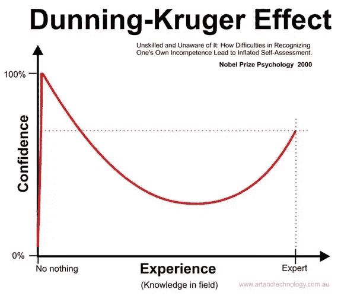
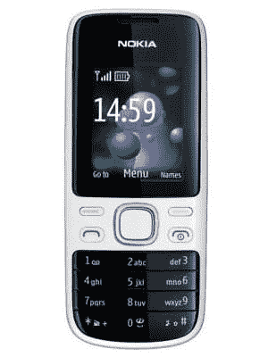
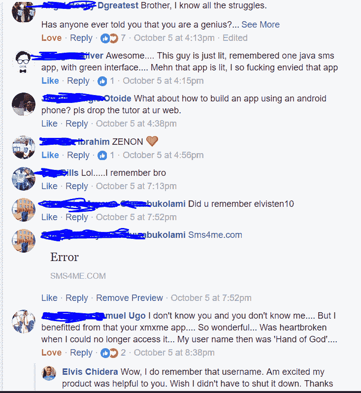
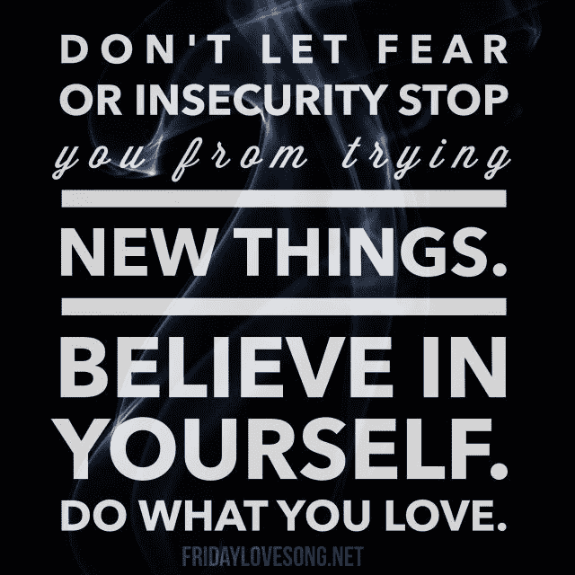

# 我是如何从用诺基亚功能手机编程到为麻省理工学院的初创公司工作的

> 原文：<https://www.freecodecamp.org/news/how-i-went-from-programming-with-a-feature-phone-to-working-for-an-mit-startup-40ca3be4fa0f/>

2012 年，我只是一个来自尼日利亚的乡村男孩，除了一个梦想和一部诺基亚特色(J2ME)手机，一无所有。今天，我是一名 19 岁的 Android 开发人员，已经开发了 50 多个应用程序，目前在麻省理工学院的一家初创公司工作。我的名字是埃尔维斯·奇德拉，这是我的故事。

我的旅程始于我对如何建立一个网站的好奇。随着年龄的增长，我花了很多时间在网上，因为我喜欢下载游戏和阅读机器人协会。我会攒几个星期的钱，花 100 奈拉(0.28 美元)买一个 10 MB 的上网套餐，而在 2012 年，这个套餐可以用一个月。

学习编码时，我迈出了简单的第一步，在谷歌上搜索如何建立一个网站。我得到了数百万个结果。不知道从哪里开始，我点击了我看到的第一个链接，它来自 [W3CSchools](http://www.w3schools.com) 。

文章解释说，我需要学习一些语言(HTML 和 CSS)才能建立一个网站。我查看了一些其他资源，以确认我确实需要学习这些东西。然后我开始了 W3CSchools 的 HTML 和 CSS 课程。

每天放学后，我都会去网站学习。最初，代码示例和解释对我来说没有多大意义。但我还是坚持学习。我在卡壳的时候参考了各种教程。这帮助我从不同的角度看待我遇到的问题。

当我年轻的时候，我在学校里努力提高我的阅读和写作能力。我只能通过不断的练习变得更好。所以我脑海中已经有了这个模型:如果我继续练习——不管花多长时间——我最终将能够理解这些编程语言。

几个月的强化学习让我熟悉了 HTML、CSS 和 JavaScript。当我还在学习的时候，一个朋友给我看了电影《社交网络》。而且看完之后，我超级有动力去造下一个大东西。谢谢你，好莱坞。

几天后，我灵机一动。这个想法是建立一个更好的脸书版本。那时，你看不到在线的脸书朋友。此外，脸书的建立是为了与你在现实生活中已经认识的人建立联系。

这就是我价值十亿美元的创业想法:建立一个拥有脸书所没有的所有功能的社交网络。马克·扎克伯格——我来找你了——至少我是这么想的。

在接下来的几个月里，我通过添加任何我能想到的功能来构建一个更好的社交网络。

我天真地相信我会赢。

完成这个项目后，我做了任何没有广告预算的人都会做的事情。我连续几天在网上发垃圾邮件。

经过几天的营销，现实给了我重重的一巴掌。我只有 200 个用户，我不得不一直恳求他们回到我的网站。

我很沮丧！几个月的努力白费了。这给了我两个重要的教训:

1.  我需要认识到新平台早期面临的[冷启动也就是鸡和蛋的问题](http://platformed.info/seeding-two-sided-businesses-strategy-chicken-and-egg-problem/)。
2.  我在做一些我认为人们需要的东西。但我最终只是建造了另一个[特色工厂](https://hackernoon.com/12-signs-youre-working-in-a-feature-factory-44a5b938d6a2)。

虽然被一个项目激励是可以的，但你也需要知道什么时候你会走进死胡同。我又花了几个月的时间，试图看看我的网站是否能吸引更多的人，但留存率一直在向 0%的方向攀升，我最终放弃了这个项目。

但是我被刘易斯在《与罗宾森夫妇见面》中的格言“继续前进”所激励。

为了给我的下一个项目寻找灵感，我思考了当地社区的需求。这一次，我想做一些人们真正需要并愿意为之付费的东西。

我想出一个主意，让短信更便宜，更容易一次发给多人。这更像是短信支持的 Whatsapp。在和不同的人谈过之后，我决定这是下一步要做的事情。

我把这个项目命名为 Xmx Me。这将是一个 J2ME 应用程序。这意味着我必须学习 Java。回顾过去，我不得不承认这是我遇到的最大挑战。我不得不多次阅读一些教程来完全理解它们。

Promotional graphics for Xmx Me

在完成了几门 Java 课程后，我已经准备好工作了。坚持不懈地输入一行又一行代码，我小心翼翼地用 PHP 构建后端，用 HTML 和 CSS 构建前端，用 J2ME 构建移动应用。这款应用变得栩栩如生。

但问题是——我没有笔记本电脑。我在我的 J2ME 功能手机上构建我的应用程序的所有部分。

等等。什么？

你没看错。

I wrote my code on a Nokia 2690

### 我如何在功能手机上构建我的生产应用

在我人生的这个阶段，我从未真正在笔记本电脑上编程。我根本买不起。我父母想帮我。但这对他们来说很难，因为他们必须在支付我的学费(和其他必需品)和给我买笔记本电脑之间做出选择。

我以前没有用过笔记本电脑，我和电脑的唯一互动是在网吧。我记得看过一些关于如何使用电脑的视频(左键点击、拖拽和其他基本的东西)，然后走进网吧练习。

我很幸运，一个亲戚送给我一部功能手机([诺基亚 2690](https://www.gsmarena.com/nokia_2690-3004.php) )。这部手机改变了我的生活。它是我用来开发 Xmx Me，我失败的社交网络，以及其他几个项目的。

除了一部电话和对成功的渴望，我一无所有，一小时又一小时地在那个小小的键盘上输入我的代码。我再次幸运地找到了一个允许我编译我的 J2ME 项目的应用程序。是的，在 J2ME 手机*上开发一个 J2ME 应用是有可能的。*

SDK 很耗资源，所以我的电池经常没电。我会继续下去，在纸上写出我所有的代码，并尝试检查它是否有语法错误。

在做了这么久之后，我不认为我会在任何 Java 白板编码测试中失败。:)

### 启动我的群发短信应用程序

几个月后，我准备好了产品。我说服了一个在网络论坛上认识的人，让他帮我支付托管 T1 的 T0 网站和数量有限的 T2 短信服务 T3 的费用。

应用发布进行得很顺利——至少比我的第一个项目好。我们得到了一些当地媒体的报道，肯尼亚的一个顶级博客甚至写了关于这个应用的文章。我们有机增长到大约 5000 名用户。

我们在做生意。我们每天都有几次交易。

由于之前没有经营企业的经验，我犯了一些大错，其中一些是:

1.  在尼日利亚，向用户收费并不容易。不是每个人都有借记卡。所以我允许人们用他们的手机信用支付。这里的问题是，没有官方途径将这种信用转换成金钱。我不得不卖给小贩，他们以低得离谱的价格买回。
2.  几乎没有会计。我在赔钱，而我对此一无所知。我没有把一些间接费用计算在内。有几件丢失了。

我在考虑卖掉这个应用程序去买一台笔记本电脑。不知道该怎么办，我去[网上求](http://www.nairaland.com/1339891/14-year-old-nigerian-bulk-sms-app)。是的，我就是那么不要脸，饥肠辘辘。结果不太好。有人被指控为骗子，我最终解决了这个问题。再说一次，我没有经验，我处理得不好。

在多次借钱维持生意后，我决定认输。回想起来，我认为这是一个糟糕的决定。再多一点学习和经验，我就能把事情做得更好。可能我在一个短信 app 里没看到什么前途吧。嗯，我最近发布了一个倒退的应用程序，许多用户仍然在使用它，喜欢它。

### 我一路走来学到的教训

我意识到，如果我想很快买得起一台电脑，我需要努力工作。所以我开始尽可能地存钱。我削减日常开支，过着尽可能简单的生活。我向我的亲戚求助。我甚至卖掉了一些个人物品来为这台笔记本电脑筹钱。

然而，这还不够。决心实现我的目标，我接了一份建立网站的自由职业，这样我就可以赚到剩余的钱。

如何用功能手机搭建一个专为 PC 用户设计的网站？简单:让一个你每天晚上都会打扰的脸书朋友在他的电脑上查看你的网站，并给你反馈。这比反复去网吧便宜。

我还大量使用了 Ideone，它允许我在上传之前运行我的 PHP 脚本，看看它们是否工作。

我终于拿到了那台笔记本电脑。我仍然记得我当时的快乐感觉。当你打开一台全新的廉价电脑时，那股塑料的味道。我现在可以做任何我想做的项目，而不会因为我的手机而感到受限制。

由于 J2ME 设备正在慢慢消亡，我最终转向了 Android 平台的构建。我的 Java 技能在那里仍然有用。我只是需要学习一些特定于平台的东西。

第二年 2015 年，高中毕业后，我决定开始打工养家。所以我开始从事自由职业。我总是活跃在当地的论坛和团体中，寻找那些想要帮助我开发安卓应用的人。

因为我没有一个好的投资组合，我会在一些人付费之前为他们开发应用程序，没有任何保证我会得到报酬。我被这种方法刺痛过几次，但它让我建立了一个足够好的投资组合。

我想分享一些我希望在做自由职业者时就知道的事情:

> 不要把自己摊得太薄。承担太多的责任对你的健康、家庭或客户都没有好处。

我和几个来自尼日利亚不同地区的客户一起工作，他们喜欢我的作品。在与一位客户远程合作后，我最终在尼日利亚的拉各斯找到了一份全职工作。

然后，在浏览我的新闻订阅时，我看到了一则在 [Dot Learn](http://www.dotlearn.org) 的 Android 开发人员的招聘广告。我看了看他们，意识到他们是一家麻省理工学院的初创公司，在我热爱的教育技术领域工作，并且在我了解的市场中工作。他们有一个独特的想法:通过制作数据量极小的教育视频来解决在线教育的问题——每小时视频的数据量低至 1MB。

这几乎令人难以置信，我知道这是让很多人都能接受教育的关键。

我非常热衷于改革非洲的教育。事实上，我已经开发了一个免费的(支持广告的)考试准备应用程序，名为 [PrepUp](https://play.google.com/store/apps/details?id=elvis10ten.com.past_questions&hl=en) ，已经有超过 35，000 次安装，并且是 2016 年[西非移动奖的决赛选手之一](https://techpoint.ng/2016/03/24/west-africa-mobile-awards-2016-finalists/)。所以我想成为 Dot Learn 建设的一部分。

所以我看了开发人员的工作要求，我觉得我有机会。但是冒名顶替综合症不想让我变得伟大。

几天来，我一直有矛盾的想法。我到底该不该申请？

然后我意识到一件事:我没什么可失去的。

最坏的情况是我被拒绝。但我不会死。所以，我去申请了。

交叉手指，我开始重新观看我从麻省理工开放式课程下载的几个视频。我还花了几个晚上看了一些[编码面试解决方案视频](https://www.youtube.com/channel/UCxX9wt5FWQUAAz4UrysqK9A/videos)。在过去，我主要是根据我强大的投资组合和以前的工作经验被录用的，但我不想在他们给我一次编码面试时措手不及。

好吧，长话短说:经过大量的准备，回答一些困难的问题，电话面试，和一些编码项目，我被录取了。

我简直不敢相信。我欣喜若狂。

回想起来，这是我最好的决定之一。

在 Dotlearn 工作，我的职业生涯有了指数级的增长，并遇到了许多来自麻省理工学院、哈佛大学和其他好地方的了不起的人。

从参加像 Techcrunch 战地(T1)这样的大型活动(我最终错过了我的航班)到意识到我会说唱，到目前为止，这是一次有趣而令人兴奋的经历。

#### 最终注释

我知道我才刚刚开始，但我的故事的目标是激励某个地方像我一样处于类似情况的人。

你可以在推特上关注我，或者在媒体上关注我。你也可以[在 LinkedIn](https://www.linkedin.com/in/elvischidera/) 上和我联系。谢了。

#### 如果你喜欢这个故事，请点击？按钮并分享，以帮助其他人找到它。欢迎发表评论。