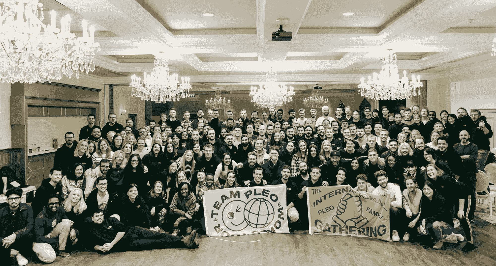

# 我如何在 16 个月内从销售变成前端开发人员

> 原文：<https://www.freecodecamp.org/news/how-i-went-from-sales-to-frontend-developer-in-16-months/>

2015 年 8 月 18 日，我在从多伦多皮尔逊机场飞往哥本哈根的单程航班上。我在哥本哈根商学院开始了为期两个学期的交流。

我很容易记住这个日期，因为那天是我哥哥的生日。当他们送我去丹麦时，他被迫在机场和我们的家人一起度过，因为他们认为只有 8 个月。

我对哥本哈根唯一的熟悉来自于在付令超杂志的 YouTube 频道上观看 CPH 公开赛。对我来说幸运的是，我完全爱上了这座城市，在我出国的第一个学期后，我把在这里呆更长时间作为我的使命。我应该在回到加拿大后开始实习，并挑战自己在哥本哈根找到一份工作。

## 在哥本哈根工作

我没有真正的计划，所以我开始寻找销售发展代表(SDR)的角色。我刚刚在我的一门课上了解到这个初级角色。因为我以前的工作经验都是在销售和客户服务方面，所以我认为这会是一个很好的选择。

我向一家年轻的初创公司发出了申请，不到 4 个小时，我就和即将成为销售经理的人通了电话。这是我第一次体验到创业领域的发展速度有多快！大约一个月后，我有了第一天。这也是我第一次见到专业开发人员。

我一直对技术有着浓厚的兴趣，尽管那时我最接近软件开发是在我高中的 Visual Basic 课上！

开始我的新工作是我第一次直接和开发人员一起工作。听到他们的工作令人激动。他们总是谈论很多时髦的词汇和技术——React、Ember、Scala、Python、TypeScript、样板代码、编译器、渲染。一想到开发软件需要了解这么多知识，我就感到害怕。

The sales floor I worked on

在接下来的一年半时间里，我在自己的销售生涯中不断进步，最终被提升为客户经理。我觉得我已经大大提高了我的沟通、时间管理和表达技巧。

## 发现免费代码营

虽然我在目前的职位上是一名成功的客户经理，但我不确定未来的销售是否是我想要的。如果我想继续留在丹麦，这也限制了我未来的工作前景——在一个第一语言是丹麦语的国家，找到一份英语销售的好工作并不容易！

我发现自己读了更多的书，寻找新的爱好或挑战。这时候我发现了 freeCodeCamp 博客(当时还在 Medium 上)。事实上，我花了几天时间才意识到 freeCodeCamp 不仅仅是一个博客，它是一个学习如何在线编码的完整平台，而且是免费的！好像这个名字不言自明...

在我完全被吸引住之前，只需要完成一些 HTML 挑战。就在那时，我决定用我所有的空闲时间来学习 freeCodeCamp 课程，目标是在遥远的将来有一天成为一名开发人员。我喜欢能够和我的同事谈论 React 的想法，不管那感觉有多遥远。

## 挣扎于基础

在我真正尝试完成其中一个项目之前，我对自己学习 HTML 和 CSS 的速度相当自信。创建一个简单的投资组合？这应该很容易！

但是，在 freeCodeCamp 之外的一个编辑器中，我突然感到多么失落，这是压倒性的。试图从零开始一个项目似乎是不可能的，而且令人害怕的是我很快就忘记了一切。突然之间，成为一名真正的开发人员似乎变得不可能了。

最终寻求帮助是我为自己做的最好的事情。在沮丧中煎熬了太久之后，我联系了一位同事，他耐心地指导我使用 VS 代码，构建我的 HTML 文档，并将其链接到一个 CSS 文件。在最终拼凑出一个作品集后，我检查了完成的方框，尽管我觉得我的工作与其他尝试同样挑战的人相比很糟糕。

我最终进入了 JavaScript 课程，在 HTML 和 CSS 中挣扎了大约一个半月之后，我已经不耐烦地等待开始了。

## 学习 JavaScript

开始很容易，尽管不久我发现自己又一次迷失和沮丧。完成所有的 JavaScript 模块后，我觉得自己缺乏信心和毅力去尝试更困难的 JavaScript 项目。相反，我采取了简单的方法，从 Codecademy JavaScript 课程开始。

这对我巩固基础当然很有帮助——毕竟，重复是关键。然而，我在学习过程中犯的最大错误是没有回去尝试那些挑战。

在学习完所有 Codecademy 模块后，我开始了另一门 JavaScript 课程，这次是通过 Udemy 购买“JavaScript Bootcamp”。因为这是我第三次学习基础知识，所以我离开那门课程时有了更稳定的基础，对自己使用 JavaScript 的能力也更有信心。

## 从 Pleo 开始

Pleo Team Camp, Dec 2019

从那里，我直接进入了另一个课程，这次是 Node，紧接着是 React 课程。

在 Node 和 React 课程之间的某个地方，我开始了一份新工作，在我仍然认为是丹麦最酷的创业公司 T1 担任客户经理。成为一家发展如此迅速的公司的一员，过去是，现在也是令人难以置信的兴奋。更令人兴奋的是见到了这么多有才华的新开发人员来学习。

在我的新工作开始大约三个月后，我的经理和我在讨论我的角色在未来如何发展。我对她很诚实，说我对任何进一步的责任都不感兴趣。我想用所有多余的能力自学编码，希望有一天成为一名开发人员。

这不是你想从团队中相对较新的销售代表那里听到的话。但令我惊讶的是，她非常支持我，并承诺尽她所能帮助我，只要我达到目标。

## 尝试编码挑战

在与我们的一位工程总监交谈后，很明显，为了让我们继续围绕从销售到产品的过渡进行对话，我需要像外部候选人一样完成我们的前端招聘挑战。

尝试这样做的想法既令人难以置信地害怕，又令人振奋。这是我开始每晚在办公室呆到很晚的时候。我不想浪费时间骑自行车回家，所以当时钟指向 17:00 时，我会赶紧去找些晚餐，尽快回到办公桌前，假装成一名开发人员开始我的一天。

就在圣诞节假期前，我终于完成了我的 React 课程，并在做一些兼职项目，尽管我从未真正完成过任何一个项目。我知道我需要开始应用我的知识，但发现很难完成一个没有真正最终目标的项目。

随着假期的到来，我有了一些额外的时间，我开始重新审视前端挑战。我仍然觉得自己远没有能力写出一份有价值的作品，但是，我觉得它给了我某种努力的最终目标，这样我就可以真正完成一些东西。

对我来说幸运的是，我们的前端挑战与 React 课程的最终项目非常相似，所以我可以在提交时重用许多样板文件和组件。我绝对觉得我在作弊。

但是我还是把我的项目发送了出去，并急切地等待反馈。让我们的两位高级工程师审查我的代码是令人难以置信的可怕，我已经准备好接受一些严厉的反馈。

几个星期后，我的成绩出来了，我的提交并没有完全失败！我收到了一些非常好的、可行的批评意见。我的一位同事甚至在下班后花了一个小时陪我，告诉我每一行反馈。我们的代码审查会议进行得非常顺利，我们决定一周接一周地再次见面，直到我成为一名开发人员。

## 我的第一次公关

在接下来的几个月里，我的销售经理和工程总监继续检查我的进度。四月份，我有机会和我们的内部工具团队一起工作。在我们的后台系统中，有许多小的、不紧急的票需要关注。

我很兴奋——这将是我获得与产品团队合作的一些真实经验的一个很好的方式，而且很清楚这不会干扰我的销售工作。使用真实的生产代码的想法是疯狂的！

经过一段时间的协调、对团队的介绍，以及对我们公司 Github org 的邀请，我得到了第一张工作票。

我将添加一个输入，使我们的合规团队可以编辑字段。很明显我不知道该怎么做。当然，我以前添加过一个输入，我隐约知道表单在 React 中是如何工作的，但是这段代码我在任何教程中都没见过。

我突然有了一大堆问题。TypeScript 是如何工作的？什么是分支？我怎么做公关？所有这些图书馆都做什么？我的代码是如何构建并发送给我们的用户的？如果我弄坏了重要的东西会怎么样？

我花了几天时间熟悉环境，但是在工程负责人的耐心和帮助下，我设法获得了两项批准，并将代码交付生产。那是我旅程中的一个巨大里程碑。

## 做出改变

在接下来的五个月里，我继续我在办公室呆到很晚的例行公事，在销售部门工作 09:00-17:00，17:00，直到假装是开发人员，处理我认为是真正的代码。

正如你所料，我继续销售的愿望每天都在减少，我开始迫切地想看看我们是否能就我正式转行的日期达成一致。

肯定不顺利。没有人知道将某人从销售团队调到我们的产品团队意味着什么。首先，我必须达到目标。我认为对大多数销售组织来说都是如此——一切总会回到完成你的定额上来。

几经周折后，达成了一项协议，我可以在 8 月 1 日正式进行转换，条件是我必须保持目标。对我来说，这是隧道尽头的光。想到我作为软件工程师的新角色将很快得到一份雇佣合同，我真是莫名其妙。几个星期过去了。到 7 月 31 日星期三 17:00，我已经不是客户经理了。

在适应我的新角色的过程中，肯定有一个过渡期。感觉就像是在交易大厅工作的股票经纪人突然变成了图书管理员。

除了噪音，我没有一天不对工作感到兴奋。我继续在我们的内部工具团队工作，建立我们的合规和客户支持后台。

## 我学到了什么

我在销售方面获得的经验对我今天的工作非常有利。作为一名开发人员，强大的沟通、时间管理和演示技巧是无价的。但是我发现在我观察过的大多数 dev 社区中缺乏这些。

我意识到我非常幸运，这么早就有机会使用产品代码。毫无疑问，这是我学习上的一个巨大飞跃，极大地帮助了我理解作为一名开发人员的工作现实，这是不可能从在线教程中获得的*。*

有一个可以一起工作的导师极大地加快了我的学习，并且对我保持项目的连续性非常有帮助，所以我们总是有东西可以一起工作。如果没有我周围所有的支持，我想我仍然会花所有的夜晚和周末来学习教程或制作随机口袋妖怪生成器。

我很早就承诺要用我所有的空闲时间继续我的发展。我认为人们很容易低估这段旅程所花费的时间。接触导师是一个巨大的帮助，尽管即使是有足够知识偶尔回答问题的人也能让你免受几个小时的挫折。不要害怕寻求帮助。

回顾过去，我希望我花了更多的时间来构建小项目和应用我学到的东西。我经常开始项目，但从来没有坚持到底，因为我觉得我不能以正确的方式编码。

花时间努力解决一些事情对我的学习更有帮助。继续学习交互式编程课程当然是安全的，但它会限制你在现实世界中应用知识的能力。我肯定掉进了那个陷阱。

过了一会儿，我才意识到没有人知道正确的方法是什么，这都是编造的。作为一个开发新手，新鲜的视角是有价值的。

如果有一条建议我希望早点得到的话，那就是更加努力地应用我学到的知识。没有真正的代码或正确的做事方法，尤其是在学习的时候。一路走来，任何应用你所学知识的机会都是宝贵的。

一旦有人付钱让你成为开发人员，你就不是开发人员，从你开始编码的那一刻起，你就是开发人员了。

别见外！如果你有任何问题，请随时写信，[给我发邮件推荐你最喜欢的书，](mailto:braedongough@gmail.com) [在 Linkedin 上联系我](https://www.linkedin.com/in/braedon-gough-ba92a048/)或[在 twitter 上关注我](https://twitter.com/bbbraedddon)！