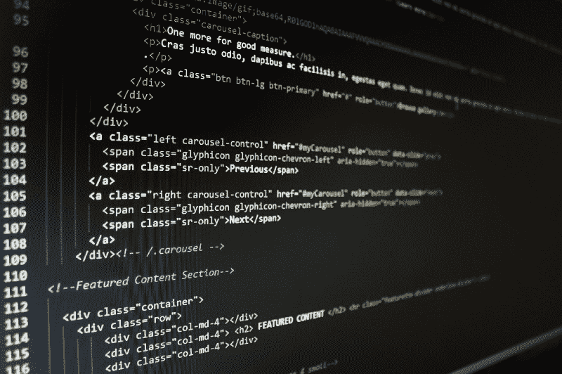
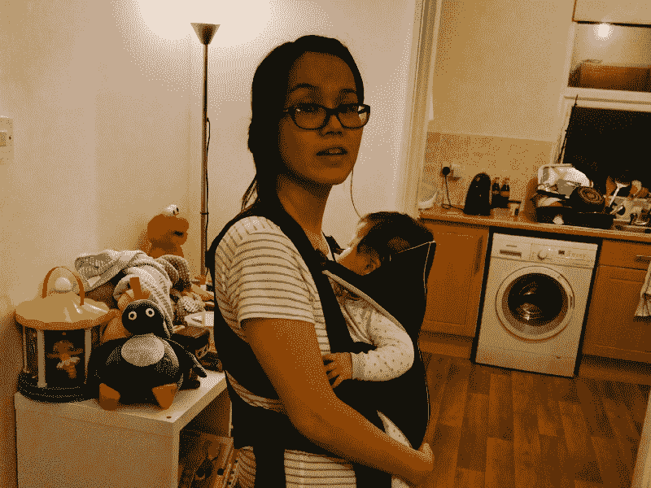

# 我是如何从全职妈妈变成前端网站开发者的

> 原文：<https://www.freecodecamp.org/news/how-i-went-from-stay-at-home-mum-to-front-end-web-developer-39724046692a/>

我多次想过写下我个人的编码之旅，但从来没有勇气这样做。我不屑一顾，心想:“怎么会有人想看这个？”

开发者来自各行各业。然而，我想谈谈如何和年幼的孩子一起学习编码，以及如何在育儿和学习之间周旋的挑战。

#### 我的背景

我不是一个传统的 web 开发人员候选人。我走的是人文路线，没有计算机科学背景。我开始了高等教育的职业生涯，十多年来，我一直在行政部门中晋升。我喜欢我的工作，但对我的职业选择并不满意。

大约七年前，为了寻找一条新的职业道路，我寻求建议进入一个更技术性的角色。所以我开始学习像 HTML 和 CSS 这样的网络基础知识。我第一次尝试编码是半心半意的。恐惧是主要原因。我担心过渡会花太长时间。我也被即将到来的婚礼分心了。

#### 6 年后…一个丈夫，一套公寓，两个两岁以下的孩子！

2015 年 1 月我有了第一个宝宝。简而言之，有了我的儿子对这个系统是一个冲击，彻底颠覆了我的世界。睡眠剥夺就像是一种折磨，我很难进行母乳喂养。前六个月我一直处于僵尸状态。

随着事情开始稳定下来，我发现我又怀孕了。这是在我回来工作的第一周！女儿 2016 年 9 月出生。现在我有两个不到 20 个月的孩子了！

#### 实现、动机和职业变化

到 2017 年年中，34 岁的我决定离职。我这样做有两个原因。对我来说，既要工作又要照看孩子在经济上不再可行。和一个经常在外工作的丈夫一起照顾两个年幼的孩子是很难做全职工作的。

我七年前的想法从未消失。我可以等到孩子们大一点，开始找兼职工作，或者最终在技术领域找一份工作。我丈夫已经在科技行业工作，他给了我同样的建议。

学习基础知识:HTML、CSS 和 JavaScript。结合这三种技能，我知道我可以成为一名前端开发人员。

#### freeCodeCamp 和我的编码之旅的开始

我研究了我应该遵循哪个在线学习平台。我读到了关于免费代码营的好消息。我也喜欢课程的结构。它适合任何没有编程经验的人。

当我开始的时候，看到我的代码在预览窗格中呈现是非常令人满意的！我对自己说，“这没那么糟，我能做到”。我记得第一次卡住的时候。

它在一个标签上。我在练习说明中读到:“div 元素可能是所有 HTML 元素中最常用的。”我不明白你为什么要在一个`
`里套一个`
`？！

我丈夫说“谷歌是你的朋友”，所以我开始研究什么是`
`。

这并不容易。我已经有超过 13 年没有学习了，而且我也进入了一个与我以前所学的任何东西都相去甚远的学科领域。早期我有很多自我怀疑，害怕自己学不会编程。但是随着时间的推移，学习编程的过程变得越来越容易。我努力了，坚持了。

虽然课程变得更加困难，但我已经习惯了不舒服的感觉。

A typical evening of multitasking! Putting my daughter to sleep and doing the chores.

#### 学习如何与孩子一起编码的挑战

为人父母是一项永不停歇的“工作”。这是我演过的要求最高的角色！我必须成为最好的厨师、艺人、管家、歌手、护士、养育者、跑腿的、老师和讲故事的人……名单还在继续。即使当我的孩子们睡着了，我也随时待命，准备放下一切去满足他们的需求。

考虑到这一点，找时间编码是最大的挑战。我丈夫在外工作，一周的大部分时间我都在照看两个蹒跚学步的孩子。太累人了！一开始我只能在他们睡着后编码。

有孩子的一天通常从早上 6 点开始，持续到晚上 8 点。大概要到晚上 9 点，我才能坐下来，打开笔记本电脑，开始编码。尽管我感觉很累，但当我开始编码时，我感觉到了活力。

有些晚上比其他的要好。根据孩子们的需要，我设法在睡前 30 分钟到 3 个小时内学习。很多时候，我根本无法学习。

忍耐一下，会好起来的。

最终，编码成了我日常工作的一部分。当我的孩子在托儿所的时候，我学习得更多。在我“空闲”的日子里，我是这样安排我的一天的:

上午 6:早餐、陪孩子的时间
上午 9:学习
下午 12:午餐和家务
下午 1:继续学习
下午 3:做饭、多做家务和接孩子
晚上 9:多学习一些
晚上 10/11:睡觉

当你有了孩子，生病是不可避免的。但是没人告诉我婴儿多久会生病一次！这对我的编码之旅是一个很大的干扰。这里有一个例子。

2017 年冬天，我女儿得了流感，不久我儿子也得了流感。他们花了两个星期才康复。当我终于放松下来，不再处于“生存模式”时，我和丈夫生病了。我有一个多月不能学习了。

我学会了对这样的干扰做好准备，不让它对我的动力产生重大影响。我会努力尽快回到学习状态。我从短时间的编码开始，当我回到工作流中时，我就建立了它。

我试着尽可能保持一个常规。这不仅对我很重要，对我的孩子们也很重要。例如，这意味着不得不在解决一个练习的中途停止学习去接我的孩子。没有熬夜到凌晨，这样我就可以为第二天的孩子做好准备。

Photo by [rawpixel](https://unsplash.com/photos/4qIawjLB0aY?utm_source=unsplash&utm_medium=referral&utm_content=creditCopyText) on [Unsplash](https://unsplash.com/search/photos/lesson?utm_source=unsplash&utm_medium=referral&utm_content=creditCopyText)

#### 经验教训

最近有人问我，在我的编码之旅中，我学到的最重要的东西是什么。我已经列出了我的最佳建议。其中一些是父母专用的，但我相信它们对任何非父母的人仍然有用！

1.  **任何人都可以学习编码:**不管你是什么背景，只要你有兴趣和动力，你都可以学习编码。网上有如此多的资源可以满足各种知识水平的需求。你所需要的只是一台电脑和学习的时间。熟能生巧！
2.  **每天编码:**这是我从【freeCodeCamp 的昆西那里得到的提示，但它太重要了！我试着坚持这一点，但如果你做不到，不要自责。孩子们不可预测的天性意味着这对我来说并不总是可能的。我试图围绕我的责任和承诺来调整我的编码生活。学习如何变得灵活是关键。
3.  不要让自己太累:试着花些时间放松一下，停止学习。我试着去健身房。
4.  **一心多用:**孩子在托儿所的那几天，我把所有家务都分组到那个时间。洗衣服的时候我会编码。在我打扫卫生或做饭的时候，在 YouTube 上看一段与编码相关的视频或听一段播客。我也会批量做饭，然后冷冻起来，以便在周末腾出更多时间。
5.  学会管理你的恐惧:不要让你的消极情绪吞噬你。在你编码之旅的某个时刻，你会感到自我怀疑。每个人都有自己的应对机制。就我个人而言，我学习和练习得越多，我就越有信心。
6.  **学习如何研究:**这是一项需要掌握的重要技能。开始时，我发现很难找到正确的关键词来帮助我完成任务。还是那句话，练习是最重要的。你在网上搜索得越多，你就会变得越好。记得收藏有用的网站。
7.  **不要不知所措:**考虑一下你的编码之旅会把你带到哪里是件好事。但是不要让它压倒你。把你的知识想象成一条钟形曲线。在图的中间，也就是最高点，你会非常了解两种语言或框架。随着时间的推移，你在其他学科上的知识将会变得不广泛。了解新技术和趋势总是好的，但这并不意味着你必须成为专家！
8.  **建立投资组合:**没有“工作”经验你仍然可以建立一个好的投资组合。我的投资组合由来自 freeCodeCamp 的项目组成。你甚至不需要设置自己的环境，就可以使用在线资源如 [CodePen](https://codepen.io/) 来演示你的代码。
9.  **版本控制:**学习如何使用 [Git](https://git-scm.com/) 和 [GitHub](https://github.com/) 。当你开始做更复杂的项目时，你需要使用 IDE(集成开发环境)。我使用 Atom，但是不要太关注这个工具。选择一个，并善于使用它！开始创建存储库并将代码提交给 Github。
10.  代码审查:找人帮你审查项目代码很重要。一开始我很难做到这一点。但最终，它会让你成为一名更好的程序员。通过回顾其他人的代码，你也会学到很多东西。
11.  永远不要停止学习:人们问我的另一件事是我什么时候会停止学习。我的答案是永远不会。web 开发中有如此多的创新。我想知道最新的更新和“必须具备的技能”。

#### 我现在在哪里

学习编码一年左右，兼职。我已经完成了 freeCodeCamp 的六个证书中的三个。

我现在是一名自由职业的网站开发人员，我已经建立了两个商业网站。一个给客户，一个给我的投资组合。我有一个客户，我现在正在重新设计和建立他们的网站。我还在 freeCodeCamp 和其他平台如 Udemy 继续学习。

#### 最后的想法

有些人问我为什么要带着孩子转行，而不是在我有更多时间的时候。讽刺的是:我没有意识到时间有多重要。我也很自满，害怕在孩子面前冒险。我想成为孩子们的好榜样，并拥有一份我热爱的职业。

当我成为父母的时候，我觉得我唯一的目的就是成为一个母亲，在这个过程中我失去了自己的身份。当我重新开始学习时，它给了我一个育儿之外的目的。我不需要成为一个程序员或者妈妈，我可以两者兼而有之。

如果你有任何问题或者只是想打个招呼，在 Twitter 上找我 [@PhoebeVF](https://twitter.com/PhoebeVF)