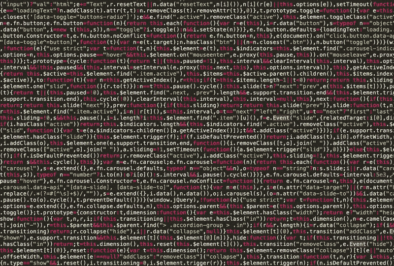
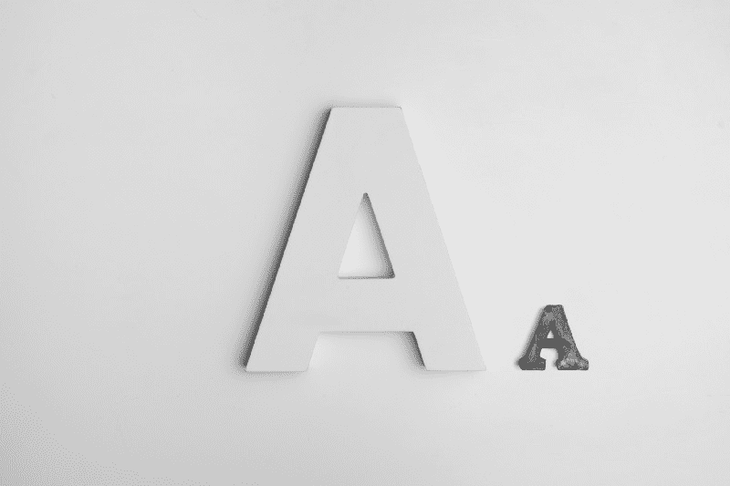
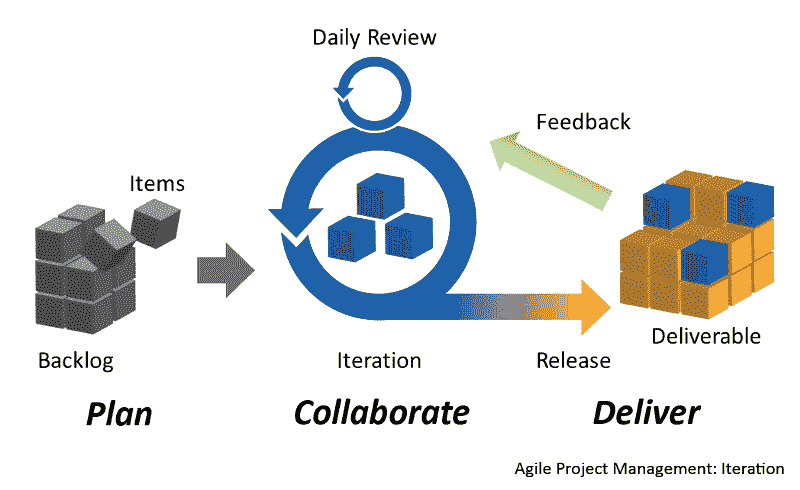
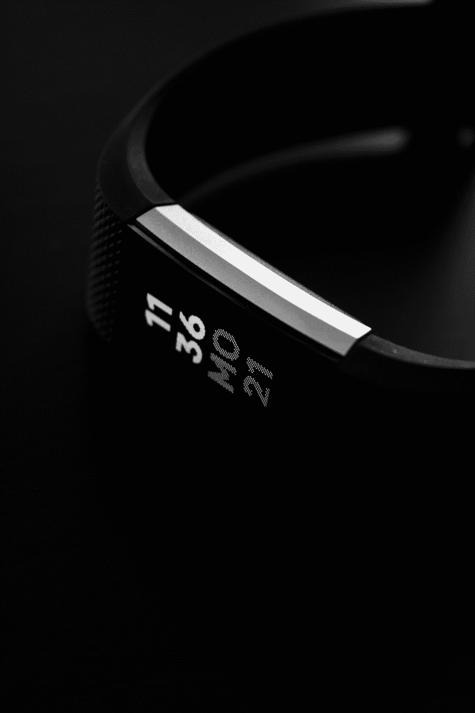

# 我是如何从停滞不前、毫无希望到实现我的科技职业梦想的

> 原文：<https://www.freecodecamp.org/news/how-i-went-from-stuck-and-hopeless-to-making-my-tech-career-dreams-come-true-d1fcf52c0650/>

科林·史密斯

# 我是如何从停滞不前、毫无希望到实现我的科技职业梦想的

Lost in life. Photo by [Maksym Kaharlytskyi](https://unsplash.com/@qwitka)/[Unsplash](https://unsplash.com/)

### 选择计算机科学

我和我的领域中一些最聪明的人一起工作，就在哈佛和普林斯顿的毕业生旁边，但我仍然没有意识到我已经取得了什么成就。几年前，我从没想过我会在这里——我认为我不是顶尖的技术人才。带我来到这里的路，开始于你现在可能会发现的同一个地方。只要稍加指导，任何人都可以取得和我一样的成就。希望我的故事能推动你迈出第一步。

我的故事始于我获得音乐技术第一个学位的毕业日。你可能遇到过和我一样的情况。我没有工作。我面对的是一个在昂贵城市无薪实习的世界。感觉我的大学学位毫无用处。我没有存款，还有大量的学生债务。我感到绝望和困顿。我觉得我永远也还不起我的学生贷款了。

在我毕业典礼上的演讲人向我的班级保证我们会很好。我们将打造自己的道路。我听了这话，心里暗笑；她绝对不可能把这句励志台词指向我。我永远也不可能拥有一份既赚钱又满足的职业。我没有做出正确的选择导致这一点。像稳定和金钱这样的东西是留给那些比我计划得更好的人的。所以我做了任何绝望的毕业生都会做的事，去东京教英语。

#### 在东京生存

有一段时间情况有所好转。我有钱，有工作，住在大城市，享受生活。一切都很好，直到我的一个室友告诉我他要搬走了，我不得不找一个新地方。现实炸弹再一次落下，我完全没有准备。我有大约 1000 美元的存款，但这远远不够在东京给自己买一套公寓(尤其是高昂的预付费用)。

所以在没有其他选择的情况下，我选择了一套很小的公寓。也很悲惨。绝对令人沮丧。那是一个 118 平方英尺的房间，在东京某个街区的后巷里，我不得不把头靠在厨房的水槽上睡觉。([这是同一栋楼的类似单元](http://www.tokyocityapartments.net/property/pier-i-305))。我又一次不得不面对眼前的现实，这一次我无处可逃。

Typical Tokyo-looking neighborhood. Photo by [Pawel Janiak](https://unsplash.com/@pawelj)/[Unsplash](http://www.unsplash.com)

我开始思考在未来的职业生涯中什么对我来说是重要的。我有几个朋友试图将他们的热情转化为工作，结果却很痛苦。事实证明，工作会剥夺你热爱的事物的乐趣。所以我排除了音乐生涯。此外，众所周知，打入这个行业非常困难。

#### 感觉卡住了

我也想过回美国去获得一个教学学位。经过一点研究，似乎最快获得教师资格的方法是通过一些项目，让你进入这个国家资金最不足、最具挑战性的教室。我在东京只当了一年半的老师，对教学有点厌倦了。所以这条路太慢，太难走，看起来不像是我最终会喜欢的职业。我又一次被难住了。我觉得外面没有什么对我有意义。

Which way to go? Sometimes the obvious choice isn’t the best. Photo by [Vladislav Babienko](https://unsplash.com/@garri)/[Unsplash](http://www.unsplash.com)

似乎摆在我面前的显而易见且自然的选择并不是我想要的。我想继续住在国外。我想要一个稳定的、受欢迎的、高薪的职业道路。我开始研究，发现计算机编程工作符合我寻找的许多标准。我一直对计算机和技术感兴趣。以前我甚至和一个朋友一起摆弄过一个像这样的小草莓馅饼。于是我开始深入挖掘。

我担心的第一件事是我数学很差。我一直认为计算机程序员必须擅长数学。在成长过程中，我甚至从未向父母要过精美的图形计算器，因为我认为这是一种浪费，尽管其他孩子都有一个。

第二件事是我一生中从未写过一行代码。似乎我认识的所有对编程感兴趣的人从他们还是孩子的时候就开始这样做了。让我担心的最后一件事是，它似乎势不可挡。我无法想象自己会成为一家科技公司的程序员。

尽管如此，我还是决定冒险一试，开始寻找一个在线计算机科学项目。我一点也没有意识到，这是我在通往现在这个令人惊叹的职业的旅程中迈出的第一步。

### 思维模式的转变

看到成功需要我个人观点的一些重大改变。幸运的是，在开始计算机科学项目之前，我遇到了一个了不起的女人，她让我变得更好。让我强调一下，我是幸运的，不要坐以待毙，等待事情发生在你身上。

首先，我厌倦了平庸，勉强度日。这意味着我准备好去改变以获得更多。对新观点保持开放的态度，并更加努力地鞭策自己是实现目标的关键。阅读高效人士的 7 个习惯帮助我采取具体措施，了解我哪里错了。

在此之前，滑行是好的。b 是伟大的，做最少对我来说是最大的。你需要明白你所做的一切都反映了你是谁。力争上游，你最终肯定会比你原本想象的更高。

第二，我现在能够一头扎进以前因为害怕失败而推迟的事情中。比如数学。我仍然讨厌数学，但如果我知道另一门课程会让我更接近我的目标，我会很乐意去学。不要想太多，投入到任何挑战中，这将确保你不断前进。你可能会发现自己不知所措，但你会度过难关，你会学到一些东西。

Ride the wave of new found determination. Photo by [Raul Varzar](https://unsplash.com/photos/L-CShKAuZsg?utm_source=unsplash&utm_medium=referral&utm_content=creditCopyText)/Unsplash

### 在线学位

我第一次寻找合适的项目是从网上学位开始的，也是从网上学位结束的。几年前我搜索的时候，只有几个选项可用。Bootcamps 和 awesome，但是像 freeCodeCamp 这样的免费程序并不存在。即使大学机构声誉良好，在线项目本身也是年轻的，未经证实的。当时，攻读在线学位似乎是一个极其冒险的选择，但我很高兴自己选择了这个选择。

我最终选择了一个承诺我可以在两年内毕业并获得学位的项目。速度是我的第一要务。灵活性其次。我通过这个特殊的在线学位项目获得了这两个学位。

我的第一门计算机科学课程是程序设计 165，它是程序设计 161 和 162 的浓缩和更快的版本。我必须上这门课，才能在两年内顺利毕业。我很兴奋，准备出发了。我直接进入第一周的话题。然后马上意识到我已经力不从心了。

Code looked like a mess of nothing when I started. Photo by [Sabrina Gelbart](https://www.pexels.com/@sabrina-gelbart-65954)/[Pexels](https://www.pexels.com/)

我们在第一周讨论了 if 语句、switch 语句以及 for 和 while 循环。因为压力太大，我第一周都睡不着觉。我对这些话题不感兴趣，我的思想开始在一个负面的反馈循环中螺旋式下降。

我知道问题不在于教科书，因为一个知道如何编程的朋友说这本书是一个很好的资源。我脑海深处那个唠叨的声音开始告诉我，我不适合做这个，我应该放弃。*没有其他人对课程进度有问题，班级论坛上的每个人似乎都做得很好。我就是很差劲。*

我想了很久，决定去找老师，看看我是否能转到正常节奏的班级。他非常支持我，并确保过渡快速顺利。这种转变让我可以在更长的时间内更专注于某个单独的主题，而且节奏对我来说也更加可行。

我不再溺水，但不幸的是，这扼杀了我两年后毕业的机会。即使学习部分很好，我仍然觉得自己很失败，因为我在高级班跟不上。这不是我想要的开始。

尽管进度落后，但我的大部分课程都学得很好。我得到了全 A(这是我一生中从来没有过的)，并尽我所能超越自我，为未来的职业生涯做准备。即使我不能像我最初希望的那样在两年内毕业，我意识到我仍然可以在毕业前开始工作。无论如何，这会让我得到我真正想要的，一份有真正职业道路的工作。

Be ambitious. Get the best grades you can. With no experience, a good GPA can be a good sign to employers. Photo by [Alexander Andrews](https://unsplash.com/photos/zw07kVDaHPw?utm_source=unsplash&utm_medium=referral&utm_content=creditCopyText)/Unsplash

#### 弄湿我的脚

我现在需要决定作为一名程序员我想做什么。我的第一直觉是去看看那些收入最高的工作。从那以后，我更深入地了解了他们为什么收入高。是因为他们使用过时的技术，所以对这些专家的需求很高吗？还是因为使用该技术的市场在增长？我最终选择了 iOS，因为它是一个不断增长的市场，我喜欢它的视觉效果，而且平均来说，它的报酬相当不错。

我开始钓鱼。这可能是一个反复出现的主题，但结果并不是我所希望的。由于我的学位在网上，我收到了很多拒绝。断然拒绝。一次甚至是通过我学校举办的网上招聘会。真是讽刺。

我也遇到过很多骗子。人们希望在没有任何指导的情况下让别人为他们做免费工作。他们会强迫使用过时和过时的技术栈。或者歪曲无薪职位，使其看起来比实际情况更有趣。我甚至有人让我做一些免费的工作，然后再决定我是否“适合”实习。避免这些废话。去合法的公司，他们会支付你的时间或者有从零开始教人的记录。

Rejection and people trying to take advantage of you can do a number on your confidence. Photo by [Hello I’m Nik](https://unsplash.com/photos/3xNn1zGvBwY?utm_source=unsplash&utm_medium=referral&utm_content=creditCopyText)/Unsplash

我希望在我的家乡加利福尼亚工作。但是，在梳理一堆粗略的实习经历时，面对如此多的拒绝，让我决定扩大搜索范围。我在波士顿偶然发现了一家提供 iOS 学徒的公司。这个节目听起来好得令人难以置信。他们会训练你，给你薪水。如果他们在 3 个月结束时足够喜欢你，他们会全职雇用你，你会得到一笔可观的薪水。我参加了面试，不知怎么得到了这份工作。

我没有为面试做好准备，因为我不知道如何准备。不要像我一样，看看我写的关于如何在第一次面试中成功的文章。但我设法说服了这家公司给我一次机会。我欣喜若狂。我在两年内设法找到了一份工作，我为自己第一次有机会证明自己是一名程序员而欣喜若狂。

### 第一份工作

和任何新事物一样，学习 iOS 是一个真正的挑战。我更熟悉 Angular 之类的 web 框架，而习惯 iOS 的新概念被证明是困难的。当时 iOS 开发者可用的资源非常有限。但是我在 iOS 的早期版本《大书呆子牧场》上学习了很多。

我每个周末都在研究 iOS，并做额外的工作来学习更多知识，证明我会是一个好的全职雇员。和我一起工作的每个人都比我在 iOS 时要好，我必须付出巨大的努力才能赶上我的同事。

我们的第一项任务是完成斯坦福大学教授 iOS 概念的在线项目。这对我来说很好，因为这正是我在攻读在线学位时所做的事情。

接下来的部分更难。我们打算开发一个应用程序。我们将使用敏捷方法来组织我们的工作。这些方法将从头到尾指导我们执行。

Agile! Photo By [Planbox](https://commons.wikimedia.org/wiki/File:Agile_Project_Management_by_Planbox.png) from [Wikimedia Commons](https://creativecommons.org/licenses/by-sa/3.0)

我现在对交给我的任务负责，我必须对我的工作负责。如果我不能按时完成任务，我必须学会解释原因。我不得不列出可能的解决方案来疏通自己，并在给定的时间内交付一些有用的东西。我不得不学 Git。我必须学会以这样一种方式组织我的工作，即我可以适应并围绕我的团队的时间表和目标进行规划。但最重要的是，我必须学会为团队做出贡献，成为人们愿意与之共事的人。

我和我的团队按时交付了我们的最终产品，公司的内部入职应用。我还在全公司面前展示了这款应用。我解释了围绕这个应用的工作，并展示了闪亮的新功能。不久之后，我开始从事客户付费的项目。这让我得到了全职工作。事情正在好转，我终于在这个新世界找到了立足之地。感觉棒极了。

但是光芒消退的比我想象的要快得多。免费的饮料和小吃成了常态。街机成了一种烦恼。周五的免费晚餐开始让人觉得是被迫的，而不是值得期待的。似乎提供的额外服务是为了转移注意力。这使得很多人看不到公司周围实际发生的事情。

把这个打出来让我觉得自己忘恩负义。但是，如果一个健康高效的工作环境的基本要素不存在，额外的东西也无法弥补。

该公司发展迅速。我是第 40 名员工，一年后我离开时，那家公司有 140 名员工。过去让你觉得被需要和特别的做法，现在只表扬了同样的几个员工。很明显，有一群人比其他人更有价值。同样清楚的是，如果你不在这个团队中，一个重大错误就可能让你被解雇。

最重要的是，我做的好工作没有得到认可。我开发的一个应用程序获得了我们那年发布的最佳架构应用程序奖。只有这个项目的负责人得到了荣誉(他和我是这个项目中唯一的两个人)。

几个月来，我一直在做一个最无聊但最赚钱的项目。我们不得不每天穿着西装出现在客户的办公室，错过了家庭办公室的许多新闻和有趣的事情。这是孤立的，给我留下了很少的空间去承担一些有助于我成长为程序员的事情。除了我的直接经理，似乎没有人欣赏这一点。

我最近也开始去当地的 iOS 聚会(做这个！！)并发现，就我工作的领域和我居住的城市而言，我的工资实际上低得多。很明显我需要做出改变。

Always be ready to make your next move. Photo by [rawpixel](https://unsplash.com/photos/Cmerk5uR1WI?utm_source=unsplash&utm_medium=referral&utm_content=creditCopyText)/Unsplash

我有两个选择。努力让自己成为不可接触的员工，或者开始寻找其他地方。我选择了后者。事后看来，这是迄今为止最正确的决定。我面试了 4 家公司，得到了两份工作机会。我最终选择了 Fitbit 公司。工资很高，产品也很棒。波士顿的团队在采访中也表现得友好和热情，这是很难做到的。我变平了，感觉棒极了。

### 中型独角兽

我在上一份工作中表现出色，并在一家科技独角兽公司找到了新工作，这无疑对我的自尊心造成了伤害。我非常自信，确信我会在新公司表现出色。

我一点也不知道，我已经进入了一个全新的世界。这个世界充满了产品经理、单元测试和数百万用户。这是一个全新的游戏，我必须从头开始。幸运的是，这一次我从一开始就有一个很好的导师，他帮助指导我进入新的角色。

我注意到的第一个最大的不同是团队的组织和他们的关注点。我所在的产品团队只专注于应用程序中与食物、水和体重相关的功能。我过度专注于一个大型应用程序的一个部分。我还定期与我的产品经理、工程经理、团队领导、Android 团队和设计部门合作。这种工作方式对我来说完全陌生。

每个人都与你所构建的东西有利害关系，你最好确保在你发布给数百万用户之前，他们都签署了你所构建的东西。步伐感觉有点慢，但更有意义。我们建造的一切都比我过去所习惯的更加精致，投入了更多的思考和努力。我的第一个 bug 修复改善了数百万人的体验，我喜欢这种感觉。

建造一个比我大得多的小东西对我来说也是全新的。我这里的意思也有几个不同的层次。我是大约 15 到 25 名 iOS 工程师之一。我们向一个更大的软件工程组织汇报。这与硬件生产和固件工程相协调。这都是在公司领导的指导下进行的。如此大的规模和对数百万人如此重要的贡献令人肃然起敬。有时我不得不坐下来想一想，让它渗透进去。

人们用 Fitbit 过上更健康生活的成功故事是巨大的动力。那时我发现，你从事的产品会让你对你工作的公司有很大的不同。这似乎是显而易见的，但在找工作时，它可能会被忽略很多。

Working on a product that helps people live healthier lives can be incredibly rewarding. Photo by [Adam Birkett](https://unsplash.com/photos/QRWAdBCqysc?utm_source=unsplash&utm_medium=referral&utm_content=creditCopyText)/Unsplash

随着时间的推移，通过导师的指导，我能够承担更大、更复杂的任务。我开始安排会议，与其他产品团队进行协调。我甚至指导了其中的一些会议。我总是从我的导师那里得到反馈，了解哪些进展顺利，哪些进展不顺利。这帮助我专注于发展领域，巩固了我的优势。

我还在开发这个应用程序最重要和最新的领域之一。该公司在这项功能上下了很大的赌注。我们承受着巨大的压力，要在非常紧迫的时间内交付一吨货物。我们的团队坚如磐石，并设法让高层意识到有些东西必须放弃，无论是功能集还是时间。我们最终在新的发布日期提前发布了这个特性。就在这个时候，我意识到我需要再次鞭策自己。

我看到我变得自满了。我还发现公司内部没有多少地方可以领导更大的项目。这是因为我们已经有了很多高级工程师。最重要的是，波士顿开始感到渺小，而我以前游牧生活方式的影响让我感到幽闭恐惧症。

我妻子和我决定去纽约。我以前提出过远程工作的话题，但这似乎不可行。所以我需要想出我的下一步。我决定力争上游，去找一家方(脸书、亚马逊、网飞、谷歌)公司。

Always be open to feedback. It is the only way to keep growing. Photo by [Startup Stock Photos](https://www.pexels.com/@startup-stock-photos)/[Pexels](http://www.pexels.com)

我以前被谷歌和推特拒绝过，所以我知道我需要知道的不仅仅是纯粹的 iOS 知识。我需要确保我的算法和数据结构知识坚如磐石。我需要为此投入时间和精力。所以我开始申请，看看谁会感兴趣。我得到了比我想象的更多的兴趣，这是一个惊喜，所以我知道这是真的发生了。我不得不低下头，专注于下一步。

### 面试准备

我立刻搞砸了两个顶级科技公司的面试。我变得懒惰和不耐烦。我希望我不用学习就能被录取。我立即被这些手机屏幕的故障带回了现实。

我有点抓狂，因为我因为过度自信和懒惰浪费了两次机会。我只有一次机会进入顶级公司。这让我意识到我不能仅仅依靠已有的知识。我需要花一些时间和精力来练习面试。不久之后，我订购了一块白板。

我开始复习数据结构和算法。我研究了 LeetCode 问题和 CareerCup 问题。我把我认为会在面试中看到的问题都添加到我的 IDE 的一个项目中(在我的例子中是 Xcode)。然后我关掉了自动完成，开始每晚钻这些题，每晚 2 个小时。周末时间更长。

过了一段时间，我记住了大约 75 个问题。但这不仅仅是记忆问题。一旦你内化了某些类型的问题是如何解决的，你就可以将这些模式应用到你从未见过的新问题上。这是最终目标。

然后，我让我的妻子学习其中的一些问题，并对我进行模拟面试。我开始在白板上演练这些问题，以适应白板。白板的很大一部分是板上的空间管理。我从黑板的左上方开始练习，使用更小的字体以节省空间，并使用这些细尖的记号笔以方便阅读笔迹。

我确保在我写完问题后，我使用的所有语法都会编译。我还限制了自己的时间，以适应面试的时间敏感性。这让我为紧张的面试环境做好了准备，并帮助我后来脱颖而出。

在大型面试之前，我参加了一些小型的初创公司面试。我不想再犯没有准备好的错误。这也是个好主意。我开始对在任何环境下做面试问题变得异常自如。

我开始看到问题中的一些模式反复出现。这让我能够将我从未见过的问题分解成更小的部分。当它们被分割成小块后，就更容易解决了。过了一会儿，我清楚地意识到，我已经准备好了在谷歌面试中面对的算法问题。

Whiteboard interviews, the bane of all software engineers. Photo by [Trent Erwin](https://unsplash.com/photos/DQm_LProvx0?utm_source=unsplash&utm_medium=referral&utm_content=creditCopyText)/Unsplash

我现在需要开始准备任何可能出现在我面前的架构问题。我开始在自己的手机上运行数据包嗅探应用程序，如 WhatsApp、Instagram、Twitter、Allo 和 Messenger。这让我对他们的网络流量有所了解。我开始阅读关于缓存和持久存储到磁盘的不同方法以及联网的不同方法。

我在飞行模式下玩了一堆不同的应用程序，看看它们如何处理离线案件。我尽最大努力尝试破解应用程序，看看错误是如何处理的。我还查看了一些开源框架，如 SDWebImage 和 AlamoFire，以了解它们是如何工作的。这帮助我理解了最好的架构和构建的应用程序是如何做到最好的。

学了两个月的算法和 app 架构，觉得准备好了。但我内心深处仍有疑虑。我应该多学习吗？我准备好了吗？确定何时准备好是一门艺术。你不能像我一开始那样没有耐心，毫无准备地仓促行事。但是你也不能犹豫太久。

当你处于事业的巅峰，并且在一些小公司的面试中胜出，那么是时候离开了。这就是我所做的。我联系了招聘人员，安排了一次与上一家我有机会接触的顶级公司的电话面试。

### 屏幕

面试那天，我很紧张。这很糟糕。我已经做了大量的采访，很久没有紧张过了。但是当然，重要的时候，神经又回来了。面试者在屏幕前迟到了 5 分钟。那 5 分钟感觉像 5 个小时。我记得我汗流浃背，不得不在开始面试前换下衬衫。我当时一团糟。然后电话来了。

电话那头的人似乎很友好。他问我是否还有空，做了自我介绍，然后直接开始解释面试的形式。这次面试全是算法问题。我觉得很舒服，因为我已经钻了这么多。第一个问题，我做得很好。第二个问题，我打了很多嗝，需要面试官的很多指导。我知道这不好，心里有一种失败的感觉。

I was sweating more than this mug before the phone screen. Gross. Photo by [MILKOVÍ](https://unsplash.com/photos/gWU--nNbE_Q?utm_source=unsplash&utm_medium=referral&utm_content=creditCopyText)/[Unsplash](https://unsplash.com/?utm_source=unsplash&utm_medium=referral&utm_content=creditCopyText)

我们结束了通话，我尽力表现出对公司的热情。我事先对这家公司做了很多研究，有一大堆我想问的问题。独特的问题表明我做了一些研究。我问到最近的一次收购，面试官实际上没有听说过，因为这是最近的新闻。我解释了被收购公司的专业，并问面试官如何看待它与方公司的契合度。他迁就我，我很感激。电话结束了，只剩下我一个人带着恐惧和疑虑。

面试官联系了我。我的心怦怦直跳。感觉好像已经过了几个月，而实际上才过了 3 天。他们没有收到想要的信号。我不能带着之前屏幕上的表演去现场。我倒下了，但没有出局。他们想再拍一部电影。我抓住了这个机会，并立即为第二次放映安排了另一次约会。

下一个面试官就不那么友好了。事实上，他表现得很冷淡。我脑子里开始发慌。这个家伙不会让我通过的。只是我的运气。他提出了第一个问题。我做得很好，我们在大约 15 分钟后进入下一个问题。我又一次做得很好，又过了 20 分钟完成了第二个。还剩 5 分钟的时候我问了一些关于公司的问题，然后我们就结束了。我对自己的表现感觉良好，但我无法读懂面试官的声音。我不知道它是否足够好。等待的游戏就这样开始了。

这次花了一个星期才回复我。感觉这是个不好的信号。我既期待又害怕招聘人员的电话。幸运的是，招聘人员怜悯我。从他们的语气中，我可以立即看出这是个好消息。我通过了。我第一次去了一家方公司的现场。我欣喜若狂。但我没有让这个消息让我沾沾自喜。我把面试安排在与招聘人员通话后的两周。我像个疯子一样钻了起来。

我把每天的训练时间增加到了 3 个小时，同时阅读了所有我能读到的关于代码的东西。我也开始对自己作为程序员的经历更加内省。我确信他们会问我以前工作的情况。我面临的挑战是什么？我是如何处理失败的？我对分配给我的任务负责了吗？

我做了一堆这样的问题，填了答案。这实际上是一种很好的体验。我对自己有了更多的了解，认识到了我可以改进的地方和我擅长的地方。通过为这次面试做准备，我成为了一名更好的程序员。有了对自己的了解，我可以满怀信心地去参加面试。

Do some major self reflection when prepping for interviews. Knowing your strengths and weaknesses will do wonders for you. Photo by [Redd Angelo](https://unsplash.com/photos/tFQg2hkyaFo?utm_source=unsplash&utm_medium=referral&utm_content=creditCopyText)/[Unsplash](https://unsplash.com/?utm_source=unsplash&utm_medium=referral&utm_content=creditCopyText)

### 现场

此时，我已经做了大量的现场采访。但看到方公司的运作方式却让我大开眼界。机票和餐费都已支付，高档酒店也已预订，招聘人员也很关心你，并一直关注你。其中一些适用于我面试过的其他地方，但在一家顶级科技公司，这个过程有些不同。在流程的每一步和每一个子步骤中，一切都经过了简化和规划。

我飞往纽约的航班准时到达。去酒店的出租车也很快。酒店本身非常漂亮。那是东村的一家精品酒店。我有一种冲动，想出去享受夜晚，喝一杯来平静一下我的神经，但我设法抑制住了。我在家里订了一顿饭，对一些建筑和职业问题做了最后的复习。没有什么沉重的，大多是轻松的阅读。我想让我的头脑在第二天保持清醒。

由于街道上的活动，酒店变得有点嘈杂，但我还是睡了足足 6 个小时。我很早就醒了，找了附近的咖啡店。在等待面试开始的时候，我边喝咖啡边吃华夫饼干。我利用这段时间放松，在网上随意浏览一些东西。进入平静的心态有助于控制我的神经，并在面试前保持正确的心态。

我提前 15 分钟到了，招聘人员带我参观了办公室。那是一个不错的办公室，有很多免费的食物。还有免费饮料。还有咖啡。还有牙刷？我想这也是有用的。她让我在一个大房间里坐下，说我很幸运。其他房间要小得多，白板空间也小得多。我有了一个好的开始。

我不想说太多关于现场的细节，但我要说的是。我在大多数问题上都做得很好。我对自己给出的所有答案都感觉良好。除了一个疗程。我在 9 到 10 个问题中有一个失败了。我希望这就够了。我希望我的热情和在其他问题上的表现足以支撑我的一次微弱的表现。

Perfect example of how I felt after 5 hours of interviewing. Photo by [Christian Fregnan](https://unsplash.com/photos/QVlDppfbDn0?utm_source=unsplash&utm_medium=referral&utm_content=creditCopyText)/[Unsplash](https://unsplash.com/?utm_source=unsplash&utm_medium=referral&utm_content=creditCopyText)

我立刻从酒店去了机场，然后飞回家。等待的游戏开始了，花了相当长的时间。而这一次，出于某种原因，我没有在意。我逼迫自己太久，太专注于一件事，以至于我厌倦了。我说完了。如果我没得到这份工作，那也没什么。

我已经尽力了，一年后我可以再试一次。我也想搬到纽约，已经有一个机会在一家我喜欢的初创公司等着我。因此，在我的波士顿租约到期前找到一份工作是最有压力的事情，而且已经解决了。我忘记了我的现场，做了最坏的打算。然后电话来了。

我通过了。我真的通过了。我甚至无法理解这对我意味着什么。我都没反应过来。我接受了这个信息，继续我的一天。我刚从漫长的一天工作中回来，我的大脑处于关闭模式。所以我告诉了我妻子。她非常为我高兴。那天剩下的时间我什么也没做。

第二天我接受了这个提议。

这就是我的故事。没那么迷人。充满坎坷、失败和疑惑。但是我做到了。你也可以。

这不是你偶然发现的。在你选择的道路上，你需要深思熟虑。你需要下定决心。你还需要有强烈的欲望不断推动自己变得更好。那你就能成功。一次征服一个挑战，直到你到达你想去的地方。感谢阅读。

**喜欢你看到的吗？**

这是我写的另一篇关于如何在你的第一次科技面试中取得成功的文章。如果你喜欢，请读一读并鼓掌。

*必要免责声明:本文包含亚马逊联盟链接。任何点击都可能导致我收到佣金。*