# 我是如何通过学习编码赢得谷歌之旅的

> 原文：<https://www.freecodecamp.org/news/how-i-won-a-trip-to-google-by-learning-to-code-a86470e76423/>

马斯基斯

# 我是如何通过学习编码赢得谷歌之旅的

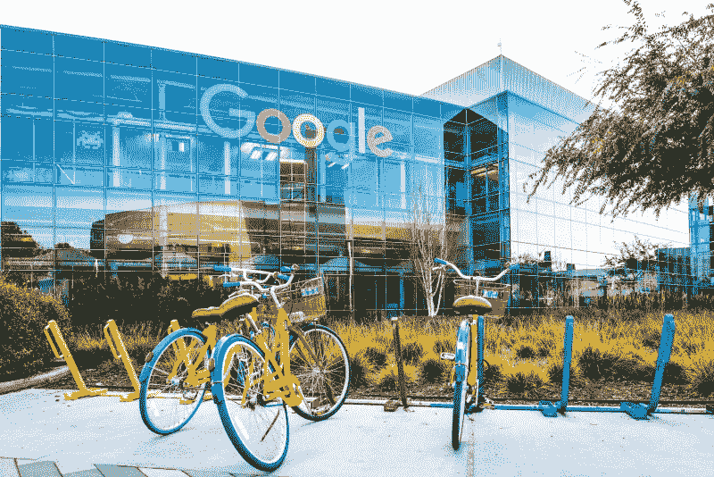

Can’t wait to visit the place :)

#### **设置场景**

我是一名 16 岁的青少年，这是一个关于我如何从一个菜鸟变成谷歌代码输入者(T2，GCI，T3，T4)的故事。 [Google Code-in](https://codein.withgoogle.com/) 是一项国际竞赛 **，旨在向大学预科学生(13-17 岁)介绍开源软件开发**。

随着你在比赛中的前进，会有很酷的奖品:数字证书、t 恤、帽衫，最后还有去谷歌总部的大奖之旅。今年的比赛有来自 78 个国家的 3500 多名学生参加，他们完成了 16468 项任务。

没有闪回的故事是不完整的。忍耐一下，我会带你回到过去。当你明白后台发生的事情时，故事的精彩部分会变得更有意义:)

剧透:学到的东西比实际的奖励更有价值。所以坚持到最后。

### $journey[0] = "第 0 天零 D "；

> 486 天前 (16 个月，但更喜欢)

那时我 10 年级。我不知道如何编程。我在学校时所知道的是 HTML 是一种编程语言。伪代码？不，没听说过。Python 是当时一种爬行动物的名字。现在才知道其实是个*兽*。

然而，在决定性的一天，一切都改变了。在翻阅一本(借来的)教科书时，我发现了一张传单。是关于学校的机器人俱乐部。看起来相当寒酸，到处都是漫画书。我内心的设计者痛苦地扭动着，但我就是我，我决定试一试。那一刻是我进入编程奇妙世界的开始。

我们学的第一件事是用 Scratch 进行可视化编程。我们用它来修补机器人套件，比如蜂鸟和 T2 雀。作为一个没有任何代码知识的人，我发现 Scratch 很方便。我们把它用于实际目的的事实使我的观点具体化了。

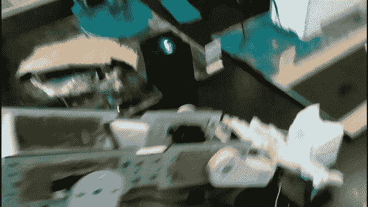

Through Scratch, we made our monstrous creation pour a glass of water. It was one year later that I’d realise that Python would have been a better start.

### `$journey[1] = $events["Infotech", "GCI" ];`

> **439 天前**

十二月很快就要到了。我们的机器人俱乐部想参加一年一度的技术展览。与此同时，来自 hackers.mu 的[洛根](https://medium.com/@loganaden)已经开始为 GCI 教授编程基础知识。这将有助于我们在竞赛开始时赶上其他国家。

然而，真正的挑战是如何管理我在构建机器人项目和学习编码之间的时间。有一次，我甚至想过放弃 GCI。但是，我决定坚持下去，两样都做。最好的。决定。永远不会。

这是一个紧张的准备月，但机器人俱乐部的活动是成功的。我们甚至得到了当地电视频道和报纸的报道。？

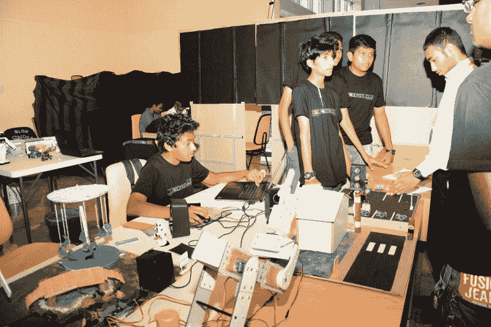

Our group effort paid off. The Robotics Club’s stand had over 1000 visitors over the course of 3 days.

接下来是 GCI。比赛开始三天后，我注册并开始着手我的第一个任务。因为洛根推荐，我决定用 Drupal。Drupal 是一个多功能的开源内容管理系统(CMS)软件。(点击[这里](https://masky.me/what-is-drupal/)了解更多关于 Drupal 的信息。)

我的第一个任务是安装 Drupal 并记录步骤。对我来说似乎很简单:找到一个教程，遵循它，然后用我自己的话重写它。两小时后，点击提交，瞧。现在我们只需等待批准。**错了。在获得批准之前，它被退回*三次*。作为参与者，重要的是每天都要习惯拒绝。*不要放弃。导师的意思不是刻薄，也不是说你刻薄。他们只想让你发挥出最好的水平。***

起初，我在 GCI 的进展缓慢。我的第一个期望是我们会设法得到 t 恤(三个任务)。随着时间的推移，我开始对这个过程有了更好的理解。在比赛中结交朋友，帮助解决彼此的问题，这让我更加热爱 GCI。由于我犯的错误相对较少，任务得到批准的速度更快。毛里求斯的参与者做得非常好，以至于谷歌甚至特别提到了我们。凌晨 3 点工作，与导师交谈，是我在 GCI 最喜欢的部分之一。

老实说，我对自己成为赢家的可能性感到困惑。但那是我的致命弱点。我开始沉迷于这种前景，并开始专注于获胜。我并不以此为荣，但有一次我甚至主动跟踪其他参与者。

> **384 天前**(1 月 25 日)

我醒了，上了厕所，掏出手机。

哦，嘿，一封来自谷歌的邮件。你没看到每天…

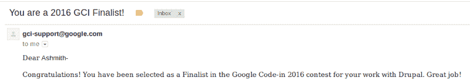

I was proud of myself and disappointed at the same time.

我猜这就是银牌得主的感觉。

如此接近却又如此遥远。

我曾想成为非洲第一个大奖得主。我失败了。但是，嘿，柯林斯的胜利比我更能代表非洲。我学到了宝贵的经验，为学校和国家创造了新纪录，并获得了重新站起来的机会。

### str_replace("win "，['enjoy '，' learn']，$ journey[$ aim])；

> 75 天前

整个 2017 年我都没有停止学习编码。我不断发现自己很怀念 GCI 的氛围，所以我参加了 [hackers.mu events](https://hackers.mu/news/end-of-year-2017-review) ，工作坊，任何与科技相关的活动。在朋友的帮助下，我甚至在学校组织了[我的第一次黑客马拉松](https://veegish.com/blog/mohack-mauritius-2017-local-hack-day/)。

于是 GCI 开始了。这一年我完全专注于学习，做我喜欢的事情，以及教别人。新的毛里求斯参与者非常热衷于学习编码，我非常欣赏这一点。我希望他们中有更多的人能有信心完成这三项任务。今年的参与者甚至比去年还多，这带来了令人惊叹的时刻。

今年的 GCI 硕果累累。我们为新来的 GCI 学生制作了[更新文档指南](https://www.drupal.org/docs/8/for-gci-students-where-to-start)。新生塔尼什甚至制作了一个[超赞的视频](https://www.youtube.com/watch?v=gZVqK8Knab0)贯穿其中。我研究了 Drupal 模块，并尽我所能做出了贡献。我开始了解社交 API，并越来越喜欢它。和其他学生一起，我们解决了大量的问题:[文档](https://www.drupal.org/project/social_auth/issues/2934724)，重构代码，等等。团队的共同努力使 GCI 成为 Drupal 的巨大成功。

> “学生们每年都继续给我留下深刻印象。尽管我们有很多学生试图作弊，但我们发现了一些摇滚明星程序员，他们是 Drupal 的未来。”

> — Matthew Lechleider，Drupal 的组织管理员

> 19 天前

快进。今天是 1 月 31 日。让我们看看结果，好吗？？

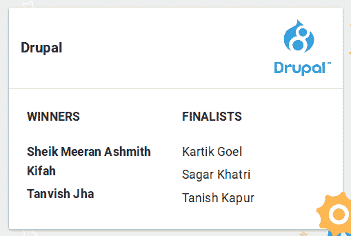

Becoming the first winner from Mauritius is an honour I’ll cherish forever.

我们感到失望的是，今年没有其他毛里求斯人获得冠军或进入决赛，但我想提一下，Tanesh，Heesen，Neel，Nissaar，Konrad，Hui 和所有其他人都做了很好的工作。他们中的许多人今年会有第二次机会，我会作为导师陪着他们度过难关:)。

### 经验教训

通过 GCI，我学到了很多东西。我发现了如何学习。我发现了媒介，并通过它获得了更多的信息来源。我不能一一列举，但这里有一些:

*   注重过程，而不是结果。你会学到更多，并珍惜这段经历。当你不把它当作一个竞争时，竞争就变得容易多了。
*   谷歌是你最好的朋友，尤其是在编码方面。通过了解谷歌黑客，利用谷歌的真正力量。$resources = [ [0](https://medium.com/marketing-and-entrepreneurship/12-powerful-google-hacks-to-make-you-a-power-searcher-763c71f3d8e1) ， [1](https://www.exploit-db.com/google-hacking-database/) ，[2](https://null-byte.wonderhowto.com/how-to/use-google-hack-googledorks-0163566/)；
*   在把你的工作发给你的同事/导师之前，一定要自我检查。自我审查不仅仅包括检查代码，还包括[实际运行代码](https://medium.freecodecamp.org/why-i-changed-the-way-i-think-about-code-quality-88c5d8d57e68)。我希望我早在创建一个 25 MB 的补丁来修复**的一个**错别字时就知道了。想起那件事，我还是会笑。
*   导师也是人，需要停机。通常情况下，他们也恰好和你生活在不同的时区。因此，耐心是很重要的。最佳的方法是在等待第一个任务被评审的同时，继续处理另一个任务。
*   如果你已经在一个特定的问题上困了很长时间，处理它的最好方法就是转移注意力。去散散步，或者睡一觉。你的大脑会下意识地处理[这个问题](https://www.psychologytoday.com/blog/your-brain-work/201209/stop-trying-solve-problems)。
*   在许多不眠之夜，我意识到每天在同一时间醒来比试图在同一时间入睡更容易。

与技术不太相关，但仍然有用:

*   书不是无用的，也不是灭绝的。世界上最成功的人(尤其是技术专家)阅读的书籍是普通人的两倍或更多。
*   生理节奏对你的表现有影响。它不仅受光线的影响，还受饮食习惯、体温和其他因素的影响。如果你曾经受到时差的影响，你可以显著地[减少时差的影响](https://www.youtube.com/watch?v=AB4S98_ZIPk)。
*   食物金字塔不是健康的饮食，一日三餐也不是。生酮饮食(高脂肪低碳水化合物)更健康，因为我们的身体是如何连接的。它也有帮助，因为你少吃糖。)。间歇禁食，[是大约 1400 年前一个不识字的家伙推荐的许多事情之一](http://thedailycrisp.com/prophet-muhammad-pbuh-9-healthy-habits-that-science-later-proved/)，由于[的科学研究](https://endpoints.elysiumhealth.com/the-science-of-fasting-2f5b56a2a65d)，它最近才成为主流。看看[这个](https://www.youtube.com/watch?v=Dan8qtgQRi8)和[这个](https://www.youtube.com/watch?v=PKfR6bAXr-c)也是:)。
*   摄入比 FDA 推荐摄入量(2300 毫克)更多的盐实际上会比你遵循指南导致更低的患病风险。见[这个](https://www.youtube.com/watch?v=0bNdhM4vt4I)和[这个。](https://chriskresser.com/shaking-up-the-salt-myth-the-dangers-of-salt-restriction/)
*   永远不要拿自己和别人比较。当你将自己与他人比较时，你已经将他们置于你之上。


#### -网络+主动性= eᵖʳᵒᵍʳᵉˢˢ

人际关系网和积极主动让我取得了指数级的进步。如果没有额外的努力去自学，我是不可能赢的。如果我没有接触到像[黑客、](http://hackers.mu) (❤)、 [Getulio](https://www.drupal.org/u/gvso) 和其他 Drupal-ers 这样有价值的导师，我不可能走到今天。如果我没有花时间去查看公告栏，我就不会知道 GCI。如果我没有主动加入机器人俱乐部，我的老师永远不会提醒我这些细节。积极主动使所有的[成为自己](http://defimedia.info/google-code-two-mauritian-students-among-finalists)和众多无名面孔之间的差异。

网络带来了巨大的好处。我交了朋友。我加入了一个很棒的团队。我学到了一些我从未想过会发生的事情。

### 不同的视角

我让其他参与者讲述他们的经历，所以下面是他们回答中我最喜欢的语录。我在我的博客[上发布了他们的完整采访。](https://masky.me/p/11eea1fe-c5d6-4f23-a30f-afb03700d94f/)

#### Tanvish Jha- Winner '17 (Drupal)？？

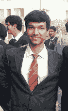

> 我最困难的任务是创建一个小模块。现在看起来不难，我已经创建和玩了很多模块，但当时我完全没有经验。当我第一次做这个任务时，我不熟悉编码标准和模块的布局，也不知道为什么要将特定的代码放在特定的文件夹中。现在一切看起来都很简单。

#### 慧婵，10 '17 强(Drupal)？？


<sarcasm>Hui couldn’t share his face so here’s an accurate representation of his cheerfulness.</sarcasm>

> 在 GCI 有一些时刻我永远不会忘记:

> 遇见了你，聊的很开心。你感同身受的能力让我吃惊，因为让外国人理解中国很难。

> 我曾经给思乐冰发了一个 pm，收到了:

```
<drupalbot> “<username> pm?” usually is a form of asking if it is acceptable to send a private message. Please do not send uninvited private messages to users. It is a courtesy to ask a user if you may engage in a private discussion before sending the PM. Furthermore, when you discuss the topic in a public channel, everyone can contribute and learn from the discussion.
```

> 这让我很惊讶，因为它与中国文化非常不同。

> 有一次，我一直工作到凌晨 00:30。很累但很高兴看到它被批准。当 GCI 结束的时候，我完成了 8 个任务，这让我在排行榜上一直保持到最后。我心里百感交集。像 ***哦……完了……***

#### Utkarsh Dixit，Winner '16 (Drupal)？？

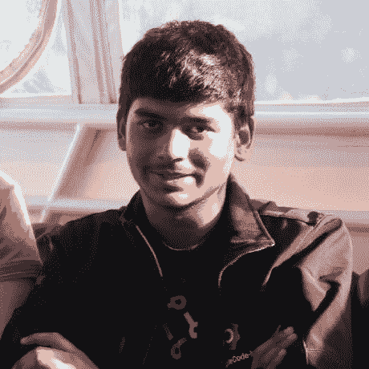

> 我是一个喜欢以任何可能的方式编码和探索编程世界的独狼。我也喜欢为开源项目做贡献，尤其是 Drupal。一开始，我没有想到我会走到这一步，但当我接近 GCI 的终点时，我开始变得自信起来。当然，我永远不会忘记的一个时刻是[我的第一个核心提交](https://www.drupal.org/project/drupal/issues/2505793)。虽然 GCI 组织得很好，但我认为 GCI 应该持续更长时间。我的意思是，我们本可以完成更具挑战性和更有趣的任务…

#### Tanesh Chuckowree，前 10 '17 (Ubuntu)？？

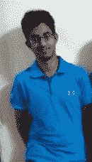

> 我是一个自豪的 Linux 用户，我只是最近才开始学习编程。老实说，我参加了 GCI，因为我的一个好朋友问我是否愿意参加。Ubuntu 并不是我的第一选择，但是我的一个导师让我使用 Ubuntu，我不能说我后悔这个决定。起初，我认为我会后悔参加 GCI，因为这意味着牺牲我的假期，但渐渐地它变得更棒了，我不认为有一个形容词可以形容我有多开心。

#### Kartik Goel，17 年决赛选手(Drupal)？？

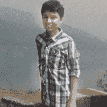

> 那一个半月可能是我度过的最美好的时光。最初，我有点厌倦，好像我不明白事情是如何运作的，但后来随着时间的推移，我探索事物，尽我所能为我的组织社区做出贡献。现在，由于 GCI，我觉得我个人已经融入了这个社区。除了学习和工作，GCI 总体上是有趣的。我与来自世界各地的学生和导师交谈，他们有着各自的故事，有着不同的技能。IRC 是一个非常好的聊天和娱乐的地方:)

#### Konrad Klawikowski，参与者 17 (Drupal)？？

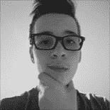

Doesn’t get hotter than this.

> 我的名字是康拉德，我来自波兰，我喜欢编程和所有它的东西，包括加密数据，区块链和更多！我不知道如何描述它，但是 Drupal 的任务非常多样，每个人都可以为自己找到一些东西。我在 GCI 玩得很开心，我认识了来自印度、毛里求斯、美国和加拿大的新朋友。我喜欢这个比赛，这是我的第一年，但我想我会争取更多。在 Drupal 中，有一些我见过的最好、最聪明的人；他们尊重我，和我有共同的兴趣。谢谢你们，我爱你们所有❤.人我认为我在 Drupal 确实有前途。我下一步要做什么？一个人曾经说过“要么做大，要么回家”，另一个人说，“那些疯狂到认为自己能够改变世界的人就是那些能够改变世界的人”。关于我的计划，我就说这些。

#### Dhanat Thew，Winner '16 (Drupal)？？

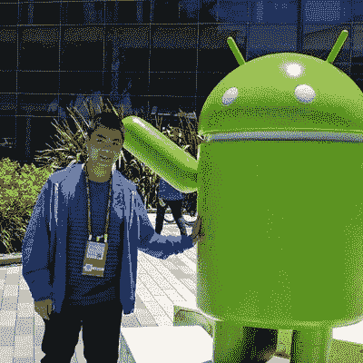

My man Thew next to his nephew.

> 我从推特上看到了关于 GCI 的新闻。在阅读了一些细节之后，我发现 Drupal 是其中的一个组织，所以我决定加入 GCI 并选择和 Drupal 一起工作。我最难的任务是“写一篇 3 段的短文向爷爷/奶奶解释什么是 Drupal ”,因为英语不是我的第一语言。在它被接受之前，我不得不改正许多语法错误。我绝对会向未来的学生推荐 GCI 和 Drupal。我的建议是专注于制作高质量的任务，以及社区将从你的作品中获得什么，而不是赢得一个奖项。

#### 17 年决赛选手萨加尔·卡特里(Drupal)？？

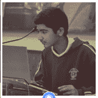

> Publii 是我对开源的第一次介绍，我立即开始帮助开发人员发现 Publii 中的错误。然后我参加了 GCI 2017，在那里我获得了关于开源的最多信息。GCI 对我来说很有趣。我的老师也允许我在学校研究 GCI，所以缺课两周为 Drupal 做贡献真的很有趣。我永远也忘不了在排行榜上看到自己名字的那一刻！至于 Drupal，它是一个非常强大的 CMS，有很好的社区基础。社区是组织的基石，Drupal 将它提升到了一个新的层次。

#### Matthew Lechleider，组织管理(Drupal)？？

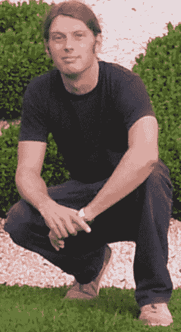

> 我希望我小时候有 GCI。这就是促使我在 GCI 开始使用 Drupal 的原因。通过它，我希望教育学生关于技术和开源的未来。我认为 Drupal 是一种生活方式，而不仅仅是一份工作。导师的生活就是花大量时间回答简单的问题，这些问题可以很容易地通过指导学生找到合适的文档来回答，然后看着他们从新手变成摇滚明星。看着学生成长为一名开发人员，最终成为一名软件专业人员，过着美好的生活，这真的很酷。

> 我永远不会忘记的一个时刻是看着 gvso 从 GCI 的学生，到 GCI 奖获得者，到 GSoC(谷歌代码之夏)的学生，到 GCI/GSoC 的导师，到在 Drupalcon 上演讲，现在帮我做组织管理工作。gvso 确实让我的生活更轻松。

### 结论

好吧，我的科技生涯就这样结束了。感谢所有这些人，这是一次美妙的经历。我期待着与 hackers.mu 一起进行更多的冒险，并在开源和 Drupal 方面追随 gvso 的脚步。

能够和 FreeCodeCamp 这样的一大群观众分享我学到的教训和我的旅程，感觉棒极了。我希望这能激励其他人步入编程和开源的世界。

如果你有任何想法或问题，请不要犹豫，在下面或在 [maskys@hackers.mu](mailto:maskys@hackers.mu) 提出来。

结束，

—马斯基斯