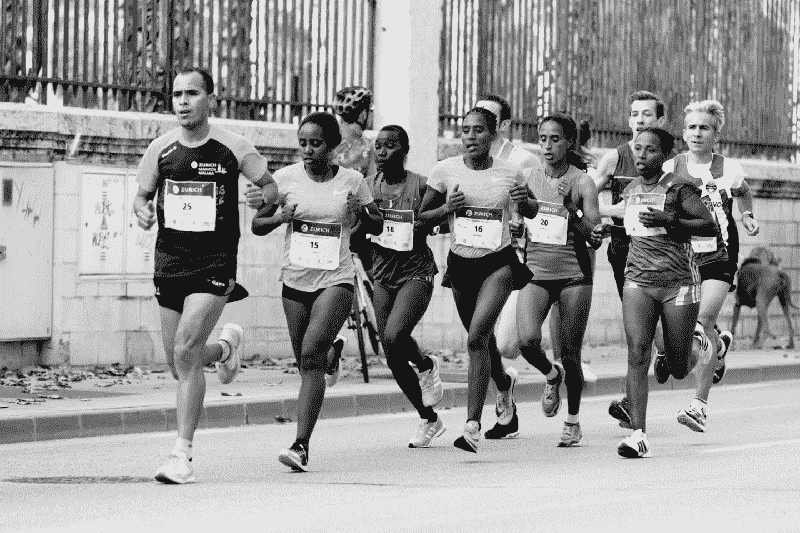

# 我是如何学习编程的:这是一项耐力运动

> 原文：<https://www.freecodecamp.org/news/how-im-learning-to-program-it-s-an-endurance-sport-8bf8725cd38/>

艾米·哈达德

# 我是如何学习编程的:这是一项耐力运动

#### 为什么我的编程学习轨迹反映了我作为跑步者的训练方式

Photo by [Quino Al](https://unsplash.com/photos/4DZikSB1tCk?utm_source=unsplash&utm_medium=referral&utm_content=creditCopyText) on [Unsplash](https://unsplash.com/search/photos/marathon-runner?utm_source=unsplash&utm_medium=referral&utm_content=creditCopyText)

我读过一些关于人们试图以极快的速度学习编程的故事——为了快速学习编程，连续几个月每天编程十几个小时。我也读过这种方法的后遗症:感觉筋疲力尽，远离编程。

学习编程没有什么是快速的，至少在我的经验中是这样。这不仅需要花时间去学习——并真正理解——大量的相关材料。但是也需要时间学会 **像程序员一样思考** 。

这就是为什么我认为学习编程是一项耐力运动。作为一名前长跑运动员，这是我如此喜欢它的一个原因。事实上，我学习编程的轨迹反映了我作为跑步者的训练方式。而是要有计划，定好稳健的步伐，持之以恒。

# 用计划培养耐力

我的第一次半程马拉松因为所有错误的原因而令人难忘。跑步条件不是很好:印第安纳州的五一天气异常温暖，而且路线上几乎没有树荫。但这些是我最不关心的。我的脸通红，心怦怦直跳，我的腿像钢杆一样，我觉得自己完全走样了——因为我确实走样了。我没有像大多数跑步者那样遵循训练计划。

我吸取了教训，并在此后的每场比赛中都使用了训练计划。这些训练计划提供了几个月的锻炼，让我为即将到来的比赛做好准备。他们也让我得到了我想要的结果:我比我的比赛时间少了几十分钟，而且感觉很棒。

今天，我遵循一个不同的训练计划:一个学习编程的计划。它给了我学习的结构，让我有责任感，并帮助我最大限度地利用我的编程时间。

这一切都从一个季度计划开始，它指导着我接下来几个月的学习。当我跑步的时候，我根据我跑的比赛或者我跑的时间，遵循不同的训练计划。现在，我制定并遵循带有特定学习目标的季度计划。例如，本季度，它正在使用 Python 学习计算机科学基础。

一旦有了计划，我会找出能帮助我实现目标的资源。然后，我通过[创建周计划和日计划](https://medium.freecodecamp.org/the-game-you-dont-want-to-play-as-a-programmer-44256740d23c)来实现它，这帮助我预算时间，并确定我未来一天的重点。这样，我带着目的进入每一个编程会话，并且确切地知道我需要做什么。

通过遵循一个跑步计划，我知道我需要跑多少英里，我需要跑多快。和编程没什么区别。当我打开我的笔记本电脑的时候，不知道今天早上我应该做什么。昨晚，当我为未来的一天制定计划时，我已经想好了这些细节。结果，我一头扎进了我需要完成的问题集中。

这个计划过程不仅仅是一个很好的功能，对我来说也是必须的。我的时间有限，因为我全职工作，并且在工作时间之外学习编程。所以我需要花在编程上的每一分钟都有价值。我的编程计划有助于实现这一目标。

# 你的速度是多少？

那是 11 月的一个清爽、阳光明媚的早晨，我一路小跑去参加半程马拉松。比赛开始前，我注意到一群跑步者挤在一起；一个人举着一面旗，上面写着他们的比赛速度。“我要和那群人呆在一起，”我对自己说，然后就出发了。我应该更清楚的。

这个小组的发展速度远远超过了我的训练速度。我的时间在五英里标记处看起来很棒，但是我的能量很快就被耗尽了。在接下来的 8.1 英里中，我无法保持小组短跑般的速度。但是当我减速的时候，伤害已经造成了。我起步太快，在这个过程中消耗了太多的能量，使得剩下的比赛变得漫长而艰难。

正如我从那场比赛中所学到的，在短跑中起跑会给你一个戏剧性的领先。但是，如果你有很多事情要做，这是不可持续的。一致性至关重要。这在我跑长距离的时候很重要，现在在我学习编程的时候仍然很重要。

每天早上 5 点 25 分，我的闹钟把我吵醒。我走向我的立式办公桌，在那里我花了几个小时编程。在我的日常工作开始之前，这些宝贵的时间是我用来实现我的日常编程目标的。没有通宵。周末没有 16 个小时花在编程上。相反，为了成为一名更好的程序员，我每天花几个小时集中精力，每周六天。

不仅仅是我花在编程上的小时数，而是我如何花掉这些时间的*。这又是一个节奏的问题。社会迫使我们在所做的每一件事上都快速前进。然而，我发现这种方法行不通——尤其是在学习的时候。如果我移动得太快，我会忽略小而重要的概念，或者混淆概念。另外有些东西，比如递归，需要花时间去理解。*

*所以我花在编程上的时间是稳定的。在继续之前，我确保自己真正理解了材料或问题。这个过程涉及到大量的[重复](https://medium.freecodecamp.org/why-i-recycle-programming-problems-7785e04e451d)，也就是说我移动的比较慢。我承认这很难忍住，所以我需要不断提醒自己，我正在建立知识的基础。如果我现在仓促行事，将来会后悔的。*

*这个速度对我来说也是可持续的。自从我开始学习编程以来，我一直保持这个速度，它帮助我到达我想去的地方。*

# *一致性很重要*

*一致性有很多让人喜欢的地方。首先，它使学习变得易于管理。因为我每天编程几个小时，所以我每次只专注于一小部分。*

*今天，这部分人正在理解一种排序算法，并开始实践。其他时候是通过一两个测试。这些都是可以实现的目标。他们挑战我，但他们肯定是可行的。*

*一致性也帮助我回忆。当我定期使用各种数据结构时，我记得**如何使用它们。当我开始一个新问题时，它们会在我脑海中浮现。毫不奇怪，我的信心也增加了。例如，我越是使用正则表达式，我就越能适应它们。***

**我看到持续努力的进步更快，因为小的、增量的改进随着时间的推移而增加。以递归为例。我当然没有在第一次通过时“明白”，甚至在第二次或第三次通过时也没有。事实上，我已经为这个概念奋斗了一段时间。每次学习都帮助我进步，虽然很慢，从理解基本概念，到完成非常简单的问题，最终更具挑战性的问题。日常学习和练习的高潮得到了回报，因为它终于成功了。**

**也许最重要的是，一致性是长期可持续的。如果我今天花了几个小时进行高质量的编程，那么我知道我会有精力在明天、第二天、下周、下个月以及这个季度的剩余时间里再做一次，直到一个新的计划开始，这个过程再次开始。**

**一致不代表容易。我对自己的编程速度感到很舒服，尽管花了一些时间来找出最适合我的速度。无论是跑步还是编程，保持一致的步调，可以让你的身体保持一点能量。这样，当你真的在挣扎的时候，你会有一些储备来强势结束。**

# **坚持**

**当你跑 20 多英里时，你的腿感觉像灌了铅一样。你又累又饿，准备停下来。但你仍在前进。**

**跑那么远需要时间来锻炼身体耐力，更不用说坚持到底的精神耐力了。编程也是一样。我很少在几分钟内解决一个问题。问题可能需要我几个星期才能解决，而且我遇到的错误和失败的测试比我愿意承认的还要多。**

**但是我每天都去，坚持不懈，意识到小胜利很重要。我的目标是逐渐变得更好:通过更多的测试或者得到更少的错误信息。同样，在长跑中，我会告诉自己“好吧，再跑一英里。”当我到达那个里程标时，我会再次告诉自己“好吧，再走一个*英里。”在这两种情况下，尽管有挑战或不适，我正通过纯粹的意志力慢慢接近最终目标。***

**解决了一个棘手的问题后的成就感就像我冲过了比赛的终点线或者跑完了一段漫长而乏味的路程时的那种感觉。所有的时间、努力和精神混乱都是值得的。**

**生活中有些事情学起来很快。在我看来，编程不是其中之一。一旦开始，你就会意识到有多少东西需要学习——而且是很多！这使它令人兴奋，但也使一致性变得更加重要。我编程的时间不长。这场比赛对我来说才刚刚开始——这是一场马拉松，而不是短跑。**

****我是一名作家(*****)，也是一名初学程序员。*****