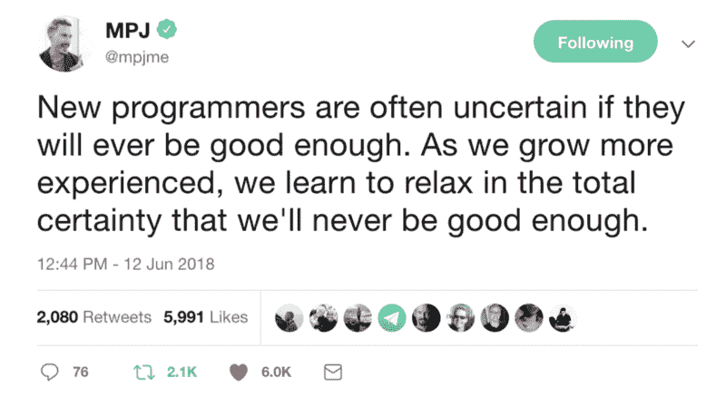
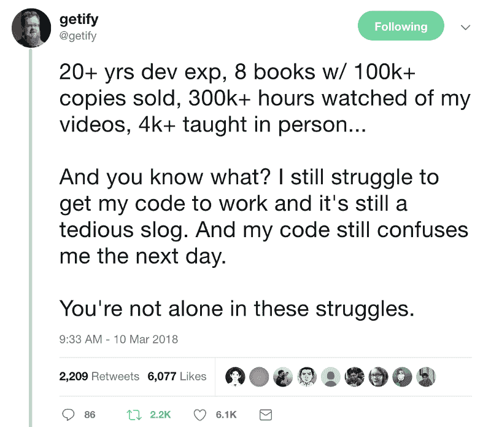

# 作为一名初级开发人员，我是如何努力克服困难的

> 原文：<https://www.freecodecamp.org/news/how-im-working-to-overcome-my-struggles-as-a-junior-developer-a6ab18ac29b2/>

Syeda Aimen Batool

# 作为一名初级开发人员，我是如何努力克服困难的

Photo by [Stas Aki](https://unsplash.com/photos/ZH6xWF_hnko?utm_source=unsplash&utm_medium=referral&utm_content=creditCopyText) on [Unsplas](https://unsplash.com/search/photos/challenge?utm_source=unsplash&utm_medium=referral&utm_content=creditCopyText)h

我相信编码的另一个名字是“奋斗”。如果你是一个初学者或初级开发人员，这种斗争往往是乘以 100。学习编码，寻找合适的资源，制作作品集，寻找实习或初级开发工作，然后从事现实生活中的项目——一切都可能是一场斗争。

但奋斗的好处是你学习，走出舒适区去体验新事物，实施新想法，最终打磨自己成为更好的你。

在科技行业，有很多成功的故事展示了一个漫长的奋斗和学习的旅程。从外面看，一切都很迷人。尤其是对于初级开发人员来说，他们的高级同事和导师是最优秀的人，他们提出了很棒的逻辑，并以他们令人惊叹的方式编写代码，让他们感到惊讶。

但是当我们更接近并清楚地看到事情时，我们意识到每个人都必须面对挑战，每个人都被错误和错误所困扰。但是通过时间和经验，我们看到他们只是在比我们更大更复杂的挑战上停滞不前。

让我分享我最喜欢的两个人的推文，我从他们身上学到了很多。这些推文总是让我微笑，激励我。我意识到，也许我们都在同一条船上，对同一个目的地有着同样的愿景。

This is MPJ one of my favorite tech YouTubers

生活让我看到了这条推文，当时我正在努力奋斗，努力让 JavaScript 进入我的大脑。几个月前这还是个可怕的概念。我花了大约 10 个月的时间来学习、探索、实施事情，最终得到了一份远程带薪实习。

在学习阶段，我总是在寻找欣赏和承认，我会成为一名优秀的程序员。我想知道编程是否是我的专长，或者我是否能像其他伟大的程序员一样写出好的逻辑和代码。

在小问题上停滞不前，不能快速解决问题，这让我感到慌乱和沮丧。但看到一些顶级编程名人诚实地向他们的追随者展示他们也不完美，让我相信了自己。

在我挣扎的时候，我第二喜欢的推文来自最优秀的开发人员之一，你不知道 JS 系列的作者，Kyle Simpson。

哈哈。感觉好吗？我不知道你怎么想，但这至少让我在一段时间内感觉放松了一些。

在[我的上一篇文章](https://medium.freecodecamp.org/how-i-got-a-remote-paid-internship-at-mozilla-through-outreachy-60958fe9264a)中分享了我学习和不赚钱的故事后，今天我要分享我技术之旅的另一个阶段:在经过漫长的求职斗争后，努力在那份工作中生存。

#### 简单回顾一下

我最近在[outreach](http://outreachy.org/)开始了远程实习。在接下来的三个月里，我将和 Mozilla 一起开发火狐健康仪表板。我意识到，随着学习和经验的积累，我对职业的恐惧和不安全感也发生了变化。这篇文章是我实习任务的一部分——写下我在实习的前几周面临的恐惧和挑战。我希望它能帮助新人和那些正在努力竞争或生存的初级开发人员，让他们知道每个人都在努力，这是学习的必要条件。

前一天晚上一切准备就绪，我兴奋又有点紧张地开始了在 Mozilla 的第一周。但是我没有想到一件意想不到的事情会发生:我家停电长达九个小时。我无法与导师交流，也无法开始工作。

谢天谢地，它在下午 5 点回来了，我与来自 Mozilla 的 Outreachy fellows 和导师们开了一个非常受欢迎的入职会议。事情对我来说非常有趣和新鲜，就像遇见来自世界各地的人，用英语交流了近一个小时。第一次见到导师 Armen 和 Dustin，很高兴见到他们。这种感觉与电子邮件和信息完全不同。

我的导师们已经在 GitHub 上组织了一个类似 trello 的董事会,根据问题的复杂程度来安排问题。从第二天开始，我必须挑选问题并着手解决。开始研究这些问题后，我意识到派对才刚刚开始。之前的挣扎只是预告片。

### 这都是为了理解代码。

我申请实习时的感觉和我开始时的感觉完全不同。现在，对得不到这个机会的恐惧被对做得不好和最终失去这个机会的恐惧所取代。

当我遇到第一个问题，即根据需求定制 graphJS 工具提示时，真的很难。起初，我认为我能很容易地做它，但是它确实给了我一段艰难的时间。我两天都想不出解决办法。

我向导师们问了几个问题，并尽力去解决。但有一瞬间，我相信我无法修复它，这很令人沮丧。

那时候，我的导师们没有给我压力。相反，他们给了我信心和想法，那就是，与一个新的、大的代码库斗争是完全没问题的。有时候理解事情和别人写的代码是需要时间的，所以我们不应该为难自己。我们需要花时间去掌握新事物。

在意识到我在苦苦理解代码库，上百个函数和文件之后，导师给我讲了[橡皮鸭技术](https://en.wikipedia.org/wiki/Rubber_duck_debugging)，让我给橡皮鸭讲解代码。这将有助于我更好地理解代码和内部的情况。

> “陷入困境是正常的，我们都会陷入问题和错误。随着经验的积累，我们越来越少被卡住，但我们还是会被卡住。”— [阿门·詹布拉诺](https://www.freecodecamp.org/news/how-im-working-to-overcome-my-struggles-as-a-junior-developer-a6ab18ac29b2/undefined)

### 这是我的发现

#### 知道从哪里开始是成功的一半

大多数时候你知道解决方案，也许知道逻辑，知道如何实现，但是你不知道从哪里开始！有了大量的代码文件和函数，您会对这个解决方案应该放在哪里才能正常工作感到困惑。我的导师 Dustin Mitchell 建议我使用注释来理解代码和功能，除了我自己的技术之外。

在第一期之后，事情变得稍微顺利了一些，但仍然充满挑战。我又陷入了一个相对复杂的问题，花了几天时间才解决。但幸运的是，我们的导师和开源团队的人很友好，理解我们这些初级开发人员有时会遇到困难——他们不会让我们为此感到难过。我们需要更多像这样的技术人员，他们愿意提供帮助和指导，为年轻人提供最好的学习资源，而不是耗尽精力。

#### 合并冲突伤人！

啊！！如果你是初学者，不熟悉开源，我想警告你合并冲突。当你不知道如何解决它们时，你会非常痛苦，你已经花了几个小时来寻找问题的解决方案，并且你最终在试图修复合并冲突时丢失了你的代码。

我遇到了一些冲突，我搞砸了一些 git 提交。又烦又吓人。但是如果我没有这样做，我就不会学到一些关于 git 合并、提交和解决冲突的新概念。感谢莎拉·克莱门茨和 T2·达斯汀·米切尔帮助我走出合并的陷阱。

#### 认识你自己的代码是一场斗争

几乎每个人都是这样，真的很有趣的是，即使过了几天，我们还是认不出自己的代码，是我们自己写的。解决了一个 bug，又试着解决了一个类似的 bug，又回到上一个做参考。我就想…我怎么会写这个代码，为什么它会工作？！

工作代码和非工作代码一样令人困惑。在大多数情况下，工作代码给了我们一个更艰难的时期。有时在回到旧代码后，你会重新思考它，你可以提出一个更好的解决方案。所以如果你不理解自己的代码或者别人的代码，你不需要担心或者难过。也许你即将学到新的东西。

### 告诉我如何生存

根据我实习的前几周，我对自己(和其他人)接下来的实习有一些建议。这些建议大部分来自我实习期间在 Mozilla 遇到的导师和优秀的人。我把它们分享给你，也许它们也能帮助你。

Photo by [Darran Shen](https://unsplash.com/photos/6yGy5qBHTCY?utm_source=unsplash&utm_medium=referral&utm_content=creditCopyText) on [Unsplash](https://unsplash.com/search/photos/struggle?utm_source=unsplash&utm_medium=referral&utm_content=creditCopyText)

#### 不要感情用事，把精力放在学习上

这个建议是莎拉提出的，我也附议。当一位资深开发人员或导师提出纠正或建议时，很难不把事情看得很私人，感觉受到了侮辱。当你在开源和公共平台中工作时，这就更难了。

但是我建议你把重点放在这一点上，要有学习的态度。除非你有谦逊和学习的态度，否则你将无法学习新概念和良好的编码实践。把你所有的自我放在一边，专注于从他人的经验和知识中学习。

#### 吸收最大量的信息，询问新事物

睁大你的眼睛，竖起你的耳朵，努力吸收尽可能多的信息，渴望学习新的东西。不要害怕尝试不在你舒适区的新的和不同的事物。有时候，我们对自己的思考和编写代码的方式感到满意，但是还有一些我们不知道的好的实践和设计模式。尽可能多学点东西。只有遵循第一点中提到的建议，这才有可能。

#### 提问前做好功课

问问题并不是一件坏事，尤其是当你陷入困境的时候。但是，首先做好你的功课和尽职调查，并提出一些有效的问题或解决方案，这是一个很好的做法。然后可以得到导师或者学长的点评。

这将有助于你明白如何自己做事情。你的导师也不会觉得你在问之前没有付出努力。如果你提出了一个合理的问题，开源领域和高级职位的人通常都很友好，愿意帮助你。

#### 不要拿自己和别人比较

不要总是拿自己和别人比较。这会影响你的表现，最终你会失去信心。记住，每个大师都曾经是初学者。每个人都在奋斗，甚至你的学长一开始也在你那里。他们熟悉初级开发人员所经历的痛苦和挑战。没有人会在一夜之间成为大师——这是一个过程，每个人都必须经历这个过程。等待时机的到来，在此之前，努力工作。

记住，每个初级开发人员都和你在同一条船上——你也不例外。我们在大学里学的东西和我们在现实生活中要实现的东西是很不一样的，要做一个行业内称职的开发者需要学习很多东西。而且每个学长都去过你那里，熟悉你所处的痛苦。你只需要专注，有一个学习的态度，不断学习，不断成长。

我打算根据我的经验和学习分享更多的东西。这是我通过 Outreachy 获得远程带薪实习后写的系列文章的第二篇。

随时分享你的想法 [@aimenbatool](https://twitter.com/AimenBatool) 。