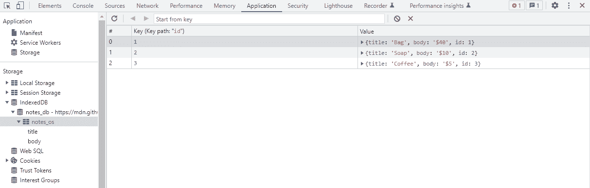
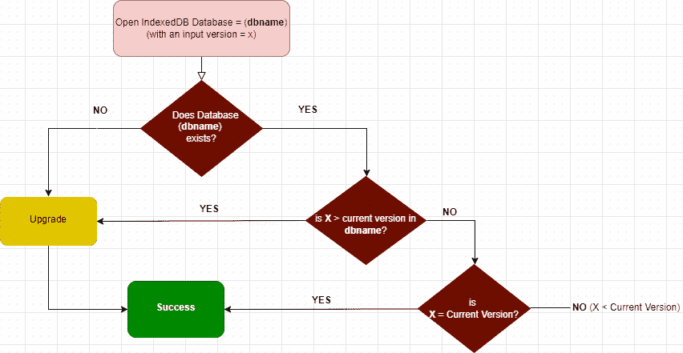
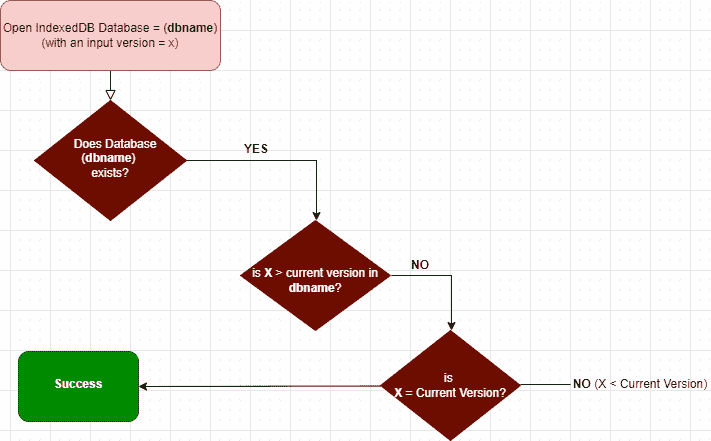
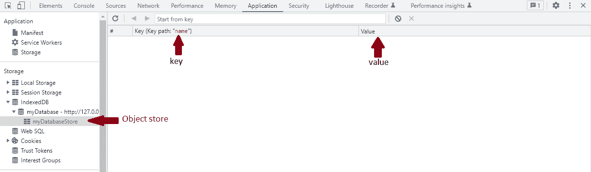
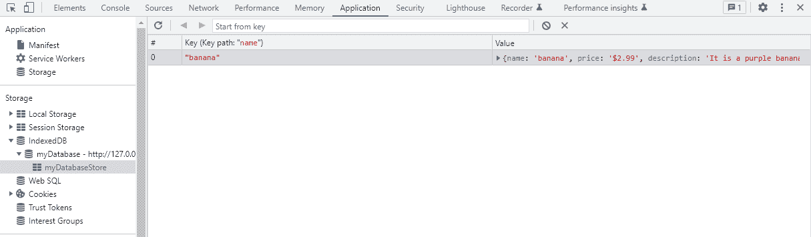

# 如何使用 indexed db——初学者数据库指南

> 原文：<https://www.freecodecamp.org/news/how-indexeddb-works-for-beginners/>

当涉及到在客户端存储数据时，现代浏览器给了我们许多选择。除了存储数据，浏览器数据库还允许我们检索数据。

根据应用程序的需求，您可以从不同的浏览器存储选项中进行选择，以增强用户使用应用程序时的体验。

这些浏览器存储选项之一是 IndexedDB。几个月前，我第一次使用 IndexedDB。在使用它之前，我浏览了关于它的各种实现的文章和视频。所以我认为根据我对它的工作原理的理解来写它会很好。

所以基本上在这篇文章中，我将谈论什么是 IndexedDB，它的优势，以及它是如何工作的。

## 什么是数据库？

如今，数据无处不在。数据可以是任何信息，如您的年龄、位置、您最近从在线网站购买的内容等等。数据可以是视频、图像、文件甚至文本的形式。

公司需要能够有效地存储和处理这些数据，为此他们使用数据库。

现在，数据库就是你存储数据的地方，就这么简单。例如，如果你打开一个 excel 表格，并在其中填入数据，这就被认为是一个数据库。

将数据存储在数据库中的目的是使其易于访问。这让你可以修改它，保护它，还可以分析它，以获得尽可能多的见解。

## 数据库的类型

主要有两种类型的数据库。根据您的需求，您可能希望在旅途中尝试这两种方式:

### 关系数据库

在关系数据库中，数据存储在表的集合中。这些桌子彼此相连。

关系数据库的例子包括 Oracle、PostgreSQL、MySQL、Microsoft SQL Server 等等。

### 非关系数据库

在非关系数据库中，数据存储在集合中。没有表、列或行，数据也没有相互连接。

在非关系数据库下，有不同的类别:键值数据库、文档数据库、图形数据库、宽列数据库、搜索引擎数据库等等。

非关系数据库的例子包括 Redis、MongoDB、Neo4j、Cassandra 等，我们自己的 IndexedDB 也是非关系数据库。

在本文中，我们不会深入讨论数据库本身，因为这不是主要目的。但是 [Dionysia Lemonaki](https://www.freecodecamp.org/news/author/dionysia/) 有一篇关于关系和非关系数据库的更详细的文章，你可以查看[这里](https://www.freecodecamp.org/news/relational-vs-nonrelational-databases-difference-between-sql-db-and-nosql-db/)了解更多。

令人兴奋的是，我们将在这里讨论的 IndexedDB 是一个可以在所有现代浏览器上使用的数据库。但是，IndexedDB 并不是您唯一可用的浏览器存储选项。还有[本地存储](https://www.freecodecamp.org/news/how-leverage-local-storage-to-build-lightning-fast-apps-4e8218134e0c/)、[会话存储](https://developer.mozilla.org/en-US/docs/Web/API/Window/sessionStorage)、[cookie](https://www.freecodecamp.org/news/everything-you-need-to-know-about-cookies-for-web-development/)、 [Web SQL](https://www.w3.org/TR/webdatabase/) 和[缓存存储](https://www.freecodecamp.org/news/web-caching-explained-by-buying-milk-at-the-supermarket-2ba6133ca4ed/)。

您可能已经熟悉这些选项，但是如果您不熟悉，我鼓励您阅读更多关于它们的内容。

## 什么是浏览器存储？它与服务器存储有何不同？

浏览器存储也称为客户端存储。它只是指位于用户浏览器上的存储。

就像服务器端存储(允许您在称为后端的数据库上存储数据)一样，您可以使用代码行与数据库进行通信，客户端存储使用相同的原理。

但是请记住，客户端存储不能替代服务器端存储。客户端存储主要用于增强用户体验。

一个简单的例子是当你第一次登录一个平台时。服务器端存储处理身份验证和必要的授权，客户端存储使您可以在几个小时后访问该平台，并从先前的状态继续，而不必向后端发送请求。

然后，每当您需要在一段时间后登录时，客户端存储会保存您的登录详细信息，并自动填写这些信息。您只需点击登录按钮。

根据您的喜好，可以使用任意数量的编程语言来编写和访问服务器端，如 Python、Ruby、C#、PHP 和 JavaScript (NodeJS)。对于客户端，您将主要使用 JavaScript 来访问浏览器存储并与之通信。

好了，现在让我们学习一下 IndexedDB。

## 什么是 IndexedDB？

上面我们讨论了非关系数据库及其不同类型。我们也提到过键值数据库是其中的一种，对吗？IndexedDB 是键值数据库的一个例子。

### 什么是键值数据库？

键值数据库意味着所有存储的数据都必须分配给一个键。至少在我看来，它是不太复杂的非关系数据库之一。

键值数据库将一个键与一个值相关联。该键作为该值的唯一标识符，这意味着您可以使用该键跟踪该值。

如果您的应用程序需要不断地获取数据，键值数据库会使用非常高效和紧凑的索引结构，通过键快速可靠地定位值。使用该键，您不仅可以检索存储的值，还可以删除、更新和替换该值。



[key-value database](https://mdn.github.io/learning-area/javascript/apis/client-side-storage/indexeddb/notes/)

好了，我相信你现在明白什么是键值数据库了吧？我们继续说 IndexedDB。

### **指数化的优势 DB**

因此，我们有了所有这些浏览器存储选项，这是一件很好的事情，因为我们可以根据自己的需要选择一个。每个选项都有不同的功能。

因此，了解每种产品的工作原理及其功能非常重要，这样您就可以根据您的使用情形选择合适的产品。

也就是说，IndexedDB 具有以下优势:

1.  IndexedDB 是异步的，这意味着它不会在数据加载时停止用户界面的呈现。
2.  它允许你使用对象存储对你的数据进行分类。
3.  它允许你存储大量的数据。
4.  它支持视频、图像等对象——任何支持结构化克隆算法的对象。
5.  它支持数据库事务和版本控制。
6.  性能很棒。
7.  该数据库是源的私有数据库。
8.  所有现代浏览器都支持它。

### 索引的使用案例 b

除了知道 IndexedDB 如何工作，知道何时应该使用它也很重要。

*   **存储用户生成的内容:**用户生成内容的一个例子是填写应用程序表单。当仍在完成表单的过程中时，用户可以离开它，过一段时间再回来完成表单，而不会丢失他们的初始数据输入。
*   **存储应用状态:**当用户第一次加载网站或应用时，可以使用 IndexedDB 来存储这些初始状态。这些可以是登录身份验证、API 请求或呈现 UI 之前所需的任何其他状态。因此，当用户下次访问网站时，加载速度会加快，因为应用程序已经存储了状态。这意味着它可以更快地呈现用户界面。
*   **对于脱机工作的应用程序:**用户可以在应用程序脱机时编辑和添加数据。当应用程序联机时，IndexedDB 将处理并清空同步队列中的这些操作。

## IndexedDB 如何工作

现在是本文的主要部分:学习 IndexedDB 是如何工作的。我们将使用下面的流程图，我们将一个接一个地检查各种事件和路径，以及相关的 JavaScript 代码来正确地解释它们。



IndexedDB event flowchart 

### 路径 1:如果数据库不存在，该怎么办

当您在 IndexedDB 中创建新数据库时，这是它将遵循的路径。这条路非常简单:


需要注意的一件重要事情是，在创建数据库时，您必须给数据库一个名称和一个版本(您决定给数据库一个什么版本)。

此外，当您第一次创建数据库时，**版本 1** 会自动分配给它，即使您没有说明版本。

现在，我们来解释一下上面的流程图。创建数据库时，它会检查是否已经存在具有该名称(dbname)的数据库。

如果不存在，它将继续调用**升级**事件。当升级事件被调用时，您可以升级数据库的结构。当升级事件块成功运行时，它将调用**成功**事件。

```
 const request = indexedDB.open('myDatabase', 1);

        //upgrade event
        request.onupgradeneeded = () => {
            alert("upgrade needed")
        }

        //on success
        request.onsuccess = () => {
            alert("success is called")
        } 
```

### 路径 2:如果数据库存在，但其新版本高于以前的版本，该怎么办

现在我们来看看第二条路。创建新数据库时，它首先检查该数据库是否已经存在。

如果存在同名的数据库，它将检查版本，看版本是否比以前的版本高。如果是，那么它调用**升级**事件，在这里您可以修改数据库的结构。在这之后，它调用**成功**事件。


按照上面的解释，现在让我们看看下面的代码。

假设我们已经创建了一个名为“myDatabase”的数据库。由于数据库名称与我们之前创建的数据库名称相同，因此它会检查版本。之前的版本是“版本 1”。由于我们将版本更改为“版本 2 ”,并且版本 2 >版本 1，因此它将在**onupgradereneed**函数中执行修改。

```
 const request = indexedDB.open('myDatabase', 2);

        //upgrade event
        request.onupgradeneeded = () => {
            alert("upgrade needed")
        }

        //on success
        request.onsuccess = () => {
            alert("success is called")
        } 
```

### 路径 3:如果数据库存在，但版本低于当前版本，该怎么办

按照下面的流程图，如果数据库已经存在，并且版本低于当前版本，则检查版本是否与当前版本相同。

这里有两种可能的结果:首先，如果版本与当前版本相同，它调用 **success** 事件，即不进行更新，数据库保持不变，不抛出错误。第二，如果版本低于当前版本，它将失败并抛出一个错误。



### 如何在 IndexedDB 中创建对象存储和事务

*   [**对象存储**](https://developer.mozilla.org/en-US/docs/Web/API/IDBObjectStore) :是一个数据库内部对象的集合，一个数据库可以有不同的对象存储。考虑下面的代码，myDatabase 是创建的数据库，而 myDatabaseStore 是在数据库内部创建的对象存储。对象存储可用于存储任何形式的数据。我使用下面的代码来解释如何创建一个对象存储。

```
let db;

const openRequest = indexedDB.open('myDatabase', 1);

openRequest.onupgradeneeded = function (e) {
    db = e.target.result;
    console.log('running onupgradeneeded');
    const storeOS = db.createObjectStore('myDatabaseStore',  {keyPath: "name"});

 };
openRequest.onsuccess = function (e) {
    console.log('running onsuccess');
    db = e.target.result;
};
openRequest.onerror = function (e) {
    console.log('onerror! doesnt work');
}; 
```



Creating object store

*   [**事务**](https://developer.mozilla.org/en-US/docs/Web/API/IDBTransaction) :一个事务是一系列任务包装在一起。要使一个事务成功，包装在其中的所有任务都必须通过，如果一个任务失败，则没有一个任务通过。如果发生这种情况，将不会对数据库进行更新。Transaction 有方法、属性和事件可供您探索。在下面的代码中，我能够通过将 item 包装在事务中来将它添加到对象存储中。

```
let db;

const openRequest = indexedDB.open('myDatabase', 2);

openRequest.onupgradeneeded = function (e) {
    db = e.target.result;
    console.log('running onupgradeneeded');
    const storeOS = db.createObjectStore('myDatabaseStore',  {keyPath: "name"});

};
openRequest.onsuccess = function (e) {
    console.log('running onsuccess');
    db = e.target.result;
    addItem();
};
openRequest.onerror = function (e) {
    console.log('onerror! doesnt work');
    console.dir(e);
};

function addItem() {
    const item = {
        name: 'banana',
        price: '$2.99',
        description: 'It is a purple banana!',
        created: new Date().getTime(),
    };
    const tx = db.transaction("myDatabaseStore", "readwrite");
    const store = tx.objectStore('myDatabaseStore');
    store.add(item);
} 
```



Adding item to the store

## 结论

IndexedDB 是一个非常强大的客户端存储选项，开发人员可以使用它为他们的网站或应用程序提供更好的用户体验。它可以帮助您减少从用户经常访问的网站或应用程序加载数据的时间。

如果您还没有用 IndexedDB 构建过什么，我鼓励您尝试一下。本文并没有介绍如何做到这一点，但是我在网上有一些资料可以指导你。建筑材料会让你更加欣赏索引。

我希望你喜欢读它，就像我喜欢写它一样。

**关于索引的相关文件 B:**

*   [www.w3.org/IndexedDB](https://www.w3.org/TR/IndexedDB/#introduction)
*   [developer.mozilla.org/IndexedDB](https://developer.mozilla.org/en-US/docs/Web/API/IndexedDB_API)