# 印度如何从贪婪的公司手中拯救互联网

> 原文：<https://www.freecodecamp.org/news/how-india-saved-its-internet-from-greedy-corporations-55b418fdb696/>

作者费宾·约翰·詹姆斯

# 印度如何从贪婪的公司手中拯救互联网

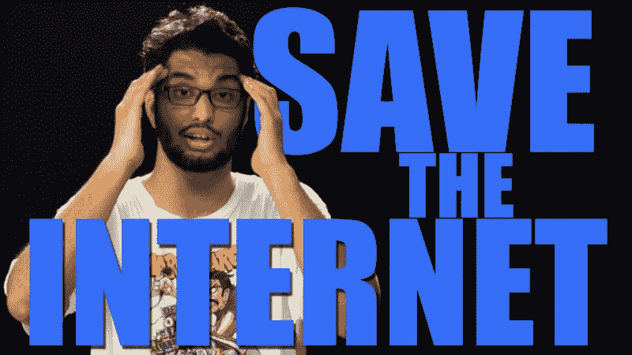

( Gursimranjeet Khamba, Co-Founder AIB) All Indian Bakchod is an Indian comedy group who helped raise awareness of Facebook’s attack on Net Neutrality.

2015 年初，印度电信管理局(TRAI)被它本应监管的电信公司劫持。它发布了一份关于网络中立的咨询文件，征求公众的意见。

问题是像 Whatsapp 和 Viber 这样的服务是否应该接受昂贵的许可制度。

TRAI 在其官方网站上放了一个很小的、几乎不引人注意的论文链接。他们还为公众讨论设定了严格的截止日期。他们希望公众不会注意到这个从根本上改变互联网工作方式的提议。

Whatsapp 曾让信息免费。在 Whatsapp 出现之前，我们必须购买昂贵的信息包来发送短信。过去，每条国际信息的成本约为 5 卢比(0.08 美元)——这是电信业的一大收入来源。

接下来，其中几个消息应用程序开始提供免费通话。这进一步削减了电信运营商的收入。由于这些消息应用通过广告赚了很多钱，这些电信公司希望自己也能从中分一杯羹。

印度激进分子建立了一个网站，在这里人们可以回答 TRAI 咨询文件提出的所有问题。人们只需点击几下鼠标就可以将这些答案发送给 TRAI。

这是明智之举。但是，大多数人仍然没有意识到网络中立性的重要性——这是一条基本规则，即所有互联网流量都应该平等对待，不管它来自哪里，互联网接入应该像任何其他公用事业一样对待。

网络中立是一个复杂的概念，典型的印度人不了解它，也不了解它的重要性。所以我们需要一种有效的方式来沟通这一切。

令人欣慰的是，喜剧团体 All Indian Bakchod 参与进来，帮助沟通这一点。这是他们的第一个视频:

印度人给 TRAI 发了一百万封电子邮件。(作为报复，TRAI“不小心”向公众泄露了数百万个电子邮件地址。)

脸书和电信运营商的回应是改变他们的活动，试图愚弄印度公众，让他们认为这些公司实际上支持网络中立。

这些公司试图将网络中立定义为每个人都可以访问互联网上的某些东西(T2)。事实上，网络中立是指*每个人都能够访问互联网上的**一切***。

脸书与一家大型电信运营商 Reliance 合作推出了 Internet.org。他们声称他们提供免费互联网。事实上，他们提供的互联网份额非常有限，只有在 Internet.org 注册的公司的网站。脸书完全控制哪些网站可以注册。

当然，这些都没有在他们看似无害的宣传视频中明确提及。

脸书试图欺骗印度公众，让他们认为他们提供这些网站是出于慈善。事实上，他们明显违反了网络中立原则。

接下来，TRAI 通过将讨论转移到 mygov.in，加大了抗议脸书行动的难度。现在，一名公民必须通过漫长的账户注册过程才能发表公开评论，而他们只有几天的时间来这样做。

全印度的巴克乔德再次用第二段视频揭露了这些腐败行为:

结果，脸书的 Internet.org 行动因违反网络中立性而在互联网上遭到猛烈抨击。脸书将其更名为“免费基础”，并开始了一场昂贵的营销活动，在全国各个角落宣传它。

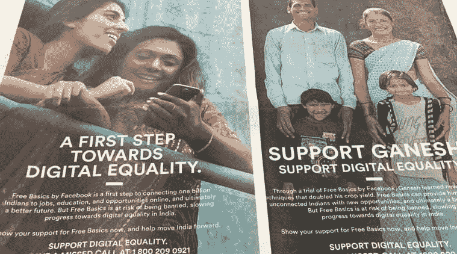

看看那些正常人，他们只是过着自己的生活，免费使用脸书。它们旨在让人们思考，“免费基础怎么会是一件坏事？”这甚至让外行人质疑活动家。

如果他们给我们免费上网，你有什么问题？

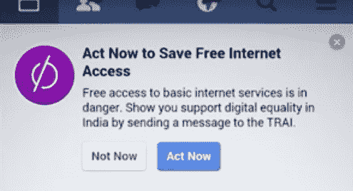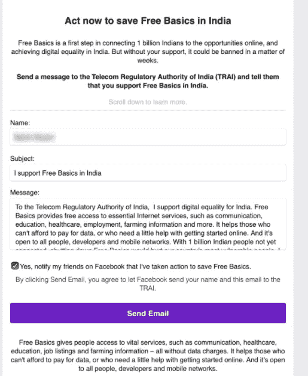

免费基础只是 Internet.org 的另一个名字。虽然他们在外面改变了他们的品牌，但是源代码却不是这样说的。

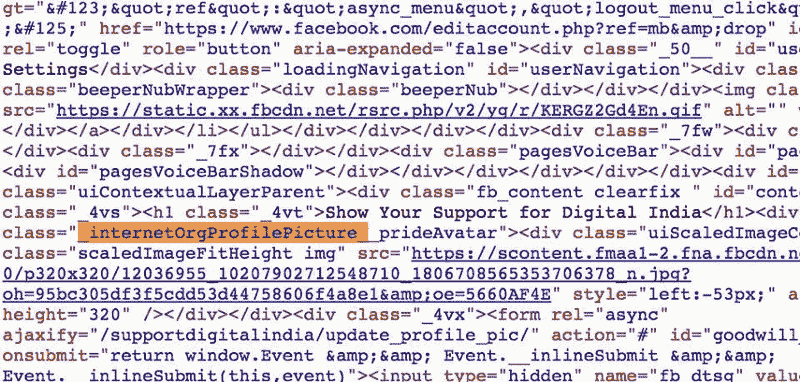

设计师们用恶搞广告来回应，让人们注意到免费基础知识的愚蠢。

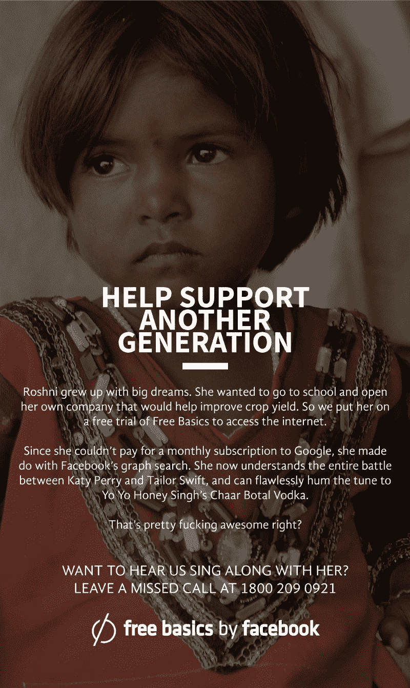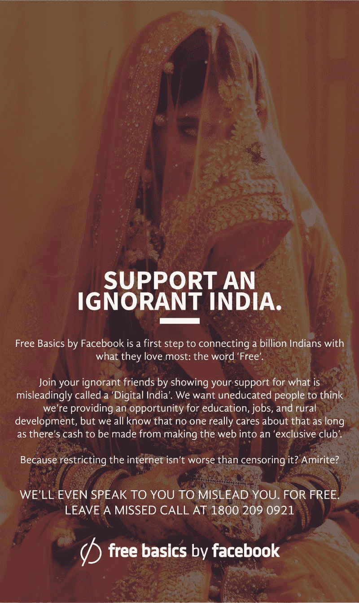

全印度 Bakchod 带回了第三个视频:

这些公司悄悄地说服 TRAI 为公众讨论设定另一个短暂的截止日期。在那段时间，许多电子邮件通过 savetheinternet.in 发送到 TRAI

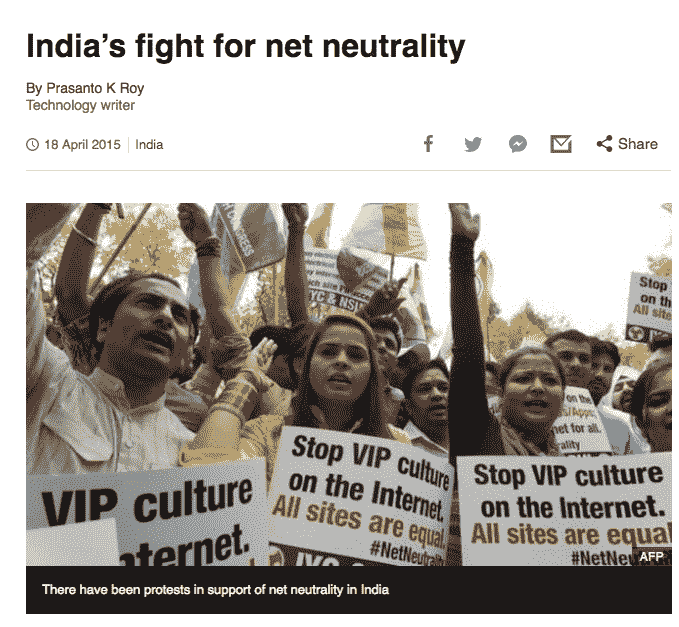

街上有抗议活动。印度媒体主持了讨论小组，邀请不同领域的专家来讨论网络中立性。

这是新闻 9 台讨论区的照片。格莱美奖得主 Ricky Kej 站出来为网络中立的重要性大声疾呼。

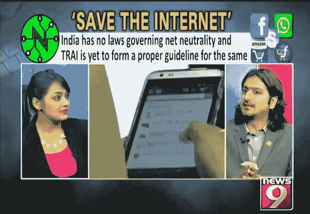

我也是同一个小组的成员。

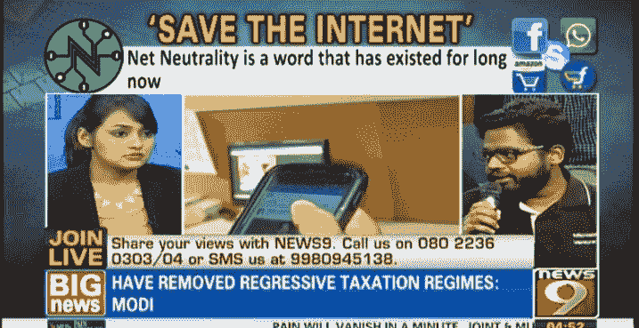

最后，所有这些努力都得到了回报。公众的强烈抗议迫使 TRAI 站在公民一边，反对公司。他们裁定支持保持网络中立。

我们赢了。

从大的方面来看，我几乎没有做出任何贡献。真正的英雄是拯救互联网背后的人们，像 Kiran Jonnalagadda，Nikhil Pahwa 和 T2，Tanmay Bhat，以及其他许多活动家。[你可以在这里了解更多。](https://qz.com/612129/the-lawyers-techies-and-comedians-who-fought-facebook-to-keep-indias-internet-free-and-open/)

一些公司和他们的投资者对此很不高兴。风险投资家马克·安德森在推特上写道:

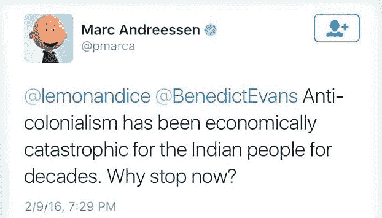

在被印度和美国媒体彻底攻击后，他被迫为此公开道歉。

### 印度的故事有一个美好的结局。但美国可能不会。

美国总统目前正致力于摧毁网络中立。电信公司已经游说国会并接管了联邦通信委员会。阻挡在这些公司和他们的更大利润之间的是我们——公众。

我希望印度的网络中立英雄能激励你。

不要保持沉默。提高你的声音。教育自己网络中立的重要性。向你的朋友、家人和关注者解释它的重要性。

我们可以一起确保美国继续像印度一样享受开放的互联网。我们开始吧！