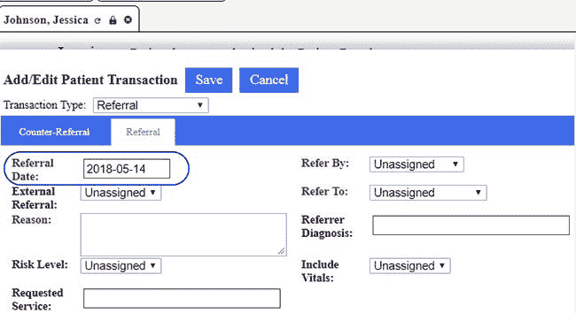
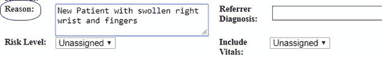
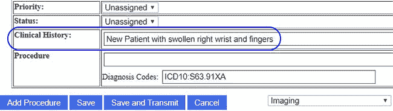
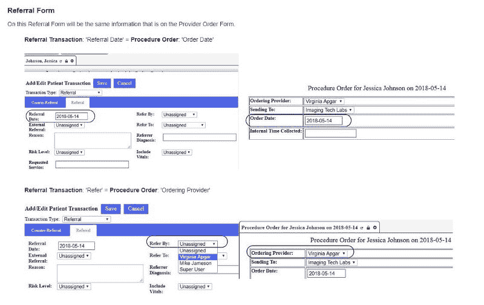
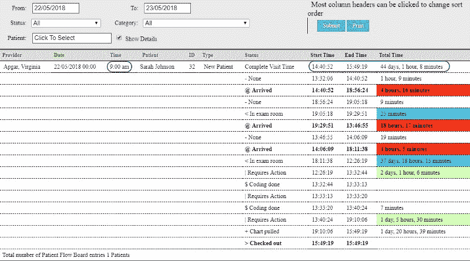
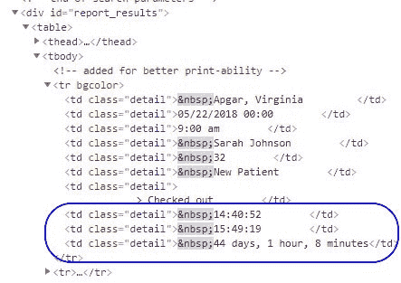
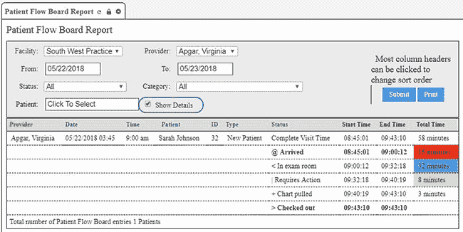
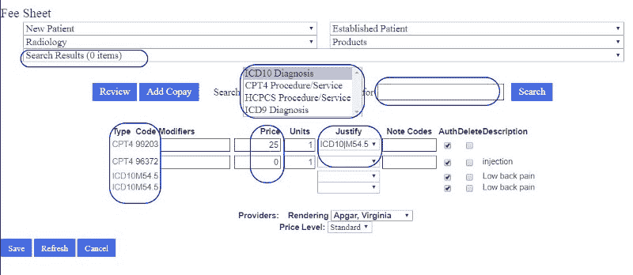
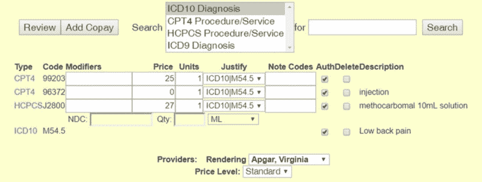
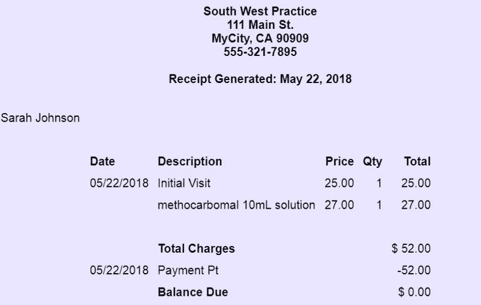

# 我是如何在我的拓展旅程中尽可能多地吸收知识的

> 原文：<https://www.freecodecamp.org/news/how-ive-absorbed-as-much-as-i-m-able-on-my-outreachy-journey-3e350c9e0362/>

托尼·肖特斯维

# 我是如何在我的拓展旅程中尽可能多地吸收知识的


我不敢相信这将是我在 LibreHealth 实习的最后一个月！？

就在它开始变得完整的时候。但是我还有几周的时间来完成我的项目，我很感激有时间来完成它们。

对于那些刚刚加入我的旅程的人来说，我是今年夏天[图书馆](http://librehealth.io/)的[外展实习生](https://www.outreachy.org/alums/)。我于今年 4 月 23 日被录取，从 5 月 23 日开始实习，一直持续到 8 月 14 日。你可以在这里阅读更多关于它是如何开始的[。](https://medium.freecodecamp.org/how-i-beat-the-odds-and-became-an-outreachy-intern-9a92f47cb44e)

自从我的上一篇[文章](https://medium.freecodecamp.org/special-moments-on-my-outreachy-journey-78db1ff11ef4)以来，我学到了很多。我一直在做的两份文件,[图书馆健康 EHR 供应商订单](https://wiki.ehr.librehealth.io/LibreHealth_EHR_Provider_Orders)和[图书馆健康 EHR 遭遇](https://wiki.ehr.librehealth.io/LibreHealth_EHR_Encounters),得到了我的导师们的批准，现在都在图书馆健康维基上。

> **注意:**您可能在我的文档中看到的患者和员工姓名或任何数据完全是虚构的。

#### 目前为止我的外展图书馆健康实习

在**提供者订单**文档中，我们涵盖了从患者就诊到将患者转诊到外部实验室，然后抄录订单的所有内容。

医疗记录对我来说是一个新概念。当我第一次读到“抄写者”这个词时，我想象这是法庭记录员被要求读回前一位证人的笔记。？

它实际上涉及两个文档的相互比较，然后提供者订单信息被放入 Referral Order 表单。

有时术语是相似的，例如**转诊日期** …



…和**订单日期**


其他的不太明显。

比如**转诊单**上的**原因**



…与来自**程序单**的**病历**相同。



当我设计网页的时候，我对我的编码非常着迷。有了 HTML 和 CSS，我可以自由地设计我的容器、图像边框和填充以保持所需的空间。然而，维基格式不允许这样做。

一个`<`；p&g`t; or`br/>完全没有影响。感谢我的国际米兰 n-mate Adele 与我分享了没有斜线的《T2 需要》。完全不同的概念！我不得不不断提醒自己打破添加前斜线的习惯。

我的导师让我把这些对比放在一起，而不是上下，这样更容易阅读。

这是我了解到 wiki 在格式上确实需要一些 HMTL 的时候。想象一下，当我发现我可以用这样的代码格式化我的 wiki 时，我有多高兴:

```
<div><blockquote>‘’’Referral Transaction’’’: ‘Referral Date’ = ‘’’Procedure Order’’’: ‘Order Date’<br><br><span>[[File:trans-refDate.jpg|500px]] [[File:trans-ordDate.jpg|500px]]</span><br><br></blockquote></div>
```

让它看起来像这样:



我觉得这个看起来好多了。我的导师也同意了。？

#### 应对新挑战

我在**供应商订单**上的两个挑战领域是**流程板**和**费用单**。

**流程板:**流程板跟踪患者在每个就诊时段的时间。它每隔几秒钟更新一次。它还保留了访问期间发生的一切，包括我的错误，并自动尝试修复它们。我最终被告知如何关闭它，但那时已经太晚了。？



请注意**预约时间**与**开始**或**结束**时间不匹配。并且**总时间**也需要改变。不仅如此，每个状态变化应该只有一个。

显然病人来了三次。她进了检查室两次。你看到发生了什么。那是一个忙碌的病人。？

此外，**总时间**必须加到总分段时间。

这就是我的开发背景和我最好的朋友 Chrome Inspector 拯救我的地方。？



我可以进去修改细节，然后关闭检查器，拍一张新的快照。当然，每次我忘了一个具体的变化，我都要重新开始。这张图片需要几次不同的尝试才能得到正确的结果:



**费用表**也有类似的挑战，因为需要添加代码和调整代码。

在与实际代码斗争之后，我仍然必须使它在所有方面看起来都很好。



在最终的图像上，我需要去掉多余的代码。对于一次实际就诊和处方，我们只需要一个 ICD10 代码。



在上图中，

*   CPT4 99203 是新患者就诊的代码，价格为 25 美元。
*   CPT4 96372 是注射的代码。没有成本，因为它在医疗成本之内。
*   HCPCS J2800 是注射药物的代码。

上述代码均采用 ICD10 代码 M54.5 进行对齐。

如你所见，ICD10 M54.5 是腰痛的医疗计费代码。

最初，我花了很长时间去理解，然后才明白过来。我非常感谢我的导师哈利·塔克的耐心。

但最终我做到了，我能够创建**账单屏幕**和**最终收据**。



#### 最后冲刺

这些是我在 EHR 图书馆的任务。现在，我将转到**图书馆健康放射学**板块，流程会有所不同。

在我实习期间，我能够抽出一些时间来准备与纽约市的其他免费代码营员见面。

#### freeCodeCamp 2018 年度最佳贡献者奖

收到昆西·拉森发来的电子邮件，告诉我我被选中是因为我对[自由代码营](https://www.freecodecamp.org/)媒体出版物的贡献，这让我非常惊讶。我没觉得自己真的做了什么出格的事。

我不久前开始在聊天室和论坛上闲逛，因为我想知道一个问题的答案，或者学习一个问题的新解决方案。然后我开始回答我认为我知道答案的问题。有时候我确实是对的。？

我喜欢编码。它迫使我用我头脑中逻辑的一面来解决问题，然而我创造性的一面也能做出漂亮的东西。

但是我也喜欢阅读。我是几个小说作者的高级评论副本(ARC)小组的成员。我喜欢他们的作品，有时我能在作品出版前发现错误。

自从我加入 freeCodeCamp 以来，我一直在阅读 Quincy Larson 每周发来的文章，以及 Medium Digest。我发现这些文章给了我很大的帮助，特别是如果这篇文章是在我从事类似项目或试图理解类似概念的同时写的。

因此，当 freeCodeCamp Medium 出版物招募志愿者编辑时，我认为这是向一些我最喜欢的作者学习的绝佳机会。我可以先读最好的文章！我会尽力帮助解决出现的任何打字错误或语法问题。

我们有一个很棒的编辑团队，我很自豪能成为其中的一员。

当我申请 LibreHealth 的文档实习时，我用我在 Medium 学到的所有编辑知识来帮助我的工作。

因此，当我收到昆西的电子邮件时，我向我的导师提到了 2018 年最佳贡献者奖活动。他建议这可以成为我实习的一部分。这样就有可能收到一笔津贴来支付我去纽约的旅费。

我的外联协调员，塞奇·夏普，同意我导师的观点！8 月 18 日，我将在纽约市与其他一些顶级捐助者一起庆祝。

在那天晚上的免费代码营活动之前，我也将有机会在曼哈顿会见我的另一位图书馆健康导师。

当然，我还发现一些我最喜欢的 freeCodeCamp 英雄将会出席这次活动。我很兴奋！

#### 遗言——暂时的

我想提醒女性和科技行业中其他未被充分代表的成员:

下一轮外展实习将于 2018 年 9 月开始。还有不到一个月的时间。如果您还没有这样做，并且有兴趣申请，请[立即注册](https://lists.outreachy.org/cgi-bin/mailman/listinfo/announce)以接收公告。该过程开始时会通知您。

而且，freeCodeCamp 的营员也有资格加入！？

谢谢你陪我走完这段旅程。当我从纽约回来的时候我会有更多。

#### **往期文章**

*   [我是如何战胜困难成为一名外展实习生的](https://medium.freecodecamp.org/how-i-beat-the-odds-and-became-an-outreachy-intern-9a92f47cb44e)
*   我的外展实习从今天开始！以下是我到目前为止所做的和学到的。
*   [我拓展之旅的下一步:码头工人、大挑战和小胜利](https://medium.freecodecamp.org/the-next-steps-on-my-outreachy-journey-docker-big-challenges-and-small-victories-2c3a2dd2277a)
*   [在我的旅程中，每一步都带来新的东西](https://medium.freecodecamp.org/every-step-brings-something-new-on-my-outreachy-journey-e7c0f7adf2ea)
*   [我的外展旅程中的特殊时刻](https://medium.freecodecamp.org/special-moments-on-my-outreachy-journey-78db1ff11ef4)