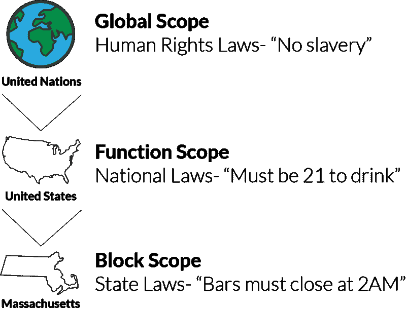
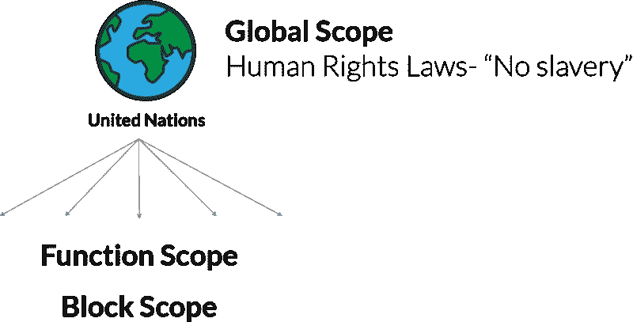
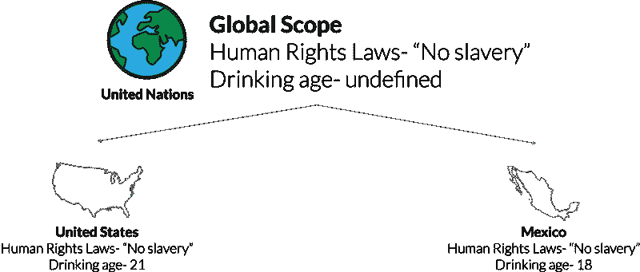
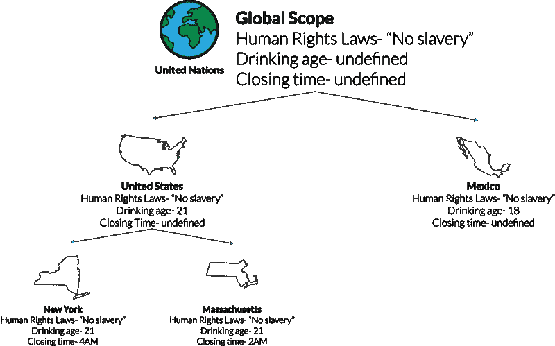
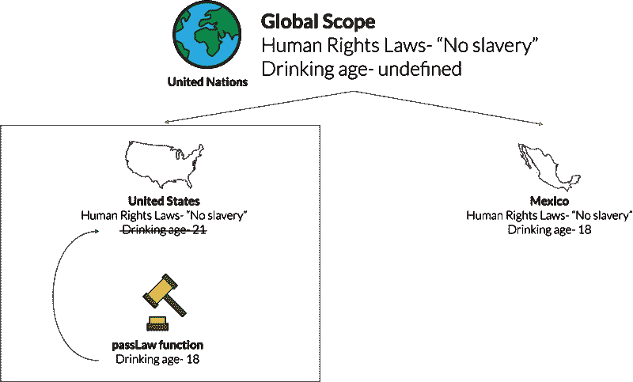

# JavaScript 变量作用域就像多级政府

> 原文：<https://www.freecodecamp.org/news/how-javascript-variable-scoping-is-just-like-multiple-levels-of-government-d7ddabc49bf1/>

凯文·科诺年科

# JavaScript 变量作用域就像多级政府

你有没有在试图寻找一个变量的值时，一遍又一遍地得到一个**未定义的** 的值后，沮丧地砸碎你的键盘？

或者，你有没有在花了几个小时的编码后给两个变量取了同一个名字，却在后来发现了你的错误？

这两个问题都与变量的范围有关。范围定义了你的变量在整个脚本中的可访问位置。

当您正确地确定变量的范围时，您会发现您的代码对于任何查看器来说都更容易阅读和调试。

#### 问题是

在 ES6 更新到 JavaScript 之前，只能用**var** *声明变量。*因为 **var** 不限制变量的作用域，你不得不猜测变量是全局作用域还是局部作用域。

现在，JavaScript 允许你用 **const** 和 **let** *来声明变量。它们可能会增加一些复杂性，但是它们让你的代码更容易理解。*

不幸的是，大多数教程将这些示波器描述为盒中盒或单向玻璃。我不知道你怎么想，但我不会花太多时间在盒子里装盒子或者透过一层层的单向玻璃看东西！

我想我有更好的办法。范围可以通过考察国际法、国内法和当地法律的合作方式来解释。所以，你只需要理解不同级别的政府存在，就可以了解不同级别的范围。这里有一个快速预览，然后我们将进入它！

Drinking laws are annoying but hopefully not too controversial

我会尽量避免任何与当前政治问题相关的法律。

### 全球范围(联合国)

在脚本顶层定义的变量是全局范围的。它们可用于所有功能。这些被称为全局变量。

这些类似于国际法。请记住，通过联合国所有 193 个成员国都同意的法律是相当困难的。所以，这些法律应该只涵盖最基本的人权。联合国不介入可能涉及个别国家的毒品政策或宗教法律。两个例子可能是:

“酷刑是被禁止的。”

“化学武器是被禁止的。”

这意味着这些法律对联合国的任何成员国以及这些国家的任何州或省都有效。

这是这些法律在 ES6 之前的版本。

在 ES6 中，我们现在可以用**常量**和 **let** 来声明变量。 **Const** 将使变量的值不可变——它将不能被改变。**让** 不会。我觉得这两项基本人权绝对应该是不可改变的！所以应该是:

你不想创建太多的全局变量。“污染”全局范围意味着你定义了太多全局可访问的变量。从编程的角度来看，使用全局变量会使调试和维护代码变得困难。

在这个类比中，没有关于允许个人饮酒的年龄的国际法。每个国家都必须定义这些规则。如果联合国试图规范饮酒年龄，它将永远无法存在！

### 功能范围(美国)

因为上面的法则是全局定义的，所以它们在我们的脚本中的任何地方都是可访问的。并且，由于它们是用**常量** *，*定义的，所以它们是不可改变的。

那么只适用于美国的法律呢？一个例子是饮酒年龄，到处都是大学生的敌人。在美国买酒必须年满 21 岁。

这个时代应该是不可改变的还是不可改变的？不。事实上，在 1984 年之前，美国没有关于饮酒年龄的统一法律。它可能在未来再次改变。

我们将用**字母**来定义这个。

如果我们试图在**美国**函数之外访问**饮酒量**的值，我们会得到一个错误，因为它只存在于**函数范围**内。

请记住——联合国的法律在美国仍然有效。

在这种情况下，括号就像是国家的边界。法律只在那个国家境内有效。所以，如果你想创建一个**墨西哥**函数，你可以将饮酒量**再次定义为 18。**

下面是图表形式代码。

### 块范围(马萨诸塞州)

我住在马萨诸塞州，所以我决定选择我自己的州。还有一层作用域:**阻塞作用域**。块作用域和函数作用域都是**局部作用域、**的例子，因为它们为变量的定义创建了局部限制。

块范围意味着一个变量可以是一组括号{}的局部变量，就像一个 **if** 语句或 **for** 循环。与函数作用域非常相似，变量只在括号内有效。

在马萨诸塞州，所有酒吧必须在凌晨两点停止营业。我知道，我知道——如果你住在欧洲，这听起来可能有些离谱。这项法律实际上因州而异。在纽约，他们可以营业到凌晨 4 点。

无论如何，为了在代码中实现这一点，我们需要在 unitedStates 函数中定义if 语句。我们将再次用**定义变量，让**，因为这些定律肯定会改变。

**closingTime** 变量仅在 **if** 块内有效，而 drinkingAge 在 unitedStates 函数中的任何地方都有效。

如果我们想为纽约定义一个单独的关闭时间，由于**块范围**，我们也可以这样做。

如果您想基于 closingTime 变量采取行动，现在可以在每个 If 块中做一些事情。

这里有一个涵盖所有这些的图表。

### 修改变量(通过新法律)

最后一部分。假设你想通过一项法律来改变美国的饮酒年龄。您需要创建一个能够修改 drinkingAge 变量的函数。姑且称之为 **passDrinkingLaw** 。

您需要在 unitedStates 函数中创建 passDrinkingLaw 函数，因为它只与美国相关。没有全球性的饮酒法律。

它还需要访问定义原始年龄的 drinkingAge 变量。想象一下，你想把饮酒年龄改为 18 岁。下面是你应该怎么做。

这就是为什么在整个 unitedStates 范围内定义变量很重要。你会希望这些改变在以后的饮用中生效。而且，如果您想创建一个通用的 passDrinkingLaw 函数，它将无法使用这种结构。

喝酒是美国当地的一项活动。这是一个图表版本。

#### 行动呼吁

你喜欢这个吗？为它鼓掌，这样其他人也能发现它。如果你想在我发布使用类比的教程时得到通知，请在这里注册: