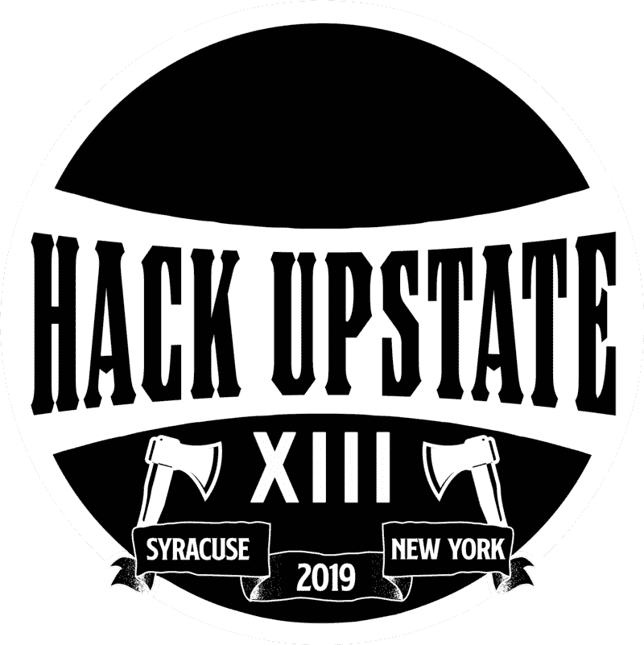
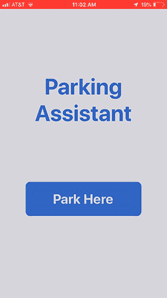
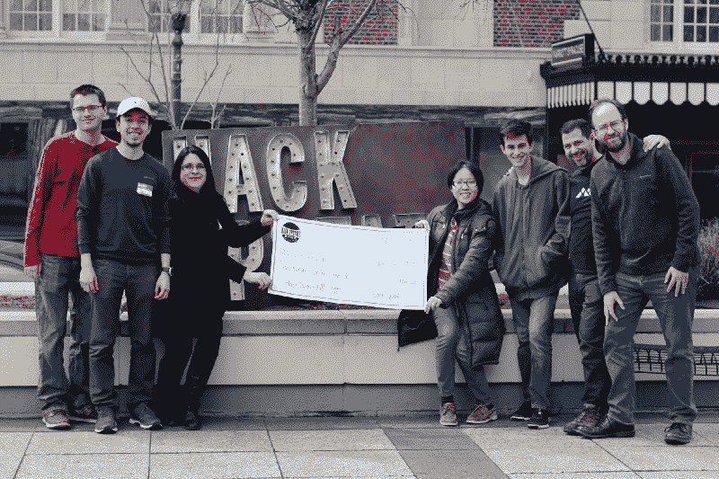
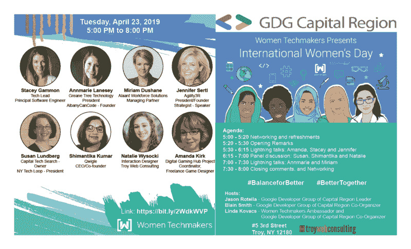

# 加入一个编码训练营，参加聚会，赢得一次黑客马拉松比赛是如何彻底改变我的生活的

> 原文：<https://www.freecodecamp.org/news/how-joining-coding-bootcamps-meetups-and-winning-a-hackathon-changed-my-life-completely-2addc66f1665/>

2016 年，我在寻找一个在线编码训练营。我希望它能让我保留我当时作为一名 Web 开发人员和设计人员的全职工作，同时帮助我将我作为一名全栈开发人员的技能更新。

### 潜入技术社区

经过大量的研究，我发现了一个在线编码程序 [freeCodeCamp](https://www.freecodecamp.org/) ，我开始为认证的课程和项目工作。

这一激动人心的冒险帮助我在 2018 年决定开始我的远程自由职业生涯，并投入更多时间来完成 freeCodeCamp 上最后一批认证的项目。

我开始参加当地的聚会，结识其他开发人员，分享对编码的热情。但是我还想看更多的东西:黑客马拉松。当 FreeCodeCamp 宣布 2018 年[在线黑客马拉松](https://hackathon.freecodecamp.org/)的时候，我正好跳了进去。尽管这是我的第一次经历，我的团队也没有赢得任何奖项，但我决定在我的领域内寻找其他黑客马拉松来重复这一经历。

黑客马拉松给你那种你无法向别人解释的能量。你可以和几分钟前才认识的团队一起工作 24 小时，并开始创造精彩的项目。

当我发现我所在的地区有组织的 Hack Upstate XIII 时，我没有多想，马上就报名了。我每天都不耐烦地等待着这个重要日子的到来。

Hack Upstate XIII (Source: Jesse Peplinski, 2019)

与此同时，你越是环顾四周，就会看到更多你从未见过的东西。我发现 [Albany 可以编码](https://albanycancode.org/)，这是一个本地编码训练营，有前端和后端开发人员课程。我加入是为了实现我的梦想，至少以一种不同的方式回到大学。

我记得在我的生活中，一切都发生得如此之快，以至于我没有时间去做我喜欢的事情。我有一份远程职业，这让我可以利用自己的时间工作和学习来获得证书。我有机会和一组同学一起工作，在项目中使用 Scrum 作为敏捷环境。毕业的第一个项目是个人项目，但最后一个项目是团队项目。

在课堂上，我们从 React Hooks——一个热门话题——转到了 React Native，就在黑客马拉松的前几周。我们做了一些小项目，没什么特别的。我们的导师向我们介绍了 Expo.io 以及 React Native 区别于 React 的细节。

时间过得很快，我越来越多地参与编码聚会。一种情况带来另一种情况，我被要求在[首都地区](https://www.meetup.com/Google-Developer-Group-of-the-Capital-Region/)的 Google 开发者小组教 Flutter。在我被提名为同一分会(首都地区)的女性科技创客大使后不久。

与此同时，我的自由职业开始成长。我正在做几个项目，这让我有时间参加我的编码训练营，组织 Google 开发者小组 CodeLabs，并通过 Meetup 小组学习 Jams。

我开始发现自己忙于各种各样的活动，以至于很难再参加更多的活动。

### 黑客马拉松

在我参加黑客马拉松的前一天，我刚好有时间打包一些我离家 48 小时所需的东西。我的丈夫支持我的每一个决定，让我更容易成为这一切疯狂的一部分。

我来到了黑客马拉松，我必须找到一个团队加入。我希望找到一个我能参与的项目。

#### 寻找团队

我只认识一个女孩，她是我几周前认识的，她会去参加黑客马拉松。我希望和她组成一个团队，但当我们进来时，我在人群中找不到她。开幕式开始了，我开始紧张，因为我还没有一个团队，而他们已经在展示项目了。

在典礼之前，我几乎没有机会找到一个团队，当我听到有人说他们需要一个平面和网页设计师。于是我做了自我介绍，并建议我们可以组建一个团队。我发现他们是寻找人才的公司，他们让我在比赛结束后联系他们。这很好，因为我总是愿意加入一个远程团队，作为一名完整的栈开发人员工作，无论是在前端还是后端。

听着小组提出的所有伟大的想法，我在想我可能需要独自完成一个项目。我想我最好开始想出一些主意。

突然，我听到最后到场的一组人说，他们正在寻找一名设计师，因为他们已经组建了团队的所有其他部分。我甚至没有听清楚他们要做什么，每个人都开始离开房间去找一个地方开始编码。

我跟在介绍他们项目的两个家伙后面，自我介绍，告诉他们我是一名设计师，我可以加入他们的团队。我们同意了，并前往办公区为我们找到一个位置。我们开始谈论我们将开发的项目，以及我们将在比赛中使用的 API。

#### 技术

我真的很希望从事 React 项目，因为我在 freeCodeCamp 和 Albany Can Code bootcamp 的项目中积累了一些经验。当我听说我们将在 React Native 项目上工作时，我大吃一惊——但是没有人知道 React Native。有些人知道我的反应，他们决定负责我希望开发的前端功能。其他一些人知道 Python，他们使用 Heroku 和一个 Raspberry Pi 来管理服务器并将其连接到 API。

我们将开发一款名为[停车助手](https://devpost.com/software/parking-assistant)的应用，通过解决两类问题使城市中的司机停车更容易:1)管理长期街道停车和 2)解决停车地点附近的犯罪风险。

Demo of “Parking Assistant” that help you know where it’s safe to park your car. (Source: STAE, 2019)

#### 动态学习

当我发现我应该负责反应原生部分时，我感到无法呼吸。我不知道该说什么。我向团队提议，我们使用 Expo.io 来测试我们的移动应用程序,因为我在这方面有一些经验。

几分钟后，我站在白板前，画出了一个应用程序的草图，但我不知道该如何构建它。我的团队正在计划如何将流程分解成步骤，并在我们之间分配要完成的工作。

在我内心，我变得非常紧张，很难集中注意力。我们完成了计划，决定了每个人要做什么。然后我们开始了自己的冒险和研究。不知何故，我没有退出这个团队和项目——但我不想让他们失望，不想制造灾难。

时间在一分一秒地流逝，我和团队成员一起问问题，回答其他人的问题，看看如何协调我们的工作。我写的所有代码都不起作用，我无法取得太大进展。我正在阅读文档，因为我知道 React Native 不同于 React。我在设计部分没有使用 HTML 和 CSS，但是我需要先熟悉一种不同的方法。

我要为我们的应用程序建立一个非常简单的主页，有一个标题和一个按钮，并对其进行自定义。我用我更熟悉的 React 代码让它回答手势。React Native 肯定是一个挑战，我们用 24 小时来开发我们的应用程序还不足以了解这种语言的所有细节。

那是第一步，给了我更多的自信。在课堂上，我们在 React Native 中做了一些工作，但没有我的应用程序需要的东西，所以我只能靠自己。

现在，我必须构建一个 compass 特性，以便在单击主页上的按钮时在下一个组件中使用。这并不容易，尽管天色已晚，我们仍继续工作。过了一段时间，我开始研究指南针及其背后的复杂性。我们一步一步地集成代码，然后进入下一步，所以我们看到了进展和应用程序的成型。完成这部分任务后，我感觉好多了。

清单上的下一步，我必须建立一个计时器，向用户显示他们需要移动汽车以避免罚单的剩余时间。我找到了一个可以使用的库，但是我花了一些时间才弄明白如何定制它。即使我按照他们的指示做了，它也没有按照我想要的方式工作。至少我有了应用程序所需的功能，但我没有太多时间来玩它——我们需要将组件添加到应用程序中，以便我们可以测试指南针，让计时器工作，并通过使用 API 获得警报。

我们开始在办公室测试这款应用，方法是在地图上选择我们附近的点，并尝试以让应用正常工作的方式指向指南针。但是没有正常工作。

为了测试这个应用程序，我们不得不在夜里走出大楼来到街上。在我们的测试之后，有许多事情需要克服和努力。其他的研究和代码调试等等。我们到达那里，几乎是早上了，我们所有人都在办公室地板上的睡袋里睡了一会儿。一些人从该地区回家睡觉，他们真幸运！你真的睡不着，但是躺下来试着闭上眼睛会让你感觉不那么疲惫。我们的思维肯定不会关闭，会不断思考改进我们项目的想法。

过了一会儿，我们团队的所有人聚在一起，开始准备一个[演示文稿](https://docs.google.com/presentation/d/1-OHysS6lHcsdgoxTk0Zcj9GmqsSgghR1ygIP-rQp_lc/edit#slide=id.p1)。我们制作了一些幻灯片、视频演示等等。

东道主和赞助商为我们提供了食物和饮料，让我们专注于交付创新项目的使命。

#### 我们的努力得到了回报

每个人都准备好展示项目，我们开始对我们的项目感觉非常好，不知何故感到自豪。我心里希望至少能赢得一个奖。这些项目一个比一个创新，一个比一个有趣。评委们做出决定并不容易，我自己也开始喜欢上了竞赛中的一些[项目。但我并没有失去重心。我带着建立一些东西的希望来到这里，但是现在我很自信并且期待赢得一些东西。](https://www.youtube.com/watch?v=4FMUyMoDpvs&t=3668s)

评委们做出了他们的决定，沉默又回到了我的脑海和灵魂中，我的心脏缓慢地跳动着。突然，我听到了我们的应用程序名称:停车助手获得了使用锡拉丘兹数据集奖的 Stae 应用程序接口最佳使用奖。我在脑子里尖叫着，把手举在空中，向我的团队表示祝贺。随着奖品列表越来越小，越来越接近顶部和格兰奖，我再次听到我们的应用程序名称。我们获得了亚军！这次我开始从真实从快乐中尖叫。

这不是为了钱，因为我们是一个 7 人团队——对于这种只有 2-5 人左右的团队来说，这种比赛是不寻常的。两项奖金加在一起，我们必须平分，但我们每个人都得带回家 100 美元。我们的钱包里有这样的东西很好，但真正令人高兴的是其他人欣赏我们的项目。

The Parking Assistant hack team (Source: Jesse Peplinski, 2019)

### 黑客马拉松如何改变了我的生活

回家后，我开始与亲戚、朋友、同事和社交网络分享我们的成功。这种感觉棒极了，我看到人们开始对我的帖子做出反应，不仅在脸书，在 LinkedIn 和 Twitter 上也是如此，这些都是更专业的网络。

我回到了正常的生活，组织我在黑客马拉松之前开始的事情:每月一次的颤振聚会学习聚会。我还和一群出色的女性演讲者以及坐满了近 50 名男女的会议室一起庆祝了 19 年国际妇女节。

International Women’s Day Celebration (IWD’19) — Women Techmakers and GDG Capital Region

黑客马拉松几天后， [Stae API 员工](https://medium.com/city-as-a-service/hack-upstate-debrief-24837aa2f77a)联系了我们，采访我们在这个项目上的合作经历。很高兴再次见到我的团队，这次是在网上。每个人都分享了与我们项目相关的经验和未来的打算。

黑客马拉松的结果是，突然之间，我有了更多的机会与人交流，我对这种体验和我的团队在黑客马拉松中赢得项目更感兴趣。更不用说我和那些想让我参与的对伟大项目感兴趣的企业进行了交谈。

我认为我们所有人都应该考虑在线或亲自参加黑客马拉松。它让你有机会向世界展示你作为一个自学成才的开发人员所获得的技能，以及你与一个你刚刚认识的团队合作来创建功能齐全的创新产品的能力。即使是那些没有获奖的人，他们仍然创造了非常有趣的应用程序。我们都和他们互动，一起玩得很开心，我们联系在一起做新的项目或者开新的创业公司。

另外，在我为你写完这篇文章之前，我收到了 7 月 12 日至 13 日在谷歌博尔德办公室举办的北美 GDG 学院的邀请。

去那里参加聚会，组织 Codelabs 和致力于技术的活动，让我接触到了我所在社区的许多企业和开发人员。所有这些都让我的业务增长了，如果我坐在家里办公室的办公桌前寻找新的项目，这一切都不会发生。你从你刚认识的周围人那里得到关于你可以加入的新项目的建议。只要在正确的时间出现在正确的地点，事情就会开始发生在你身上。

所以，我想对你们所有人说:走出去，改变世界！即使你认为你现在做不到，如果你不去尝试，你永远不会知道结果。全世界都在等待你的改变和创新！

黑客快乐！