# JPG 是如何运作的

> 原文：<https://www.freecodecamp.org/news/how-jpg-works-a4dbd2316f35/>

作者柯尔特·麦坎利斯

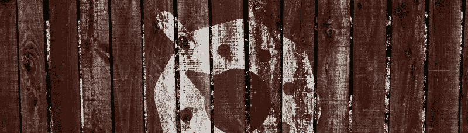

# JPG 是如何运作的

JPG 文件格式是 1992 年问世的图像压缩技术中最令人印象深刻的进步之一。从那时起，它就成了互联网上照片质量图像表现的主导力量。而且理由很充分。JPG 工作原理背后的许多技术异常复杂，需要对人眼如何适应颜色和边缘的感知有深刻的理解。

由于我对这一类的东西感兴趣(如果你正在读这篇文章，你也是)，我想分解 JPG 编码是如何工作的，这样我们可以更好地理解如何制作更小的 JPG 文件。

### 迷雾

JPG 压缩方案分为几个阶段。下图从较高的层面描述了它们，下面我们将逐一介绍各个阶段。

### 色彩空间转换

*有损*数据压缩的一个关键原则是，人类传感器不如计算系统精确。从科学上讲，人眼只有分辨大约[1000 万种不同颜色](https://en.wikipedia.org/wiki/Color_vision)的生理能力。然而，有很多因素会影响人眼对颜色的感知；用[色错觉](https://www.washingtonpost.com/news/wonk/wp/2015/02/27/12-fascinating-optical-illusions-show-how-color-can-trick-the-eye/)完美凸显，或者说[这件衣服](http://www.wired.com/2015/02/science-one-agrees-color-dress/)爆红互联网的事实。要点是，人眼可以很好地控制它所感知的颜色。

量化是有损图像压缩中这种效果的一种形式，然而 JPG 对此采取了不同的方法: [*颜色模型*](https://en.wikipedia.org/wiki/Color_model) 。一个 [**色彩空间**](https://en.wikipedia.org/wiki/Color_space) 是一种特定的色彩组织，它的**色彩模型**代表了如何表现这些色彩的数学公式(例如 RGB 中的三色，或 CMYK 中的四色)。

这个过程的强大之处在于，你可以*从一种颜色模型转换到另一种*，这意味着你可以用一组完全不同的数值来改变给定颜色的数学表示。

例如，下面是一种特定的颜色，它用 RGB 和 CMYK 颜色模型来表示，它们对人眼来说是相同的颜色，但是可以用不同的数值集合来表示。

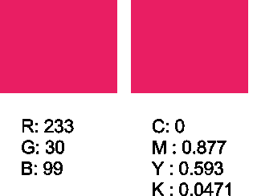

JPG 从 RGB 转换成 [Y，Cb，Cr](https://en.wikipedia.org/wiki/YCbCr) 颜色模型；其包括亮度(Y)、色度蓝(Cb)和色度红(Cr)。原因是心理视觉实验(也就是大脑如何处理眼睛看到的信息)表明，人眼对[亮度](https://en.wikipedia.org/wiki/Luminance)比对[色度](https://en.wikipedia.org/wiki/Chrominance)更敏感，这意味着我们可能会忽略色度的较大变化，而不会影响我们对图像的感知。因此，我们可以在人眼注意到之前对 CbCr 通道进行积极的改变。

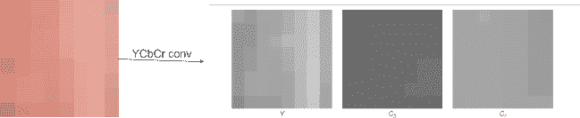

### 向下采样

YCbCr 色彩空间的一个有趣的结果是，所得到的 Cb/Cr 通道具有较少的细粒度细节；它们比 Y 通道包含更少的信息。

结果，JPG 算法*将 Cb 和 Cr 通道的大小*调整为大约它们的原始大小(注意，这其中有一些细微的差别，我在这里没有涉及……)，这被称为*下采样*。

这里需要注意的重要一点是，缩减采样是一个有损压缩过程(您无法恢复精确的源颜色，而只是一个非常接近的近似值)，但它对人类视觉皮层的视觉组件的总体影响是最小的。亮度(Y)是有趣的东西，因为我们只对 CbCr 通道进行下采样，所以对视觉系统的影响很小。

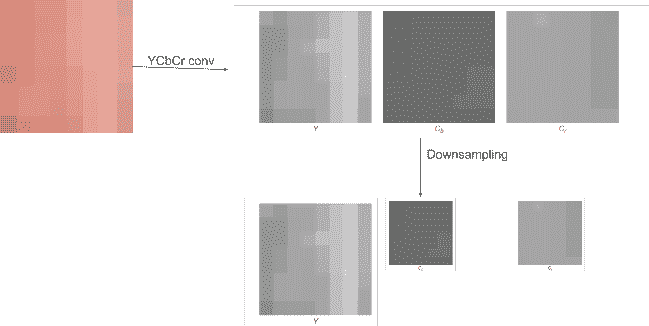

### 分成 8×8 像素块的图像

从现在开始，JPG 对 8×8 像素块进行所有操作。这样做是因为我们通常期望在 8×8 的块上没有太多的变化，即使在非常复杂的照片中，在局部区域也往往有一些自相似性；这种相似性是我们稍后在压缩过程中要利用的。

值得注意的是，在这一点上，我们正在介绍 JPG 编码的第一个常见“工件”之一。“渗色”是指沿锐边的颜色会“渗色”到另一边。这是因为表示像素颜色的色度通道已经将每个 4 像素的块平均为单一颜色，并且这些块中的一些跨越了锐边。

### 离散余弦变换

到目前为止，一切都很平淡。色彩空间、缩减采样和分块在图像压缩领域是很简单的事情。但是现在…现在真正的数学出现了。

DCT 变换的关键部分是，它假设任何数字信号都可以使用余弦函数的组合来重新创建。

例如，如果我们有下图:

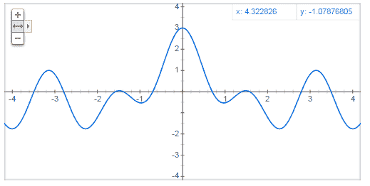

你可以看到它实际上是 cos(x)+cos(2x)+cos(4x)的和

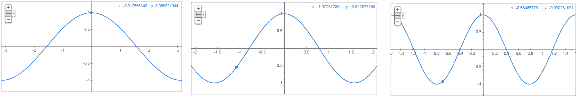

也许更好的展示是给定 2D 空间上的一系列余弦函数，图像的实际解码。为了展示这一点，我展示了互联网上最令人惊叹的 gif 之一:在 2D 空间中使用余弦对 8×8 像素块进行编码:

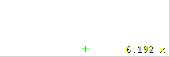

你现在看到的是一个图像的重建(最左边的面板)。对于每一帧，我们取一个新的基值(右图)并将其乘以一个权重值(右图文本)以产生对图像的贡献(中图)。

正如你所看到的，通过将不同的余弦值和一个权重相加，我们可以重建我们的原始图像(相当好...)

这是[离散余弦变换](https://en.wikipedia.org/wiki/Discrete_cosine_transform)如何工作的基本背景。这个想法是*任何*8×8 的块可以被表示为不同频率的加权余弦变换的和。这整件事的诀窍是弄清楚*使用什么*余弦输入，以及它们应该如何加权在一起。

原来"*用什么余弦"*的问题是相当容易的；经过大量测试，选择了一组余弦值来产生最佳结果，它们是我们的*基函数*，如下图所示。

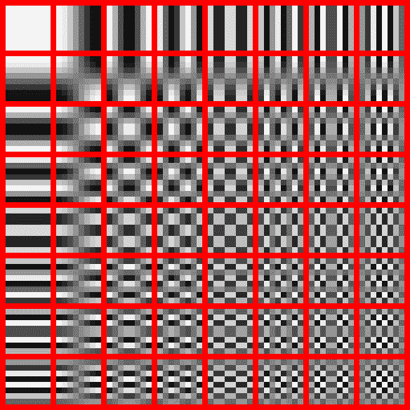

至于“它们应该如何加权在一起”的问题，简单来说(哈！)套用这个公式。

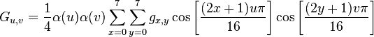

我不会告诉你所有这些值是什么意思，你可以在维基百科页面上查找它们。

基本结果是，对于每个颜色通道中的 8×8 像素块，应用上述公式和基函数将生成新的 8×8 矩阵，该矩阵表示将在重建期间使用的权重。这是一个流程图:

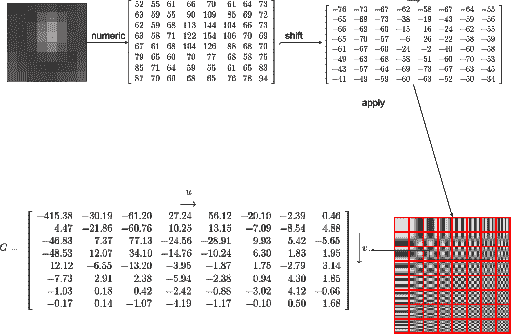

这个矩阵 G 表示用于重建图像的基本权重(上面动画右下角的小十进制值)。基本上，对于每个基，我们把它乘以这个矩阵中的权重，把所有东西加在一起，得到我们的结果图像。

此时，我们不再在色彩空间中工作，而是直接使用 G 矩阵(基重)，所有进一步的压缩都直接在该矩阵上进行。

但是这里的问题是，我们现在已经将字节对齐的整数值转换成了实数。这有效地膨胀了我们的信息(从 1 字节移动到 1 浮点(4 字节))。为了解决这个问题，并开始产生更大的压缩，我们进入量化阶段。

### 量化

所以，我们不想压缩浮点数据。这将使我们的流膨胀，并且没有效率。为此，我们；我想找到一种方法将权重矩阵转换回空间[0，255]中的值。直接地，我们可以通过找到矩阵的最小/最大值(分别为-415.38 和 77.13)并将该范围内的每个数字相除，得到一个介于[0，1]之间的值，然后乘以 255 得到最终值。

例如:[34.12--415.38]/[77.13--415.38]* 255 = 232

这是可行的，但代价是精度显著降低。这种缩放将产生值的不均匀分布，其结果是图像的视觉损失很大。

相反，JPG 采取了不同的路线。它使用预先计算的量化因子矩阵，而不是使用矩阵中的值范围作为其缩放值。这些 qf 不需要成为流的一部分，相反，它们可以是编解码器本身的一部分。

[这个例子](http://en.wikipedia.org/wiki/JPEG#Quantization)示出了一个常用的量化因子矩阵，每个基准图像一个，

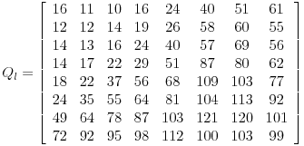

我们现在使用 Q 和 G 矩阵来计算量化的 DCT 系数矩阵:

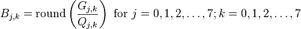

例如，使用 G[0，0]= 415.37 和 Q[0，0]=16 个值:

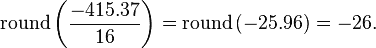

产生最终的矩阵:

观察矩阵变得有多简单——它现在包含大量的小条目或零条目，使其更容易压缩。

顺便提一下，我们将此过程独立应用于 Y、CbCr 通道，因此我们需要两个不同的矩阵:一个用于 Y 通道，另一个用于 C 通道:

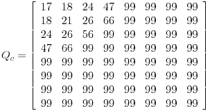

量化以两种重要方式压缩图像:第一，它限制了权重的有效范围，减少了表示权重所需的位数。第二，许多权重变得相同或为零，在第三步熵编码中提高了压缩率。

因为这种量化是 JPEG 伪像的主要来源。因为右下方的图像往往具有最大的量化因子，JPEG 伪像往往类似于这些图像的组合。量化因子矩阵可以通过改变 JPEG 的“质量等级”来直接控制，这可以放大或缩小它的值(我们马上会谈到)

### 压缩

到目前为止，我们已经回到了整数值的世界，并且可以继续对我们的块应用无损压缩阶段。但是，当查看我们转换后的数据时，您应该会注意到一些有趣的事情:

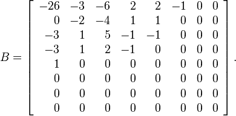

当你从左上移到右下时，零的频率增加。这看起来像是游程编码的主要嫌疑人。但是行主和列主的顺序在这里并不理想，因为这将使这些零串交错，而不是将它们打包在一起。

相反，我们从左上角开始，以对角线模式之字形穿过矩阵，来回移动，直到到达右下角。

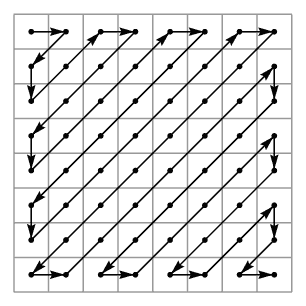

我们的亮度矩阵的结果，按此顺序，变成:

*26，3，0，3，2，6，2，4，1，3，1，1，5，1，2，1，1，1，2，0，0，0，0，0，0，0，0，0，0，0，0，0，0，0，0，0，0，0，0，0，0，0*

一旦数据是这种格式，接下来的步骤就很简单了:对序列执行 RLE，然后对结果应用一些统计编码器([霍夫曼](https://www.youtube.com/watch?v=6rnF2Mo80x0&list=PLOU2XLYxmsIJGErt5rrCqaSGTMyyqNt2H&index=2) / [算术](https://www.youtube.com/watch?v=FdMoL3PzmSA&index=7&list=PLOU2XLYxmsIJGErt5rrCqaSGTMyyqNt2H) / ANS)。

然后嘣。你的区块现在是 JPG 编码的。

### 了解质量参数

既然你已经理解了 JPG 文件实际上是如何创建的，那么就有必要重温一下从 Photoshop(或诸如此类的软件)导出 JPG 图像时通常会看到的*质量*参数的概念。

这个参数，我们称之为 q，是一个从 1 到 100 的整数。你应该把 q 看作是图像质量的一种度量:q 值越高，对应的图像质量越高，文件越大。

**该质量值在量化阶段使用，以适当地缩放量化因子。**因此，对于每个基重，量化步长现在类似于 *round(Gi，k / alpha*Qi，k)*

其中作为质量参数的结果，创建了*α*符号。

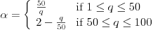

当 alpha 或 Q[x，y]增加时(记住 alpha 的大值对应于质量参数 Q 的小值)，更多的信息丢失，并且文件大小**减小**。

因此，如果您想要一个更小的文件，以更多的视觉伪像为代价，您可以在导出阶段设置一个较低的质量值。

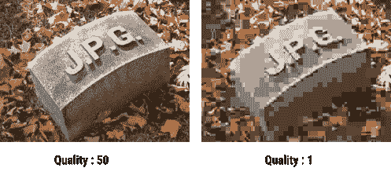

注意上面，在最低质量的图像中，我们如何清楚地看到分块阶段以及量化阶段的迹象。

可能最重要的是，*质量参数根据图像*而变化。由于每个图像都是唯一的，并且呈现不同类型的视觉伪像，因此 Q 值也是唯一的。

### 结论

一旦你理解了 JPG 算法的工作原理，一些事情就变得显而易见了:

1.  对于每个图像，获得正确的质量值对于找到视觉质量和文件大小之间的折衷很重要。
2.  因为这个过程是基于块的，所以伪影将倾向于以块的形式出现，或者“振铃”
3.  由于已处理的块不会相互混合，JPG 通常会忽略将大量相似的块压缩在一起的机会。解决这个问题是 WebP 格式擅长做的事情。

如果你想一个人玩这一切，所有这些疯狂可以归结为一个 [~1000 行文件](https://github.com/richgel999/jpeg-compressor/pull/7/files?short_path=04c6e90)。

#### 嘿！

想知道如何让你的 [JPG 文件变小](https://medium.com/@duhroach/reducing-jpg-file-size-e5b27df3257c)？

想知道 [PNG 文件如何工作](https://medium.com/@duhroach/how-png-works-f1174e3cc7b7#.k84u38rna)，或者[如何让它们变小](https://medium.com/@duhroach/reducing-png-file-size-8473480d0476#.8prys6ckk)？

想要更多数据压缩的好处？[买我的书](http://shop.oreilly.com/product/0636920052036.do)！