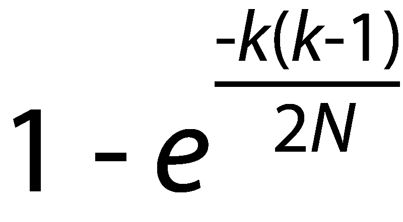
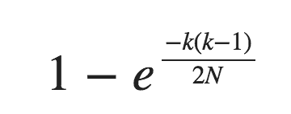

# 我应该把我的 API 密匙设为多长？

> 原文：<https://www.freecodecamp.org/news/how-long-should-i-make-my-api-key-833ebf2dc26f/>

作者:山姆·科尔科斯

# 我应该把我的 API 密匙设为多长？

#### 计算散列值的冲突概率

假设您构建了一个生成公钥的 API，这些密钥都需要是唯一的，并且难以猜测。最常见的方法是使用哈希函数生成一系列随机的数字和字母。典型的散列看起来像下面的文本。

> *afgg 2 pixh 0 ht 6 dmxux qv 4 na 1 pu 120 r 0 ymqhuk 13 i8*

经常出现的一个问题是，“为了确保惟一性，我的 hash 需要多长？”大多数人认为这是一个困难的计算。所以它们默认为某个非常大的数字，比如一个 50 位的散列。估算碰撞概率的方程式实际上很简单。

### 我怎么算？

让我们假设你正在使用一个好的加密算法(即[而不是 JavaScript 的 Math.random](https://medium.com/@betable/tifu-by-using-math-random-f1c308c4fd9d#.1ypwox7l4) )。每种语言都有一个不错的加密包来生成随机散列。在 Phoenix 上，你可以使用 Erlang **:crypto** 包。

进行计算时，您只需要两条信息:

1.  对于给定的输入，您可以创建多少个可能的唯一哈希值？我们将把它赋给变量 *N.*
2.  在项目的生命周期中，你可能需要产生多少价值？我们将把它赋给变量 *k.*

为了计算第一个值，将所有可能的字符加到你的散列中。将它提升到散列长度的幂。

例如，如果您的哈希值包含数字、小写和大写字母，那么我们总共可以使用 62 个字符(10 + 26 + 26)。如果我们生成的散列长度只有 3 个字符，那么:

*N* = 62 = **238，328** 可能的值

要计算第二个值，你需要思考你的 app 是做什么的，做一些合理的假设。

假设您的应用程序正在生成一个散列分配给您的每个客户。这么说吧，你的 app 很小众。绝对最好的情况是，您的应用程序在其生命周期中将有 1000 个客户。那么，为了安全起见，我们将把它乘以 10。我们假设你可能需要在应用程序的生命周期中产生 10，000 个值。

需要创建的可能值的上限

所以现在我们需要计算。有很多算法我们可以用。我们将使用[简单近似值](https://en.wikipedia.org/wiki/Birthday_problem#Approximations)中的一个，其中 *e* 是数学常数(自然对数的底)，而 *k* 和 *N* 是与上面相同的值。

基本方程给出了所有值都是唯一的概率。然后我们从 1 中减去这个结果，得到发生碰撞的几率。如果你不想写你自己的方程式，我在下面提供了一个用 JavaScript 写的。

所以在上面的例子中， **calculate(N，k)** 得出**大约 100%** 的概率，你会有一个碰撞。因此，对于这个用例，您应该使用长度超过 3 个字符的散列。

现在，如果我们举同一个例子，但是把散列的长度从 3 改为 5，我们将得到一个比*大得多的*(指数就是这样)。

*N* = 62⁵ = ~ **9 亿**

假设 k 值*和*相同，我们新的碰撞概率下降到只有 **5.4%** 。如果我们把 5 个字符增加到 10 个呢？

*n*= 62≤~ 800，000，000，000，

是的，大约有 800 万亿个唯一散列。这使你的碰撞几率下降到 0.00000000062%。这是一个 500 亿分之一的概率，你会有冲突。这是一个 10 位数的散列，类似于:BwQ1W6soXk。

再举一个例子，假设你是一家处理大量交易的数据处理公司。我们假设您每秒处理 100 万个进程，您需要为每个进程生成一个哈希。让我们假设你认为这家公司可以经营 100 年。

k = ~30 亿

这就产生了大约 **3 千万亿个**散列，你需要使它们都是唯一的。数据真多啊！但是即使要处理这个非常大的数字，你只需要一个 **21 位的**散列来确保在项目的生命周期中**1/1000 万的碰撞几率**。

所以下一次当你担心散列的长度以确保惟一性时，要知道只要你认为需要，你就不需要散列。另外，你可以自己做计算，不需要太多的努力。

*Sam Corcos 是最直观的 3D 打印地形图平台 [Sightline Maps](http://sightlinemaps.com) 和中级高级教程网站 [LearnPhoenix.io](http://learnphoenix.io) 的首席开发人员和联合创始人，LearnPhoenix.io 用于使用 Phoenix 和 React 构建可扩展的生产应用程序。*