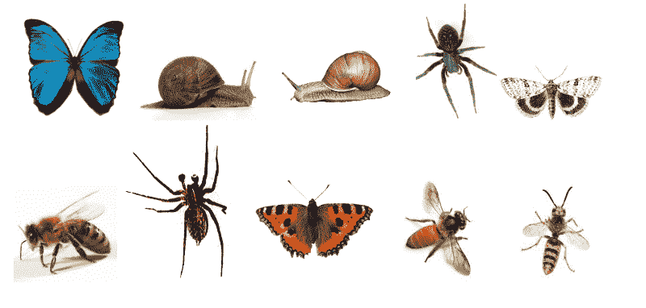
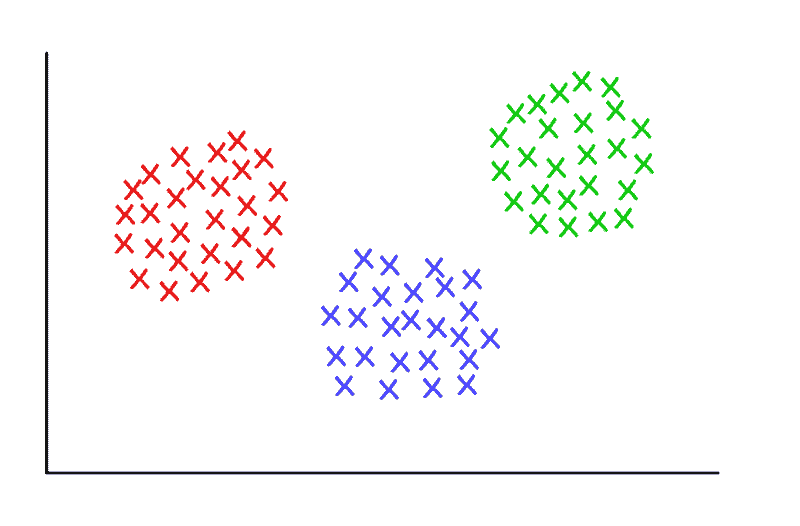
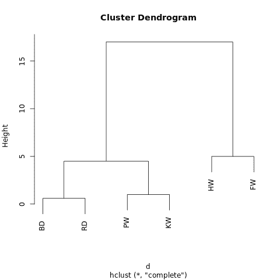
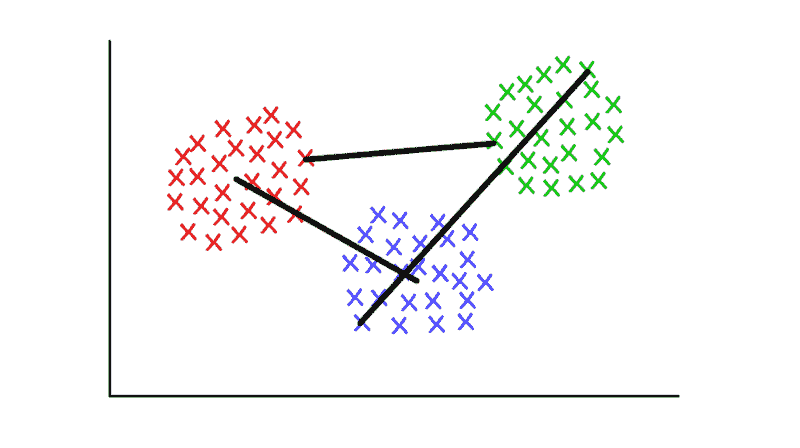
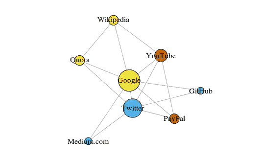
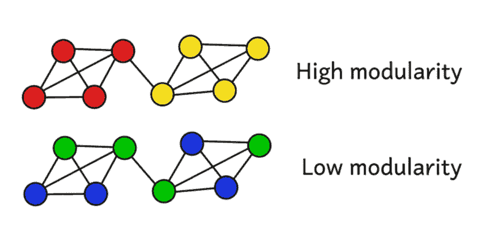
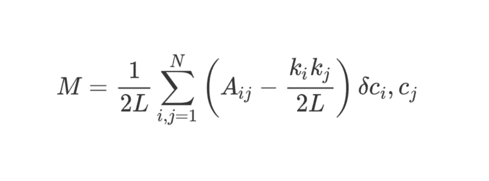

# 聚类算法简介

> 原文：<https://www.freecodecamp.org/news/how-machines-make-sense-of-big-data-an-introduction-to-clustering-algorithms-4bd97d4fbaba/>

看看下面的图片。它是不同形状和大小的虫子和爬虫的集合。花点时间根据相似性将它们分成几个组。

这不是一个难题。从将蜘蛛归类开始。



Images via Google Image Search, labelled for reuse

完成了吗？虽然这里不一定有一个“正确”的答案，但最有可能的是你将这些错误分成四个*簇*。蜘蛛在一个集群中，一对蜗牛在另一个集群中，蝴蝶和蛾在一个集群中，黄蜂和蜜蜂的三个集群在另一个集群中。

那还不算太糟，是吗？你可以用两倍的虫子做同样的事情，对吗？如果你有一点空闲时间，或者对昆虫学有热情，你甚至可以对一百只虫子做同样的事情。

然而，对于一台机器来说，将十个物体分组为多少个有意义的集群并不是一件小事，这要归功于一个令人费解的数学分支[组合学](https://en.wikipedia.org/wiki/Bell_number)，它告诉我们有 115，975 种不同的方式可以将这十只昆虫分组在一起。

如果有 20 个 bug，那么将会有超过 50 万亿种可能的方法来聚集它们。

如果有一百个错误，那么答案将比已知宇宙中的粒子数多很多倍。

还要多少次？根据我的计算，大约是的五千亿亿倍。事实上，有超过[四百万亿*古戈尔*的解决方案(](https://www.wolframalpha.com/input/?i=BellB%5B100%5D+%2F+googol)[什么是古戈尔？](https://www.wolframalpha.com/input/?i=googol))。

仅仅为了一百件物品。

几乎所有这些解决方案都是没有意义的——然而，从难以想象的众多可能选择中，你很快就找到了一个以一种有用的方式将错误聚集在一起的极少数解决方案。

我们人类理所当然地认为，我们对大量数据进行分类和理解的速度有多快。无论是一段文字，还是屏幕上的图像，或者是一系列物体，人类通常都能相当有效地理解世界抛给我们的任何数据。

鉴于开发人工智能和机器学习的一个关键方面是让机器快速理解大量输入数据，有哪些捷径可用？

在这里，您可以了解机器可以用来快速理解大型数据集的三种聚类算法。这绝不是一个详尽的列表——还有其他算法——但它们代表了一个很好的起点！

您会发现每一个都有可能用到它们的快速总结，它们如何工作的简要概述，以及一个更详细的逐步工作的例子。我相信通过实际执行自己有助于理解一个算法。

如果你真的很感兴趣，你会发现最好的方法是用纸和笔。说吧，没人会评判你的！



Three suspiciously neat clusters, with K = 3

### k 均值聚类

#### **使用时间...**

…你知道你期望找到多少组先验的*。*

#### **工作原理**

该算法将每个观察值随机分配到 *k* 个类别之一，然后计算每个类别的*平均值*。接下来，在重新计算平均值之前，它将每个观察值重新分配给具有最接近平均值的类别。这个步骤反复重复，直到不再需要重新分配。

#### **工作示例**

以 12 名足球运动员为例，他们每个人在本赛季都进了一定数量的球(比如在 3-30 个范围内)。让我们把它们分成不同的组，比如说三个。

**步骤 1** 要求我们将玩家随机分成三组，并计算每组的平均值。

```
Group 1
  Player A (5 goals),
  Player B (20 goals),
  Player C (11 goals)
Group Mean = (5 + 20 + 11) / 3 = 12 goals

Group 2
  Player D (5 goals),
  Player E (3 goals),
  Player F (19 goals)
Group Mean = 9 goals

Group 3
  Player G (30 goals),
  Player H (3 goals),
  Player I (15 goals)
Group Mean = 16 goals
```

**第二步:**对每位球员，重新分配到平均值最接近的一组。例如，球员 A (5 个进球)被分配到组 2(平均值= 9)。然后重新计算组均值。

```
Group 1 (Old Mean = 12 goals)
  Player C (11 goals)
New Mean = 11 goals

Group 2 (Old Mean = 9 goals)
  Player A (5 goals),
  Player D (5 goals),
  Player E (3 goals),
  Player H (3 goals)
New Mean = 4 goals

Group 3 (Old Mean = 16 goals)
  Player G (30 goals),
  Player I (15 goals),
  Player B (20 goals),
  Player F (19 goals)
New Mean = 21 goals
```

**反复重复**步骤 2，直到组意不再变化。对于这个有点做作的例子，这发生在下一次迭代中。**停下！**您现在已经从数据集形成了三个聚类！

```
Group 1 (Old Mean = 11 goals)
  Player C (11 goals),
  Player I (15 goals)
Final Mean = 13 goals

Group 2 (Old Mean = 4 goals)
  Player A (5 goals),
  Player D (5 goals),
  Player E (3 goals),
  Player H (3 goals)
Final Mean = 4 goals

Group 3 (Old Mean = 21 goals)
  Player G (30 goals),
  Player B (20 goals),
  Player F (19 goals)
Final Mean = 23 goals
```

在这个例子中，聚类可以对应于球员在场上的位置——比如后卫、中场和进攻球员。

K-means 在这里起作用，因为我们可以合理地预期数据自然地落入这三个类别。

通过这种方式，给定一系列表现统计数据，机器可以合理地估计任何团队运动中球员的位置——这对于体育分析非常有用，实际上对于将数据集分类到预定义的组中可以提供相关见解的任何其他目的都非常有用。

#### **更详细的细节**

这里描述的算法有几种变体。“播种”集群的初始方法可以通过几种方式中的一种来完成。

这里，我们将每个玩家随机分配到一个组，然后计算该组的平均值。这使得初始组均值趋向于彼此相似，这确保了更大的可重复性。

另一种方法是在每个集群中植入一个玩家，然后开始将玩家分配到最近的集群。返回的聚类对初始播种步骤更敏感，降低了高度可变数据集中的可重复性。

然而，这种方法可以减少完成算法所需的迭代次数，因为这些组将花费更少的时间来发散。

K-means 聚类的一个明显限制是，您必须提供关于您期望找到多少个聚类的先验假设。

有一些方法可以评估一组特定聚类的适合度。例如，类内[平方和](https://en.wikipedia.org/wiki/Partition_of_sums_of_squares)是每个类内方差的度量。

聚类越“好”，总体 WCSS 越低。

### 分层聚类

#### **使用时间...**

…你希望发现观察结果之间的潜在关系。

#### **工作原理**

计算距离矩阵，其中单元格( *i，j)* 的值是观察值 *i* 和 *j* 之间的距离度量。

然后，将最接近的两个观察值配对，并计算它们的平均值。形成新的距离矩阵，将成对的观察结果合并成单个对象。

根据这个距离矩阵，将最近的两个观察值配对，并计算它们的平均值。重复上述步骤，直到所有观察结果被组合在一起。

#### **工作示例**

这是一个关于精选的鲸鱼和海豚物种的超级简化数据集。作为一名训练有素的生物学家，我可以向你保证，我们通常会使用更详细的数据集来重建系统发育。

不过现在，我们只看这六个物种的典型体长。我们将只使用两个重复的步骤。

```
Species          Initials  Length(m)
Bottlenose Dolphin     BD        3.0
Risso's Dolphin        RD        3.6
Pilot Whale            PW        6.5
Killer Whale           KW        7.5
Humpback Whale         HW       15.0
Fin Whale              FW       20.0
```

**步骤 1:** 计算每个物种之间的距离矩阵。这里，我们将使用[欧几里德距离](https://en.wikipedia.org/wiki/Euclidean_distance)——数据点相距多远？

请像阅读道路地图中的距离图一样阅读这篇文章。任何一对物种之间的长度差异可以通过读取相关行和列的交叉点的值来查找。

```
 BD   RD   PW   KW   HW
RD  0.6                    
PW  3.5  2.9               
KW  4.5  3.9  1.0          
HW 12.0 11.4  8.5  7.5     
FW 17.0 16.4 13.5 12.5  5.0
```

第二步:将两个最接近的物种配对。在这里，这将是宽吻海豚&里索的海豚，平均长度为 3.3 米

**通过重新计算距离矩阵重复**步骤 1，但是这次将宽吻海豚&里索的海豚合并成一个 3.3 米长的单一物体

```
 [BD, RD]   PW   KW   HW
PW       3.2               
KW       4.2   1.0          
HW      11.7   8.5  7.5     
FW      16.7  13.5 12.5  5.0
```

**下一步**，用这个新的距离矩阵重复步骤 2。在这里，领航鲸&和黑仔鲸之间的距离最小，所以我们将它们配对，取它们的平均值——得出 7.0 米

**然后**，我们重复第一步——重新计算距离矩阵，但是现在我们已经将飞行员&黑仔鲸合并成一个 7.0 米长的物体

```
 [BD, RD] [PW, KW]   HW
 [PW, KW]      3.7              
 HW           11.7      8.0     
 FW           16.7     13.0   5.0
```

**下一个**，用这个距离矩阵重复步骤 2。两个合并的对象之间的距离最小(3.7 米)，所以现在将它们合并成一个更大的对象，取平均值(5.2 米)。

**然后**，重复第一步，计算新的距离矩阵，将宽吻海豚&里索海豚和领航员&黑仔鲸鱼合并。

```
 [[BD, RD] , [PW, KW]]    HW
HW                   9.8    
FW                  14.8   5.0
```

**下一个**，重复步骤 2。最小的距离(5.0m)是座头鲸&和长须鲸之间的距离，所以把它们合并成一个物体，取平均值(17.5m)。

**然后**，回到第一步——计算距离矩阵，合并座头鲸&长须鲸。

```
 [[BD, RD] , [PW, KW]]
[HW, FW]                  12.3
```

**最后，**重复步骤 2——这个矩阵中只有一个距离(12.3 米)，所以把所有东西都配对成一个大物体。现在你可以**停下来了！**看最终合并的对象:

```
[[[BD, RD],[PW, KW]],[HW, FW]]
```

它有一个嵌套的结构(想想 [JSON](http://json.org/example.html) )，这允许它被绘制成一个树状图，或“树状图”。

它读起来和家谱差不多。树上的两个观察值越接近，它们就越相似或密切相关。



A no-frills dendrogram generated at [R-Fiddle.org](http://www.r-fiddle.org/#)

树状图的结构让我们深入了解数据集的结构。

在这个例子中，有两个主要分支，一边是座头鲸和长须鲸，另一边是宽吻海豚/里索海豚和领航鲸/黑仔鲸。

在进化生物学中，具有更多标本和测量值的大得多的数据集以这种方式被用来推断它们之间的分类关系。

在生物学之外，层次聚类在数据挖掘和机器学习环境中也有应用。

很酷的一点是，这种方法不需要假设您正在寻找的集群的数量。

您可以通过在给定高度“切割”树来将返回的树状图分割成簇。可以通过多种方式选择该高度，具体取决于您希望对数据进行聚类的分辨率。

例如，看上面的树状图，如果我们在高度= 10 处画一条水平线，我们将两个主要分支相交，将树状图分成两个子图。如果我们在高度= 2 处切割，我们将把树状图分成三个簇。

#### **更详细的细节**

从本质上讲，层次聚类算法可以在三个方面有所不同。

最基本的是方法——在这里，我们使用了一个*凝聚*过程，我们从单个数据点开始，迭代地将它们聚集在一起，直到我们剩下一个大的集群。

另一种方法(但计算量更大)是从一个巨大的集群开始，然后将数据分成越来越小的集群，直到只剩下孤立的数据点。

还有一系列方法可用于计算距离矩阵。对于许多目的来说，欧几里德距离(想想毕达哥拉斯定理)就足够了，但是在某些情况下，还有其他更适用的选择。

最后，*链接标准*也可以变化。聚类是根据它们彼此之间的接近程度来链接的，但是我们定义“接近”的方式是灵活的。

在上面的例子中，我们测量了每组的平均值(或“质心”)之间的距离，并将最近的组配对。但是，您可能希望使用不同的定义。

例如，每个聚类由几个离散的点组成。您可以将两个聚类之间的距离定义为它们任意点之间的最小(或最大)距离，如下图所示。

还有其他定义联系标准的方法，可能适用于不同的情况。



Red/Blue: centroid linkage; Red/Green: minimum linkage; Green/Blue: maximum linkage

### 图形社区检测

#### **在**时使用

…您拥有可以表示为网络或“图形”的数据。

#### **工作原理**

一个*图形社区*通常被定义为顶点的子集，这些顶点彼此之间的连接比与网络其余部分的连接更多。

基于更具体的定义，存在各种算法来识别社区。算法包括，但不限于:边介数，模块最大化，Walktrap，团渗，领导特征向量…

#### **工作示例**

[图论](https://en.wikipedia.org/wiki/Graph_theory)，或网络的数学研究，是数学的一个迷人分支，它让我们将复杂系统建模为由“线”(或*边*)连接的“点”(或*顶点*)的抽象集合。

也许最直观的案例研究是社交网络。

这里，顶点代表人，边连接作为朋友/追随者的顶点。然而，任何系统都可以被建模为一个网络，如果你能证明一种方法有意义地连接不同的组件。

图论在聚类方面更具创新性的应用包括从图像数据中提取特征，以及分析基因调控网络。

作为一个入门级的例子，看看这个快速组合的图表。它显示了我最近访问的八个网站，根据它们各自的维基百科文章是否相互链接来链接。

您可以手动组装这些数据，但是对于大型项目，编写 Python 脚本来完成同样的工作要快得多。[这是我之前写的一篇](https://raw.githubusercontent.com/pg0408/Medium-articles/master/graph_maker.py)。



Graph plotted with ‘igraph’ package for R version 3.3.3

顶点根据它们的社区成员来着色，并根据它们的*中心性*来确定大小。看看 Google 和 Twitter 是怎么最核心的？

此外，集群在现实世界中很有意义(总是一个重要的性能指标)。

黄色顶点通常是参考/查找位置；蓝色顶点全部用于在线发布(文章、推文或代码)；红色的顶点包括 YouTube，它当然是由前 PayPal 员工创建的。对一台机器来说，这是不错的推论。

除了作为一种可视化大型系统的有用方法，网络的真正力量来自于它们的数学分析。让我们先把网络的美好图景转换成更数学化的格式。下面是网络的*邻接矩阵*。

```
 GH Gl  M  P  Q  T  W  Y
GitHub    0  1  0  0  0  1  0  0  
Google    1  0  1  1  1  1  1  1
Medium    0  1  0  0  0  1  0  0
PayPal    0  1  0  0  0  1  0  1
Quora     0  1  0  0  0  1  1  0
Twitter   1  1  1  1  1  0  0  1
Wikipedia 0  1  0  0  1  0  0  0
YouTube   0  1  0  1  0  1  0  0
```

每行和每列交点处的值记录了该对顶点之间是否有边。

例如，Medium 和 Twitter 之间有一个优势(惊喜，惊喜！)，所以它们的行/列相交处的值是 1。同样，Medium 和 PayPal 之间没有边界，所以它们的行/列的交集返回 0。

编码在邻接矩阵中的是这个网络的所有属性——它给了我们开启各种有价值见解的钥匙。

首先，对任何一列(或一行)求和会得到每个顶点的度数，即它与多少个其他顶点相连。这通常用字母 *k* 来表示。

同样，将每个顶点的度数相加，然后除以 2，得到网络中边(或“链接”)的数量 *L* 。行数/列数给了我们 *N* ，网络中顶点(或“节点”)的数量。

只需知道 *k* 、 *L、N* 和邻接矩阵 *A* 中每个单元的值，我们就能计算出 [](https://en.wikipedia.org/wiki/Modularity_(networks)) ***网络的任何给定聚类的[*。*](https://en.wikipedia.org/wiki/Modularity_(networks))***

**假设我们已经将网络聚集到了许多社区中。我们可以使用模块化评分来评估这种聚类的“质量”。**

**较高的分数将表明我们已经将网络分成了“准确的”社区，而较低的分数表明我们的集群更随机而非有见地。下图说明了这一点。**

**

Modularity serves as a measure of the ‘quality’ of a partition.** 

**模块化可使用以下公式计算:**

****

**这是一个相当大的数学量，但我们可以一点一点地分解它，这样会更有意义。**

**M 当然是我们正在计算的——模块化。**

**1/2 *L* 告诉我们用 2 *L* 除后面的所有东西，即网络中边数的两倍。到目前为止，一切顺利。**

**符号**σ**告诉我们正在对右边的所有内容求和，并让我们迭代邻接矩阵 *A* 中的每一行和每一列。**

**对于那些不熟悉 sum 符号的人来说， *i，j = 1* 和 *N* 的工作方式很像编程中的嵌套 For 循环。在 Python 中，您应该这样写:**

```
**`sum = 0
for i in range(1,N):
    for j in range(1,N):
        ans = #stuff with i and j as indices 
    sum += ans`**
```

**那么更详细的说`#stuff with i and j`是什么呢？**

**嗯，括号里的位告诉我们从 *A_ij* 中减去( *k_i k_j ) / 2L* 。**

***A_ij* 就是邻接矩阵中第 *i* 行第 *j* 列的值。**

***k_i* 和 *k_j* 的值是每个顶点的度数——通过分别将行 *i* 和列 *j* 中的条目相加而得到。将这些相乘并除以 2 *L* 得到顶点 *i* 和 *j* 之间的预期边数，如果网络被随机打乱的话。**

**总的来说，括号中的术语揭示了网络的真实结构和随机重组后的预期结构之间的差异。**

**摆弄数值表明，当 *A_ij* = 1，( *k_i k_j ) / 2L* 为低时，它返回最高值。这意味着，如果顶点 *i* 和 *j.* 之间存在“意外”边缘，我们会看到更高的值**

**最后，我们将括号中的术语乘以最后几个符号所指的内容。**

**那个？c *_i，* c *_j i* 这是一个听起来很花哨但完全无害的克罗内克-德尔塔函数。这是用 Python 解释的:**

```
**`def kroneckerDelta(ci, cj):
    if ci == cj:
        return 1
    else:
        return 0

kroneckerDelta("A","A")
#returns 1

kroneckerDelta("A","B")
#returns 0`**
```

**是的——真的就这么简单。Kronecker-delta 函数接受两个参数，如果它们相同，则返回 1，否则返回 0。**

**这意味着如果顶点 *i* 和 *j* 被放在同一个集群中，那么？c *_i，* c *_j = 1* 。否则，如果它们在不同的群集中，该函数将返回零。**

**当我们将括号中的项乘以这个 Kronecker-delta 函数时，我们发现对于嵌套的 sum**σ**，当有许多“意外的”边连接分配给同一个集群的顶点时，结果最高。**

**同样地，模块性是一个衡量图形如何很好地聚集成独立社区的标准。**

**除以 *2L* 将模块化的上限值限定为 1。接近或低于零的模块性分数表明网络的当前聚类实际上是无用的。模块化程度越高，网络就越容易聚集成独立的社区。**

**通过最大化模块化，我们可以找到网络集群的最佳方式。**

**请注意，我们必须预先定义图表的聚类方式，以确定聚类的实际效果如何。**

**不幸的是，使用蛮力来尝试聚类图的每一种可能的方式以找到哪个具有最高的模块性分数，在计算上不可能超过非常有限的样本大小。**

**组合学告诉我们，对于一个只有八个顶点的网络，有 4140 种不同的聚类方式。一个两倍大的网络将有超过 100 亿种聚集顶点的可能方式。**

**将网络再翻一倍(达到非常适度的 32 个顶点)将给出 128 万亿种可能的方式，一个 80 个顶点的网络将以比可见宇宙中的原子更多的方式聚集。**

**相反，我们不得不求助于一种*启发式*方法，这种方法在估计将产生最高模块化分数的集群方面做得相当好，而无需尝试每一种可能性。**

**这是一个叫做*快速贪婪模块化最大化*的算法，它有点类似于上面描述的凝聚层次聚类算法。“Mod-Max”不是根据距离合并，而是根据模块化的变化合并社区。**

**事情是这样的:**

****从**开始，首先将每个顶点分配给它自己的社区，并计算整个网络的模块性， *M* 。**

****步骤 1** 要求对于由至少一条单条边链接的每个社区对，如果两个社区合并成一个，该算法计算模块性的结果变化δ*M*。**

****步骤 2** 然后取产生δ*M，*最大增加的一对社区，然后将它们合并。计算该聚类的新模块性 *M* ，并记录下来。**

****重复**步骤 1 和 2——每次合并这样做产生δ*M、*最大增益的社区对，然后记录新的聚类模式及其关联的模块性得分 *M* 。**

****当所有顶点组合成一个巨大的簇时，停止**。现在，该算法检查它保存的记录，并识别返回最高值 *M* 的聚类模式。这是返回的社区结构。**

#### ****更详细的细节****

**咻！这是计算密集型的，至少对我们人类来说是这样。**

**图论是计算上具有挑战性，通常是 NP 困难问题的丰富来源，但它也具有难以置信的潜力，可以为复杂系统和数据集提供有价值的见解。**

**问问拉里·佩奇(Larry Page)就知道了，他的 PageRank 算法完全基于图论，该算法帮助谷歌在不到一代人的时间里从初创企业发展到基本上统治世界。**

**社区检测是当前图论研究的一个主要焦点，有很多模块化最大化的替代方案，虽然有用，但也有一些缺点。**

**首先，它的聚集方法经常看到小的、定义明确的社区被更大的社区吞并。这被称为*分辨率限制* —该算法不会找到低于特定大小的社区。**

**另一个挑战是，Mod-Max 方法不是有一个独特的、容易达到的全局峰值，而是实际上倾向于产生许多相似的高模块化分数的宽“平台”——这使得真正确定绝对最大分数有些困难。**

**其他算法使用不同的方式来定义和处理社区检测。**

***边-介数*是一种除法算法，从所有的顶点组成一个巨大的集群开始。它继续迭代地删除网络中最不重要的边，直到所有的顶点都是孤立的。这会产生一个层次结构，相似的顶点在层次中靠得更近。**

**另一个算法是*团渗*，它考虑到了图社区之间可能的重叠。**

**还有一套算法是基于图中的[随机行走](https://en.wikipedia.org/wiki/Random_walk)，然后有 [*谱聚类*](https://en.wikipedia.org/wiki/Spectral_clustering) 方法，开始深入研究邻接矩阵和其他矩阵的特征分解。这些想法被用于例如计算机视觉等领域的特征提取。**

**给出每个算法自己的深入的工作示例已经超出了本文的范围。可以说，这是一个活跃的研究领域，提供了强有力的方法来理解甚至一代人以前都极难处理的数据。**

### **结论**

**希望这篇文章能让你更好地理解机器如何理解数据。未来是一个快速变化的地方，其中许多变化将由下一代或两代人的技术能力所驱动。**

**正如引言中所概述的，机器学习是一个非常雄心勃勃的研究领域，其中大量复杂的问题需要以尽可能准确和高效的方式解决。对于我们人类来说很自然的任务在由机器承担时需要创新的解决方案。**

**仍然有很多进展要做，无论是谁贡献了下一个突破性的想法，毫无疑问都会得到丰厚的回报。也许看到这篇文章的人会在后面提出下一个强大的算法？**

**所有伟大的想法都得从某个地方开始！**