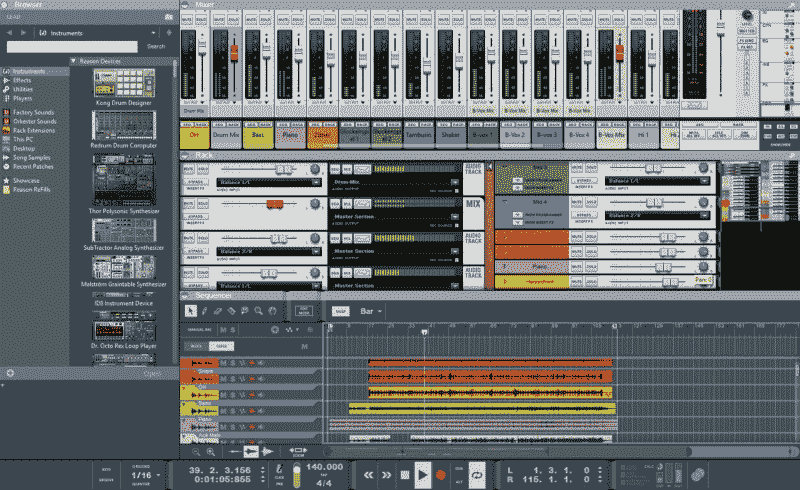
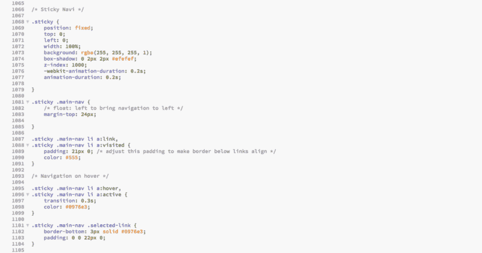
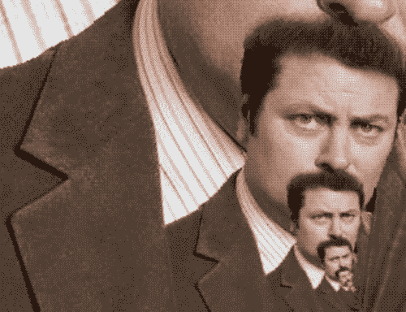
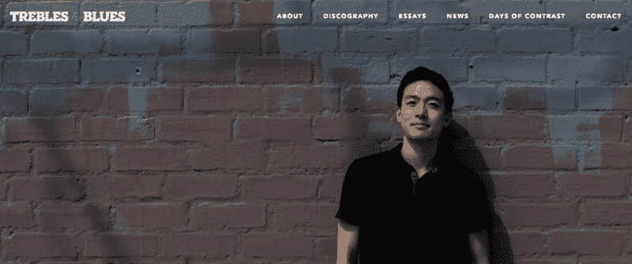
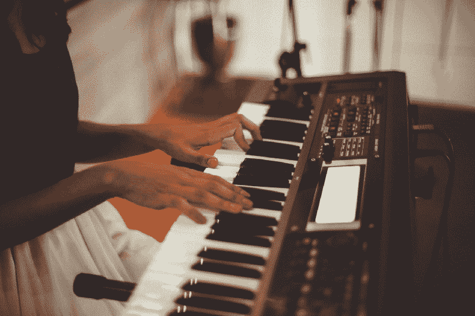
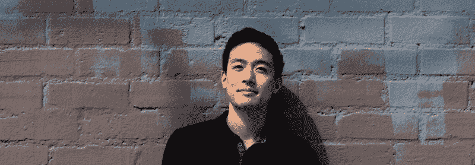

# 制作数百个嘻哈节拍如何帮助我理解 HTML 和 CSS

> 原文：<https://www.freecodecamp.org/news/how-making-hundreds-of-hip-hop-beats-helped-me-understand-html-and-css-cb7c61e847cf/>

劳伦斯·杨

# 制作数百个嘻哈节拍如何帮助我理解 HTML 和 CSS


那是一个周六晚上的凌晨两点，我熬夜做一个新项目。

作为一名 beatmaker，你可能会认为我的屏幕应该是这样的:



[Image credit](https://www.propellerheads.se/support/user/reason/mac-troubleshooting/how-can-i-change-themes-in-reason-9/)

但是，它看起来是这样的:



Source: My Screen @ 2 AM that Saturday Night

我试图在我的网站上建立一个有粘性的导航条，而不是编程踢腿和陷阱。是的，这不完全是机器学习或人工智能，但对我来说，这是一件相当大的事情。

你看，我从来没有认为自己是一个网站开发者。我有几个以此为生的朋友。但是每次他们打开代码编辑器向我展示他们在做什么，看起来就像是那些 gif 文件中的一个，永远循环往复。



Kind of like this, but with way less mustache.

很自然地，我会站起来想，谢天谢地，我不用那么做。我只是一个整天打很多拍子的人！

嗯……这种想法是短暂的。

Soundcloud、Spotify 和 Bandcamp 让音乐家向公众展示他们的作品变得无比容易。但是现在音乐分散在如此多的平台上，以至于听众很难准确找到他们想要的。

很明显，我需要一个网站作为我工作的中心。就像我最喜欢的音乐人一样，我想要一个网页，有一个漂亮的导航栏和一个大的我自己的英雄形象*而不是*看着摄像机。



An homage to my heroes.

我最初尝试使用 Squarespace，但是我不喜欢从模板开始，然后在预先确定的块的范围内工作。

主题太普通了。你可以点击*your-favorite-artist.com*，却只能到达你已经看过几百次的同一个 Squarespace 模板。

我想从头开始构建一些东西——即使我事先没有 HTML 和 CSS 的知识。

我想挑战自己。

所以我购买了一个 Udemy 课程，下载了括号，开始上课。

还有……哇。我立刻就被迷住了。

仅仅一两个月后，[我的网站上线了](https://www.treblesandbluesmusic.com/)，完全是从零开始做的。

[**Trebles and Blues**](https://www.treblesandbluesmusic.com)
[*Trebles and Blues 是一家总部位于洛杉矶的 beatmaker，其影响力来自众多创意渠道。*www.treblesandbluesmusic.com](https://www.treblesandbluesmusic.com)

那么……是什么让我如此热爱这次经历呢？

以下是我觉得特别酷的一些东西:

*   **“把屎变成钻石”哲学**:用 HTML 构建原始内容(不管它看起来有多糟糕)，然后用 CSS 美化它的能力
*   **现有资源的重新情境化**:拍摄图片、图标字体等。并操纵它们来适应你的叙述
*   外部工具的使用:jQuery 插件的可用性，我可以用它来增强页面

退一步想一想，我明白了为什么我如此喜欢它。

**这些相同的元素也牢牢地嵌入到节拍制作过程中！**

这看起来不太可能，但对我来说很明显，网络开发和音乐制作之间有很强的联系。让我们花些时间来进一步探索这种联系。

### 拍子制作过程概述

对于那些不熟悉 hip hop 制作的人，我将把这个过程简化为以下三个步骤:

1.  **鼓**
2.  **采样**
3.  **仪器仪表**

出于这个练习的目的，我将解构下面的节拍，标题为“前方晴空”(取自我的 [Soundcloud 页面](https://soundcloud.com/treblesandblues)):

我之所以选择它，是因为它的结构相当简单，源文件仍然完好无损，而且……这是一个相当冷的节拍？。

我将使用这首歌走过每一个步骤，并详述 HTML 和 CSS 如何比你想象的更嘻哈。

### 探索联系

#### 相似性#1:制作鼓就像在 HTML 中构建内容，然后在 CSS 中对其进行样式化。


Photo Credit: [Nam Bui](http://nambuidesign.com/)

我想强调 HTML 的两个关键特征:

1.  **HTML 提供了结构。HTML 为页面提供了架构。在一个典型的 HTML 文档中，我们有`<ht`ml`>,` &l`t;head`&g`t;, <`body>，< footer >标签，它们清楚地描述了每个部分，以及对任何必要的 CSS 文件和 jQuery 插件的调用。**
2.  HTML 包含了稍后将被样式化的内容。尽管 HTML 负责一个页面的*内容*，我们以一种方便我们以后*风格*的方式编码一切。最初的预览现在看起来可能很糟糕，但我们正在通过 CSS 为未来的美化做准备。

一拍的鼓也有非常相似的特征:

1.  鼓提供了结构。他们是这首歌的基础。它们形成了承载听众的凹槽。
2.  **鼓声代表了后来的风格。**他们一开始普遍缺乏性格。通常只有当适当的效果被应用时，它们才会真正地展现出来。

让我们来听听参考节拍的**初始鼓点**，“前方晴空万里”原始模式由踢腿、圈套和循环鼓击弦组成:

听起来……*好的*。结构是有的，凹槽是有的，但缺少性格。这一踢听起来很刺耳。这个圈套听起来很空洞。击鼓声隐藏在背景中。

**所以一定要风格化，美化！**


为了加强踢腿的低端，我在它上面应用了一个*均衡器*。这种效果允许我调整声音的不同频率。为了给小军鼓更多的生命，我添加了一个*混响*效果，这样它就会发出回声。为了给出采样的断点，我使用了一种叫做*立体成像仪*的效果来扩大节拍。

这相当于将一个 div 元素的类“均衡器”、“混响”和“立体声成像器”分配给 HTML 中的各个部分:

```
<div class=”equalizer”>  <h2>Kicks</h2>    <p>The “boom”</p></div>
```

```
<div class=”reverb”>  <h2>Snare</h2>    <p>The “bap”</p></div>
```

```
<div class=”stereo-imager”>  <h2>Drum Break</h2>    <p>”Boom-bap”</p></div>
```

然后我们可以在 CSS 中相应地调整类的样式:

```
.equalizer {  font-weight: bolder;}
```

```
.reverb {  text-shadow: 1px 1px blue;}
```

```
.stereo-imager {  letter-spacing: 1px;}
```

下面是对鼓进行造型的声波等效效果(带有处理过的效果):

正如您所听到的，一旦应用了适当的效果，鼓就真正变得栩栩如生了。同样，你的网页中的内容只有在 CSS 中经过适当的样式化后才能呈现。

#### 相似性#2:对一首歌进行采样就像是将图像和图标字体重新组织以适应新的叙事。


不管你对取样的看法如何，它是嘻哈文化中的一个主要部分。我绝对喜欢它，并发现这是一种给已有的艺术作品注入新生命的神奇方式。

hip hop 中有一种叫做“chopping”的技术，在这种技术中，你把一首老歌切成小片段，然后以新的序列重放它们，从而创作出一首全新的歌曲。

以“前方晴空万里”为例，下面的视频详细介绍了 3 个步骤:

1.  识别要采样的歌曲(样本为“dig”)—从 0:00 开始
2.  用切碎的切片排列一个新序列，从 0:13 开始
3.  添加任何必要的效果并融入节拍，从 0:24 开始

建立一个网页遵循同样的哲学。

假设您正在构建一个非常简单的页面，包含四个居中的图像，当您将鼠标悬停在这些图像上时，它会改变不透明度。同样的 3 步流程也适用于此:

1.  **识别要使用的图像**

你可以使用 [Unsplash](https://unsplash.com/) 或这些漂亮的[图片网站](https://medium.com/the-mission/these-41-epic-sites-have-breathtaking-stock-photos-you-can-use-for-free-30407b175f45#.3dvz0lazf)来找到你喜欢的图片。

2.**按照适合叙述的顺序排列 HTML 中的图像**

```
<div class=”box”>        </div>
```

3.**在 CSS 中添加必要的效果来完成页面**

```
.box img {
```

```
 /* Resize images */    width: 50%;  height: auto;
```

```
 /* Center images */  display: block;  margin-left: auto;  margin-right: auto;
```

```
 /* Space out images */  margin-bottom: 30px;
```

```
}
```

```
img:hover {
```

```
 opacity: 0.5;  transition: 0.3s;
```

```
}
```

这种积极挖掘资源、重新安排资源并根据自己的喜好设计资源样式的过程在 hip hop 和 web 开发中都很普遍。

#### 相似性#3:添加虚拟仪器就像添加 jQuery 插件来增强页面一样。



为了完成这一拍，我想添加一个低，亚低音的声音，将所有的东西放在一起。它将充当胶水，使节拍中的低频变圆并填满它。

“但是如果我没有低音吉他，我该怎么办呢？即使我有，我也不知道怎么玩！”

这就是虚拟仪器的用武之地。它们以原声或第三方插件的形式出现，并且它们允许您访问原本难以获得的声音。它们允许您创建没有实际合成器模块的合成器声音，没有实际弦乐器的小提琴声音，等等。

对于“前方晴朗的天空”，我添加了包含低音的虚拟乐器，录制了它，并将其应用于现有的节拍:

这种使用外部工具的哲学就像为您的站点使用一个伟大的 jQuery 插件。它们都允许您轻松地访问一个特性，否则您自己很难创建这个特性。

为了在我的网页上说明这一点，让我们插入一个图片库，它可以显示我前面的例子中的四个季节的图像。让我们利用 jQuery 并使用一个非常好看的插件，而不是从头构建一个。我将使用 [Swipebox](http://brutaldesign.github.io/swipebox/) :

*对于手机读者，查看我的 JSFiddle [这里](https://jsfiddle.net/treblesandblues/tq36zd2L/)。*

在这两个场景中，我使用了无缝集成到每个平台的外部资源。两者都很容易访问，并为访问者和听众提供了更丰富的体验。

### **总结思路**

虽然我只写了几个月的代码，但在过去的六年里，我已经打了成百上千的节拍。当我意识到这两者之间的强烈相似性时，我能够利用我作为一名音乐家的经验成为一名更好的 web 开发人员。

这让我想到了我最后的想法:

为了创造一个有趣的学习经历，找出现有的激情如何与你正在学习的新主题联系起来。


它让概念更容易理解，也让你对现有的激情或爱好感到兴奋。

就我而言，理解 HTML/CSS 和音乐制作之间的联系极大地加速了我的学习曲线，并带来了真正有趣的体验。当我建立自己的网站时，我进入了心流状态，这让我想起了我在节拍制作环节中的感受。

你现有的热情如何与你正在学习的新技能相匹配？起初，它们可能看起来大相径庭，但是花点时间深入观察一下。

如果看似不相关的技能，如制作节拍和编写代码，可以很好地结合在一起，那么你也应该能够在你的各种兴趣之间找到类似的强有力的联系！



你好，我是劳伦斯，我以“布鲁斯和 T2”的名字制作节拍。我刚出了一张新的 EP，把它掀起来了，就是现在出的[](https://treblesandblues.bandcamp.com/album/set-it-off)**。更多音乐，可以随意查看我的 [**Soundcloud 页面**](https://www.soundcloud.com/treblesandblues) 。**