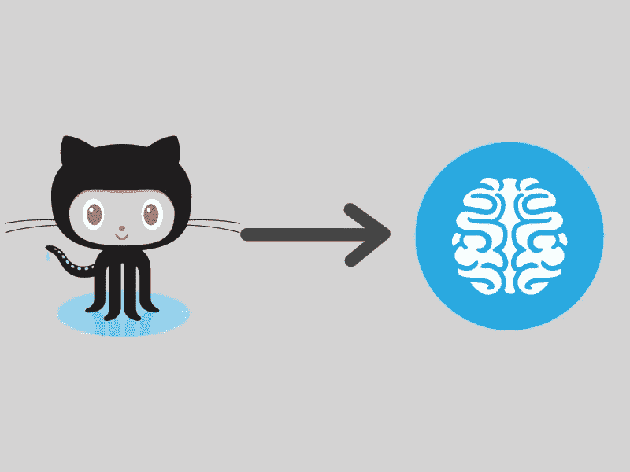

# 修改流行的库如何帮助你成为更好的开发者

> 原文：<https://www.freecodecamp.org/news/how-modifying-popular-libraries-can-help-you-become-a-better-developer-4fbdd7d88228/>

by Kristoffer Andreasen

# 修改流行的库如何帮助你成为更好的开发者

在过去的几年里，我一直在学习额外的技能。特别是在计算机科学领域。在其中的一些技能中，我已经获得了足够的能力来交付具有相应质量水平的产品。然而，我的大部分语言探索都没有什么用处。

就获取知识而言，我学到了一些重要的经验。今天，这些方法的应用并没有带来快速的学习过程，而是带来了更加一致的学习过程。

#### 方法

在我的旅程中，最令人惊讶的经历之一是 CSS 库的创建。在这种情况下，我创建了一个小型的动画库。在我开始之前，我就知道 [Animate.css](https://daneden.github.io/animate.css/) 已经成为动画事实上的标准。这并没有让我在开始这个项目时三思。这样做的原因是，我并没有打算去创造一个世界各地的开发者都可以使用的东西。我开始学习 CSS 中的动画世界。

我读过许多教程，它们都很好地介绍了这个主题。缺点是我的方法。因为只是阅读材料时经常发生，我很难将这些技巧应用到我的项目中。这就是我决定查看 Animate.css 源代码的地方。

我的动画不像 Animate.css 和其他动画项目那样适用于现实世界的问题。它大多只是显示在顶部的动画上，这些动画显示在网站上对用户体验没有帮助。然而，它确实让我对 CSS 动画的不同概念有了坚实的理解。我现在在我所有的项目中都在一定程度上使用它。

> 如果你真的想学，就把手弄脏。尝试不同的值，观察结果如何变化。这才是真正让你记住的。

除了学习 CSS 动画的基础知识，我还利用这种情况来熟悉 Git 和 Github 页面。这篇文章的标题是如何在 Github 上创建合适的文档并设置项目页面。此外，这让我有机会考虑在项目页面上显示动画的最佳方式。

#### 该项目

点击图片查看 Gitub Repo 和项目页面。请随意分享或贡献，但我鼓励你创造自己的。

Github Repo and Project Page

感谢您阅读我关于通过修改现有库来学习的故事。这只是继续学习过程的另一种方式。我还没有尝试用 JavaScript 修改库，这将是我的下一个项目之一。一旦我对这门语言有了更好的理解，我就迫不及待地想去学它。

快乐学习！