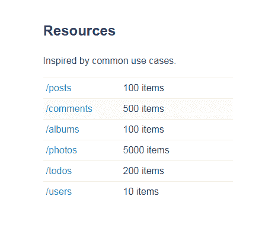
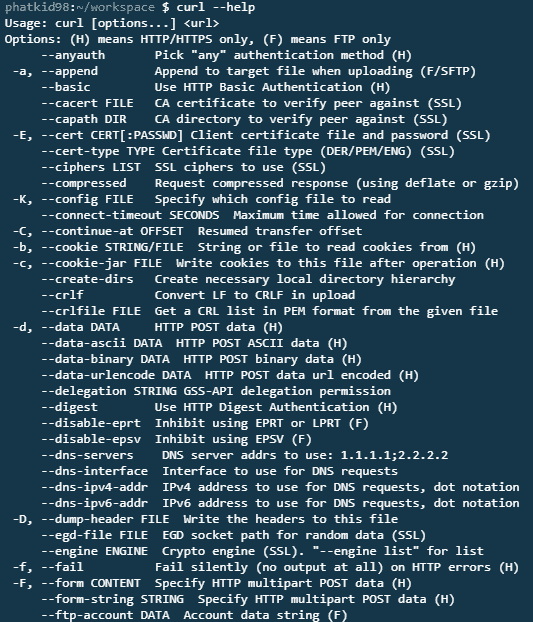
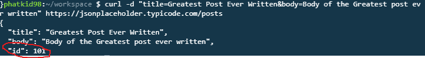
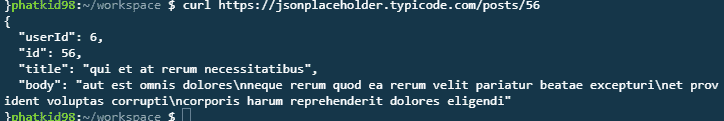
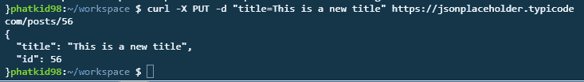

# 你能卷曲多少？一个有用工具的快速简单介绍。

> 原文：<https://www.freecodecamp.org/news/how-much-can-you-curl-3c88e2fed3f6/>

米格尔·布斯塔曼特

# 你能卷曲多少？一个有用工具的快速简单介绍。


心情好的时候，我可以弯曲 20 磅的重物…两次。大概吧。但那不是我们正在谈论的冰壶类型！

另一方面，Curl(或 curl)是一个通过 URL 传输文件和数据的小而强大的工具。在小范围内，它非常适合测试 REST APIs。而且，虽然大多数 web 开发人员可能会选择使用其他工具，如谷歌的 [Postman](https://chrome.google.com/webstore/detail/postman/fhbjgbiflinjbdggehcddcbncdddomop?hl=en) ，cURL 是在命令行中完成的，可以让你感觉像一个真正的计算机黑客，拥有大卫·莱特曼一样的技能(对于你的“战争游戏”粉丝来说)。

CURL 代表“客户端”和“URL”，因为它是一个运行在客户端的程序，向 URL 发出 HTTP 请求。既然是开源的，你可以在这里下载[。或者如果你已经在你的机器上安装了](https://curl.haxx.se/) [Gitbash](https://git-scm.com/downloads) ，它会被自动包含进来。

出于这个快速介绍的目的，我们需要一个允许我们发出请求的服务器，看起来 [JSON 占位符](https://jsonplaceholder.typicode.com/)很好地满足了我们的需求。这是一个假的 REST API，即使我们的请求实际上不会改变服务器的数据库，它仍然会给我们适当的响应。所以继续打开控制台，让我们开始黑吧！

### **获取**

首先，我们将尝试一个简单的 HTTP“get”请求。向下滚动到 JSON 占位符中的“Resources”部分，让我们看看可以请求的对象类型。



Objects to be requested

不错！我们可以通过添加“/”来调用这些对象，然后在 URL 中添加我们想要的对象。这一行右边的数字告诉我们这个请求将返回多少个项目。首先，让我们请求一些用户。在控制台中键入以下行:

```
curl https://jsonplaceholder.typicode.com/users
```

您应该看到我们承诺的所有十个用户都是 JSON 对象。但也许我只是想要第五个用户。我们将在 URL 后面添加“/5”来获取 id 为 5 的用户。

```
curl https://jsonplaceholder.typicode.com/users/5
```

我们看到第五个用户的 JSON 对象。很好，让我们试着向服务器发送一个用户。

### **发帖**

“提交”是向服务器提交数据并将其保存在数据库中的过程。为了用 cURL 做到这一点，让我们看看它的选项。类型:

```
curl --help
```

您应该会得到一些我们可以在终端中使用的很酷的选项:



Options for cURL

出于我们的目的，看起来“-d”或“-data”选项会很好地工作。如果我们回头看看占位符的主页，在“Routes”部分，它告诉我们可以向“[https://jsonplaceholder.typicode.com/posts](https://jsonplaceholder.typicode.com/posts)”发出发布请求。有了这些信息，我们将通过控制台发布我们自己的对象:

```
curl -d "title=Greatest Post Ever Written&body=Body of the Greatest post ever written" https://jsonplaceholder.typicode.com/posts
```

现在您将看到这个帖子在数据库中被“创建”，它的 id 为 101。



### **更新**

有时我们需要改变数据库中的对象。我们只能改变已经保存在数据库中的东西，由于这是一个假的 REST API，我们的帖子实际上并没有被保存。因此，让我们更新一个现有的职位。56 号怎么样？类型:

```
curl https://jsonplaceholder.typicode.com/posts/56
```

你会看到:



Post 56

它保存了一些时髦的文本，我们可能应该把它们改成更容易理解的。我们需要一些其他的选择来指挥这里。首先，我们需要告诉 cURL 这是一个“put”请求。所以当我们查看我们的"- -help "选项时，似乎我们可以使用"-X "来告诉 cURL 我们想要使用" PUT "命令。

那么我们仍然希望对我们打算使用的新数据使用“-d”选项。让我们把这些拼凑起来。类型:

```
curl -X PUT -d "title=This is a new title" https://jsonplaceholder.typicode.com/posts/56
```

就这样，我们把 id 为 56 的帖子的标题改成了我们想要的。



New title for post 56

### **删除**

现在我们来删除。啊，删除。如果其他方法都失败了，那就全部摧毁它！我们将看到一些与 PUT 命令中相同的代码，但是我们只需要给 cURL 一个删除请求和我们要删除的文章的 URL。

```
curl -X DELETE https://jsonplaceholder.typicode.com/posts/56
```

请注意，除了换行符之外，您没有得到任何回报。也许在某些游戏机上你会看到和空散列(" {} ")。这表明没有要返回的内容，因为它已被删除。

### 包扎

我们只是在非常肤浅的层次上触及了一些 cURL 命令。这是一个简洁的工具，在你的应用程序中进行全功能的 API 集成时会很有帮助。我建议看一下[手册](https://curl.haxx.se/docs/manual.html)进行进一步的阅读，并尝试不同的选项，看看哪些可能适合你的需求。