# 你的软件即服务工具应该收费多少？

> 原文：<https://www.freecodecamp.org/news/how-much-should-you-charge-for-your-software-as-a-service-tool-45595f49a990/>

亚历克斯·莫斯科夫斯基

# 你的软件即服务工具应该收费多少？为了找到答案，我分析了 1530 种产品的价格。

确定软件即服务产品的正确定价需要时间。从长远来看，即使是一个小小的错误也会让你损失一大笔钱。

我不能高估探索你周围的市场和了解你所在领域的定价的重要性。好消息是我已经为你做了很多这方面的研究。

这组图表基于 1，530 种 SaaS 产品的当前价格，可以让您很好地了解垂直市场的价格分布情况。

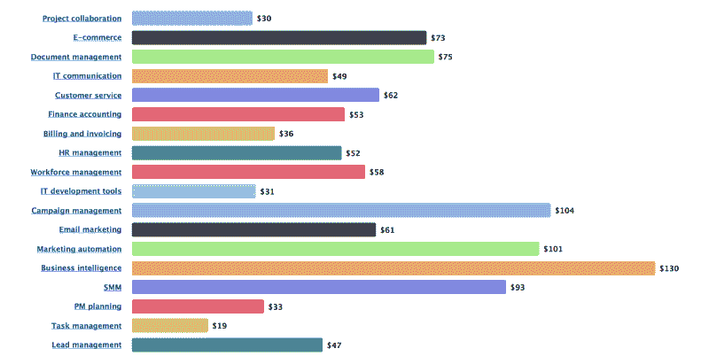

SaaS starter prices distribution by niche

当我试图为我的 SaaS 网络服务想出正确的价格时，我从分析我的直接和间接竞争对手的最低价格开始。收集完数据点后，我将它们绘制在图表上，并在那里寻找峰值。峰值意味着这里有一个独特的价格段，这反过来意味着需求的存在。

顺便说一句，在应该有刺的地方没有刺可能意味着有机会进入利基市场。

这是我的团队通过访问各个软件目录类别中的每一个 SaaS 收集到的信息。

首先，简单介绍一下这些数据是如何收集的。

我们有来自几个软件目录的 SaaS 网络服务列表。通过仔细检查清单上的每一件商品，我们找到了每件 SaaS 的最低价格。然后我过滤掉免费服务和费用超过 500 美元的服务，把数据放到图表上。

### 项目协作工具

178 个数据点，平均最低价 30 美元。

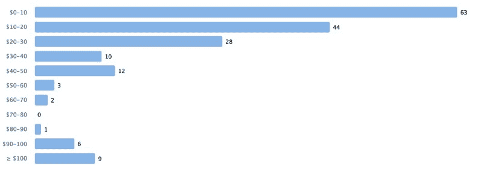

### 电子商务工具

120 个数据点，平均最低价 73 美元。

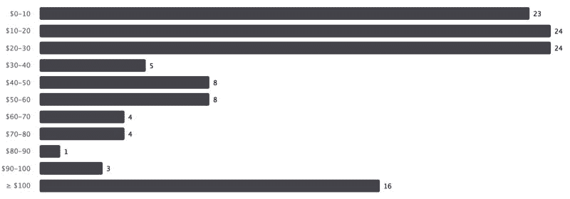

### 文档管理工具

94 个数据点，平均最低价 75 美元。

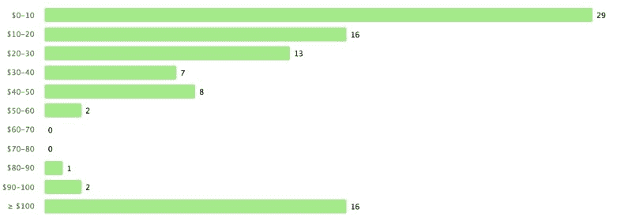

### IT 通信工具

148 个数据点，平均最低价 49 美元。

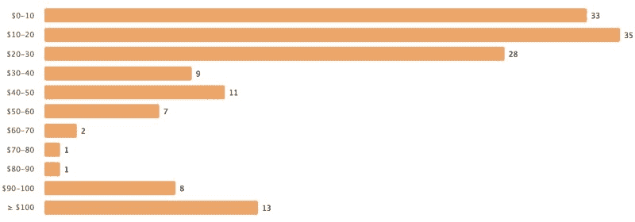

### 客户服务工具

97 个数据点，平均最低价 62 美元。

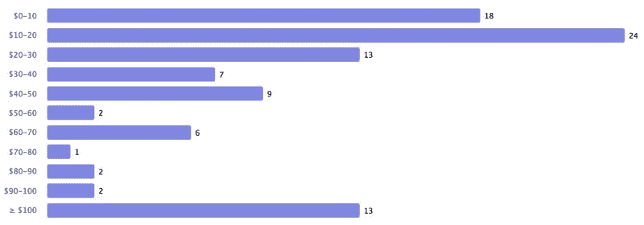

### 财务会计工具

80 个数据点，平均最低价 53 美元。

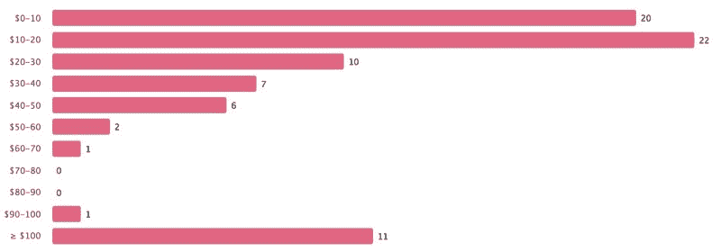

### 计费和发票工具

107 个数据点，平均最低价 36 美元。

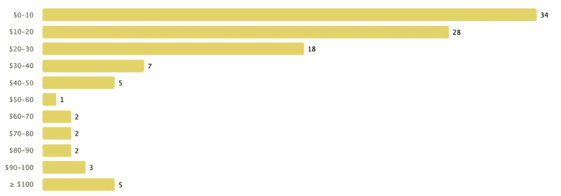

### 人力资源管理工具

113 个数据点，平均最低价 52 美元。

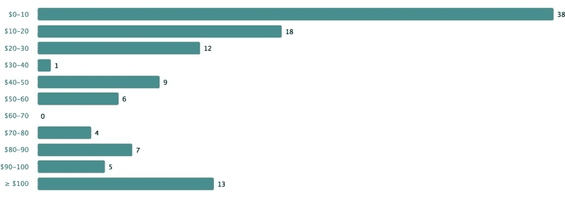

### 劳动力管理工具

54 个数据点，平均最低价 58 美元。

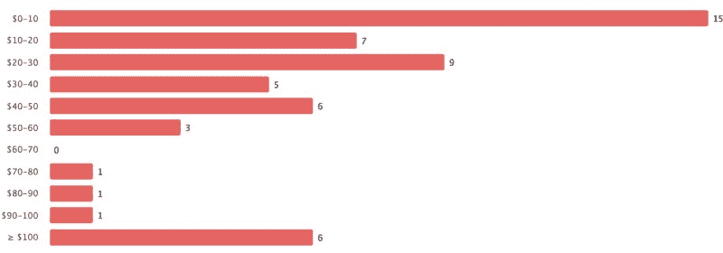

### IT 开发工具

138 个数据点，平均最低价 31 美元。

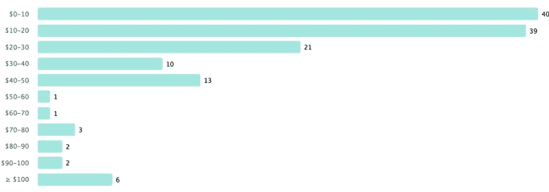

### 营销活动管理工具

90 个数据点，平均最低价 104 美元。

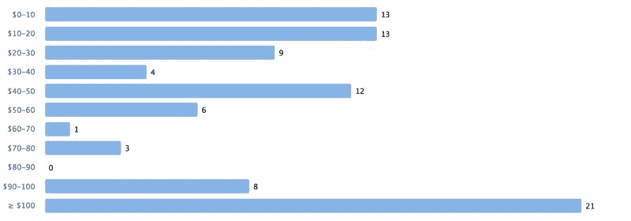

### 电子邮件营销工具

67 个数据点，平均最低价 61 美元。

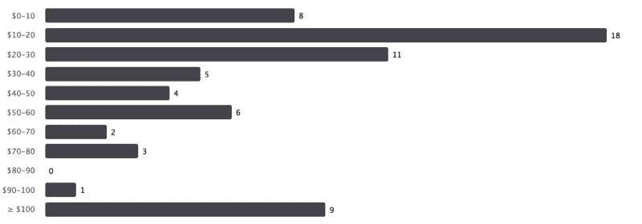

### 营销自动化工具

45 个数据点，平均最低价 101 美元。

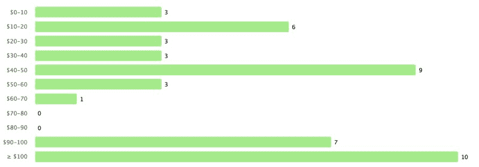

### 商业智能工具

55 个数据点，平均最低价 130 美元。

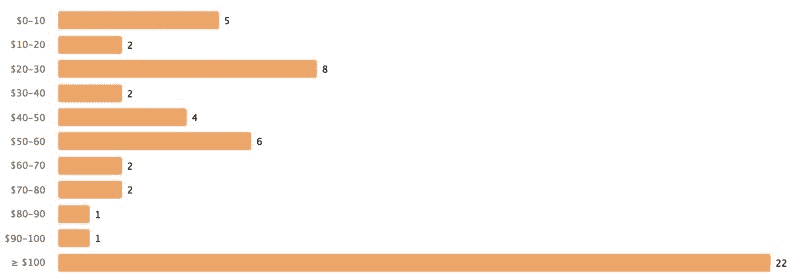

### 社交媒体营销工具

36 个数据点，平均最低价 93 美元。

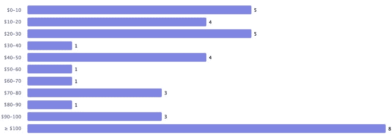

### 项目管理规划工具

41 个数据点，平均最低价 33 美元。

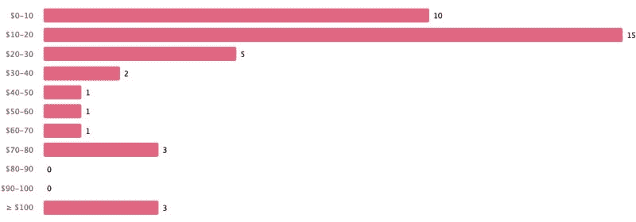

### 任务管理工具

13 个数据点，平均最低价 19 美元。

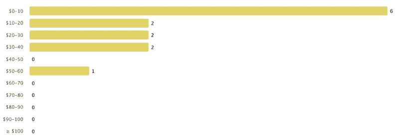

### 销售线索管理工具

54 个数据点，平均最低价 47 美元。

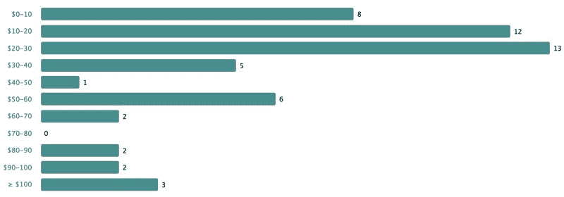

正确的价格分析是软件定价的第一步。虽然这些图表不是万灵药，但它们可以让你对价格的总体水平有一个概念，并帮助你找出如何向你的客户定价你自己的产品。

感谢阅读！随着我们逐渐收集更多的数据，我会试着更新这篇文章。