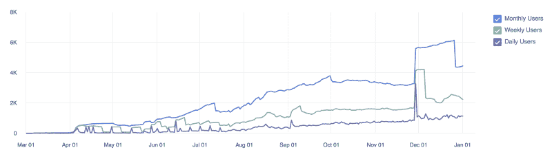
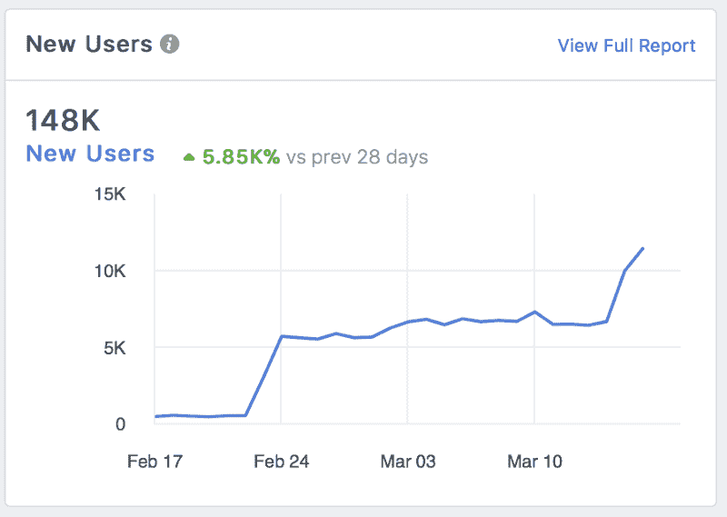
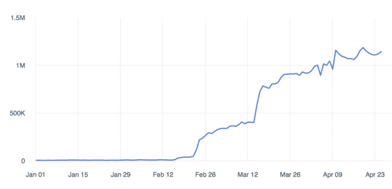

# 我的应用如何在一个月内增长超过 100 万用户

> 原文：<https://www.freecodecamp.org/news/how-my-app-grew-by-5-800-in-one-month-with-no-branding-or-marketing-d0bafb93108/>

阿萨夫·埃洛维奇

# 我的应用如何在一个月内增长超过 100 万用户

#### 所需要的只是这种简单的每周一次的方法和耐心。

作为一名企业家，打造和推广一种新的消费品是你能做的最具挑战性的事情之一。虽然有很多方法可以设计、测试、构建和推广应用程序，但通常它们似乎不会带来真正的效果。

然后你开始怀疑，也许是产品的问题？可能是市场契合度不够？还是执行力不好？或者我们应该增加营销和品牌预算！也许我们没有瞄准正确的观众？也许我们应该建立更多的功能！

当你开始质疑一切时，事情通常会变得更糟。你开始偏离主要目标，开始在各种各样的方法上浪费精力和金钱。

最糟糕的是当你认为这只是增加营销或品牌预算的时候。

你的目标应该永远是一个:**提高客户保持率**。对于那些不熟悉什么是客户保持的人，[点击这里](https://en.wikipedia.org/wiki/Customer_retention)。

#### 案例研究:留住客户的重要性

为了说明我的观点，我将让你知道我从我的一个朋友那里听到的一个故事，他是一家非常成功的生产力 B2C 公司的联合创始人兼首席技术官。

2012 年，他们向 Android 谷歌商店发布了他们应用的第一个版本，一件疯狂的事情发生了。在发布后的几天内，全球已有 50 万用户下载了该应用。这种疯狂增长的原因主要是因为当时在生产力领域没有好的应用程序。在接下来的几个月里，他们发展到了几百万用户，并从风投那里筹集了超过 500 万美元。

然而，四年后，他们仍然无法达成一个像样的商业模式。他意识到，尽管数量庞大，但真正长期使用该产品的用户非常少。

于是他决定深挖数据，寻找原因。他发现保留率非常低。更糟糕的是，他发现这四年来并没有多大改善！这时候，他突然意识到要专注于留住用户，而不是用户增长。

当时，风投公司向用户增长巨大的公司投入了数百万美元，因为他们不知道如何应对或衡量移动应用商店和网站带来的疯狂规模。

今天情况不同了。为了在 B2C 中筹集资金，你需要做的第一件事就是显示出留存率的增长。这是有充分理由的。

回到我朋友的故事:没有留存，有多少用户下载了他们的应用程序并不重要。一周后，95%的用户停止使用该产品。因此，即使他们有十亿用户，几周后在他们的数据库中也只是一个数字。

这里有一个想法:如果你有 10 万用户每天使用你的产品，它比 1 亿用户每月使用你的产品有价值 100 倍。

最重要的是，一旦你达到一个体面的保留率，你可以肯定你的营销预算将导致你的产品和业务的可持续增长。

### 精益启动方法

太多的创业公司都是从他们认为人们想要的产品创意开始的。然后，他们花几个月，有时几年的时间来完善产品，却从来没有向潜在的顾客展示过产品，即使是最基本的形式。这就是精益创业公司的用武之地。

简而言之，精益创业是一种方法论，它假定每一个创业都是一个宏大的实验，试图回答一个主要问题——“这个产品应该被制造吗？”

精益启动方法的核心组成部分是[构建-测量-学习反馈循环](https://www.mindtools.com/pages/article/build-measure-learn.htm)。

第一步是找出需要解决的问题，然后开发一个最小可行产品(MVP)来尽快开始学习的过程。

一旦 MVP 建立起来，一个新公司就可以开始调整引擎了。这将涉及测量和学习，并且必须包括可以证明因果问题的可操作的度量标准。

每当我和我的团队在开发一个产品时，我们都会采取以下步骤:

1.  定义最重要的产品假设
2.  设计并构建一个 MVP，说明如何测试这一假设
3.  瞄准早期采用者来测试 MVP
4.  应用测试结果
5.  重复

这是我们在迭代的第一年(2017 年)的增长情况:

User activity from March 2017 to January 2018

缓慢但肯定是对的？现在让我们一起来看一个例子，看看经过足够的迭代后会发生什么。

### 该过程

#### 定义最重要的假设

我将以我的团队为例。我们认为没有人们真正喜欢使用的像样的提醒应用程序。在我们看来，主要原因是设置一个单一的提醒有很多摩擦。要么你需要在移动应用程序上填写一个长表格，要么自然地询问 Siri 这样的助手——意识到她不理解你 50%的请求。

所以那时我们定义了我们最重要的产品假设:如果我们能够用自然语言理解几乎每一个提醒请求，用户就会长期使用这样的产品。

#### 设计并构建一个 MVP

由于我们的假设集中在 NLU(自然语言理解)，我们决定只关注它。没有品牌，UX，或其他功能。

首先，我们聘请了数据科学家来构建最先进的 NLU 算法，用于理解复杂的提醒请求。

其次，因为我们验证的只是这个假设，所以我们决定在 Facebook Messenger 上构建一个聊天机器人 MVP，而不是经历构建移动应用程序的漫长而恼人的过程。

**请注意**:如果我们要开发一个移动应用，这不会增加任何测试我们假设的东西，而且会使我们的 MVP 更长，设计和开发更复杂。此外，它甚至可能使我们偏离主要假设。比如用户就是不喜欢再用新 app 了怎么办？我们可能已经得出结论，我们的假设是错误的，即使是出于完全不同的原因。

尽可能缩小你的 MVP 很重要，这样就不会有干扰你的主要假设。

#### 锁定早期采用者

我们需要会说英语的人，因为我们的 NLU 算法只支持它。此外，我们认为千禧一代的妈妈们会急切地想要这样的产品，因为她们总是在移动，非常忙碌，同时不断需要记住一些东西。因此，我们瞄准了一些基于妈妈社区的脸书页面(没有预算)，并成功地吸引了数百名测试人员进行测试。

#### 将测试结果应用于产品

在我们的第一次迭代之后，我们学到了以下内容:

1.  请求提醒的方式比我们想象的要多得多。但是用户真的很享受通过一个简单的请求来设置提醒的便利。
2.  用户并不总是在单个请求中要求提醒，而是把它分成几个步骤。
3.  当使用聊天机器人时，用户希望有按钮的帮助，以使操作更快更容易。

有了这些结果，我们进行了优先排序，并继续我们的下一个假设，即在设置提醒的流程中添加按钮(结论三)。你猜怎么着？这个假设也被证明是正确的。关于更多被证实的假设，你可以阅读我关于如何改进你的聊天机器人的文章。

渐渐地，我们每周都在提高我们的整体产品和保留率。

我们从来不会一次解决一个以上的假设。

突然，我们开始发现和我们在一起超过六个月的用户！经过一年的每周迭代，我们最终决定是时候推出我们的产品了。我们在第 1 周达到了 92%的保留率，在第 4 周达到了 19%。这远远高于市场标准，这对我们来说已经足够了。

我们于 2018 年 2 月中旬在 FB Messenger 上发布了我们的聊天机器人，一个月内我们的增长超过了 5，800%，如下图所示。

Daily new users from Feb 17 to March 17

这主要是因为我们提供了一种精益产品，我们知道人们喜欢这种产品，并且会推荐给其他人。从那时起，我们在全球的用户已经超过 100 万，并且每天还在增加数万名用户。

Total user growth from Jan 18' to May 18'

我们将继续使用这种方法，事实证明它每天都很成功。

此外，我们试图做出尽可能多的**数据驱动决策**。尝试收集用户数据以改善用户体验，在没有确定答案的情况下做 **A/B 测试**。例如，如果你不确定一个按钮应该放在哪里，或者哪个标题会吸引更多的点击，试着把它放在一半用户的一边，另一半放在另一边。然后，看看哪个位置导致更多的点击。

### 最后的想法

这种方法不仅可以帮助我们专注于用户想要的最重要的功能，还可以帮助我们筛选出我们认为有价值但实际上没有价值的功能。

正如他们在客户服务中所说:客户永远是对的。产品开发也是如此。相信你的客户，倾听他们，与他们互动，你就会明白他们想要什么，不想要什么。除非是为了挑战你的假设，否则永远不要凭你自己的直觉来建造东西。在这条路的尽头，你会得出两个结论之一:

1.  产品没有足够的市场契合度，**该继续前进了**。
2.  你有人们想要的产品。干得好，你正在创建一家公司！

不管怎样，你都赢了。

非常感谢你的阅读，如果你觉得这有用，请给我一些掌声？？？所以更多的人可以看到。更多文章，请访问我在 afelovic.com 的科技博客。如果你有任何问题，欢迎在下面的评论中给我留言！