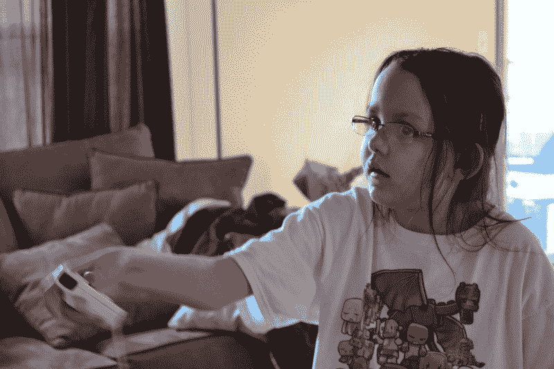
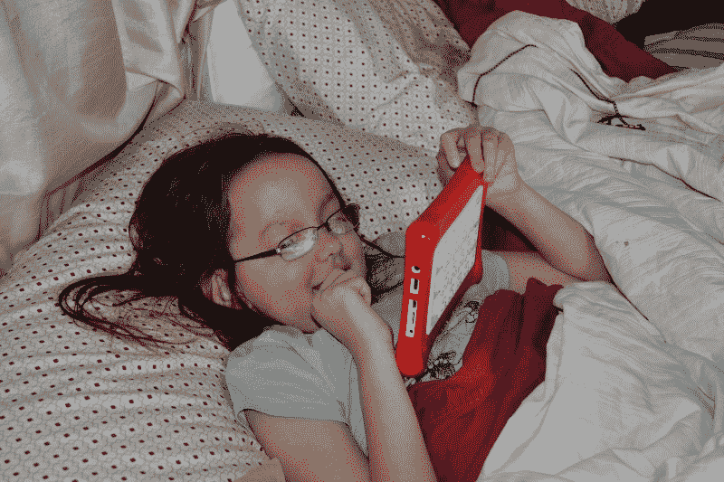
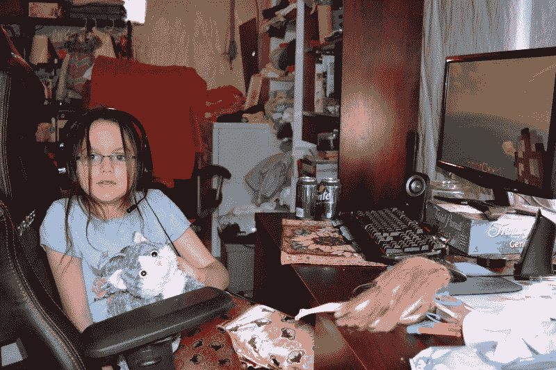

# 我女儿是如何教我无障碍的

> 原文：<https://www.freecodecamp.org/news/how-my-daughter-taught-me-about-accessibility-898354103d52/>

作者德鲁

# 我女儿是如何教我无障碍的

#### 在过去的几个月里学习编程是一次大开眼界的经历。我痛苦地意识到，当面对似乎无穷无尽的技术和概念时，即使是最简单的事情也需要学习。

当我终于开始掌握基本但必要的“如何”学习部分时，我也开始思考“谁”和“为什么”。我已经了解到，谁将会使用我正在创建的程序或网站，以及他们为什么需要它，这些都是在试图做出有用的东西时需要考虑的。

最近的一个启示让我真正关注了一些事情，并且无疑将在我继续走这条编程道路的时候塑造我的一些重点。

首先是一些背景故事。我是两个了不起的年轻女孩的父亲，其中一个生来就患有脑室周围白质软化症。她的情况有几个相关的挑战，即认知延迟，视力不佳，一些精细运动问题，语言障碍以及癫痫发作。虽然她的症状被认为是轻微的，但她的主要问题是她的精神功能。

她像一个小很多岁的孩子一样思考和行动。八岁时，她还在努力识别字母和数字。尽管她面临种种挑战，但她有着强烈的独立倾向和令人羡慕的干劲。她不想听到她不能做她姐姐正在做的事情。不管我们认为她有什么能力，她都会去尝试，并且经常通过不断的努力，用她自己能够解决的事情给我们留下深刻的印象。

最近，我和妻子在地下室用电脑工作时，我们开始从显示器上听到她微弱的声音。“摇滚乐队”她说。有一个停顿。“摇滚乐队”我们又听到了。我上楼去看她在做什么，发现她藏在我的床罩下玩她的平板电脑。

我问她在忙什么，她以自己特有的方式回答道:“没什么。”我走过去自己看，我注意到她在 Youtube 上看游戏摇滚乐队(我们喜欢一起玩的东西)的视频。不用说，我印象深刻。她不能读或写，但她能够在搜索栏中找到麦克风图标，并使用它来调出她想要的任何内容。

除了和妻子分享我所看到的，那天晚上剩下的时间里我没有花太多时间去想它。

几天后，我再次来到我的电脑前，但这次她就坐在我旁边，用我妻子的电脑玩《我的世界》。这次我有机会更仔细地观察她，印象不亚于以前。

她点击了谷歌 Chrome 图标，进入默认主页，再次点击麦克风图标，搜索“玩具”。就在那时，无障碍的概念像一辆卡车一样击中了我。

在这个发现的美妙时刻，我已经学会了来自打破障碍的力量，并为某人打开了一个世界，这个世界以前只为那些足够幸运拥有某些特殊能力的人保留。

在我听到的对话中，当无障碍被提起时，它通常围绕着视觉障碍。对我来说，最有教育意义的是看到它在一个完全不同的环境中上演。我心想，“如果这是可以帮助人们克服他们的局限性的东西，那么外面还有什么呢？”

我最近发现的一个非常好的资源是 A11y 项目。该项目标榜自己是“一个社区驱动的努力，使网络无障碍更容易”。它的目标是教育开发者关于无障碍网页设计的“最佳实践”。它不仅解决了实际操作的问题，还解释了这种需求有多普遍。

列出的四个主要无障碍领域是视觉、听觉、运动和认知。有趣的是，我发现我自己的女儿属于这四大类中的三类。当你真正开始研究以某种方式受到限制因素影响的人群时，你会意识到可访问软件的影响力有多大，无论是在网站上还是在原生应用程序上。

许多我们从未考虑过的软件“用户”每天都在互动，甚至依赖于它的存在。如果我们忽视这些需求，我们就切断了大量想要——甚至可能需要——与我们创建的网站和程序互动的人。

随着研究的进展，我现在对可访问性的概念产生了浓厚的兴趣。我很幸运，因为我只需瞥一眼我的小女儿，就能直接看到无障碍软件所能提供的力量和自由。

我想不出比承诺给最需要的人的生活带来真正的改变更好的激励来关注可访问性。

*最初发布于[thecodinghyrax.wordpress.com](https://thecodinghyrax.wordpress.com/2016/04/07/how-my-daughter-taught-me-about-accessability/)2016 年 4 月 7 日。*