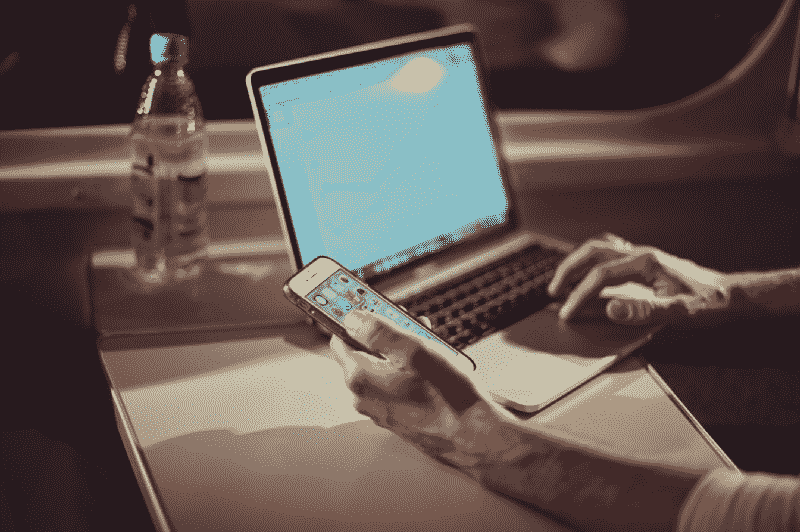
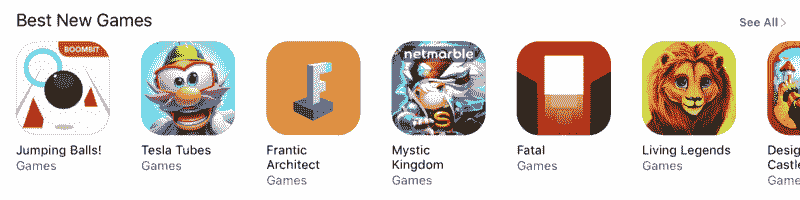
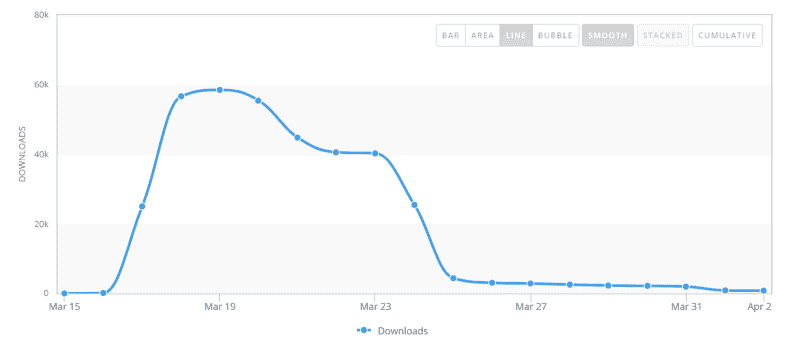
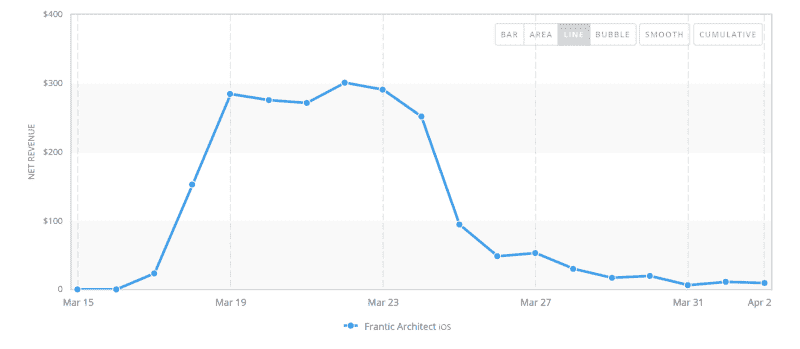
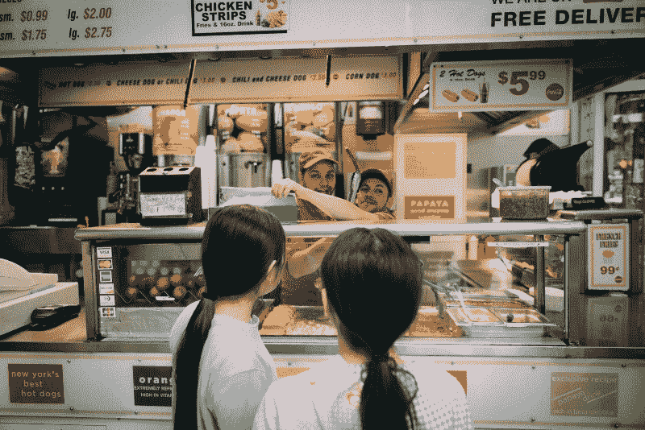

# 我的手机游戏如何在两周内获得 365，000 的应用商店下载量(以及我为什么退出独立游戏开发…

> 原文：<https://www.freecodecamp.org/news/how-my-mobile-game-got-365k-app-store-downloads-in-2-weeks-and-why-i-quit-indie-game-dev-a3ebd1fa3229/>

威廉·关

# 我的手机游戏如何在两周内获得 365，000 的应用商店下载量(以及我后来退出独立游戏开发的原因)

我不是一个成功的游戏开发者。我最受欢迎的游戏*狂乱建筑师*，在从应用商店下架之前只有 410，678 次免费安装；没有什么比得上*和 *2048* 这样的电影。*

但我当时 21 岁，有着非传统但值得尊敬的游戏背景，并且用相对较少的努力自己开发了这个游戏。这看起来是我独立游戏开发者生涯的完美开端。

相反，我辞职了。

《疯狂的建筑师》已经出版一年半了。科技领域的事情变化很快，我不会花太多时间去反思被放弃的投资。但现在浏览 App Store，我看到休闲手机游戏开发商用我当时使用的策略获得了成功。我怀疑几年后它还能工作，但是现在它能，而且非常简单(不是说它容易)。

你甚至不需要我几年的游戏编程和设计经验。如果你的目标是快速开发一个移动应用程序，你不在乎它是什么样的应用程序，你想用可复制的方法快速获得大量用户，而不需要在广告上花费大量金钱，那么休闲移动游戏利基是适合你的。

我没有兴趣重复这个实验，因为我认为这是一个糟糕的商业模式。也许你能证明我是错的。

2016 年 3 月 17 日

我从大学宿舍的床上爬起来，查看我的 Skype。一周前，我的游戏已经提交给苹果公司审核，我知道它随时都可能上线。我当时在多伦多，我的产品经理在巴黎，所以我已经养成了一觉醒来就会收到大量信息的习惯。

我记得读过一些祝贺我的游戏被苹果公司在全球推广的消息。我打开我的 iPad，打开应用程序商店。果然，*狂乱的建筑师*坐在那里作为最佳新游戏。

几天后，我获得了分析数据。第 4 天是我最好的一天，有 58，486 次下载。

两周前，下载量已经急剧下降。我并不太失望，因为一开始我并没有想到会有这么大的用户量。在我工作/拖延的 6 个月里，除了我从当时最成功的休闲手机游戏发行商之一 BulkyPix 那里获得了一份合同之外，几乎没有人告诉我这款游戏会有多好。

然而，考虑到下载量，我对广告收入并不满意。

I didn’t have any in-app purchases besides a one-time payment to remove the ads, and this generated very few sales (as expected), so I was relying on interstitial and video ads for the bulk of the revenue.

这是第一个警钟，让我怀疑我是否应该继续这样做。发布时最初的流量峰值远远不足以产生可居住的收入，我不想不断推出新内容来保持我的游戏的相关性，因为我认为游戏一开始就不是很好。更重要的是，我甚至不知道玩家会想要什么样的内容。

我的第一批用户是通过 App Store 功能发现这款游戏的，这使得这款游戏在 100 多个国家登上了排行榜，下载量也随之增加。但是我不知道这些人是谁，也不知道他们为什么对我的游戏感兴趣。据我所知，他们只是碰巧下载了它，因为它就在他们面前。

事实证明，我的游戏不是摇钱树是一件好事，因为几个月后，BulkyPix 宣布破产，我一分钱也没拿到。我很生气，但这不是我离开独立游戏的原因。我需要产生可靠的收入，但是我无耻地从其他游戏中抄袭的方法是有缺陷的。

整个策略依赖于让你的游戏成为苹果或谷歌的特色。如果你只是将一款休闲手机游戏发布在互联网上的任意位置，它不会在每月发布的数千款游戏中脱颖而出。

为了获得特写，你需要联系他们的编辑团队。你可以尝试发送大量电子邮件和 LinkedIn 联系，试图找到一个内部联系人来推销你的游戏(我从未这样做过，但我想这值得一试)，但大多数顶级休闲手机游戏开发商所做的是向知名发行商推销他们的游戏。这些出版商定期与苹果和谷歌的编辑团队会面，并亲自向他们推销你的游戏。如果你的游戏和我的游戏一样平庸，他们的关系和声誉是你获得商店首页令人垂涎的位置的最佳方式(我假设你的游戏也好不到哪里去，否则你不会制作休闲手机游戏)。

为了让你的游戏通过发行商，你需要向他们推销一款既适合他们的产品组合，又有独特卖点的游戏。如果他们接受你的游戏，他们将处理所有的商业事务，以换取大部分的收入和知识产权，而你只需专注于让游戏变得更好。

总体战略可以分为 5 个步骤:

1.  梳理 App Store 和 Google Play 上的热门游戏和特色游戏，寻找制作起来非常简单的游戏。当我写这篇文章的时候，主要的候选游戏是像 *Fire Up！*和*扣篮*。
2.  找到这些游戏背后的发行商，并寻找那些与许多不同开发商合作过的发行商。在他们的游戏组合中寻找模式。一般来说，他们都有很短的游戏时间和简单的机制。这些发行商之间在接受什么方面没有太大的区别，所以如果其中一个喜欢你的游戏，很可能会有其他人也喜欢它。
3.  快速制作原型。除了核心的游戏循环，不要编写任何代码，保持图形简单。只要你有一个独特的卖点，抄袭其他游戏没问题。这通常是一种机制，但是如果你有艺术天赋，你也可以用一种有趣的方式来改变现有的游戏概念。
4.  将可玩版本发送给你之前研究过的所有发行商。保持你的电子邮件简短。不应该用一句话来描述这个卖点。
5.  签合同，完成游戏。你可能还得制作广告和描述等销售材料。特别注意你需要提交给苹果和谷歌的图形。

我的前三个游戏普遍遭到拒绝，但这只是几百个小时的工作损失，如果我没有爱上前两个游戏并不断为它们添加功能，尽管事实上它们被我展示的每个出版商忽略/传递，我可以将这减少到几十个小时。不要那样做。迅速废弃你被拒绝的游戏，减少你的损失。休闲手机游戏应该很容易制作，所以重新开始往往比重复一个无聊或破损的设计要快。

当我说你的出版商会处理商业事务时，我的意思是他们会最大化你被报道的机会。你可能会认为还有其他营销渠道可以帮助他们。有，但主要是向许多游戏和科技相关的新闻/评论/社交媒体网站发送销售材料。如果你的游戏是另一款休闲手游，那就没什么冲击力了。为了说明这一点，Google Play 版的《疯狂建筑师》总共只有 3817 次下载。它被提交到与 iOS 版本相同的网站(我不知道所有这些网站是什么，但你可以在谷歌上找到一堆)。它只是没有出现在 Google Play 上。

根据我的研究，似乎有所帮助的是发行商产品组合中不同游戏之间的交叉推广。基本上，你可以从发行商拥有的其他游戏中免费获得广告，而不是支付大量的广告费用。我没有狂乱建筑师下载来源的数据，但我怀疑 BulkyPix 曾经为我这样做。当我签合同的时候忽略这一点是一个错误，但这不会阻止游戏的死亡。

如果我必须描述为什么制作休闲手机游戏是一种愚蠢的赚钱方式，我会把它比作经营一个热狗摊。它有一个千篇一律的商业模式，即使食物很糟糕，顾客还是会来，因为它又快又方便。高端独立游戏开发商就像餐馆老板，他们提供美味的食物，但同样难以赚钱，因为竞争同样激烈。不管你是在经营餐馆还是热狗摊，当有很多其他地方可以去的时候，你如何说服别人来吃你的食物？

当然，一小部分人会成为成功的热狗摊和餐馆。但是，为什么不选择一个竞争较少的市场，一个你可以简洁地向你的客户解释为什么他们应该购买你的产品，而不是一个模糊的乐趣和满意度的承诺？

我仍然热爱游戏。我是在他们的陪伴下长大的，我可能会成为一名游戏玩家。但是如果我要制作另一款游戏，我不会把它当成一个生意。

我不太懂经营公司。自从疯狂建筑师之后，我已经放弃了多个其他项目，所以我甚至不认为这是一个特别痛苦的失败。但我不认为这是因为运气或更多的努力，我目前的公司[是一家生存技能游戏的游戏服务器提供商，下个月将超过*疯狂建筑师*的总收入，但它的用户群是数百人而不是数十万人，并且自一个半月前推出以来一直在稳步增长。我知道人们为什么需要我的服务，我可以相应地收费，我可以改进它，而不必胡乱猜测该做什么。](https://7d2dserverhosting.com/)

太多的人看着应用商店顶部的应用，错误地认为那些是最成功的。但是目标客户比随机客户更有价值，了解这一点的企业值得学习，即使他们不在聚光灯下。