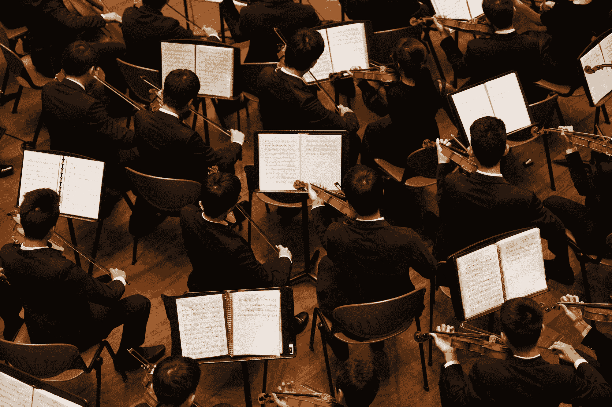

# 我的音乐训练如何帮助我学习如何编码

> 原文：<https://www.freecodecamp.org/news/how-my-musical-training-helped-me-learn-how-to-code/>

你可能会想，音乐和学习如何编码有什么关系？

作为一名专业的双簧管吹奏者，我注意到学习音乐和学习编程有很多相似之处。

两者都需要大量的专注、纪律和毅力才能变得伟大。

以下是我的音乐训练如何帮助我专注于学习如何编码的一些例子。

## 只要完成它

Photo by [George Pagan III](https://unsplash.com/@gpthree?utm_source=ghost&utm_medium=referral&utm_campaign=api-credit) / [Unsplash](https://unsplash.com/?utm_source=ghost&utm_medium=referral&utm_campaign=api-credit)

回到大学，有几次我没有为我的课程、排练或考试做好准备。

我没有为自己准备不足负责，而是找借口，比如:

> "我正忙于准备音乐理论考试，这就是我无法备课的原因。"

或者

> "我有一个重要的试镜即将到来，所以我正忙于准备."

无论我当时有什么借口说我没有准备好，我的双簧管教授都不相信。他总是相信一天中有足够的时间来练习、学习和参加一点社交生活。

所以，他经常会扔下那句著名的耐克口号，“只管去做。”

对此我总是会得到一点嘲笑，但他说得很有道理。

作为一个自学成才的程序员，身边无时无刻不有那么多杂念。你很容易会有这样的想法，

> "我真的应该多做一些算法练习，但也许明天."

或者

> "我真的应该开始那个新项目了，但是我真的很忙."

生活中大多数人没有 24 小时不间断的自由时间去做我们想做的任何事情。总会有一些事情出现，我们只需要处理它。

残酷的现实是，我们必须保持纪律性来完成我们的工作，这样我们才能成为更好的程序员。

所以当你要为拖延找另一个借口时，记得无论如何都要完成它！

## 熟能生巧，不是吗？

Photo by [Samuel Sianipar](https://unsplash.com/@samthewam24?utm_source=ghost&utm_medium=referral&utm_campaign=api-credit) / [Unsplash](https://unsplash.com/?utm_source=ghost&utm_medium=referral&utm_campaign=api-credit)

我们都听说过这样一句话，“熟能生巧”。

嗯，这不完全正确。

我大学的双簧管教授总是不理会这句话，而是告诉我们“熟能生巧”。

每当我试图学习一首新曲子时，我都会因为它没有变得更好而感到沮丧。不管我练了多少次，还是一塌糊涂。

但是我很早就知道仅仅出现和练习是不够的。你必须聪明地练习。

所以我学会了如何把事情分解成小块，放慢节拍器的速度，并在那一段上工作，直到它是正确的。

一旦我改变了我的练习习惯，我开始成为一个更好的音乐家。

在学习如何编码的过程中，匆忙地完成一门课程不会让你成为更好的程序员。在某些情况下，你可能会养成一些坏习惯，以后很难改掉。

一次解决一个问题，慢慢解决，比匆忙解决所有问题要好。

如果你练习聪明，那么这些概念将开始变得更有意义。

## 一致性是关键

Photo by [XPS](https://unsplash.com/@xps?utm_source=ghost&utm_medium=referral&utm_campaign=api-credit) / [Unsplash](https://unsplash.com/?utm_source=ghost&utm_medium=referral&utm_campaign=api-credit)

我是那些 7 岁就开始学钢琴的孩子之一，在最初的几年里，我真的很喜欢钢琴。

但是一旦我开始练习更难的曲子，我就失去了练习的动力。

我的练习习惯很零散，结果也没什么起色。我的课最终完全白费了，因为我们只是一周又一周地重复同样的事情。

随着关于在家学习如何编程的大肆宣传，许多人带着最初的兴奋投入其中。他们将浏览教程，并从课堂上构建小项目。

但是几个月过去了，人们开始失去动力。

他们开始减少编码频率，最终失去兴趣并退出。

在学习如何编码时，你必须有一个一致的时间表，否则你永远不会成为程序员。

你将永远困在与基础的斗争中，永远无法构建更复杂的项目。

你不必每天投入 12 个小时才能成功。建立一个适合你的时间表。

如果你一天只有两个小时用于学习，那就坚持下去。

但是重复一天做 8 小时，然后休息两周的循环只会导致缺乏进步。

持之以恒是学好东西的关键。

## 实践你所不知道的

Photo by [Surface](https://unsplash.com/@surface?utm_source=ghost&utm_medium=referral&utm_campaign=api-credit) / [Unsplash](https://unsplash.com/?utm_source=ghost&utm_medium=referral&utm_campaign=api-credit)

在我大学三年级的时候，我们管乐团的指挥告诉了我们一些事情，从那以后我一直记着。

他说:“要有勇气去实践自己不懂的东西。”

我们大多数人都想在练习室练习我们知道听起来不错的音乐。对我们来说，这可能是一种让我们感觉良好并稍微打击一下自我的方式。

但是，我的指挥是对的。

如果你不挑战自己，克服自己的弱点，那么你永远不会成为一名音乐家。

作为一名初学程序员，你要学的东西太多了。只关注你喜欢的事情真的很诱人。

你想自我感觉良好，炫耀你所知道的，这是有道理的。但这并不能给你借口去忽略你不擅长的事情。

如果你知道你不擅长算法，就不要忽视它们。腾出额外的时间来解决它们，这样它们会变得更容易解决。

或者你正在和递归做斗争。它不会因为你不喜欢它而消失。

即使目前很难，你也必须有坐下来学习你需要学习的东西的纪律。

我希望你喜欢这篇文章。如果你想了解我更多，请在 twitter @codergirl1991 上关注我

编码快乐！