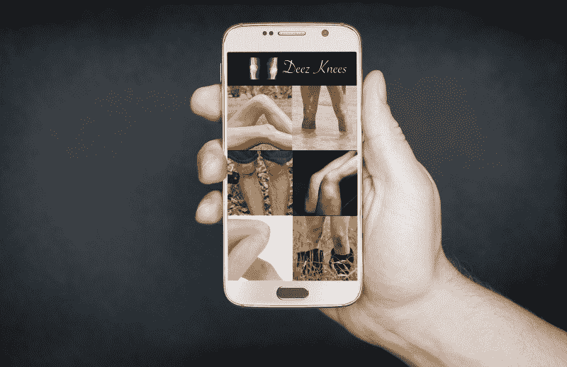
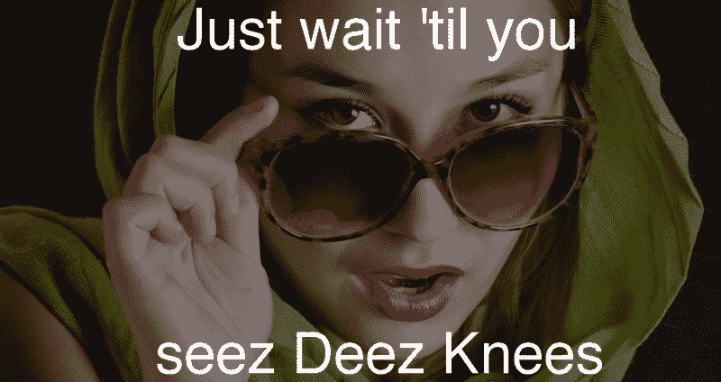
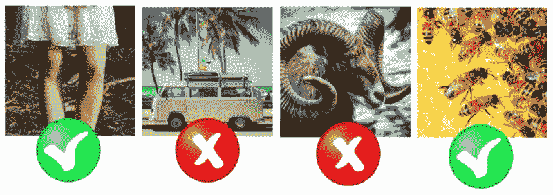
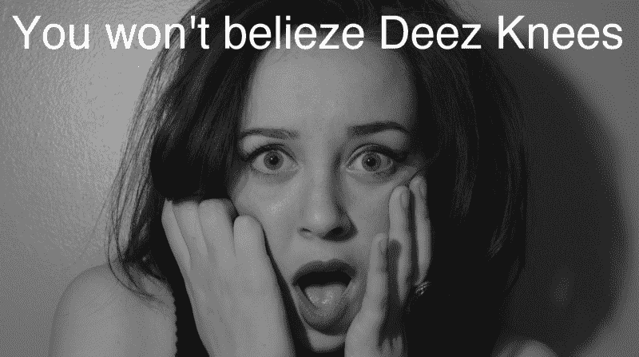

# 我分享膝盖照片的社交网络将如何拯救世界

> 原文：<https://www.freecodecamp.org/news/how-my-social-network-for-sharing-photos-of-knees-will-save-the-world-2074367d10ad/>

每个人都有两个共同点:膝盖。你的朋友有膝盖。你的同事有膝盖。你的萨莉阿姨也是。还有你叔叔金鲁贤。

你。我。左膝。右膝。

然而，尽管有这种共同的纽带，人们继续争论、争斗和伤害彼此。无论是网上还是现实世界，冲突无处不在。但是，如果在几个世纪的争吵之后，有可能通过我们共同的身份给全人类带来和平与和谐呢？这一天终于到来了。

介绍 Deez Knees，第一个也是唯一一个分享膝盖照片的社交网络——只有膝盖。

### 为什么是膝盖？

我创造了 Deez 膝盖来统一人类。我们有些人比其他人高。我们中有些人有深色头发，有些人有浅色头发。但是说到膝盖，就没什么变化了。膝盖只有两个部分:内部组件(膝盖骨骼)和外部组件(膝盖蒙皮)。对我的膝盖，你的膝盖，他的膝盖，她的膝盖都是如此。通过分享膝盖的照片，我们提醒自己，在膝盖皮肤的深处，我们基本上都是一样的。

> Deez 膝盖促进团结

你知道 Deez Knees 还宣传什么吗？多样性。“嘿，等一下，先生，”你可能会想。“你刚才说所有的膝盖都是一样的，那么你惊人的新创造如何既促进统一又促进多样性呢？”

我的朋友，这就是 Deez 膝盖的力量。

### 可扩展、可配置、可技术化

Deez Knees 背后的核心技术是一种复杂的膝盖识别算法。你可以试着贴一张别的东西的照片，但是不行。上传你手肘的照片？没有骰子。分享一张你屁股的照片？试试 Instagram。

Deez Knees 可以完全集成到所有数字平台上，包括垂直、水平和对角线。用户界面是直观的，反应灵敏的，免费的。您的个人信息将保持安全。我们使用三重旁路，带交叉密钥标签的六边形加密。Deez 膝盖上的所有数据不仅存储在云中，还存储在薄雾和哈欠中。

我们用区块链吗？是的，的确如此——准确地说，是区块链 27 号。用户还可以选择自己喜欢的加密货币:比特币、赛博币或网络面团。我们的网络快如闪电。由于我们基于科学和数学的中间压缩算法，图像加载速度很快。Deez 膝盖也塞满了纳米技术和人工智能。

> 数字、先进技术、未来— Deez 膝盖

### 让世界变得更美好

大多数科技企业家只关心金钱和名誉。他们想成为下一个高调的亿万富翁，登上杂志封面，与名人亲密接触。不是我。我为你创造了 Deez 膝盖。为了你和你的膝盖。

Deez 膝盖上会有广告吗？那是不用说的。我会把你的个人信息给营销公司吗？是的，当然，但不是免费的。我会一有机会就把 Deez 的膝盖卖给脸书吗？你打赌。

但是不要让这些次要的商业细节分散你的注意力。Deez 膝盖是为了更高的目标而创造的。世界上有太多不好的。让我们注入一点好的。实际上，这是件好事。

我不知道你怎么想，但我认为我们的这个世界值得拯救。受够了犯罪和战争。受够了令人讨厌的 YouTube 评论和愚蠢的 Twitter 抱怨。为什么这么敌对？朋友，你只有一次生命。一命两膝。好好利用它们。

这就是 Deez 膝盖的用武之地。与其对那个网络巨魔鼓掌，不如分享一张你膝盖的照片。你们很快就会意识到你们并没有什么不同。不要抨击共和党人、民主党人或萨斯喀彻温省人，滚动你的 Deez 膝盖饲料，反思我们如何多样但相同，不同但不那么不同，在某些方面还不平等——真的，当你想一想，真的想一想——在所有重要的方面总是平等的。

> Deez 膝盖变脏为好

是时候了，我的朋友。是时候让这个世界变得更美好了。是时候把光明带进黑暗了。是时候把冲突变成亵渎了。我们只需要你，我和 Deez 的膝盖。我们能做到。一次两个膝盖。