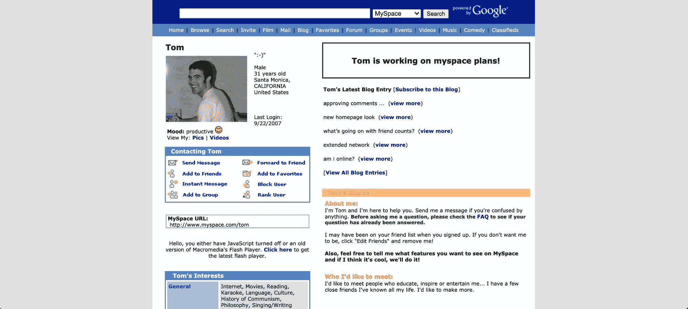
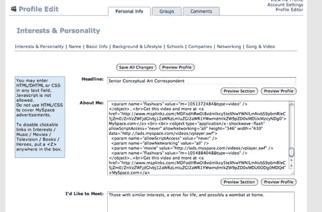
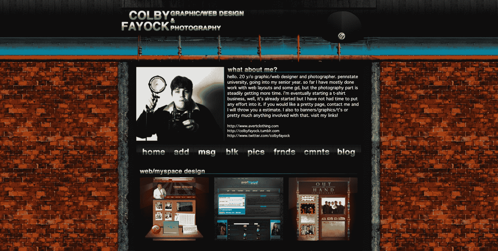

# MySpace 是如何教会我如何编码的，以及你应该从哪里开始培养你的激情

> 原文：<https://www.freecodecamp.org/news/how-myspace-taught-me-how-to-code-and-where-you-should-look-to-develop-your-passion/>

学习新东西很难。如果你很难找到动力，那就更有挑战性了。我们如何在日常生活中找到可以帮助我们学习的东西？

## 汤姆已经不在你的扩展网络中了

自从我们看到 MySpace 发生巨大变化以来，已经过去了将近 10 年。如果你不记得 MySpace 是什么，它是脸书称王之前流行的社交网络(尽管从技术上来说它仍然存在)。

Tom's MySpace Profile

那时，每个人都有了一个新朋友，名叫汤姆，他是 MySpace 的联合创始人。每个人都可以设定自己的“前 8 条”,如果你冷落了某人，这 8 条可能会建立或破坏最好的友谊。

你也可以为你的个人资料设置一首歌曲，作为一个小播放器添加，当你的页面加载时自动播放一首歌曲是“没问题”的。

但是 MySpace 现在已经是过去的事情了，那我为什么还要谈论它呢？

## 打造 MySpace，您的空间

MySpace 有一个独特的特点，这是你在当今任何流行的社交网络中都看不到的——它允许你在页面中添加 HTML 和 CSS，这样你就可以对你的个人资料做任何你想做的事情。

Example of custom code in a MySpace profile from [dummies.com](https://www.dummies.com/social-media/myspace/how-to-embed-video-in-your-myspace-profile/)

虽然从简单的角度来看，这给了你一些有限的选择。也许你可以添加一些 CSS 来更新标题的外观和改变背景颜色。

但实际上，这打开了添加完整网页的大门，您可以通过使用一些 z 索引将新布局放置在原始内容之上，将其覆盖在您的个人资料之上。

Custom MySpace profile for the band Filmore

诀窍在于，每次输入时你能输入的字符数量是有限的。这有局限性，但这些局限性有助于促进创造力，无论是找出如何去除代码中的所有空白，还是找出用更少的代码添加内容的方法。

## 通过爱好学习

建立 MySpace 的个人资料是上瘾的！这是一个社交媒体，你可以定制自己的社交媒体，并在上面印上你的名字，向所有人展示你的所作所为。

虽然你可以在自己的网站上做同样的事情，但当时并不容易。在 MySpace 上建立个人资料很容易，而且免费，你可以和你所有的朋友联系。

One of my portfolio custom profiles

每当我写下新的一页，我就试着去思考我还能做些什么。我甚至参与了一些小的社区，在那里我们可以分享我们的工作，并互相帮助找出如何把东西放进个人资料页面(大声喊出来！).

在这段时间里，当我试图了解我还可以定制什么的时候，我正在学习如何编码！我学会了如何从文档中挤出每一英寸的 HTML，也了解了 CSS 选择器是如何工作的。我还学会了定位如何让我在页面上做一些很酷的事情，以及当我们没有选择 flexbox 的选项时如何将事情放回中心。

Flexbox all the things!

这导致“商业科尔比”培养了一种企业家精神。此时，我还在上高中，但我已经能够从构建这些页面中衍生出一些小业务。

虽然每个简介 50 美元似乎很低，但对于 2004 年的一个高中生来说，这是一大笔钱，更不用说对于另一个高中生来说，花这么多钱来制作一个简介了！

STK Counter-Strike 1.6 team website

但这是我代码之旅的开始。在 MySpace 的基础上，我开始为反恐精英团队创建真正的网站。)和乐队，最终让我以编码为职业。

## 把爱好变成工作

我听说过其他人有类似的故事，甚至还有一些人也是从 MySpace 起步，最终将兴趣转向了编程事业。虽然 MySpace 时代是我们所有人回顾和嘲笑的事情，但它确实激励了许多人找到他们喜欢做的事情。

找到这种灵感对于发现你想如何度过你的时间很重要。无论是业余爱好还是把它作为一种职业来兼职学习，保持对你真正感兴趣的事情的参与对学习一门新手艺是很重要的。

但重要的是要注意你如何投入到新的兴趣中去。你不想强行把它变成职业，很快把自己累垮。那会导致后悔和怨恨。

虽然我很幸运，我对编程的兴趣最终变成了我的职业，但我确保不要“把工作带回家”，因为把工作与你的个人兴趣分开很重要，比如兼职的 [random](https://wwdc-memoji.netlify.app/) [OSS 项目](https://github.com/colbyfayock)。

## 找到激励你的东西

重要的是找到能激励和启发你发展激情的东西，无论是职业还是爱好。我们每个人都有自己的旅程，无论是否与代码相关，我们都应该努力找到让我们开心的事情。

你的兴趣的灵感是什么？在 Twitter 上与我分享！

*   [？在 Twitter 上关注我](https://twitter.com/colbyfayock)
*   [？️订阅我的 Youtube](https://youtube.com/colbyfayock)
*   [✉️注册我的简讯](https://www.colbyfayock.com/newsletter/)