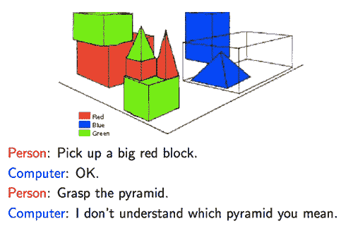
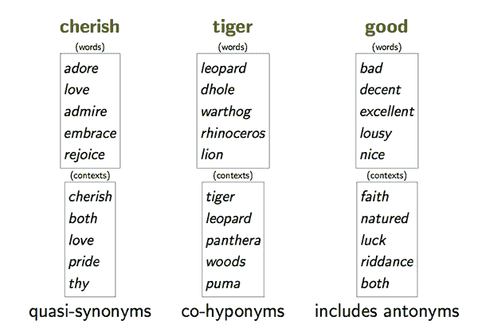
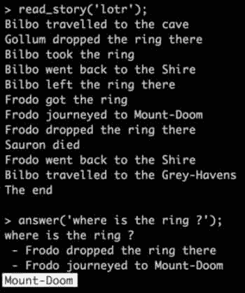
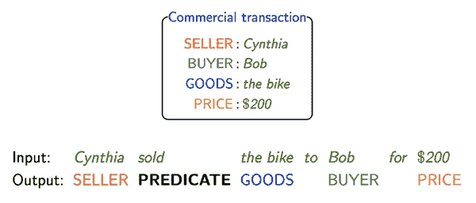
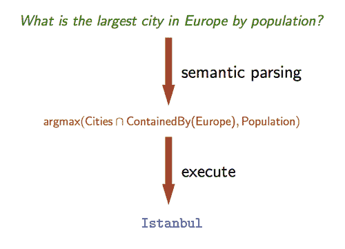
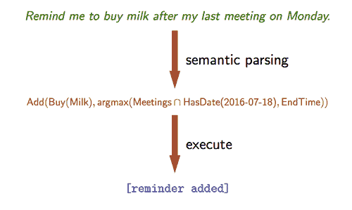
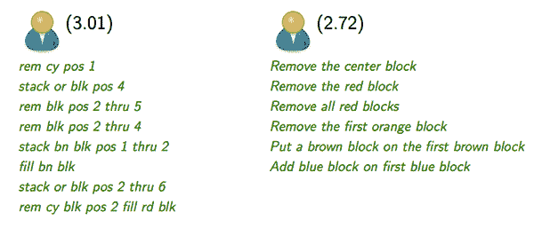
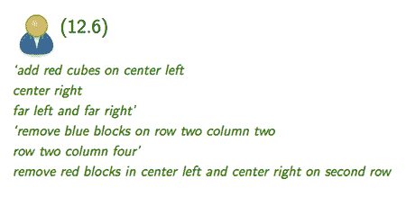

# 自然语言处理和理解的 4 种方法

> 原文：<https://www.freecodecamp.org/news/how-natural-language-processing-powers-chatbots-4-common-approaches-a077a4de04d4/>

作者:姚

# 自然语言处理和理解的 4 种方法

1971 年，Terry Winograd 在麻省理工学院完成博士学位时编写了 SHRDLU 程序。

SHRDLU 的特色是一个玩具积木世界，电脑将人类的命令转化为物理动作，例如“将红色金字塔移动到蓝色立方体旁边。”

要成功完成这些任务，计算机必须反复建立语义知识，Winograd 发现这一过程既脆弱又有限。

聊天机器人和语音激活技术的兴起重新点燃了自然语言处理(NLP)和自然语言理解(NLU)技术的热情，这些技术可以产生令人满意的人机对话。

不幸的是，学术上的突破还没有转化为用户体验的改善。Gizmodo 作家达伦·奥尔夫宣称信使聊天机器人“[令人沮丧且无用](http://gizmodo.com/facebook-messenger-chatbots-are-more-frustrating-than-h-1770732045)”，脸书承认他们备受期待的对话助手“m”[有 70%的失败率](https://www.theregister.co.uk/2017/02/22/facebook_ai_fail/)

尽管如此，研究人员仍在推进新的攻击计划，偶尔会重温维诺格拉德在 70 年代尝试过的相同策略和原则。

OpenAI 最近利用强化学习[教导代理人设计他们自己的语言](https://openai.com/blog/learning-to-communicate/)，方法是“将他们放入一组简单的世界，给他们交流的能力，然后给他们通过与其他代理人交流可以最好地实现的目标。”代理人独立开发了一种简单的“基础”语言。

麻省理工学院媒体实验室[向](https://www.media.mit.edu/projects/grounded-language-learning-and-understanding/overview/)展示了这个令人满意的关于“根植”在语言环境中的含义的澄清:

> “语言建立在经验的基础上。与根据其他单词定义单词的字典不同，人类根据与感觉运动体验的关联来理解许多基本单词。人们必须与他们的世界进行身体上的互动，才能领会像“红色”、“沉重”和“上面”这样的词的本质。“抽象词汇的习得只与更具体的基础术语有关。因此，基础是口语的一个基本方面，它使人类能够在语境中习得和使用单词和句子。”

基础语言的对立面是推理语言。推断语言从词语本身而不是它们所代表的东西中获得意义。

当只在大型文本语料库上训练时，而不是在真实世界的表示上训练时，NLP 和 NLU 的统计方法缺乏对单词含义的真正理解。

OpenAI 指出，这些方法与约翰·塞尔著名的[中文房间](https://plato.stanford.edu/entries/chinese-room/)思维实验所揭示的弱点是一样的。配备了一个通用字典来映射所有可能的中文输入句子到中文输出句子，任何人都可以执行一个蛮力查找并产生会话可接受的答案，而不需要理解他们实际上在说什么。

### 语言为什么这么复杂？

斯坦福大学计算机系教授兼自然语言处理专家 Percy Liang[将自然语言处理/ NLU 的各种方法](https://www.youtube.com/watch?v=mhHfnhh-pB4)分为四个不同的类别:

1.  分配的
2.  基于帧的
3.  模型理论
4.  互动学习

首先，在我们继续定义和描述这些类别之前，先上一堂简短的语言学课。

语言分析有三个层次:

1.  语法——什么是语法正确的？
2.  语义学——什么是意义？
3.  语用学——目的或目标是什么？

梁把成功的语法比作“没有编译错误”，把语义比作“没有实现错误”，把语用比作“实现了正确的算法”。

何[强调](https://simons.berkeley.edu/sites/default/files/docs/5950/2017.02.01-21.15.12-simons-nlp-tutorial.pdf)句子可以有相同的语义，但不同的句法，比如“3+2”对“2+3”。类似地，它们可以有相同的语法，也可以有不同的语法，例如 3/2 在 Python 2.7 和 Python 3 中有不同的解释。

归根结底，语用学是关键，因为语言产生于激发世界上一种行为的需要。如果你实现了一个复杂的神经网络来模拟一个简单的硬币投掷，你有很好的语义但是很差的语用学，因为有太多更容易和更有效的方法来解决同样的问题。

大量其他语言学术语的存在证明了语言的复杂性。单词与其他单词组合时具有不同的含义，如“光”与“灯泡”(即多词表达)，或用于各种句子中，如“我步入了光”和“手提箱是光”(多义词)。

上下义关系显示了一个具体实例如何与一个一般术语相关联(猫是哺乳动物)，而部分义关系表示一个术语是另一个术语的一部分(猫有尾巴)。这种关系必须被理解为执行文本蕴涵的任务，识别一个句子何时逻辑地包含在另一个句子中。“你正在读这篇文章”意味着“你能读”这句话。

除了复杂的词汇关系，你的句子还涉及信念、会话含义和预设。梁提供了两者的优秀范例。超人和克拉克·肯特是同一个人，但路易斯·莱恩认为超人是英雄，而克拉克·肯特不是。

如果你说“烤牛肉在哪里？”而你的会话伙伴回答“嗯，狗看起来很开心”，会话含义就是狗吃了烤牛肉。

预设是背景假设，不管句子的真值是多少，它都是真的。“我已经不吃肉了”有预设“我曾经吃过肉”即使你把这句话倒过来说“我没有不吃肉。”

模糊、不明确和不确定性增加了复杂性。不确定性是当你看到一个你不认识的单词时，你必须猜测它的意思。

如果你暗恋脸书，而他们的关系状态显示“这很复杂”，那么你已经理解了模糊。Salesforce 的首席科学家理查德·索彻(Richard Socher)在最近的一次人工智能会议上举了一个很好的模糊例子:“问题‘我能砍了你吗？’如果排队时我站在你旁边，或者我拿着一把刀，这意味着完全不同的事情。"

现在你对语言的无数挑战有了更多的了解，让我们回到梁在自然语言处理和中提出的语义分析的四种方法。

### #1:分配方法

分布式方法包括机器学习和深度学习的大规模统计策略。这些方法通常将内容转化为用于数学分析的词向量，并且在诸如词性标注(这是名词还是动词)的任务中表现得相当好。)、依存句法分析(句子的这一部分是否修饰另一部分？)，以及语义相关度(这些不同的词的用法相似吗？).这些 NLP 任务不依赖于理解单词的含义，而是依赖于单词本身之间的关系。

这样的系统是广泛的、灵活的和可扩展的。它们可以广泛应用于不同类型的文本，而不需要手工设计的功能或专家编码的领域知识。缺点是他们缺乏对现实世界语义和语用的真正理解。将单词与其他单词进行比较，或者将单词与句子进行比较，或者将句子与句子进行比较，都会产生不同的结果。

例如，语义相似并不意味着同义。最近邻计算甚至可以认为反义词是相关的:

先进的现代神经网络模型，如脸书首创的[端到端注意力记忆网络](https://arxiv.org/abs/1503.08895)或 Salesforce 发明的[联合多任务模型](https://arxiv.org/abs/1611.01587)可以处理简单的问答任务，但仍处于消费者和企业用例的早期试点阶段。

到目前为止，脸书只[公开展示了](http://newsroom.fb.com/news/2015/03/f8-day-two-2015/)一个根据荒谬简化版的《指环王》训练的神经网络可以计算出难以捉摸的一只戒指的位置。

尽管分布式方法实现了广度，但是它们不能处理深度。复杂而微妙的问题依赖于语言的复杂性和语境世界的知识，还没有得到满意的回答。

### #2:基于框架的方法

马文·明斯基在他 1974 年的开创性论文《表示知识的框架》中解释道:“框架是一种用于表示刻板印象的数据结构。”可以把框架想象成一种规范的表示，其中的细节可以互换。

梁提供了一个商业交易的例子作为框架。在这种情况下，通常会有一个卖方、一个买方、被交换的商品和交换价格。

句法不同但语义相同的句子，如“辛西娅以 200 美元的价格将自行车卖给了鲍勃”和“鲍勃以 200 美元的价格从辛西娅那里买了这辆自行车”，可以放在同一个框架中。解析需要首先识别正在使用的帧，然后填充特定的帧参数——例如 Cynthia，$200。

框架的明显缺点是它们需要监管。在某些领域，专家必须创建它们，这限制了基于框架的方法的范围。框架也必然是不完整的。像“辛西娅昨天去了自行车店”和“辛西娅买了一辆最便宜的自行车”这样的句子不能用我们上面定义的框架进行充分的分析。

### #3:模型理论方法

第三类语义分析属于模型理论方法。为了理解这种方法，我们将介绍两个重要的语言学概念:“模型理论”和“组合性”。

模型理论指的是句子指代世界的观点，就像扎根语言的情况一样(即方块是蓝色的)。在组合性方面，句子各部分的意义可以组合起来推导出整体意义。

梁把这种方法比作把语言变成计算机程序。要确定查询“欧洲人口最多的城市是哪个”的答案，您首先必须确定“城市”和“欧洲”的概念，并将您的搜索空间缩小到欧洲包含的城市。然后，您需要对目前为止您已入围的每个城市的人口数量进行排序，并返回该值的最大值。

要执行“周一开完最后一次会提醒我买牛奶”这句话，需要类似的成分分解和重组。

模型各不相同，从需要专家的强力监督到普通人对机械土耳其人的轻度监督。基于模型的方法的优势包括全面的表示、丰富的语义和端到端的处理，这使得这种方法能够回答困难和微妙的搜索查询。

主要的缺点是，由于需要手工设计的功能，应用程序的范围受到了很大的限制。模型理论方法在 NLU 中的应用通常从最简单、最包容的用例开始，并从那里向前推进。

NLU 的圣杯是广度和深度，但实际上你需要在两者之间进行权衡。分配方法有规模和广度，但理解浅薄。模型理论方法是劳动密集型的，而且范围狭窄。基于帧的方法介于两者之间。

### #4:互动学习方法

英国语言哲学家保罗·格莱斯将语言描述为说话者和听话者之间的合作游戏。梁也倾向于同意。他认为，解决语言学习广度和深度的一个可行的方法是采用交互式的互动环境，在这种环境中，人类逐渐教会计算机。在这种方法中，语言的语用需求决定了语言的发展。

为了验证这个理论，梁开发了一个现代版的 Winograd 的 SHRDLU。在这种交互式语言游戏中，人类必须指示计算机将积木从起点移动到终点。挑战在于计算机开始时没有语言的概念。一步一步地，人类说出一个句子，然后向计算机直观地指示执行的结果应该是什么样子。

如果一个人玩得好，他或她会采用一致的语言，使计算机能够快速建立游戏环境的模型，并将单词映射到颜色或位置。令人惊讶的结果是，任何语言都可以，甚至是个人发明的速记符号，只要你是一致的。

花费最长时间训练电脑的最差玩家经常使用不一致的术语或不合逻辑的步骤。

梁的赌注是，这种方法将使计算机能够在没有显式模型的情况下端到端地解决自然语言处理和 NLU 问题。“语言本质上是互动的，”他补充道。“我们如何表现知识、背景、记忆？也许我们不应该专注于创造更好的模型，而是更好的互动学习环境。”

语言既是逻辑的，也是情感的。我们用词来描述数学和诗歌。在自然语言处理和 NLU 应用中容纳我们的各种各样的表达可能需要结合上面概述的方法，从分布/宽度集中的方法到基于模型的系统到交互式学习环境。

我们可能还需要完全重新思考我们的方法，使用基于人机交互的合作学习，而不是研究人员驱动的模型。

如果你有一个半小时的空闲时间，我强烈推荐你看一下 Percy Liang 的整篇演讲，这篇摘要文章就是基于这篇演讲:

*特别感谢[梅丽莎·法布鲁斯](https://www.linkedin.com/in/melissa-fabros-5a1b35b/)推荐珀西的演讲，[马修·克莱恩史密斯](https://www.linkedin.com/in/matthewkleinsmith/)强调麻省理工学院媒体实验室对“接地气”语言的定义，以及 [fast.ai](http://www.fast.ai/) 的杰瑞米·霍华德和瑞秋·托马斯为我们的联系和对话提供便利。*

如果你喜欢我的文章，加入 [TOPBOTS](http://www.topbots.com/bot-news-pro-newsletter/?utm_medium=article&utm_source=medium&utm_campaign=newsletter) 社区，获得最好的机器人新闻和独家行业内容。