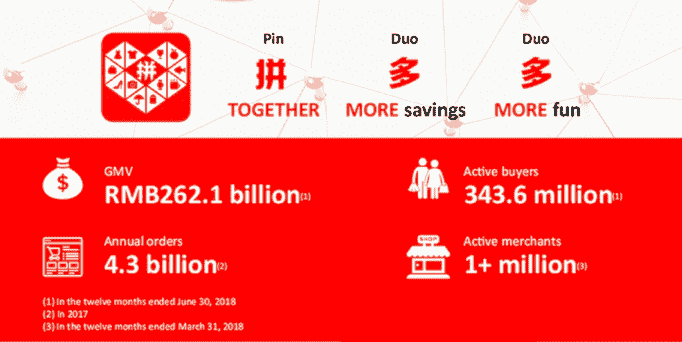

# 非中国开发者如何利用微信每月 11 亿的活跃用户

> 原文：<https://www.freecodecamp.org/news/how-non-chinese-developers-can-leverage-wechats-1-1b-monthly-active-users-285083836bb9/>

威廉·关

# **非中国开发者如何利用微信每月 11 亿的活跃用户**

自两年前该平台推出以来，已有超过 100 万个微信小程序被发布。相比之下，App Store 花了十年时间才达到 200 万个应用。

微信用户平均每天在微信上花费 **66 分钟。迷你程序模拟了轻量级移动应用程序的体验，不需要用户离开微信或等待长时间的下载。这加速了在线(迷你计划主要通过社交分享获得)和离线(通常通过二维码完成)的入职。**

这种通过绕过下载过程来获得更多用户的想法已经在西方科技界流传开来。大约在迷你程序平台推出的同时，我们搭上了信使聊天机器人的宣传列车。Android Instant 发现了一些利基用例，但从未流行起来。

作为一个有中国传统的加拿大软件开发者，我不认为我们应该在这里采用这种一体化的用户体验。移动优化网站和原生移动应用已经涵盖了所有重要的使用案例。

但在中国，微信在迷你程序出现之前的几年里一直是独一无二的应用。从叫出租车到支付餐费，再到与附近的陌生人联系，一切都可以通过微信完成。迷你节目是自然的演变，在一个政府历来阻止外国竞争者的国家创造了一个半开放的平台。

中国标志性的西方品牌已经开始从本地应用转向迷你程序。像麦当劳和肯德基这样的快餐连锁店让你在他们的迷你程序中点餐和领取优惠券。像古驰和博柏利这样的奢侈品牌正在创造游戏和促销活动来推销他们的产品。

许多小型项目是为了补充当地的中国企业，如商店、餐馆和酒店。对于注重技术的迷你程序，游戏是主要类别。几个游戏引擎提供迷你程序支持，包括 [Cocos](https://docs.cocos.com/creator/manual/en/publish/publish-wechatgame.html) 。

但这个平台也是科技创业公司的温床。最引人注目的是团购应用拼多多，该应用于 2018 年 7 月在美国上市，估值为 238 亿美元，目前正寻求在 6 个月后再融资 15 亿美元。

*Image credit: GGV Capital*

我最近一直在做一个迷你程序，由于我从未学会如何阅读中文(尽管我的父母从小就争吵不休)，克服语言和文化障碍真的很难。不仅微信的大部分文档都是中文的，而且中文软件对用户体验也有不同的标准。简单地翻译一个面向西方市场的应用程序是行不通的。

此外，还有一些技术挑战:

*   迷你程序的大小限制在 10 MB，以确保快速下载
*   硬件访问仅限于微信通过他们的 API 提供的内容(值得注意的是，你不能使用 NFC)
*   网站链接是不允许的(腾讯希望用户使用微信，而且只能使用微信)

尽管障碍重重，但这个机会太大了，不容忽视。中国人是世界上最活跃的社交媒体用户，他们已经爱上了高质量的西方产品，就像我们崇拜日本制造业一样。具有讽刺意味的是，“中国制造”是在中国推销产品的糟糕方式。西方科技创业公司可以利用这一点，但几乎没有一家公司采取中国优先的战略。

如果你想成为少数敢于尝试中国市场的开发者之一，我制作了这个教程来教你如何制作你的第一个迷你程序。如果你熟悉全栈 JavaScript web 开发，你会很快掌握技术栈。它由一个 JavaScript 客户机和服务器、一个 HTML/CSS 的修改版本和一个 JSON 数据库组成。

如果你觉得这个教程有帮助，我很乐意创建更多这样的内容，并为讲英语的微信开发者建立一个社区。欢迎在评论中提出任何微信开发问题，我会尽力帮你解决！