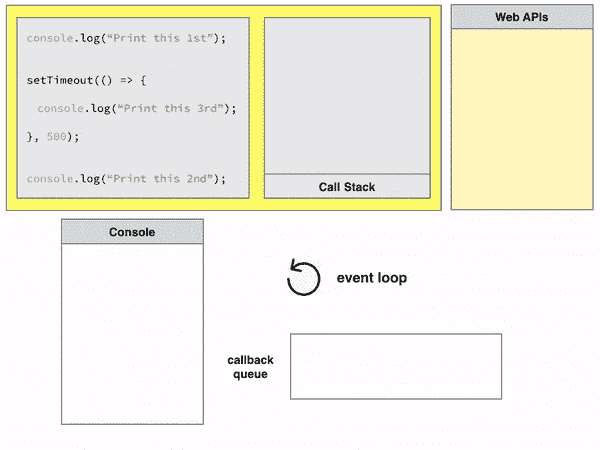

# 如何不再害怕 JavaScript

> 原文：<https://www.freecodecamp.org/news/how-not-to-be-afraid-of-javascript-anymore-c40780dc071/>

#### 成为一名优秀的 Javascript 开发人员需要知道的事情

你以前去过那里吗？Javascript 在这里似乎不起作用。你写的函数没有做你期望的事情。哪里`this`就是说不通？什么是`this`？这是`this`。

我有。所以，我写了这篇文章。它涵盖了从闭包和类到对象和提升的所有内容。

它帮助我成为一名更好的开发人员。希望对你也有帮助。

### 数据模型

#### 类型

跟着我。我这样做是因为我想让你们了解两种不太为人所知的类型:符号和数字。

未定义和空之间的区别也困扰着许多人。

*   [号](https://developer.mozilla.org/en-US/docs/Web/JavaScript/Reference/Global_Objects/Number)
*   [字符串](https://developer.mozilla.org/en-US/docs/Web/JavaScript/Reference/Global_Objects/String)
*   [布尔型](https://developer.mozilla.org/en-US/docs/Web/JavaScript/Reference/Global_Objects/Boolean)
*   [功能](https://developer.mozilla.org/en-US/docs/Web/JavaScript/Reference/Global_Objects/Function)
*   [物体](https://developer.mozilla.org/en-US/docs/Web/JavaScript/Reference/Global_Objects/Object)
*   [符号](https://developer.mozilla.org/en-US/docs/Web/JavaScript/Reference/Global_Objects/Symbol)
*   [未定义](https://developer.mozilla.org/en-US/docs/Web/JavaScript/Reference/Global_Objects/undefined)和[空](https://developer.mozilla.org/en-US/docs/Web/JavaScript/Reference/Global_Objects/null)

#### 数字

JS 中的所有数字都是“双精度 64 位格式 IEEE 754 值”。俗称 floats，意思是没有整数的概念。你的整数存储为浮点数。

将字符串转换成数字:使用`parseInt('123', 10)`。第二个参数是基数。所以，在处理二进制时，你可以:

```
> parseInt('101',2)
5
```

同样，`parseFloat('number')`存在于浮点数中。这里的基数总是 10。

#### 标志

这种数据类型的唯一目的是识别对象属性。迭代协议和正则表达式是使用符号的最流行的例子。我们将在下一部分讨论迭代协议！

您可以通过`Symbol()`创建一个。每次调用都会生成一个新符号。因此，

```
console.log(Symbol(42) === Symbol(42)) // false
```

在 JavaScript 中，符号可以跨文件保存。从这个意义上说，它们不同于全局变量。

存在存储所有遇到的符号的全局符号注册表。使用`Symbol.for()`将符号添加到注册表中，使用`Symbol.keyFor()`检索符号。

有关符号的更多信息，请参见[此处](https://developer.mozilla.org/en-US/docs/Glossary/Symbol)。

#### 未定义和空

为什么区分未定义和空？

按照惯例，Null 表示故意不存在的值。undefined 是一个未初始化的值。

例如，假设您有一个存储 ID(如果存在)的字段。在这种情况下，您可以使用 null，而不是使用“NOT_EXISTS”这样的神奇值。如果它应该存在，但现在不存在，你可以通过 undefined 显示出来。

### 变量和范围

#### ES2015 之前

`var`是定义变量的唯一方法。

此外，我们只有两个范围: [**全局**](https://developer.mozilla.org/en-US/docs/Glossary/global_scope) 和**功能**范围。在函数内部声明的变量成为该函数的局部变量。函数范围之外的任何东西都不能访问它们。

因此，它们有作用范围。

#### ES2015 之后

ES2015 引入了两种定义变量的新方法:

*   `let`
*   `const`

随之而来的是**区块**范围的概念。块是两个花括号之间的所有东西

ES2015 是向后兼容的，因此您仍然可以使用 var，尽管不鼓励使用它们。

```
var x = 1;
{
  var x = 2;
}
console.log(x) // OUTPUT: 2, as block doesn't mean anything to var.
let x = 1;
{
  let x = 2;
}
console.log(x) // OUTPUT: 1
```

#### 可变提升

JavaScript 对`var`有一个奇特的想法，叫做提升。

```
function something() {
  console.log(name);
  let name = 'neil';
  console.log(name);
}
```

你能猜到上面会发生什么吗？

我说一个`ReferenceError`:我们在变量被定义之前就使用了它的名字。有道理，就是这么回事。

然而，如果我使用`var`而不是`let`，我不会得到错误。

```
function something() {
  console.log(name); // OUTPUT: undefined
  var name = 'neil';
  console.log(name); // OUTPUT: neil
}
```

幕后发生了什么？

```
function something() {
  var name; // variable hoisting

  console.log(name); // OUTPUT: undefined
  name = 'neil';
  console.log(name); // OUTPUT: neil
}
```

这是不鼓励使用`var`的另一个原因。它会导致有趣的错误。

### 短路逻辑:&&和||

对于 JavaScript，逻辑运算会有一些特殊的东西。(Python 中也有。)

能让你做像这样神秘的事情:

```
// o is an object
var name = o && o.name;
```

你觉得`name`是什么？如果对象`o`为空或未定义，`name`为空或未定义。

如果`o`已定义，但`o.name`未定义，`name`未定义。

如果`o`被定义，`o.name`被定义，那么`name = o.name`。

我们用的是布尔逻辑运算符，对吗？这怎么可能呢？答案是短路和真实。

#### 真实性

如果一个值在布尔上下文中评估为真，则该值为真。除以下虚假值外，所有值都是真实的:

*   `false`
*   `0`
*   `""`
*   `null`
*   `undefined`
*   `NaN`

注意:这意味着，`{}`和`[]`是真的！

将某物转换为其真实值的常用技巧:`!!`

`!`转换为 not—falsy 值，然后`!`再次将其转换回 true/false。

#### 短路

其思想是布尔运算符返回使语句为真或为假的最终值，而不是语句为真或为假。就像我们上面看到的，要将其转换为真值，可以使用`!!`。

当布尔表达式没有完全求值时，就会发生短路。举个例子，

`null && ...`

`...`是什么并不重要。`null`是 falsy，所以这个表达式将返回`null`。

与`[] || ...`情况相同。`[]`是真的，所以这个表达式将返回`[]`，而不管`...`是什么。

### 目标

JavaScript 中的对象是名称/值对的集合。如果你来自[如何不再害怕 Python](https://neilkakkar.com/How-not-to-be-afraid-of-Python-anymore.html)，不要混淆 Python 对象和 JavaScript 对象。

与 JavaScript `Object`最相似的是 Python `dict`。

对于对象中可用的类型，name: `string`或`Symbol`value:any。

`Arrays`是一种特殊类型的物体。他们有一个神奇的属性:长度(和不同的原型链。见下文。)数组的长度比最高索引大 1。这是可变的，这意味着你可以用它做一些有趣的事情(不推荐):

```
const funkyArray = [];
funkyArray['0'] = 'abcd';
funkyArray['length'] = 3

> console.log(funkyArray);
(3) ["abcd", empty × 2]

> funkyArray[4] = 'x';
> console.log(funkyArray);
(5) ["abcd", empty × 3, "x"]
```

注意使用数字和字符串作为数组索引。数字可以工作，因为对象隐式地调用名称上的`toString()`。

迭代数组和对象，使用像`for...of`、`for...in`和`forEach`这样的结构是我将在下一部分讨论的内容。(另外，在 JavaScript 中使用对象作为地图时的一个有趣的 bug！)

#### 全局对象

全局对象是始终存在于全局范围内的[对象](https://developer.mozilla.org/en-US/docs/Glossary/object)。在 JavaScript 中，总会定义一个全局对象。在 web 浏览器中，当脚本创建全局变量时，它们被创建为全局对象[ [1](https://neilkakkar.com/How-not-to-be-afraid-of-Javascript-anymore.html#fn:1) ]的成员。全局对象的接口取决于脚本运行的执行上下文。例如:

*   在 web 浏览器中，脚本没有专门作为后台任务启动的任何代码都有一个窗口作为其全局对象。这是网络上绝大多数的 JavaScript 代码。
*   在 Worker 中运行的代码将 WorkerGlobalScope 对象作为其全局对象。
*   Node.js 下运行的脚本有一个名为 global 的对象作为它们的全局对象。[ [2](https://neilkakkar.com/How-not-to-be-afraid-of-Javascript-anymore.html#fn:2)

### 功能

在 JavaScript 中，函数是第一类对象。它们可以像任何其他对象一样拥有属性和方法。它们可以作为参数传递给其他函数(元递归！).函数不同于对象的地方在于它们是可调用的。

所有功能都扩展了[的**功能**的](https://developer.mozilla.org/en-US/docs/Web/JavaScript/Reference/Global_Objects/Function)对象。这个对象没有预定义的属性或方法，但是从`Function.prototype`继承了一些。(这将在下面的原型部分变得清楚)。此外，这个`Function`对象是函数的构造函数。您至少可以用 4 种方式创建函数:

```
function functionDeclaration() {};
var anonymousFunctionExpression = function() {};
var namedFunctionExpression = function named() {};
var arrowFunctionExpression = () => {};
var constructorFunction = new Function(...args, functionBody); // functionBody is a string
```

return 语句可以随时返回值，从而终止函数。如果 JavaScript 看不到 return 语句(或没有值的空返回)，则返回 undefined。

为函数定义的所有参数都放在变量中。所有参数的默认值都是`undefined`。

你以前见过 JavaScript 中的三个点吗？`...`。像我上面在`constructorFunction`里用的那个？我第一次见到它们时，它们让我大吃一惊。它们是 JavaScript 语法的一部分。这不是伪代码(像我最初想的那样)。

它们是`rest`和`spread`参数语法。

这是彼此对立的。`spread`传播论点，`rest`将它们重新组合在一起。

这里有一个例子:原谅设计糟糕的函数——它不需要命名参数——但我要说明一点。

```
const average = function( val1, val2, val3, ...otherValues) { // rest
  console.log(otherValues);
  let sum = 0;
  for (let i = 0; i < arguments.length; i++) { 
    sum += arguments[i];
  }
  return sum / arguments.length;
}
let values = [1, 2, 3, 4, 5, 6]
const averageValue = average(...values); // spread
```

这里发生了什么事？`otherValues`使用 rest 语法收集传递给 average 的无限个参数。上面的`console.log()`会打印出`[4, 5, 6]`。

`values`正在使用 spread 语法将数组转换成单个参数。它的工作原理是这样的:在幕后，下面等同于上面。

```
const averageValue = average(1,2,3,4,5,6)
```

另一件要注意的事情是，每次调用函数时都会计算默认参数值，不像 Python 那样只发生一次。

有 3 个有趣的原型函数可用于函数对象。这些是`apply()`、`bind()`和`call()`。JavaScript 的 A，B，C。

随着 spread 和 rest 语法的出现，`apply()`和`call()`不再不同。

`apply()`用 args 数组调用函数；`call()`调用带有单个值的函数。

最酷的是，它们允许你用一个定制的`this`对象调用函数。

一旦我们覆盖了`this`对象，我们将更多地讨论`apply()`和`bind()`。

#### 匿名函数和内部函数

```
const avg = function () {
  let sum = 0;
  for (let i = 0, argLength = arguments.length; i < argLength; i++) { // arguments variable is an array containing all args passed to the function.
    sum += arguments[i];
  }
  return sum / arguments.length; // argLength isn't available here
};
```

表达式`function avg()`和`var avg = function ()`语义等价。

然而，函数名(这里是匿名的——所以不存在)和函数被赋给的变量之间是有区别的。

不能更改函数名，但可以重新分配函数所赋给的变量。函数名只能在函数体中使用。试图在函数体之外使用它会导致错误(或者，如果函数名先前是通过 var 语句声明的，则会导致未定义的错误)。

函数作为变量传递的想法产生了巨大的力量。例如，您可以隐藏局部变量:

```
var a = 1;
var b = 2;
(function() {
  var b = 3; // hidden local variable
  a += b;
})();
a; // 4
b; // 2
```

上面的表达式称为 IIFE(立即调用的函数表达式)，在这里创建一个函数并立即调用它。

此外，我们还可以在彼此内部嵌套函数！这些被称为**内部函数**。要记住的重要一点是:内部函数可以访问父函数中定义的变量，但反之则不行。这是闭包的直接结果，我们很快就会谈到。

这使您可以创建如下功能:

```
let joiner = function(separator) {    // The outer function defines separator
    return function(left, right) {      
        return left + " " + separator + " " + right;    // The inner function has access to separator
    }    // This exposes the inner function to the outside world
}
let and = joiner("and");
and("red", "green"); // There's no way to change the separator for AND now; except by reassigning the function variable.
// red and green
const or = joiner("or"); // There's no way to change the separator for OR now.
or("black", "white"); 
// black or white
```

#### 功能提升

> 通过函数声明，函数定义被提升到作用域的顶部。
> *带函数表达式，函数定义不挂*。

好吧，你可能会对这两个术语之间的区别感到困惑。我是。

```
function declaredFunction() { // this is the function declaration
    // what comes here is the function definition
}
let functionExpression = function() { // this is a function expression
    // what comes here is the function definition
}
```

### 类和原型链

JavaScript 使用函数作为类。最近引入的 class 语句是对函数的语法修饰。

因为 JavaScript 中的所有数据都是一个`Object`，所以我们的函数——一个类构造器——将返回一个`Object`是有意义的。

因此，给定我们所知道的关于函数和对象的所有基础知识，我们可以做这样的事情来创建一个类，比如说*(很难找出一个不平凡的、有用的和相关的例子……)*
…。
……
..
。
一个 tweet 界面！听起来很有趣。

假设您正在构建自己的前端来显示推文，与 twitter API 对话来获取推文的数据。

```
function Tweet(id, username, content, parent = null) {
  return {
    id, // Javascript implicitly converts this into id: id
    username,
    content,
    getUrl: function() {
      return 'https://twitter.com/' + this.username + '/' + this.id;
    },
    isComment: function() {
      return parent !== null;
    }
  };
}
var t = Tweet(1, '@neilkakkar', 'How not to be afraid of JS anymore'); 
// Remember, we can fill any number of args
// the rest are undefined or default
// All args are in the arguments variable
t.getUrl(); // "https://twitter.com/@neilkakkar/1"
t.isComment(); // "false"
```

`[this](https://developer.mozilla.org/en-US/docs/Web/JavaScript/Reference/Operators/this)`关键字引用当前对象。使用点标记法，这将成为应用了点的对象。否则，它就是全局对象。

MDN 的说明:

> 在大多数情况下，这个值是由函数的调用方式决定的。在执行过程中不能通过赋值来设置，可能每次调用函数都不一样。ES5 引入了`[bind()](https://developer.mozilla.org/en-US/docs/Web/JavaScript/Reference/Global_Objects/Function/bind)`方法来设置函数的`this`值，而不管它是如何被调用的，ES2015 引入了不提供自己的 this 绑定的 arrow 函数(它保留了封闭词法上下文的`this`值)。

这(一语双关)是经常出错的原因。例如:

```
const t = Tweet(1, '@neilkakkar', 'How not to be afraid of JS anymore');
const urlFetcher = t.getUrl; // assigning the function
urlFetcher(); // https://twitter.com/undefined/undefined
```

当我们单独调用`urlFetcher()`，而不使用`t.getUrl()`，`this`被绑定到全局对象。因为没有名为`username`或`id`的全局变量，所以我们为每个变量取`undefined`。

我们可以利用`this`关键字来改进我们的 Tweet 功能。这个想法是，我们期望一个新的对象(由`this`引用)并修改它的属性，而不是创建一个对象并返回它。

```
function Tweet(id, username, content, parent = null) {
  this.id = id;
  this.username = username;
  this.content = content;
  this.getUrl = function() {
      return 'https://twitter.com/' + this.username + '/' + this.id;
  };
  this.isComment = function() {
      return parent !== null;
    }
  };
}
var t = new Tweet(1, '@neilkakkar', 'How not to be afraid of JS anymore');
```

关键字 [new](https://developer.mozilla.org/en-US/docs/Web/JavaScript/Reference/Operators/new) 创建一个全新的空对象，然后调用指定的函数，并将`this`设置为新对象。我们修改后的函数不返回值，只是修改了`this`对象。一旦函数被调用，`new`也会返回`this`对象。这是我们想要的。`new`也做了一些我们想要的额外的事情——比如建立原型链——但是我们一会儿会讲到。

这种被设计成由`new`调用的函数被称为**构造函数**。按照惯例，这些函数是大写的(提醒用`new`调用它们)。

因为我们每次调用`Tweet`都会得到一个新对象，所以我们每次调用`Tweet`都会创建两个函数对象(`getUrl`和`isComment`)。更好的方法是在构造函数范围之外编写这些函数，并传递一个引用。

如果你来自面向对象的背景，甚至这可能看起来不够好。除了这个`Tweet`对象，您不希望在任何地方使用这个函数。你不想弄脏你的全局函数列表。这就是 JavaScript 的“继承”之处。

### 原型

`Tweet.prototype`是由`Tweet`的所有实例共享的对象。它构成了查找链的一部分(有一个特殊的名字，“原型链”):任何时候你访问没有设置的`Tweet`的属性，JavaScript 将检查`Tweet.prototype`以查看该属性是否存在。

因此，任何分配给`Tweet.prototype`的东西都可以通过`this`对象被该构造函数的所有实例使用。

> 每个对象都有一个私有属性(`__proto__`)，它保存了一个到另一个被称为原型的对象的链接。该原型对象有自己的原型，依此类推，直到到达一个以 null 作为其原型的对象。根据定义，null 没有原型，并且充当这个原型链中的最后一环。

这是一个非常强大的工具。JavaScript 允许您在程序中随时修改某个东西的原型，这意味着您可以在运行时向现有对象添加额外的方法(无需再次调用构造函数)。

```
var t = new Tweet(1, '@neilkakkar', 'How not to be afraid of JS anymore');
t.getComments(); // TypeError on line 1: t.getComments is not a function
Tweet.prototype.getComments = function() {
  // example API call to Twitter API - let's say it exists as the twitterService object
  return twitterService.getComments(this.id);
};
t.getComments(); // "[ 'This is an amazing article, thank you!' , 'I love it' ]" 
// fictional comments
```

#### function.prototype vs __proto__

你可能已经看到两者可以互换使用。它们不一样。让我们把这个弄清楚。

`function.prototype`是`__proto__`的构造函数。

`__proto__`是 objects 上可用的实际原型对象。

因此，`function.prototype`只对构造函数可用。你不能以`t.prototype`的身份访问 tweet 的原型，你必须使用`t.__proto__`。

但是要设置原型，您可以像上面的例子一样使用`Tweet.prototype.getComments()`。

#### 我们对函数和类所做的复习

*   类是函数。我们从一个创建新对象的函数开始(`return {...}` -使用对象字面语法)，然后向它添加属性(类数据)，最后返回它。
*   然后是构造函数。这些方法假设有一个给定的空对象(通过`new`初始化),只需向它添加属性。
*   接下来是原型链，用于将被`class`的所有对象使用的方法

在幕后，这就是使用`class`关键字时的工作方式。

### 新的关键字和应用

我们现在可以探索使用`new`在幕后发生了什么，并从函数原型重新访问`apply()`。我们已经看过了`bind()`。

`new`的作用是创建一个对象，把它传递给构造函数(这里这个对象作为`this`可用)，设置原型链。

`apply()`接受一个对象(`this`值)和一个要在该对象上调用的参数数组。

将这两者放在一起，我们得到了 new 的一个简单实现。

```
function newNew(constructorFunction, ...args) {
  const thisObject = {}; // create object using object literal syntax
  constructorFunction.apply(thisObject, args); // calls constructorFunction with this set to thisObject and with given args
  // setting up prototype chain is tricky. Need a new prototype for constructorFunction
  // not the Function constructor prototype
  return thisObject;
}
```

### 关闭

还记得 joiner 函数吗？

```
let joiner = function(separator) {    // The outer function defines separator
    return function(left, right) {      
        return left + " " + separator + " " + right;    // The inner function has access to separator
    }    // This exposes the inner function to the outside world
}
let and = joiner("and");
and("red", "green"); // There's no way to change the separator for AND now; except by reassigning the function variable.
// red and green
const or = joiner("or"); // There's no way to change the separator for OR now.
or("black", "white"); 
// black or white
```

定义在另一个函数内部的函数可以访问外部函数的变量。一旦外部函数返回，常识会告诉我们它的局部变量不再存在。

但是它们确实存在——否则，joiner 函数就不会工作。更重要的是，`joiner()`的局部变量有两个不同的“副本”——一个是`separator`是`and`，另一个是`separator`是`or`。这是如何工作的？

#### 范围对象

每当 JavaScript 执行一个函数时，它都会创建一个“作用域”对象来保存在该函数中创建的局部变量。scope 对象用作为函数参数传入的变量初始化。这类似于全局对象——当新变量“出现”时，它们被添加到范围对象中。

两个关键点:

*   每次函数开始执行时，都会创建一个全新的作用域对象
*   与全局对象不同，这些范围对象不能从 JavaScript 代码中直接访问。没有迭代当前范围对象的属性的机制。

所以当调用`joiner()`时，创建一个带有一个属性的 scope 对象:`separator`，它是传递给`joiner()`的参数。`joiner()`然后返回创建的函数。

通常 JavaScript 的垃圾收集器会在此时清理为`joiner()`创建的作用域对象，但是返回的函数会维护一个指向该作用域对象的引用。因此，直到不再有对`joiner()`返回的函数对象的引用时，作用域对象才会被垃圾收集。

范围对象形成了一个称为范围链的链，类似于原型链。

> 闭包是函数和创建它的作用域对象的组合。闭包让你保存状态——因此，它们经常被用来代替对象

因此，每当你在一个函数中创建另一个函数时，你就在创建一个闭包。

#### 表演

在结束这一部分之前，我们先来谈谈性能。为了优化性能，去掉不需要的闭包。记住，引用一直存在到需要 scope 对象为止，包含所有的局部变量和函数参数。

```
function f(i) {
    var o = { };  // Some large object
    var a = [ ];  // Some large array
    // `a` and `o` are local variables and thus will get added to the closure object.
    //...
    //...
    // some use case for a and o
    var c = [ 1, 2, 3 ].filter(item => a.indexOf(item) > -1 || o[item]);
    a = undefined;  // Clean up before closure
    o = undefined;  // Clean up before closure
    return function () { // closure created
           return ++i; // we didn't need anything except i for this function,
           // so makes sense to delete everything else from the closure.
    };
}
```

### 执行模型



[*Source*](https://www.zeolearn.com/magazine/understanding-the-javascript-event-loop)

JavaScript 如何运行？

这张 gif 展示了不同的组件以及它们是如何相互作用的。让我们过一遍。

#### 调用栈

每个函数调用都是堆栈上的一帧。

这个调用栈是要按顺序执行的函数调用的栈。(你看它为什么叫栈？)

该框架包含函数参数和局部变量。这是定义作用域对象和闭包的地方！

函数返回时会从堆栈中弹出。

每个脚本在堆栈上都以一个`main()`开始，因为这个函数包含了脚本中的所有其他函数。

#### 许多

你创建的每一个对象都需要在内存中有一席之地。这个地方就是堆:一个大的非结构化内存区域。

如果你来自 C++领域，那么在 C++中使用`new`构造时，堆就是事情发生的地方。

#### Web APIs 和事件

Web APIs 是 JavaScript 运行时中与操作系统交互的低级功能。它们是由浏览器/主机实现的。对于 ex: `setTimeout()`。

它们从堆栈中被调用并开始处理。函数在此时返回(从而弹出堆栈帧)。这就是 JavaScript 的异步特性。几乎所有的基本 API 都是非阻塞的。

看看上面的 GIF 这一点会变得更清楚。

这些 API 生成一条消息。这可能是对`fetch`数据的 API 调用，在这种情况下，消息就是数据。这可能是`setTimeout()`，其中消息为空。这可能是像`onClick`这样的 DOM 按钮上的事件，其中消息是存储在按钮中的信息。

API 将这些消息发送到回调队列。它们有一个附加在消息上的回调函数。这个回调是从调用栈(调用 API 时我们提供的东西)接收的。

> 在 web 浏览器中，每当事件发生时都会添加消息，并且有一个事件侦听器与之关联。如果没有侦听器，则事件会丢失。因此，用 click 事件处理程序单击一个元素将会添加一条消息——对于任何其他事件也是如此。

#### 回调队列

这是一个包含所有已完成处理的任务的队列。它有一个消息队列，每个消息都有回调函数。

为了处理消息，回调函数以消息作为输入被调用——但是队列不能这样做，它只是一个消息队列。这个处理是通过事件循环实现的。

**趣闻**:这个队列通常被称为宏任务队列。后面还隐藏着一个小的微任务队列。没有多少人知道这一点——但在处理承诺时，这一点会发挥作用。也许是未来文章的一个故事？(哇，JS 好大啊，不是吗？)

#### 事件循环

为了调用回调队列中的回调，我们需要将它们放回调用堆栈中。这是调用函数的唯一方式。

事件循环处理这个位。这是一个正在运行的循环，它检查每个循环上的调用堆栈是否为空。

一旦调用堆栈为空，事件循环就从回调队列中取出第一个元素，并将回调转移到调用堆栈。

#### 运行至完成

在事件循环中，每条消息都运行到完成。这意味着，在执行当前消息时，不会有新消息添加到调用堆栈中。

#### 执行模型刷新程序

好了，我们已经谈了很多了。下面是一些代码，但在此之前，我想确保事情是清楚的。

1.  一旦执行了脚本，`main()`函数就会被添加到调用堆栈中。
2.  当从脚本中调用函数时，它们被添加到调用堆栈中。返回时弹出。
3.  范围对象随函数一起添加到调用堆栈中。
4.  一些函数可能还有一个处理组件——由 API 处理。这些 API 返回一个消息和回调。
5.  消息被添加到回调队列中。
6.  只有当调用堆栈为空时(即`main()`也被弹出)，事件循环才会将消息从回调队列传输到调用堆栈
7.  每个消息都运行到完成(只有当堆栈为空时才添加新消息的直接结果)

记住这个复习，让我们应用它。`setTimeout( callback, t)`是上面定义的函数(API ),它接受一个回调，并在`t`秒后向回调队列添加一条消息。

那么，下面的打印顺序是什么呢？

```
console.log('1');
setTimeout( () => console.log(2), 0) // t = 0;
console.log('3');
```

…

..

。

如果你猜到了`1 2 3`，我们来过一遍例子。

最初，我们在调用堆栈上有`main()`。然后我们浏览剧本。

我们看到`console.log(1)`——它进入调用堆栈，打印`1`并被弹出。

我们看到`setTimeout()`——它进入调用堆栈，传递给 Web API 并被弹出。

同时，由于超时为 0 秒，回调被传递到回调队列。

我们看到`console.log(3)`——它进入调用堆栈，打印`3`并被弹出。

脚本结束，所以弹出`main()`。

现在调用栈是空的，所以`setTimeout()`回调被转移到调用栈。

也就是说，我们在调用堆栈上有`() => console.log` (2)。这被称为完整消息。

因此，顺序是`1 3 2`。

这就是零延迟陷阱——一个提醒自己事件循环如何工作的简便方法。

这似乎是个暂时停下来的好地方。我希望这篇文章已经帮助你开始更好地理解 JavaScript！:)

参考资料:

[1] [重新引入 Javascript](https://developer.mozilla.org/en-US/docs/Web/JavaScript/A_re-introduction_to_JavaScript)
【2】[MDN 通用文档](https://developer.mozilla.org/en-US/)

这是我博客的第二部分。

本系列的其他故事:

[如何不再害怕 GIT](https://neilkakkar.com/How-not-to-be-afraid-of-GIT-anymore.html)

[如何不再害怕 Vim](https://neilkakkar.com/How-not-to-be-afraid-of-Vim-anymore.html)

[如何不再害怕蟒蛇](https://neilkakkar.com/How-not-to-be-afraid-of-Python-anymore.html)

阅读更多我关于 neilkakkar.com 的文章。