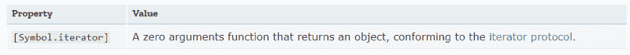
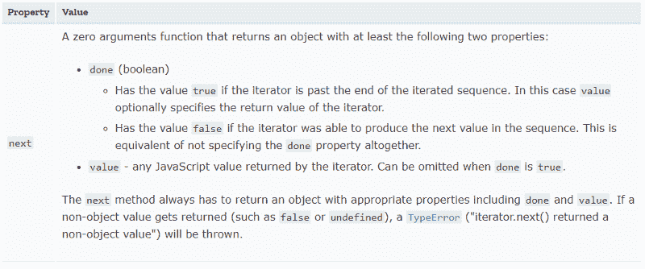

# 如何不害怕 JavaScript 有趣的部分

> 原文：<https://www.freecodecamp.org/news/how-not-to-be-afraid-of-javascript-part-2-625a3869819b/>

#### 本系列的第 2 部分讨论迭代协议、for 循环和生成器函数

这是精通 Javascript 的第 2 部分——也可能是这门语言最令人兴奋的部分。(直到第 3 部分出现，无论如何；) )

第 1 部分介绍了语言基础知识，这里我们将介绍迭代协议，它们在 for 循环中的使用，以及生成器函数。

为什么发电机在混音中起作用？如果你认为这是随机添加的，请继续阅读！生成器链接到迭代！

### 对于循环

你知道基本的 for 循环，对吧？

`for (let i = 0; i < arr.length; i++)`

你可以用它来访问数组中的元素。

您可以使用类似的东西来访问对象的属性/值:

`for ( let i = 0; i < Object.keys(obj).length; i++)`

同样，对于`map`、`set`和您定义的任何其他自定义对象也是如此。当您只需要值/属性时，编写这个循环可能会导致错误。你可能错误地使用了长度属性，你可能只犯了一个错误，或者你可能认为`Object.keys(obj).length`很丑(我就是这么想的)。

因为应该有一个最好的方法来做事情，这里我们有了`for...of`和`for...in`循环！…最好的一件事，对吗？

嗯，是的。它们都是迭代某些东西的循环，但这是相似性的终点，正如我们将在下面看到的。

### For…of 循环

让我们从尝试迭代对象中的值开始。

访问数组中的元素:`for (let val of arr)`

要访问对象的值:`for (let var of Object.values(obj))`

很美，不是吗？这就引出了一个问题，为什么`for (let var of obj)`不能简单地工作呢？

让我们更深入地了解这是如何工作的，以及在哪里可以使用`for…of`循环。最重要的是，你的类/对象如何利用这一点。

欢迎来到`iteration`协议的世界。

首先，简单介绍一下协议。

如果你以前和 [OOP](https://en.wikipedia.org/wiki/Object-oriented_programming) 打过交道，那么你可能知道什么是接口:它是一个对象可以做的动作的描述，就像一个契约。如果你想做`X`，你需要在契约中定义一个做 x 的函数，比如`doX(a,b,c)`，它接受参数 a，b，c，同理，协议也是 Javascript 中的接口。

Javascript 中有两个迭代协议:

### 可迭代协议

该协议使 JS 对象能够确定它们的迭代行为。它使一个对象能够被迭代。它还决定了迭代的确切内容。该接口要求在原型链的某处有一个[Symbol.iterator]方法。



MDN documentation

### 迭代器协议

这个协议决定了我们的 iterable 协议返回迭代值的方式。呃？举个例子会更清楚。

我喜欢这样看，迭代器协议定义了迭代器的类接口。(如果你再看看这个名字，这似乎很明显，是吗？迭代器协议=迭代器接口。看，妈妈，我现在会写字了。)

回到我们亲爱的文档:



[Source](https://developer.mozilla.org/en-US/docs/Web/JavaScript/Reference/Iteration_protocols#The_iterator_protocol)

所以，我们的迭代器接口完全由对象上`next()`函数的存在决定。

这里要强调的一点是，实现迭代器和可迭代协议被认为是最佳实践，因为有些函数/语法可能期望前者，而有些则期望后者。这样做使您能够在迭代器中同时使用这两者。这里有一个很好的例子:

```
const iteratorObject = {
 next() {
     const value = Math.random();
     if ( value < this.threshold ) {
         return { done: false, value}; 
     }
     return { done: true};
 },
 [Symbol.iterator]: function() {
     return this;
 },
 threshold: 0.7
}
```

美妙之处在于迭代器的`[Symbol.iterator]`部分。通过定义这一点，我们允许迭代器暴露于各种需要可迭代协议的函数和语法，而不仅仅是迭代器协议。你能用这个做什么？

还记得 spread 运算符吗？—它也接受可迭代协议！

```
>[...iteratorObject] 
[0.03085962239970308, 0.20649861146804716]
```

当然，还有这个故事开始的地方`for...of`。

```
>for (let val of iteratorObject) {
    console.log(val);
}
0.6234680935767514
0.525812241023621
```

在引擎盖下，我们现在可以理解发生了什么:所有这些方法都使用`[Symbol.iterator]`来生成迭代器，并使用`next`对其进行迭代！

```
>const iter = iteratorObject[Symbol.iterator]()
undefined
>iter.next();
{done: false, value: 0.04474940944875905}
>iter.next();
{done: true}
```

当你不需要自己去做的时候，事情会变得更简单。有一点我们还没有触及，那就是与`for...of`循环密切相关的:`for...in`。有什么区别？让我们深入研究，从我们的例子开始！

### 对于…循环

```
>for (const val in iteratorObject) {
    console.log(val);
}
next
threshold
```

简单看一下，差别似乎很明显:`for...in`获取属性，而`for...of`获取值！那为什么[Symbol.iterator]不见了呢？嗯，有两个原因。

属性上存在可枚举的属性描述符。这决定了给定的属性是可枚举的、可配置的还是可写的。

```
> Object.getOwnPropertyDescriptors(iteratorObject)
{ next:
   { value: [Function: next],
     writable: true,
     enumerable: true,
     configurable: true },
  threshold:
   { value: 0.7,
     writable: true,
     enumerable: true,
     configurable: true },
  [Symbol(Symbol.iterator)]:
   { value: [Function: [Symbol.iterator]],
     writable: true,
     enumerable: true,
     configurable: true } }
```

`for...in`循环遍历可枚举描述符设置为 true 的属性，以及非符号属性。这就解释了，对吧？为了确认，您可以向对象添加一个新属性，将 enumerable 设置为 false，它不会出现在`for...in`循环中。

```
Object.defineProperty(iteratorObject, "newHiddenProperty", {
    enumerable: false,
    value: "hidden",
})
```

果然，还是不在。`Object.keys()`使用完全相同的方法。

```
>for(const val in iteratorObject) {
    console.log(val);
}
next
threshold
```

回到让我们掉进这个兔子洞的问题——为什么`for(let val of obj)`不工作呢？现在你知道了，对吧？因为在对象原型上不存在可迭代的协议！

为什么不呢？简单的回答就是——语言设计选择。他们为什么选择这个？因为很多对象都是从基对象继承的。在基本对象上有一个可迭代的协议意味着让所有这些对象都是可迭代的。举个例子:你的 date 对象变成了 iterable，这没有任何意义。

### ForEach 循环

这就把我们带到了最后一种 for 循环:forEach 循环。我见过人们对为什么`forEach`不能在任何地方工作(比如在物体上)感到困惑，我将在这里回答这个问题。

简单回答— `Array.prototype.forEach()`。

`forEach`循环只为数组定义！所以，你只能在数组中使用它们。现在，`forEach`并不关心这个数组来自哪里。它可以是简单的本机数组，也可以是由对象生成的数组，如 Object.keys()。

结束循环部分，有一个常见的问题。

当使用 JS 中的对象作为映射(或者字典、hashmap)时，当一些键与原型链上的属性一致时，您可能会遇到问题。

考虑这个例子:

你有一个对象，它带有你想要循环的键。

```
const baseObject = {
  a: 1,
  b: 2,
  someProperty: function() {
    return 4;
  }
}

const myObjectMap = Object.create(baseObject);

myObjectMap.c = 3; // key set in map for some reason.

for(let val in myObjectMap) { // this iterates up the chain!
  console.log(val);
}

> c
 a
 b
 someProperty
```

你可能只是想看看`c`，你设定的键。您可以通过以下方式解决此问题:

```
for (let val in myObjectMap) {
  if (myObjectMap.hasOwnProperty(val)) {
    console.log(val);
  }
}

> c
```

因此，有两条规则可以避免这个问题:

1.  总是使用`hasOwnProperty()`来检查你正在寻找的键是否存在于对象中(而不是在原型链上)
2.  永远不要在你的字典/地图中使用`hasOwnProperty`作为关键字。

如果你已经覆盖了`hasOwnProperty`，仍然有办法使用它，因为它是对象原型的一个方法。

```
myObjectMap.hasOwnProperty = 4;

for(let val in myObjectMap) {
    if (myObjectMap.hasOwnProperty(val)) {
        console.log(val);
    }
}
> Uncaught TypeError: myObjectMap.hasOwnProperty is not a function
    at <anonymous>:4:21

// instead, we can do: 
for(let val in myObjectMap) {
    if (Object.prototype.hasOwnProperty.call(myObjectMap, val)) {
        console.log(val);
    }
}

> c
  hasOwnProperty
```

[还记得上一部的`call`和`apply`吗？这是使用它们的一种很棒的方式。](https://neilkakkar.com/How-not-to-be-afraid-of-Javascript-anymore.html#the-new-keyword-and-apply)

### 发电机功能

[发生器功能](https://developer.mozilla.org/en-US/docs/Web/JavaScript/Reference/Statements/function*)允许按需进入和退出功能。入口和出口都是固定的。就像多次入境签证。

它们是完成困难任务的强大工具。

我认为生成器函数是这样的:它们有助于动态创建一个值列表，而没有数组的开销。

为什么不直接迭代一组值呢？发电机节省空间。开始时没有数组，只有从“数组”中获取下一个元素所需的计算(或 I/O)。

让我们深入了解它的机制。

调用生成器函数并不执行函数体，而是返回函数的迭代器对象。当您调用迭代器的`next()`方法时，执行主体。固定退出点呢？不执行整个主体，而是直到主体中的下一个`yield`表达式。

这个`yield`表达式还指定了要返回的值。

让我们用一个例子把这个概念具体化。让我们看看第 1 部分中的 tweet 示例。

```
function * generateTweets(userID, numberOfTweets) {
    for(let i=0; i< numberOfTweets; i++) {
        const tweet = randomTweetGenerator(); // assume this gives you a string of words < 280 characters.
        yield { tweet, userID, tweetID: i};
    }
}

const tweetList = generateTweets('neilkakkar', 3);
for( let tweet of tweetList) {
	  console.log(tweet);
}

> {tweet: "hi", userID: "neilkakkar", tweetID: 0}
  {tweet: "how's it going?", userID: "neilkakkar", tweetID: 1}
  {tweet: "I'm automagic", userID: "neilkakkar", tweetID: 2}

console.log(tweetList.next());
>    {value: undefined, done: true}
```

好吧，这里发生了很多事。我们来分解一下。

首先，我们有函数生成器，它根据 userID 和要生成的 tweet 数量生成 tweet。这个函数将返回一个迭代器对象。因此，这就是`tweetList`是什么。

```
> tweetList
generateTweets {<suspended>}
    __proto__: Generator
    [[GeneratorLocation]]: VM2668:1
    [[GeneratorStatus]]: "suspended"
    [[GeneratorFunction]]: ƒ * generateTweets(userID, numberOfTweets)
    [[GeneratorReceiver]]: Window
    [[Scopes]]: Scopes[3]
```

暂停意味着发电机还没有关闭/完成。所以，它能提供价值。我们可以通过`tweetList.next()`来访问它们——这将给我们一个带有两个键的对象，`value`和`done`。

另一方面，`for...of`循环理解迭代协议，因此它们可以自己迭代整个生成器！

这正是为什么我们可以在`tweetList`上做`for...of`并获得我们的推文。

至此，发电机完成。`for...of`循环消耗所有值。

> 常见问题:如果在`for...of`循环中有一个 break 语句，生成器也会关闭。所以，不能再重复使用了。参见:[不要在 for 中重复使用发电机..成圈的](https://developer.mozilla.org/en-US/docs/Web/JavaScript/Reference/Statements/for...of#Iterating_over_generators)。

我们这里有

```
> tweetList
generateTweets {<closed>}
    __proto__: Generator
    [[GeneratorLocation]]: VM2668:1
    [[GeneratorStatus]]: "closed"
    [[GeneratorFunction]]: ƒ * generateTweets(userID, numberOfTweets)
    [[GeneratorReceiver]]: Window
```

因此，当我们记录下一行中的下一个值时，我们得到了预期的`done: true`——没有值。

例子到此为止。

但是，故事并没有到此结束。你也可以让发电机屈服于发电机！你可以通过`yield *`来完成。

```
function * generateTweetsForSomeUsers(users, numberOfTweets) {
    for(let user of users) {
        yield * generateTweets(user, numberOfTweets)
    }
}
```

发电机也可以用`return`代替`yield`。这将导致生成器结束。

好了，这已经进行了足够长的时间，我想我会把其他酷的部分留给下一部分。有趣的事实？我们将彻底消除 for 循环。欢迎来到地图、过滤和简化的世界。

阅读更多我在 neilkakkar.com 的博客文章。