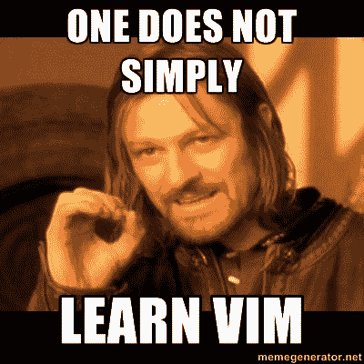

# 如何不再害怕维姆

> 原文：<https://www.freecodecamp.org/news/how-not-to-be-afraid-of-vim-anymore-ec0b7264b0ae/>

#### 最流行的命令以及如何使用它们

如果您曾经使用过 Vim，您就会知道要达到与“普通”GUI 编辑器相同的速度有多困难。但是一旦你这样做了，回报是指数级的——你写代码的效率会更高。当然，这不是这篇文章的主要原因。

大部分时间花在——或者应该花在——设计问题的解决方案上，而不是实际编码；因此，优化编码速度似乎是最不需要关注的事情。这不是一个杠杆点。

这篇文章的形成是因为另一个原因:SSH 机器上不存在 GUI。你现在打算做什么？任何可以访问终端并想要编辑文件的机器—您有两种选择:

1.  放弃，尝试关闭 Vim
2.  我来了

仅仅复制一份`[vimtutor](https://superuser.com/questions/246487/how-to-use-vimtutor)`对任何人都没有帮助。所以在这里，我使用了一种不同的方法:我收集了我作为一名软件开发人员在日常生活中使用的 vim 的最佳部分，以及用来记住这些内容的助记符。这几乎包含了常规编辑和写作所需的一切。

### 基础知识

听我说，这与命令无关，而是命令背后的意识形态！

#### 模式

Vim 有两种模式:

*   正常(命令模式)
*   插入(编辑模式)

当您打开 Vim 时，您以正常模式启动。要随时返回正常模式，按下`ESC`键。正常模式是您可以发布命令的地方:命令列表是无穷无尽的！

有很多方法可以进入插入模式。最直观的就是使用`i`命令。`i`为插入。在正常模式下，按下`i`，你将进入插入模式。现在你输入的任何东西都会出现在编辑器中。最大的障碍之一，排序。

心智模型——理解这个想法:因为没有 GUI，所以没有鼠标点击的概念。没有菜单可供选择，没有右键。因此，你需要一种方法在键盘上实现这一切——你唯一的输入来源。

拥有两种模式可以实现这一点！你可以把普通(命令)模式想象成菜单栏和鼠标，而插入模式就像 GUI 编辑器中的普通模式(你输入的内容会显示在屏幕上)。

#### 话

对 Vim 来说，单词对我们的意义几乎相同——由空格或特殊字符分隔的一组字符。命令是`w`。

#### 命令解剖学

Vim 中的命令遵循一种固定的模式。了解这一点将有助于将每个命令放入特定的命令桶中，从而为相同的命令建立更好的心理模型。

命令看起来像这样:

【动作】<number>【动作】</number>

动作是你想做的，

这个数字是你想做这个动作的次数，

运动是行动的范围。

议案是范围。举个例子会更清楚。比方说，我们想删除从光标开始的接下来的 3 个单词。这里，动作是删除，数字是 3，动作是一个单词。删除的命令动作是`d`。

因此，我们得到最后的命令:`d3w` —删除接下来的 3 个单词。

省略数字默认为一次。

动作可以在没有动作的情况下使用，默认为导航。因此，在命令模式下键入`w`会将光标向前移动一个单词。

我们现在已经准备好开始学习命令本身(以及使用它们的一系列动作)

### 有用的命令

#### 如何关闭 Vim

首先，我们不想在没有退出计划的情况下被困在 Vim 的土地上。永远要有退出策略。

`:q`退出

`:q!`强行退出

`:wq`保存并退出

#### 命令操作

`d`:删除

`i`:插入

`p`:上传/粘贴

`y`:猛拉/复印

`x`:剪切

`u` : **撤销**

`di`:删除内侧*，`yi`:猛拉内侧*

`v`:视觉/选择

`/`:搜索

`%`:括号匹配，开发者欢喜！

`:s`:替身！换句话说，寻找-替代类固醇

由于整条生产线上的动作非常频繁，vim 的开发人员为它们创造了一种新的速记方式——省略了添加动作的需要。重复该动作，应用于整条线。例如:

删除当前行:`dd`

复制当前行:`yy`

很整洁，不是吗？

#### 命令动作

正如我们所见，动作伴随着动作，可用的动作随着动作而变化。然而，有些动作相当一致。

下一个单词的开始(我们以前见过这个！)

`e`:当前单词结束

`b`:前一个单词的开头

箭头键/ <h>:各自的动作。h，j，k，l 是箭头键的替代品，也是 Vim 中速度的来源:你不用把手从键盘的打字部分移开。</h>

`$`:行尾

`0`:行首

`G`:文件结束

`nG`:跳转到行号`n`

`)`:向前跳一句

`}`:向前跳一段

这有助于更好地形象化:

```
 ge      b          w                             e
           <-     <-         --->                          --->
    This is-a line, with special/separated/words (and some more). ~
       <----- <-----         -------------------->         ----->
         gE      B                   W                       E
```

有了这些动作和运动，我们可以在 Vim 中创建大多数基本命令。以下是 8 个日常功能的列表。想出让它们发生的命令！

1.  删除接下来的 3 行(包括当前行)
2.  复制当前单词—光标位于单词的开头
3.  复制当前单词—它有特殊字符—光标在单词中间
4.  向下导航 10 行
5.  删除花括号内的所有内容
6.  向上移动 2 个段落
7.  粘贴之前选择的文本 5 次。
8.  编辑光标所在的位置:“我现在可以 Vim 了！”

…

等着吧…

…

以下是解决方案:

1.  `d3j`
2.  `yw`
3.  `yiW`:里面的猛拉是往里面猛拉，`W`是往什么里面猛拉(当前词)。这非常有用，你可以和`inside`进行各种组合！
4.  `10j`
5.  `di}`:就像#3 一样。
6.  这更直观一点。`{`是上一个帕拉，`}`是下一个帕拉
7.  还记得解剖命令中的可选数字吗？它们几乎可以在任何地方使用
8.  `i` `I can Vim now!` : `i`是进入插入模式，然后你可以像在“普通”编辑器中一样工作

好吧，你做到了！恭喜你，这足够你自己去探索了，冒险家。教程结束了。祝你好运。

如果有人问你关于 Vim 的问题，你可以做得比使用这个 meme 更好。给他们解释一下，或者点这里；)



> *注意:这是我的 Vim 模型。这并不完全是内部运作的方式。如果你看一下文档(:help user-manual)，你会看到 d 是命令，而 motion 是 iw，或者“inside word”。有偏差。
> 为什么？因为我觉得这有助于更好地解释。

### 奖金

以下是一些有用的额外命令:

#### 分画面银幕

`:vsplit <filena`我>

创建垂直拆分。使您能够从一个屏幕复制粘贴到另一个屏幕。

在屏幕分割之间循环:`<ctrl-w> &l`t；ctrl-w >

或者，您可以像这样使用箭头键/ `hjkl`:

`<ctrl-w` > h 转到上一屏幕。

您可以像平常一样关闭窗口(`:q`)，或者—

`:only` —关闭所有其他窗口

#### 多个选项卡

me 在 Vim 的新标签页中打开一个新文件

`:tabn`转到下一个标签页(或`:gt`

`:tabp`转到上一个标签页(或`:gT`

同样，您可以从一个选项卡复制粘贴到另一个选项卡。

您也可以将这个组合映射到您选择的键上！

我试过 ab>，但是那已经被预订了。真扫兴。相反，我们有:

```
map <C-t><left> :tabp<cr>
map <C-t><right> :tabn<cr>
```

这意味着<ctrl-t>后面跟着向左或向右箭头键可以让你在标签之间切换。</ctrl-t>

我到底是怎么想出这个映射的？[看看这个教程](http://vim.wikia.com/wiki/Mapping_keys_in_Vim_-_Tutorial_(Part_1))。

本系列的其他故事:

*   [如何不再害怕蟒蛇](https://medium.freecodecamp.org/how-not-to-be-afraid-of-python-anymore-b37b58871795)
*   [如何不再害怕 GIT](https://medium.freecodecamp.org/how-not-to-be-afraid-of-git-anymore-fe1da7415286)

喜欢这个吗？不要再错过任何帖子了——订阅我的邮件列表吧！