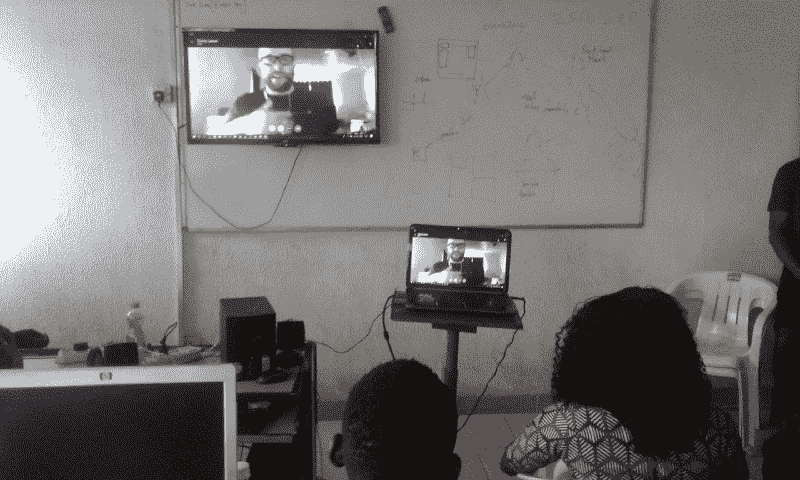
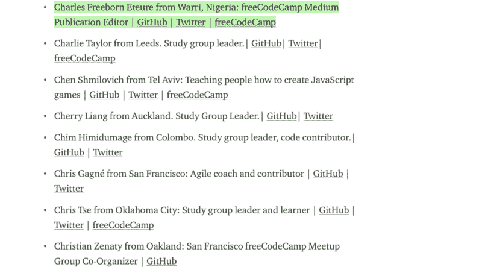

# 做一年自由代码营的志愿者编辑改变了我的生活

> 原文：<https://www.freecodecamp.org/news/how-one-year-of-being-a-volunteer-editor-for-freecodecamp-has-changed-my-life-182057986483/>

直到我被评为 [2018 年度最佳贡献者](https://medium.freecodecamp.org/announcing-our-freecodecamp-2018-top-contributor-award-winners-861da08a77e1)，我才知道我作为一名志愿编辑与 freeCodeCamp 合作产生了多大的影响。

Charles Freeborn speaking at the Google I/O Extended 2018 Warri

2017 年夏天，[自由代码营的创始人昆西·拉森](https://www.freecodecamp.org/news/how-one-year-of-being-a-volunteer-editor-for-freecodecamp-has-changed-my-life-182057986483/undefined)发表了一篇文章，请求[志愿编辑帮助领导 Medium 最大的科技出版物](https://medium.freecodecamp.org/seeking-a-volunteer-editor-to-help-lead-mediums-largest-technology-publication-26fe3670ea09)。我读了这篇文章，并主动联系昆西，让他自愿花时间为刊物编辑文章。

在联系昆西之前，我收到了一些我申请的组织的拒绝邮件——要么是技术写作，要么是网站开发。所以当他给我机会的时候我很激动。

我做这个决定已经一年了，天哪，我真高兴我迈出了这一步。或者像我们在尼日利亚社交媒体领域所说的那样——值得一试。

史蒂夫·乔布斯在斯坦福大学的毕业典礼演讲中谈到了将点点滴滴串联起来——向前看，你不可能将点点滴滴串联起来；你只是把它们联系起来。

我当时并没有意识到，我做志愿者这个简单的行为会给我的生活带来多大的改变。我只想回报这个平台，它一直站在帮助数百万人(包括我自己)免费学习编码并最终获得一份开发人员的工作的第一线。

例如，因为我是 freeCodeCamp 媒体出版物的志愿者，所以我成为了一名技术社区构建者。今年早些时候，我向谷歌开发者社区申请在尼日利亚瓦里(T3)成立谷歌开发者小组(GDG)T2 分部。我在 freeCodeCamp 的工作有助于获得 GDG 分会的批准。下面是关于[我如何将社区发展到 100 名成员](https://medium.freecodecamp.org/how-i-started-a-google-developers-group-gdg-chapter-in-warri-nigeria-and-reached-100-members-22cbd622d070)(目前超过 250 名成员)的故事。

### 编辑生活中的一天

我并不是在伸手成为编辑之后才开始编辑文章的。我必须接受培训——我第一次尝试编辑一篇样本文章，结果从原文中删掉了 300 个单词——这意味着我改变了作者太多的声音。

昆西训练我如何巧妙有效地编辑文章。他曾是 freeCodeCamp 媒体出版物的唯一编辑，需要帮助。我不得不通过学习专门为志愿者编辑准备的[编辑手册](https://medium.freecodecamp.org/the-freecodecamp-medium-publication-editor-handbook-cb5876d1ef23)来学习如何保持作者的原声。昆西让每个人都可以使用它，这样我们幕后的过程就尽可能的透明。

作为编辑，我们努力确保我们发布的文章符合读者的需求(web 开发、数据科学、人们向技术转型的鼓舞人心的故事、web 设计等等)。我们还希望它们能容易被读者接受，同时保持作者的原声。然后是制作吸引人的标题的艺术(请不要点击诱饵！)—人们都很忙，大多数时候他们阅读一篇文章的决定只受标题的影响。

### 观点的改变和学到的最重要的一课——金钱对人

> "一个人不会有所作为，除非他能改变人们的生活。"—约瑟夫·熊彼特

我从提交给我们出版物的技术文章中学到了很多技术知识。但是所有这些信息都没有打败我在过去一年里学到的最重要的一课——我们正在对人们的生活产生影响。

关于生活中真正重要的东西:人，我的观点已经改变了。我曾经认为拥有金钱决定了一个人有多成功。我们的社会天生就让我们相信这种幻想。但事实并非如此。你在其他人的生活上投资多少，可以衡量你作为一个个体有多成功。

恰当的例子？昆西·拉森——他正带领数百万人免费学习编程。对我来说，昆西是一个巨大的成功，因为他影响了许多人的生活。我和他的交往对我的生活产生了巨大的影响。

Proudest moment of my life: Hosting Quincy Larson as a remote speaker at the first meet-up I (Charles Freeborn) organized

随着时间的推移，我已经意识到，当你用你的个性投资来影响你周围的世界时，你的生活才真正有价值。即使他们永远不会知道你为了让他们的生活和工作更轻松做了多少，这也是值得的。

例如，像我一样的志愿者编辑团队帮助来自世界各地的 freeCodeCamp Medium 出版物的作者编辑他们的文章，以便他们易于阅读和接近。

但是作者可能永远不知道是哪位编辑帮助他们完善了作品。或者根本没有编辑。

但是帮助人们——不管是否得到认可——是我为什么在我的当地社区瓦里成立了一个 GDG 分会的主要原因之一，也是我为什么为 freeCodeCamp 编辑文章的原因之一。我开始帮助人们成为软件开发人员(我在这里[写了这个](https://medium.freecodecamp.org/how-i-started-a-google-developers-group-gdg-chapter-in-warri-nigeria-and-reached-100-members-22cbd622d070))——这是一件很棒的事情。

经常有人问我一个问题:“查尔斯，你是如何在志愿参加 freeCodeCamp 的同时生存下来并照顾家人的？”昆西·拉尔森曾经在 Quora 上回答过这个问题，关于他如何在 100%工作在 freeCodeCamp 的同时养活自己和家人。剧透一下——这是一篇很长的文章，如果你真的想知道，那就在这里读吧。

### 邀请参加 freeCodeCamp 顶级贡献者的活动

Charles Freeborn named freeCodeCamp 2018 top contributor

2018 年 6 月 11 日早上，我的收件箱里收到了一封电子邮件——它来自昆西。当我读到它的时候，我立刻被淹没了。我拍了拍妻子的肩膀，告诉她昆西·拉森刚刚邀请我参加在纽约、都柏林和/或香港举办的自由代码营顶级贡献者活动。

我非常荣幸能够入选 2018 年度 200 名免费代码营最佳贡献者。我祝贺你们每一个人！对于技术出版物的品尝者(编辑团队)，也为你们所有人干杯。

我希望参加一个顶级贡献者活动，并会见一些 freeCodeCamp 平台的出色贡献者。

*感谢阅读！你可以给这篇文章一些掌声，让其他人也能看到。我可以受雇——前端开发、技术写作或编辑。给我发邮件:Charles . eteure[at]Gmail[dot]com*