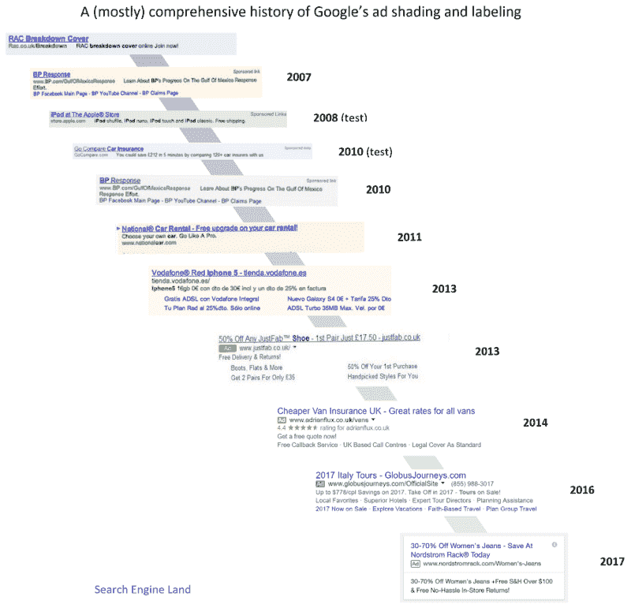

# 开源教科书如何降低大学费用

> 原文：<https://www.freecodecamp.org/news/how-open-source-textbooks-are-reducing-the-cost-of-college-2ad2e81c02a1/>

在过去的 10 年里，美国的教科书价格上涨了 88%。这导致了超过 1 万亿美元的学生贷款债务，美国人正在努力偿还。

现在，大学系统正转向一个强大的成本节约工具:开源。

马里兰大学正在向“在 2017 年秋季通过高入学率课程采用、适应或扩大 OER[开放教育资源]使用的教师发放补助金，这些课程都是优质 OER 的课程。”

你可以在这里浏览大量的开源计算机科学教科书。

你可以在这里阅读更多关于高等教育开源教科书运动的信息

以下是其他三个值得你花时间去做的链接:

1.  搜索引擎优化的秘密:逆向工程谷歌的算法( [15 分钟阅读](https://fcc.im/2p50Yil))
2.  域名系统(DNS)是如何工作的，你如何使它变得更好( [8 分钟阅读](https://fcc.im/2oKh5hY))
3.  如何利用本地存储构建闪电般速度的应用( [8 分钟阅读](https://fcc.im/2pjhBVV))

### 想到这一天:

> "一撮概率抵得上一磅也许."—詹姆斯·瑟伯

### 每日一图:

谷歌广告每年看起来更像正常的搜索结果。55%的谷歌用户甚至没有意识到他们正在点击广告。图片来源:[搜索引擎登陆](https://fcc.im/2q8r2KF)。

### 今日学习小组:

[freeCodeCamp Kitchener-Waterloo](https://fcc.im/2piUJWx)

编码快乐！

–昆西·拉森，自由代码营的老师

如果你从这些邮件中获得了价值，请考虑[支持我们的非营利组织](http://bit.ly/donate-to-fcc)。