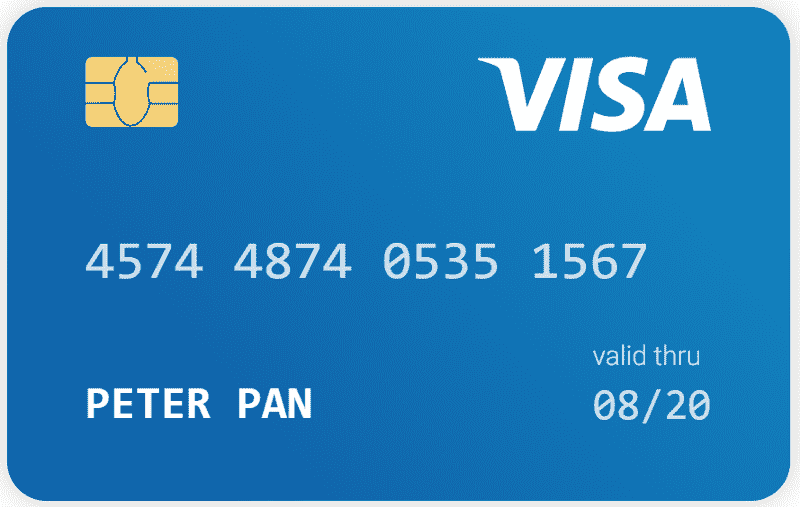
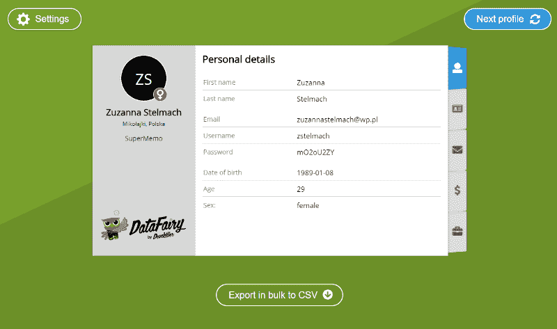

# 我们的测试数据生成器如何让假数据看起来像真的

> 原文：<https://www.freecodecamp.org/news/how-our-test-data-generator-makes-fake-data-look-real-ace01c5bde4a/>

汤姆·温特

# 我们的测试数据生成器如何让假数据看起来像真的


Photo by [Buzz Andersen](https://unsplash.com/photos/IOKqP2VnHoc?utm_source=unsplash&utm_medium=referral&utm_content=creditCopyText) on [Unsplash](https://unsplash.com/search/photos/mannequins?utm_source=unsplash&utm_medium=referral&utm_content=creditCopyText)

我们最近发布了 [DataFairy](https://devskiller.com/datafairy/?utm_source=Medium&utm_medium=referral&utm_campaign=FreeCodeCamp&utm_term=Thomas&utm_content=How%20our%20test%20data%20generator%20makes%20fake%20data%20look%20real) ，一个生成测试数据的免费工具。但首先，让我告诉你它是如何产生的。

这是一个关于我们如何把一个有趣的开源项目变成真正有用的东西的故事。

这不是假新闻，也不是欺骗群众。但事实仍然是，对于开发人员、软件测试人员，以及任何真正做过演示的人来说，虚假数据是必不可少的，而且很难立即编造出来。

我们关于虚假数据的故事要追溯到我们第一次开发 SaaS 工具 [Devskiller](https://devskiller.com/?utm_source=Medium&utm_medium=referral&utm_campaign=FreeCodeCamp&utm_term=Thomas&utm_content=How%20our%20test%20data%20generator%20makes%20fake%20data%20look%20real) 的时候。像所有的应用程序一样，我们需要用户。在这一点上，我们甚至没有寻找付费用户。我们的申请只需要候选人简介。我们需要的是看起来真实的虚拟数据。

### 我们需要一个测试数据生成器

我们需要假数据有几个原因:

**1。我们需要看看我们的系统是否工作正常**

这意味着我们需要构建许多不同的虚拟概要文件，以查看系统是否正确地存储和显示它们。

**2。我们需要销售我们的产品**

我们需要为我们的第一批潜在客户做演示。我们希望向我们的客户展示，在邀请和测试数百名候选人 6 个月后，系统会是什么样子。

我们首先想到的是寻找一个可用的测试数据生成器。但问题是，数据很难令人信服地造假。问问这个人，

或者他，

### 许多数据都经过算法验证

如果制作令人信服的数据很容易，我们可能就不需要工具了。但是，由于几个原因，生成数据可能很棘手。

假数据不仅仅是随机数。以信用卡号码为例。大多数信用卡号码都是基于一种叫做[卢恩算法](https://www.fivecentnickel.com/how-do-you-know-if-a-credit-card-number-is-valid/)的东西。为了解释这一点，我们将以 Visa 卡为例:


Photo by Dom J from [Pexels](https://www.pexels.com/photo/business-bank-chip-credit-card-45111/)

### 如何检查信用卡号码是否有效

开始之前，重要的是要知道所有的 Visa 卡号都是以 4 开头的。此外，它们都有 16 或 13 位数。

拿着这个 Visa 卡号:



Source: [React Credit Cards](https://github.com/amarofashion/react-credit-cards)

您需要做的第一件事是，从序列中的第一个数字开始，将交替的数字加倍，看是否能够验证该数字。

```
4574487405351567
```

```
(4x2), (7x2), (4x2), (7x2), (0x2), (3x2), (1x2), (6x2)
```

```
8, 14, 8, 14, 0, 6, 2, 12
```

如果你刚刚做的加倍得到一个两位数的数，把它们加在一起得到一个一位数。

```
8, 5, 8, 5, 0, 6, 2, 3
```

然后，您需要回到原来的信用卡号码，并替换您将新值翻倍的数字。

```
8554885405652537
```

这可以是双精度值，也可以是数字相加的值表。现在全部加起来。

```
8+5+5+4+8+8+5+4+0+5+6+5+2+5+3+7=80
```

然后检查总和是否能被 10 整除。在这种情况下，它是，所以数字是有效的。

你需要某种计算算法来大规模验证信用卡号码。但是信用卡号码是相对容易得到的数据。我们不仅仅需要个别的可证实的数据，我们需要完整的资料。

### 可验证的概要文件需要不同种类的数据，这些数据在逻辑上相互关联

信用卡号相对容易生成，因为它们只与自己相关。但是个人身份号码通常与一个人的其他方面有关。以瑞典的个人身份号码为例，它实际上被称为 personnummer。


Photo by [Jonathan Brinkhorst](https://unsplash.com/photos/FMtCI4zIVGk?utm_source=unsplash&utm_medium=referral&utm_content=creditCopyText) on [Unsplash](https://unsplash.com/search/photos/sweden?utm_source=unsplash&utm_medium=referral&utm_content=creditCopyText): Sweden is a practical country

对于那些不知道的人来说，个人电脑是为纳税而设计的，有点像美国的社会安全号码。但它们也被用作获得医疗保健和学校等服务以及信用评级等非政府服务的一种方式。

personnummer 的格式与信用卡略有不同。它是一个 10 位数的数字，分为由连字符连接的 6 位数和 4 位数。

酷事实:超过 100 岁的瑞典人会用一个[加号](https://www.oecd.org/tax/automatic-exchange/crs-implementation-and-assistance/tax-identification-numbers/Sweden-TIN.pdf)来代替他们称呼中的连字符。

personnummer 中的前六位数字很简单，使用 YYMMDD 格式对应此人的生日。第二个 4 位数部分的前三位是序列号。第三个序列号数字对男性来说是奇数，对女性来说是偶数。最后一个数字是校验和数字。

所以如果你拿这个人名来说:

```
601128–9235
```

你知道这是给一个 1960 年 11 月 28 日出生的人的。

```
60(year)11(month)28(day)-(under 100 years old)92(unique numbers)3(unique odd number for male)5(checksum digit)
```

要计算校验和，请将身份号码中的各个数字乘以号码 212121–212 中的相应数字。

```
(6x2)(0x1)(1x2)(1x1)(2x2)(8x1)(9x2)(2x1)(3x2)
```

```
12, 0, 2, 1, 4, 8, 18, 2, 6
```

就像上面的 Visa 卡一样，如果这些数字的乘积是两位数，只需将两位数相加即可。

```
3, 0, 2, 1, 4, 8, 9, 2, 6
```

将所有剩余的产品加在一起。

```
3+0+2+1+4+8+9+2+6=35
```

要获得校验和位数，从 10 中减去相加乘积的最后一位数(例外情况是，如果最后一位数为零，则校验和也为零)。

```
10–5=5
```

因此，如果你要生成这个人的个人资料，它不可能是一个出生于 1916 年 4 月 10 日的女人。她的 personnummer 应该是这样的:160410+1244。换句话说，你不能随便拿出一个随机数，然后指望它能和你生成的任何一个假档案一起工作。

### 我们需要逻辑测试数据

这些数据需要以一种逻辑的方式相互关联，因为 personnummer 不是唯一一个建立在外部信息基础上的数据。大多数类型的标识号以某种方式与其他信息相关。我们根本找不到一个可以做到这一点的测试数据生成器，所以我们决定自己构建一个。看起来我们不是唯一有这个问题的人。

### 仙女

作为开源社区的定期贡献者，我们决定生成我们需要的测试数据的最好方式是构建我们自己的库。我们称之为 [JFairy](https://github.com/Devskiller/jfairy) ，我们的目标是让它生成可验证且有逻辑联系的数据集。

这样我们就可以用用户来填充我们的应用程序。我们的用户数据不可能是乱码，否则就无法估算。因此，我们将这个库投入使用，它的表现比我们预期的要好。它甚至会时不时地生成真人。我们发现这一点是因为我们使用了 [Gravatar](https://en.gravatar.com/) 来显示候选图片。当一张真实的照片出现在我们的测试账户上时，我们很惊讶。


Source: [Tenor](https://media1.tenor.com/images/28855054c8ba5225bddc536a5862025b/tenor.gif?itemid=11386682)

当我们开始围绕我们的应用程序购物时，这真的很有用。我们想向企业客户展示一个平台上有 300 个不同考生的账户。如果我们没有建立 JFairy，我们可能都会尝试使用该应用程序几次，但团队中只有我们五个人。我们五个人想出 300 个有逻辑联系的假档案是不切实际的。

事实证明，JFairy 生成的数据非常有说服力，以至于新客户对我们从哪里得到所有这些人进行测试感到困惑。事实上，他们问我们是否可以帮助他们寻找新的开发人员，因为很明显我们接触了许多有技术背景的人，其中一些人实际上有经验证的技能。

### 我们需要让开源社区看看 JFairy

我们意识到这已经变得比我们自己更重要了，所以我们决定把这个系统放在开源上。第一个原因是我们都是开源代码的狂热用户。我们知道，为了获得回报，回馈社区是非常重要的。但是最重要的是，开源可以给产品带来真正的好处。通过将我们的项目放在那里，以便许多不同的开发者可以查看它，我们可以获得一些我们从来没有考虑过的新想法。

最显著的贡献是纳入了新的语言。我们构建 JFairy 只是为了给说英语和波兰语的人生成数据。毕竟，我们受到我们所熟知的语言的限制。但是当然，它可以成为许多不同国家的人的有用工具。通过开源贡献，我们已经能够添加对西班牙语、法语、德语、瑞典语和中文数据的支持。

我们还意识到，当我们接触到软件开发人员中的大量用户时，Jfairy 的应用程序远远超出了其成员知道如何编码的社区。因此，我们决定在这个库的成功基础上，开发一个可以支持更多应用程序和更多人使用它的应用程序。

### 数据仙子让每个人都能接触到假数据

事实证明，JFairy 对知道如何编码的开发人员非常有用，但他们并不是唯一会使用 JFairy 生成的数据的人。软件测试人员需要能够填充他们的系统，看看它们是否工作。销售人员和营销人员需要数据来使他们的演示看起来逼真。为了让 JFairy 对大多数人有用，我们必须让它的假数据易于访问。



带着这个目标，我们构建了 [DataFairy](https://devskiller.com/datafairy/?utm_source=Medium&utm_medium=referral&utm_campaign=FreeCodeCamp&utm_term=Thomas&utm_content=How%20our%20test%20data%20generator%20makes%20fake%20data%20look%20real) 。DataFairy 是一个由 JFairy 支持的应用程序，所以你可以访问我们的假数据，而不必先学习编码。数据呈现在整洁的笔记本界面上。要获得一个以上的假配置文件，您可以生成一个新的配置文件，或将最多 100 个配置文件的批量列表导出到一个 CSV 文件。这是一种用逻辑连接的有效数据填充软件的免费且简单的方法。


### 我们对 DataFairy 未来的计划

DataFairy 可以不断改进，并增加新的功能。除了自己的努力，我们想坚持开源社区的租户。我们继续征集新的语言加入我们的花名册，我们有一个开放的 GitHub 项目。我们也希望最终让用户添加样本数据。这将有助于我们建立一个参与者社区，帮助 DataFairy 发展壮大，为更多人提供更多帮助。

无论您是需要下载大量经过逻辑验证的数据，还是只想享受阅读弹出的配置文件的乐趣，请查看 [DataFairy](https://devskiller.com/datafairy/?utm_source=Medium&utm_medium=referral&utm_campaign=FreeCodeCamp&utm_term=Thomas&utm_content=How%20our%20test%20data%20generator%20makes%20fake%20data%20look%20real) 。