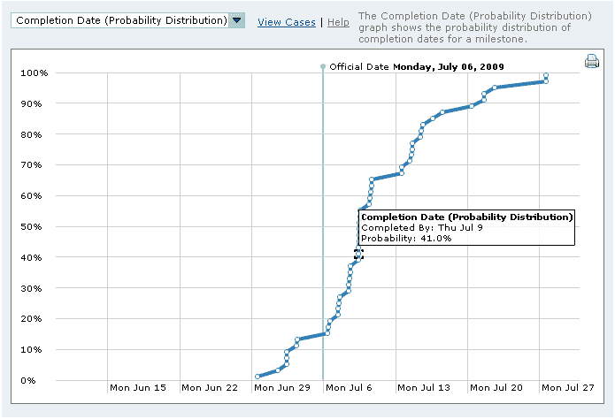
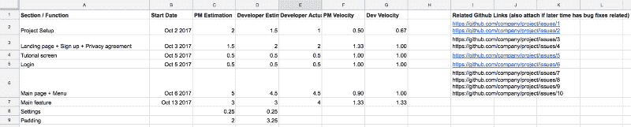
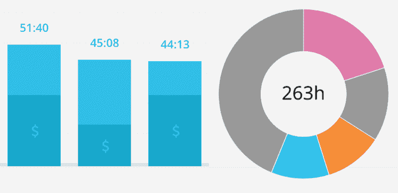
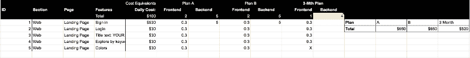

# 项目经理和开发人员如何能够(愉快地！)给出实际的发货日期

> 原文：<https://www.freecodecamp.org/news/how-project-managers-and-developers-can-both-happily-give-realistic-ship-dates-2d5e4ec42df7/>

作者 Roy Yuen

# 项目经理和开发人员如何能够(愉快地！)给出实际的发货日期

Source: Fog Creek

项目经理是期限追逐者。他们认为客户希望尽可能早的发货日期以降低成本。但这是一个常见的误解。客户真正想要的是最好的产品和最早的发货日期。

优质的产品需要精心编写的代码。开发人员应该[在 Joel 测试中使用 12 种开发方法](https://www.joelonsoftware.com/2000/08/09/the-joel-test-12-steps-to-better-code/)来确保良好的源代码控制，鼓励日常构建，并利用 QA 测试人员。现实的截止日期需要基于跟踪记录的估计。我们的项目团队希望验证我们估计的准确性，并为我们的项目经理和开发人员创建一个反馈回路。我们已经和 Fog Creek 一起做了[循证调度](https://www.joelonsoftware.com/2007/10/26/evidence-based-scheduling/) (EBS)两个月了，我想分享一下我们到目前为止学到的东西。

### 没有强迫症的循证日程安排

我们使用 Fog Creek 的 EBS 来跟踪开发人员的估计，并与他们在项目上花费的实际时间进行比较。这些数据帮助我们制定更好的项目时间表，也为项目经理和开发人员提供了一个反馈回路，以改进他们对单个任务的估计。

但是重点不是 OCD 时间跟踪工具——我们相信我们的开发人员和项目经理会在项目电子表格中输入他们的时间。

除了 Fog Creek 在他们的 [EBS 博客文章](https://www.joelonsoftware.com/2007/10/26/evidence-based-scheduling/)中提到的，这里是我们在实施中了解到的。

### 将项目分解成少于两天的任务

A template for our Google spreadsheet for EBS

正如我上面提到的，我们的 EBS 跟踪用户故事和特性的估计值和花费的时间。单个特性被分解成任务(GitHub 问题),这些任务应该在两天内完成。

开发人员仍然需要通过创建足够小的任务来精确地规划出一个特性将如何组合在一起。例如，除了说“创建购物车”，我们可以将这些任务分解成不同的项目，比如“布局购物车产品列表”这种跟踪也有利于我们的客户，因为他们可以确切地看到我们在每两周一次的冲刺中所做的工作。如果功能提前或推迟完成，他们会收到通知，不会有任何意外。

我们还跟踪我们的项目经理的时间估计，因为他们不仅仅是客户经理。他们必须有一些技术知识。对于项目经理来说，重要的是从他们的误算中吸取教训，并改进他们对未来的估计。

通过将他们的估计与开发人员对同一特性的估计进行比较，当存在较大偏差时，他们可以提出问题。他们学习什么需要更多的时间，技术债务如何影响项目，以及如何在技术上更好地工作。我们的项目管理有助于找到最佳点:他们给开发人员足够的时间来设计和编码，同时给客户提供合理的时间框架(和成本)。

### 跟踪经过的时间

Credit: [Toggl](https://toggl.com/team-time-tracking/)

由于我们公司的工作时间很随意，许多同事可能会喝咖啡休息或去聊天。对于 EBS，这些休息时间计入该功能所花费的时间。一些开发人员可能会频繁休息并快速冲刺工作，而其他人可能会连续工作四个小时。

最后，如果估计的时间和实际花费的时间是相同的，那么两个开发人员仍然是准确的。你可以通过应用程序 [Toggl](https://www.toggl.com) 检查你自己的工作估算，让计时器在休息时开启(无论多频繁或多长),直到一个功能完成。但这不是真的有必要。

因为许多任务至少需要几个小时，开发人员可以快速记录他们每天完成的问题。估计比如 0.25 天就够好了。这就是为什么我们不需要时间追踪器。

我们用“速度”来衡量估计和实际花费的时间如果估计时间和跟踪时间相同，我们给它 1。如果一个开发人员在 2 天内完成了一项任务，但估计需要 2.5 天，他们的速度是 0.8，这意味着他们低估了他们的速度。

追踪的目的不是为了变得更快。**EBS 的目标是一致性和准确性。一致性意味着团队成员可以根据过去的表现预测彼此的交付日期。准确性意味着始终达到尽可能接近 1 的速度(低范围)。**

### 将开发人员的评估分解到项目评估中

当客户带着一个项目来找我们时，我们的项目经理会分解这些功能，然后估计每个功能需要多少时间。通过添加所有的特性，包括代码审查和 QA，我们可以给出一个标准的项目评估。EBS 帮助我们了解个人开发者如何影响项目。自从我们开始追踪以来，我们已经了解了一些有趣的模式。例如，一些开发人员可能一贯高估他们的速度，因此落后于他们的估计。然而，他们仍然可能以比“平均”更快的速度完成特性，并按时完成。

由于这种行为仍然是可预测的，我们的项目经理现在知道如何调整给客户的估计。相反，如果我们有一个经常提前交付的开发人员，我们的项目经理会知道他们可能会给客户一个更精确的估计。

这正说明了证据甚至比经验更好。

### 其他 EBS 观察和学习

Photo by [NeONBRAND](https://unsplash.com/@neonbrand) via Unsplash

我们确实学到了一些有趣的东西:更有经验的开发人员不一定估计得更好。一个可能的原因是因为我们将复杂的功能委托给他们。即使有详细的计划，也有很大的不确定性。随着开发的进展，需要解决一些问题。

目标是允许开发人员和项目经理为他们还不能完全想象的任务提供缓冲时间，并对常见任务(如登录页面)使用现有的估计。

另一个观察结果是，尽管每种产品都不同，但一些共同的任务总是一样耗时。我们不应该为了削减成本而急于“优化”。

电子表格上的 EBS 和任务跟踪也帮助我们快速识别具有某些类型特征的重复延迟模式。

有证据有助于我们追踪模式，从而更好地了解我们的工作方式。但是，每个项目都是新项目。

Joel 展示了项目应该如何使用蒙特卡罗模拟，有 100 种可能的情况，每种情况有 1%的概率。这显示了基于开发人员随机选择的历史速度数据的项目的所有可能的未来。目标是缩小客户发货日期范围，而不是固定一个日期并假设每次都 100%准确。

EBS 已经证实软件开发是可能的。

### 最后的想法

Photo by [Felix Plakolb](https://unsplash.com/@felix_plakolb) via Unsplash

出于实际原因，我们仍然给客户一个项目的预计交付日期。我们还邀请我们的客户参加大本营项目，这样他们就知道我们每周都在做什么。

当一个公司或开发商(包括同事！)给你一个项目估算，不要只看总天数。不管项目长度如何，都要询问分解成特性的估计值，以及项目交付日期的过去记录。首先理解一个团队是如何进行项目评估的，然后将它纳入到你的产品的长期预算中。

你喜欢这篇文章吗？如果是这样，请点击鼓掌按钮，让更多的人看到它。谢谢大家！

？在 O [ursky](https://oursky.com) 我们致力于帮助品牌和企业家实现他们的想法。如果您正在寻找合作伙伴来帮助构建您的下一个数字产品，请联系我们。