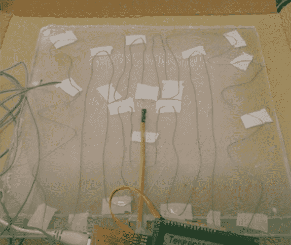
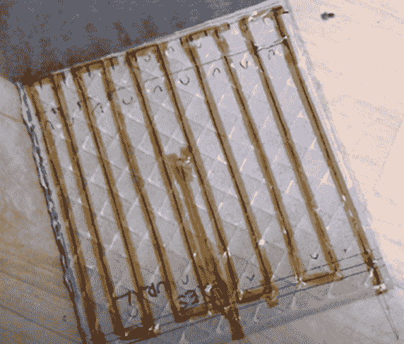
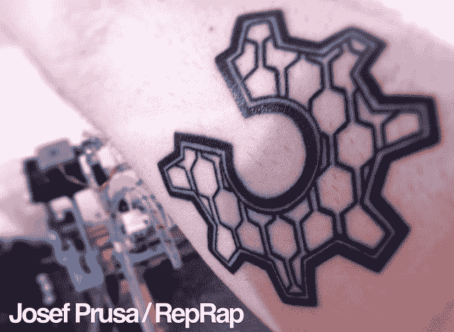

# 捷克 DJ 如何建立 3D 打印帝国

> 原文：<https://www.freecodecamp.org/news/how-prusa3d-became-one-of-the-fastest-growing-startups-in-the-world/>

2012 年，一位年轻的捷克 DJ 爱好者对他的音乐控制器上的旋钮和推子感到沮丧，所以去寻找改进它们的方法。就在那时，他遇到了 3D 打印，世界上发展最快的 3D 打印公司之一诞生了。

今天，我将向您展示 Prusa3D 是如何成为欧洲发展最快的硬件制造商之一的。然后，你可以从他们发展硬件公司的精确战略中获得灵感，并创建一个贡献者社区，他们将帮助你在几乎没有资源的情况下开发和推广你的项目。

## 普鲁莎的一些背景

普鲁萨研究公司的创始人约瑟夫·普鲁萨是 3D 打印机行业的超级明星。

你可能已经听说过他，但如果你没有…

*   普鲁萨研究公司由约瑟夫·普鲁萨于 2012 年一个人创办。
*   他与 Prusa Research 的目标是创造一种用于 3D 打印的 Thermomix，这是欧洲最受欢迎的多功能、易用的厨房设备。他想制造一台简单易用的 3D 打印机，任何人都可以使用，并有步骤和材料的指导。
*   2018 年，Prusa Research 成为中欧增长最快的科技公司(德勤 2018 年快速 50 强)，2014 年至 2018 年增长了 [17，118%](https://www2.deloitte.com/cz/en/pages/press/articles/technology-fast-500-emea-v-top-petce-hned-dve-ceske-firmy.html)
*   Prusa Research 从不起眼的起步发展到销售 100，000 台打印机，雇用 410 多名员工，并在布拉格建立了一个 9 层楼的工厂，底层是一个黑客空间
*   该公司首次将 Maker Faire 带到了布拉格
*   Prusa 的网站每月有超过 100 万的独立访问者，其 YouTube 频道有超过 144，000 名订户，其论坛有超过 143，000 名成员

约瑟夫·普鲁萨是幸运的，但他也做了很多值得我们学习的事情。

怎么会？让我们开始吧。

# 如何解决自己的问题，回馈社会，并在成长中的社区建立信任

在过山车开始之前，约瑟夫注册了一个经济学学位，让他的父母感到自豪。这导致了大量的业余时间，所以他和他的兄弟开始做 DJ 和制作他们的音乐控制器。

约瑟夫(上图)，展示他的 DJ 技能。他一点也不知道他的生活将会发生怎样的变化。

他在寻找自己的旋钮和推子，但发现搜索时间太长，具有挑战性。然后他发现了 RepRap 项目和 Mendel 3D 打印机。

你可能知道，RepRap 是巴斯大学的阿德里安·鲍耶博士发起的一个社区项目，它引发了桌面 3D 打印热潮。

基本想法是，一台 3D 打印机可以为另一台 3D 打印机打印尽可能多的零件，从而降低成本。

但是当约瑟夫在制造他的孟德尔打印机时，他发现它太复杂了。它需要许多不同尺寸的螺钉，没有螺母槽，很少有零件是推入配合的。

所以他改进了孟德尔，做了一个更简单的版本；简化的 Mendel[原文如此]，并在 GitHub 上与 RepRap 社区的其他人分享这些设计。

社区赶上了他的简化模型，并开始在原始模型上使用它，这时人们开始注意到他。

外卖:

*   如果你是学生，有空闲时间，或者没有依靠，享受这段时间去尝试新事物。你对建筑有什么好奇？
*   识别并解决你自己的一个问题。你正在使用什么工具？他们目前让你感到沮丧的是什么？
*   修复或简化那些不起作用的东西。如果你不知道如何做，什么技能会帮助你？学习那些。
*   在一个活跃的、有着相同问题的社区中分享你的解决方案。您将从曝光和反馈中受益，从而使您的解决方案变得更好。通过这种方式，你将开始在志同道合的观众中建立信任，你将接触到人们想要的东西。

# 如何创建你的第一个原型

当约瑟夫试图解决他的问题时，打印机仍然缺少 ABS 塑料打印成功的一个关键部件:加热床。没有它，指纹就会扭曲变形。

为了解决这个问题，他想出了一个基本的原型(如上所示),它由一根电阻丝夹在两片丙烯酸树脂之间组成。没有持续很久。

没有让挫折打败他，他继续创造第二个版本。这个用瓷砖代替了丙烯酸树脂，这是一个进步。但是，它只达到了大约 90 摄氏度，这也不够。

经过近六个月的不懈努力，PCB 加热台 MK1(见上图)已经完成。这是他创造的第一个真正的产品。

这种新的加热床可以达到 110 摄氏度，对于 ABS 和其他高温塑料来说绰绰有余。

但是加热床的许多部件要么太贵，要么很难买到，所以他自己重新做了许多。

他很快就开始收到要求印刷他的普鲁萨孟德尔的部分。他还组织了一些当地的建造活动，每个人都可以建造自己的零件。

有如此多的需求，是时候让约瑟夫和他的兄弟米哈尔正式开始 Prusa 3D 了。

有趣的是，他并不是从公司名称、徽标等等开始，而是从他自己的问题开始，然后公开与他人分享他的问题和解决方案。

通过与他人分享他正在做的事情，有同样问题的人可以订购他的解决方案。有很多人分享他的问题，这转化为许多订单。

同样重要的是，要欣赏持续迭代六个月所需要的坚持和耐心，以便创造出一个有效的、人们想要使用的产品。

约瑟夫和他的兄弟开始在没有电子商店的情况下销售他们的第一批零件，而是通过电子邮件和网页上的电话号码来销售。他们也没有完全优化他们的包装。一开始，他们把加热床装在披萨盒里，然后运送给客户。

Josef 和 Michal 没有让缺乏完美的技术解决方案妨碍他们。他们只是找到了一种足够好的方法来让他们的想法传播出去，然后随着他们的发展而变得更好。

他们还积极主动地与他们的观众建立意识和信任。在早期，他们通过组织演示和参加活动来教育人们这种新的 3D 打印想法的可能性，从而启动了社区。

约瑟夫在他的销售中也体现了诚实。如果人们来找他，但正在寻找他不卖的东西或不适合的东西，他只是告诉他们应该使用哪种技术。

这为他赢得了一个信任他的忠实用户社区，他们定期回来在新 Prusa 打印机的在线中心分享打印和黑客攻击。每当普鲁萨在他们的 Youtube 评论区受到批评时，都会有一群粉丝站出来为他们辩护。

takealways:

*   在想好一切之前，从简单开始。
*   不要追求完美，也不要试图让自己看起来像老牌公司。对你所处的阶段来说，什么足够好来满足你所服务的人的需求？如果它把你的产品包装在一个披萨盒子里，而不是提供一个愉快的拆箱体验，那就这样吧。如果它不是一个电子商店，而只是一个简单网站上的电子邮件和电话号码，那就这样吧。
*   专注于创造一个解决问题的方案。这可能需要一些时间，但是如果它还没有被解决，很有可能是因为它很难解决。坚持和耐心要求你在开始时投入和投入，但是一旦你解决了问题的另一面，你就会有人们趋之若鹜的东西。Josef Prusa 花了六个月的时间才为他的加热床找到合适的解决方案。
*   彻底诚实，捍卫客户的最大利益。如果有其他人能更好地为他们服务，就把他们转到那里。这会建立信任，因为人们会记得你是如何尊重他们的。

# 你应该自己做每件事，还是委派某些任务？

当我们开始一件事，它得到了一些牵引力，或者即使我们只是预计到它可能得到的牵引力，思考我们必须处理的所有事情会变得难以承受。

可能有条形码可视化、商标注册、标签设计、建墙、建网站、会计、开发票、挖排水沟、与银行家打交道、安装设备、视频编辑、处理客户支持等等。

大多数时候，我们在这些事情上甚至一点能力都没有。

所以这是我们走到岔路口的时候。我们是雇佣或外包来委托，还是自己做？

Prusa 的开端是一个有趣的例子，说明如何度过这一时期并为长期发展而努力。下面，Josef [解释了](https://www.tctmagazine.com/additive-manufacturing-3d-printing-news/pushing-prusa/)他们是如何着手准备扩展的:

> *“我们从来没有经销商，所以我们总是与社区中的客户直接联系，事实证明这对我们非常重要，因为你可以从人们那里获得即时反馈。*
> 
> *如果你只是一个制造商，而别人在为你做销售，你并不总能得到所有的信息。起初，我们这样做要困难得多，因为我们不仅需要学习如何大规模生产打印机，还需要学习如何经营一家大型网店，以及如何为所有这些人提供客户支持。这是更困难的，但现在我们有了直接的联系，知道如何独立运营业务的每一部分，这是值得的。”*

直到 2013 年 10 月，在完成最初的原型三年后，他们才雇佣了第一名员工汉卡。

你如何获得雇佣员工的现金流？嗯，你先卖，后生产。一开始，Prusa 总是有两周的时间让客户购买打印机。

随着他们的不断发展，他们还雇佣了一名富士康工程师来处理质量问题，并雇佣了几名软件工程师来领导工程团队。

他们可能已经花了几个月或几年的时间，试图通过风投或 Kickstarter 筹集资金，以便雇人、外包生产和更快地发展。

但他们决定投资于更慢、要求更高的途径，自己解决问题，并与客户和他们的需求保持联系。事实证明，从长远来看，这条道路是一个更好的策略。

2014 年，Prusa Research 的收入为 149，000 欧元，随后增长到 7，000 万欧元，2019 年仅通过启动业务就雇佣了 250 多名员工。

如果你的目标是改变系统，你需要能够独立存在。

takealways:

*   拥抱 DIY，学会自己做业务的关键部分。需要学习哪些技能？你能在哪里学习它们？
*   一旦你不再能自己做，明白需要做什么，当你有足够的现金流时，雇人和你一起做这项工作。

# 普鲁萨代表什么

Prusa 的爆发是因为它在几件事情上做得非常好，总是把客户的需求放在第一位，而不损害他们的价值或价格。这反过来有助于他们为自己的发展建立一个强大的良性循环。

### 普鲁莎有长远的眼光

约瑟夫知道他想让普鲁莎成为什么样的人。他希望他的打印机能够通过引导步骤打印任何材料的任何物体，就像 3D 打印的 Thermomix 一样。他希望最不懂技术的人也能操作它。

明确这一点有助于他和公司的每个人朝着一个共同的目标努力。

### 他们有惊人的客户支持

该公司还在关心客户的方式上不断投资。

他们不遗余力地测试打印机的每一个部件以确保质量，但即使这样也不足以涵盖一切，这就是他们获得支持的原因。

几乎 20%的员工在客户支持部门工作。他们每月用九种语言进行 12，000 次实时聊天，每月处理超过 11，000 封电子邮件。

### Prusa 提供高质量的产品

投资使他们的 3D 打印机设计更具功能性、更简单、质量更高，使他们能够避免与更漂亮但更昂贵的 3D 打印机竞争。

### 他们制造了一种廉价的打印机

这意味着它们对普通消费者来说不会太贵，对公司来说也不会太便宜。

他们还使他们的 3D 打印机可升级，因为这为他们的客户节省了资金，并且通过帮助他们了解打印机硬件的结构，建立了他们客户的自主权。

### Prusa 的所有工作都是开源的

Prusa 的客户是 Josef 所描述的“普通人”,大多数人并不太关心开源。但是公司有。

那些关心开源的人提供了有价值的贡献，这些贡献可以被添加到产品中。有些人会做出改进，有些人会填充新代码，所有这些都有助于让打印机变得更好。

开源方法对用户也有好处。那些想要进行修改的人会发现这要简单得多，因为他们有打印机部件、固件和电子设备的原始来源。

Josef 甚至有一个 OHSWA 标志的纹身，以保持自己对开源愿景的负责和诚实。

*Source:* [*3D printing Industry*](https://3dprintingindustry.com/news/aleph-objects-prusa-research-3d-printing-community-others-react-ultimaker-patent-application-107215/)

开源使得这种想法很容易传播，并提高那些能够找到新用例的人的技能，以加快公司的创新步伐，并且让客户更加负担得起。

### 他们与分销商合作，支持他们的客户，即使这降低了他们的利润

Prusa 为其客户做的另一件违反直觉的事情是，它支持由其他分销商服务的客户。

许多公司会放弃这一渠道，因为它要求很高的利润，而且分销商不提供支持。但是他们仍然进行这些分销合作，以使他们服务的人们更容易发现和使用他们的打印机。

即使他们没有通过这些渠道赚到额外的钱，他们仍然给予他们与那些从他们的网站上购物的人同等水平的支持。

为什么？因为关心他们的客户是让他们安全地向朋友和家人推荐 Prusa 的原因，通过口口相传推动更多的业务。

takealways:

*   你正在做的事情的长期愿景是什么？当你继续发展你的组织时会发生什么？你在帮助人们实现什么结果？
*   您如何投资来更好地支持您的客户？
*   你可以把项目的哪些部分交给别人，让他们和你一起构建和学习？
*   你可以建立什么样的伙伴关系来将你的项目分发到人们需要的地方？

# Prusa 如何建设和投资社区

我们已经谈了很多他们在客户支持方面的投资，但 Prusa 也在他们的社区投入了大量资金。

这做了两件事:它建立了他们的产品在世界上做什么的证明，并且它帮助进一步扩展他们的客户支持服务能做什么。

为了聚集他们的社区，他们做了一些事情。

Prusa 做的第一件事是向客户提供两种选择:他们可以购买成套打印机或组装打印机。80%的客户成套购买打印机。除了节省生产时间之外，这还能让客户学习如何制造打印机，并了解它们的工作原理。

这种方法培养了一代能创造和修复而不是扔掉的制造商，为 Prusa 品牌建立了很多商誉。

为了与社区保持联系，早期 Josef Prusa 试图去尽可能多的展会，这样他就可以面对面地与粉丝交谈，并了解在他们的打印机的帮助下可以实现的令人敬畏的项目。他去参加创客博览会和 DIY 或 3D 打印活动。

现在公司发展了这么多，他也不能去那么多活动了。但在疫情开始之前，有一个三到十人的团队每月环游世界两到四次。他们还在捷克共和国组织了他们的创造者大会。

takealways:

*   你的社区成员在哪里闲逛？他们看什么博客或杂志？他们听什么播客？他们去参加什么活动？他们看什么 youtube 频道？他们订阅什么时事通讯？他们在推特、脸书或 Linkedin 上关注谁？他们参加什么论坛或小组？
*   他们需要哪些资源来帮助他们起步？你如何给他们工具来创造你所做的事情？
*   你如何邀请用户参与你产品的开发？你能为他们打开你的文件和设计吗？你如何邀请他们回报并展示他们的工作或他们因你而获得的技能？你在哪里可以用这个来证明你的产品是有效的？

# 如何让社区参与进来

许多人理解在网上免费提供东西来吸引人群的价值。但我觉得许多企业家还没有抓住机会，也没有意识到将他们社区中的人联系在一起的价值。

这是一个非常强大的想法，可以在很大程度上与你的品牌建立信任和互惠，并让社区成员传播你所做的事情并与你的故事互动。

Prusa 正在做的一件更有影响力的事情是弄清楚如何连接孤立的创客部落，并扩大规模。

一旦他们通过分发他们的设计并在活动中与他们联系来聚集他们的社区，下一个挑战就是让这些人参与进来。普鲁莎在这方面做得非常出色。

他们创建了一系列资源，使人们能够轻松地学习成为社区积极成员所需的技能和工具。

在他们的在线中心，他们分享学习和实践的资源，如带文件的 3D 打印模型库，以及如何开始 3D 打印的免费指南。

一旦人们在他们的网站上获取这些资源，他们就可以通过地图或论坛在本地或在线相互联系，寻求支持或去喝杯啤酒。

作为一个快速概述，Prusa 提供了学习设置和入侵 3D 打印机所需的工具和技能所需的资源。有手册，例如教授 3D 打印基础知识的免费电子书，视频和电子书形式的组装说明，故障排除指南，当然还有可下载的驱动程序和固件。

一旦人们有了学习基础知识所需的东西，他们就可以进入论坛讨论他们的打印机型号，了解最新的一般公告和发布，找到名人堂中的社区成员，并讨论该软件。

takealways:

*   你的受众需要什么资源来发展使用你的产品和参与社区以互相帮助的技能？
*   一旦他们信任你，你如何联系他们在同龄人中寻找支持？你能促成什么样的交流，或者你能创造什么样的空间让他们聚在一起讨论他们的问题？

# 概括起来

Prusa 的方法帮助他们在没有销售团队的情况下，仅通过口口相传就增长了 17，000%以上。

这有助于他们服务于快速增长的 3D 打印市场，但仍然。

Prusa 已经成为他们行业中的大玩家和受人喜爱的品牌，证明了你不需要庞大的营销团队或预算就可以获得类似的结果。你只需要一个聪明而有意图的计划。

以下是根据 Prusa 的现实营销策略，你可以借用、修改和改编的关键要点:

### 要点 1:培养解决自己问题的技能

你正在使用的什么工具没有像你希望的那样工作？学习修复或简化不工作的技能。

### 要点 2:公开分享你的解决方案

一旦您创建了第一个工作解决方案，请与已经使用这些工具并与您有相同问题的社区共享它。

这建立了信任和互惠，如果人们想买你的解决方案，或者他们有你可以利用的其他问题，他们可以告诉你。

### 秘诀 3:如果这是你的第一次，耐心点

当我们刚开始的时候，我们并不具备解决问题所需的所有技能。要有耐心和毅力，拥抱失败和拒绝。通过付诸行动，你会发现什么是行不通的或缺失的，什么是需要调整的。

### 建议 4:从简单开始，即使你没有想好所有的事情

放下完美主义或试图看起来像一个已建立的公司。在你所处的阶段，什么足够好来满足你所服务的人的需求？现在有什么足够好来解决别人的问题，构建你的产品，并交付它？

### 要点 5:学会自己做每件事，变得自主

不要太早授权。如果你的目标是改变系统，你必须在早期学会自主，并与你的客户保持密切联系。

到了委派的时候，你会知道需要做什么，并为此雇佣合适的人。

### 秘诀 6:绝对诚实，捍卫客户的利益

如果有一个竞争对手能更好地为他们服务，就把他们引向那里。这会建立信任，因为人们会记得你是如何尊重他们的。

### 要点 7:明确你的立场

你的项目的长期愿景是什么？如果金钱和增长是达到目的的一种手段，那么这个目的是为了达到什么呢？您能做些什么来加速或扩展这一过程？

对于 Prusa 来说，它投资于出色的客户支持，并在开源中共享他们的工作，以创造愉快的体验，并让外部专家参与他们的创新。

### 要点 8:找到并聚集你的社区

去见见你的社区，他们在那里闲逛，了解他们的需求并与他们联系。他们参加什么论坛或小组？他们去参加什么活动？

一旦你找到了他们，为他们创造聚集和联系的空间。Josef Prusa 从参加 RepRap 论坛和参加创客活动开始。后来，他们开始在捷克共和国组织他们的制造者集会。

### 要点 9:融入社区

为他们提供开始工作所需的资源和工具。然后邀请他们通过开放你的设计来参与你的产品开发。

对于那些做出贡献的人，你可以展示他们的工作和技能来表达你的感激之情，并把这些贡献作为你的产品和社区工作的证明。

感谢阅读。这篇文章的灵感来自 100，000 台原始 Prusa 3D 打印机之路。你可以在这里观看:

[https://www.youtube.com/embed/xX3pDDi9PeU?feature=oembed](https://www.youtube.com/embed/xX3pDDi9PeU?feature=oembed)