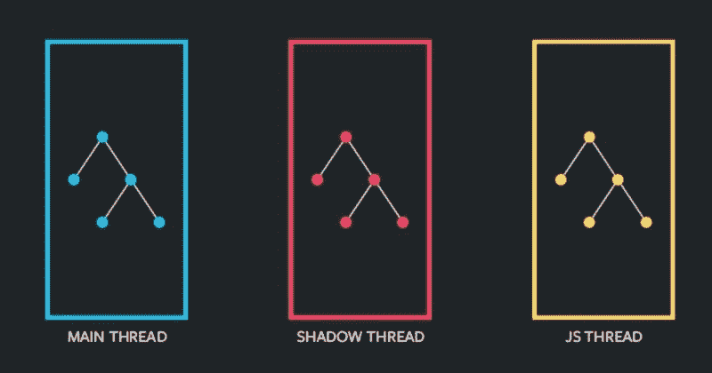
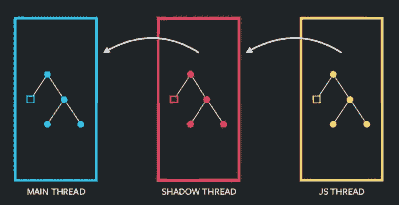
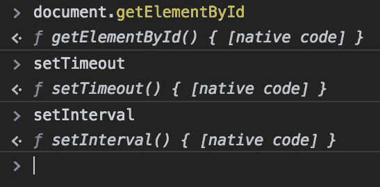

# React 如何构建应用程序布局(以及 Fabric 将如何改变它)

> 原文：<https://www.freecodecamp.org/news/how-react-native-constructs-app-layouts-and-how-fabric-is-about-to-change-it-dd4cb510d055/>

React Native 团队一直致力于从根本上改变 React Native 通信与主机操作系统的内部工作方式。它被很好地命名为“项目结构”(直到有一个正式的名称发布)。

让我们讨论一下它实际上是什么，它给作为开发者的你带来了什么变化。

### 本土作品现在有什么反应

如果我们看一下，React Native 现在使用 3 个线程:



1.  UI 线程——这是运行 Android/iOS 应用程序的主应用程序线程。它可以访问用户界面，你的用户界面只能由这个线程来改变。
2.  Shadow Thread 该线程是 React Native 用来计算使用 React 库创建的布局的后台线程。
3.  JavaScript 线程——这个线程是 JavaScript 代码(本质上是 React 代码)生存和执行的地方。

#### 内部运作……

让我们从头开始。假设你想在屏幕中央画一个红框。所以，你的 JS 线程包含了创建布局的代码，也就是屏幕上的红框。以下是 React Native (RN)可能实现的典型代码片段:

```
<View style={{ flex: 1, justifyContent: "center", alignItems: "center" }}>
<View style={{width: 100, height: 100, backgroundColor: "red"}}></View>
</View>
```

主机操作系统有自己的布局实现，不遵循您刚刚编写的那种 flexbox 代码。因此，RN 首先必须将您的 flexbox 编码布局转换为您的主机操作系统可以理解的布局系统。

坚持住！在此之前，我们需要将这个布局计算部分卸载到另一个线程，这样我们就可以继续执行我们的 JavaScript 线程。因此，RN 使用 Shadow 线程，它本质上构建了一个你在 JS 线程中编码的布局树。在这个线程中，RN 使用了一个名为 [Yoga](https://github.com/facebook/yoga) 的布局引擎，它将基于 flexbox 的布局转换成您的本地主机可以理解的布局系统。

React Native 使用一种叫做 React Native bridge 的东西将这些信息从 JS 线程传递到 Shadow 线程。简而言之，这只是将数据序列化为 JSON 格式，并通过桥将其作为字符串传输。

在这一点上，我们在阴影线。JS 线程正在执行，屏幕上什么也没有画。

现在，一旦我们从 yoga 获得了呈现的标记，这些信息再次通过 React 本机桥传输到 UI 线程。同样，这在影子线程上执行一些序列化，在主线程上执行一些反序列化。在这里，主线程呈现 UI。



### 这种方法的问题

如果你看到了，所有线程间的通信都是通过一个桥进行的，这个桥可以工作，但是有很多限制。其中包括:

*   传输大块数据(比如转换成 base64 字符串的图像文件)很慢，而且
*   如果同样的任务可以通过指向内存中的数据(同样，比方说一幅图像)来实现，那么就没有必要复制数据

其次，所有的通信都是异步的，这在大多数情况下是好的。然而，目前还没有办法从 JS 线程同步更新 UI 线程。当你使用一个包含大量数据的列表时，这就产生了一个问题。(你可以把 FlatList 看作 RecyclerView 的一个较弱的实现。)

最后，由于 JS 线程和 UI 线程之间通信的这种异步性质，严格要求同步数据访问的本机模块不能被完全使用。例如，android 上的 RecyclerView 适配器需要同步访问它正在呈现的数据，以避免屏幕闪烁。由于 React Native 的多线程架构设置，这现在是不可能的。

### 介绍织物

退一步想想你的浏览器。如果你仔细观察，输入域，按钮等等。实际上是特定于操作系统的。因此，是你的浏览器要求你的操作系统(Windows，Mac，Linux，或者几乎任何东西)在网页的某个地方画一个输入框。天啊。查看从浏览器到 React Native 的漂亮映射。

*   UI 线程→ UI 线程
*   浏览器渲染引擎→ React 原生渲染引擎(Yoga/Shadow 线程)
*   JavaScript 线程→ JavaScript 线程

我们知道，现代浏览器已经非常成熟，可以高效地处理所有这些任务。那么为什么不反应本土呢？残酷地限制 React Native 而不是浏览器的难题缺少了什么？

#### 直接向 JavaScript 公开本机 API 调用



你曾经在你的控制台中写下像`document.getElementById`和`setTimeout`和`setInterval`这样的命令并看到输出吗？哦！他们的实现其实是`[native code]`！那是什么意思？

您看，当您执行这些函数时，它们不会调用任何 JavaScript 代码。相反，这些函数直接链接到名为。所以浏览器并没有让 JS 使用桥接与主机操作系统通信，而是直接使用原生代码将 JS 暴露给 OS！简而言之，这就是 React Native Fabric 要做的事情:消除桥接，让 UI 直接由 JS 线程使用本机代码控制。

### 外卖食品

1.  RN Fabric 允许 UI 线程(绘制 UI 的地方)与 JS 线程(编程 UI 的地方)同步
2.  Fabric 仍在开发中，React 本地团队到目前为止还没有提到公开发布日期。但是我很确定今年我们会看到一些很棒的东西。
3.  像这样的应用开发框架(RN，NativeScript，Flutter)正在一天比一天好！

*图片来源:[https://www . slide share . net/axemclion/react-native-fabric-review 2018 07 25](https://www.slideshare.net/axemclion/react-native-fabric-review20180725)*

### TL；速度三角形定位法(dead reckoning)

[https://www.youtube.com/embed/zsnSqdXqs64?feature=oembed](https://www.youtube.com/embed/zsnSqdXqs64?feature=oembed)

### 喜欢这篇文章吗？

如果你喜欢这篇文章，请给我一些掌声，并在 twitter 上与我联系。你知道最精彩的部分吗？Claps 和 twitter 都是免费的！如果你有任何问题，欢迎在评论中提出！

***快不要脸塞:*** *如果你正在入门 React Native，下面是我 95%的入门课程: **[React Native —第一步](http://bit.ly/rn-basics-medium)***