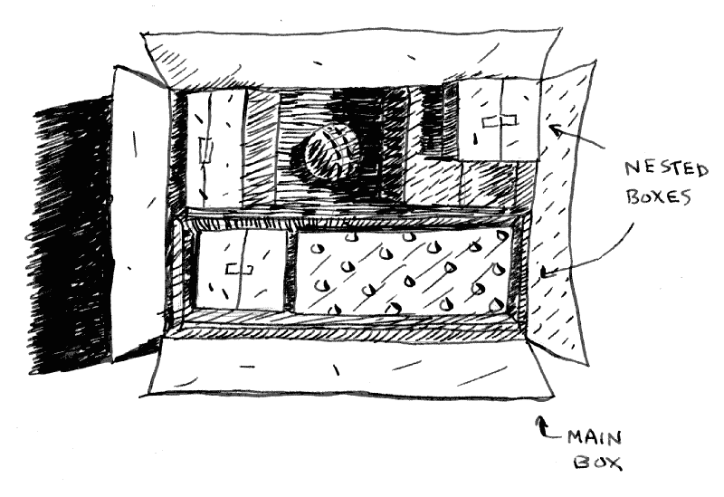
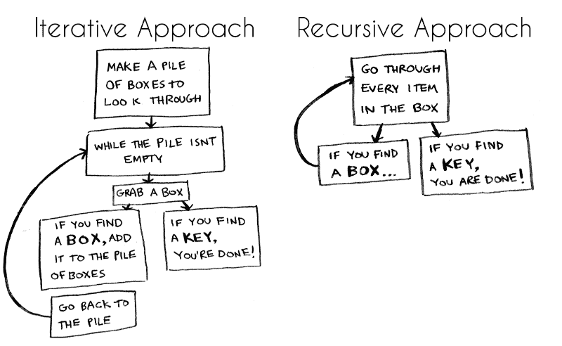
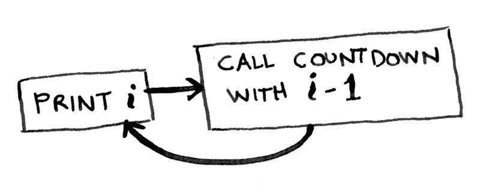
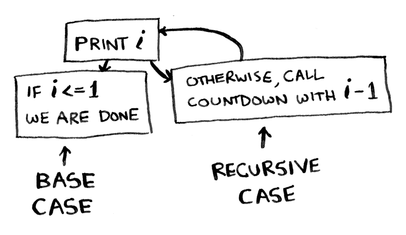
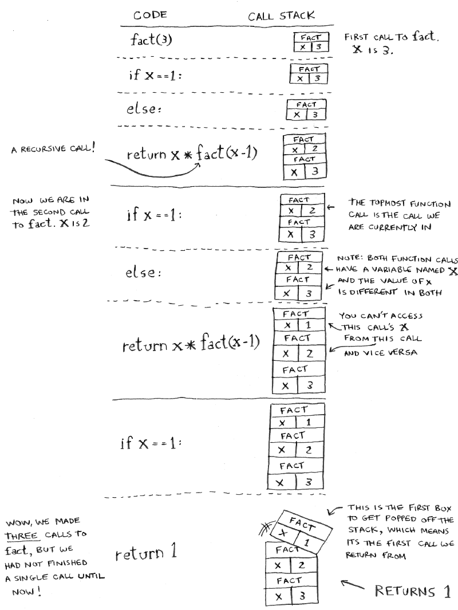
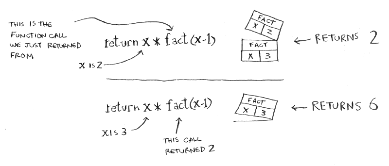
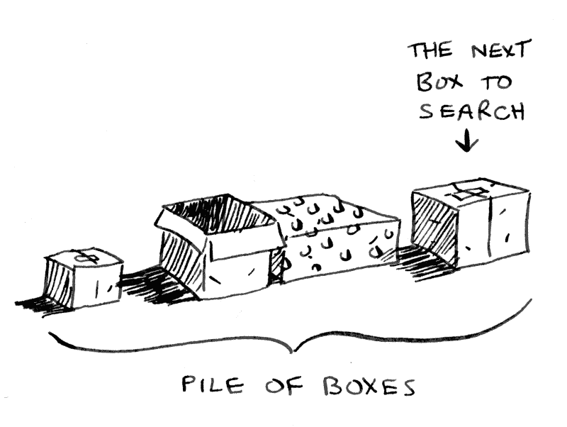
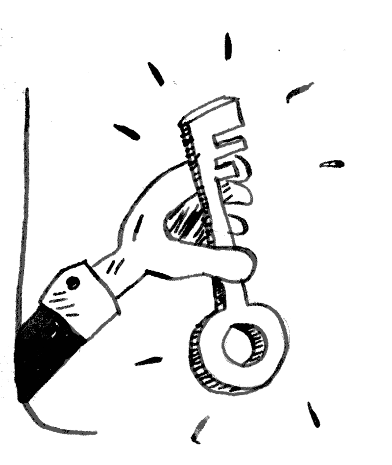
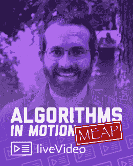

# 递归如何工作——用流程图和视频解释

> 原文：<https://www.freecodecamp.org/news/how-recursion-works-explained-with-flowcharts-and-a-video-de61f40cb7f9/>



Illustration (and all in this article) by Adit Bhargava

> "为了理解递归，首先必须理解递归."

递归可能很难理解——尤其是对新程序员来说。最简单的形式是，递归函数调用自身。我试着举个例子解释一下。

想象你去打开你的卧室门，它是锁着的。你三岁的儿子从拐角处突然出现，让你知道他把唯一的钥匙藏在一个盒子里。(“就像他一样”，你想。)你上班要迟到了，你真的需要进屋拿你的衬衫。

你打开盒子却发现…更多的盒子。盒子里的盒子。你不知道哪一个有钥匙！你需要尽快得到那件衬衫，所以你必须想出一个好的算法来找到那把钥匙。

有两种主要的方法来创建这个问题的算法:迭代和递归。以下是两种方法的流程图:



哪种方法对你来说更容易？

第一种方法使用 while 循环。趁这堆东西还没空，拿个盒子翻一翻。下面是一些受 JavaScript 启发的伪代码，展示了正在发生的事情。(伪代码写得像代码，但更像人类的语言。)

```
function look_for_key(main_box) {
    let pile = main_box.make_a_pile_to_look_through();
    while (pile is not empty) {
        box = pile.grab_a_box();
        for (item in box) {
            if (item.is_a_box()) {
                pile.append(item)
            } else if (item.is_a_key()) {
                console.log("found the key!")
            }
        }
    }}
```

第二种方法使用递归。记住，递归是函数调用自身的地方。这里是伪代码中的第二种方式。

```
function look_for_key(box) {
  for (item in box) {
    if (item.is_a_box()) {
      look_for_key(item);
    } else if (item.is_a_key()) {
      console.log("found the key!")
    } 
  }
}
```

这两种方法完成了同样的事情。使用递归方法的主要目的是，一旦你理解了它，阅读起来会更清晰。使用递归实际上没有性能优势。使用循环的迭代方法有时会更快。但主要是递归的简单性有时更受青睐。

此外，由于许多算法使用递归，所以理解它是如何工作的很重要。如果递归对你来说仍然不简单，不要担心:我将再看几个例子。

### 基本情况和递归情况

当你写递归函数时，你需要注意的是一个无限循环。这是函数不断调用自己的时候…而且永远不会停止调用自己！

例如，你可能想写一个倒计数函数。您可以像这样用 JavaScript 递归地编写它:

```
// WARNING: This function contains an infinite loop!
function countdown(i) {  console.log(i)  countdown(i - 1)}

countdown(5);    // This is the initial call to the function.
```



这个函数会一直倒数下去。如果你不小心运行了无限循环的代码，你可以按“Ctrl-C”来终止你的脚本。(或者，如果你有时像我一样用 CodePen，你得加上“？turn_off_js=true”到 URL 的末尾。)

递归函数总是要说什么时候停止重复自己。递归函数应该总是有两个部分:递归情况和基本情况。递归的情况是函数调用自己。基本情况是函数停止调用自己。这可以防止无限循环。

这又是一个倒计时功能，有一个基本情况:

```
function countdown(i) {
    console.log(i)  if (i <= 1) {  // base case
        return;
    } else {     // recursive case
        countdown(i - 1);
    }
}

countdown(5);    // This is the initial call to the function.
```



这个函数中到底发生了什么可能并不明显。我将演示当你调用传入“5”的倒计时函数时会发生什么。

我们首先使用`console.log`打印出数字 5。既然五是*而不是*小于或等于零，我们就去 else 语句。在这里，我们再次调用数字 4 的倒计时功能(5–1 = 4？).

我们记下了数字 4。同样，`i`是*不是*小于或等于零，所以我们转到 else 语句，用 3 调用 countdown。这一直持续到`i` 等于零。当这种情况发生时，我们记录数字 0，然后`i` *小于或等于 0。我们最终到达 return 语句并弹出函数。*

### 调用堆栈

递归函数使用一种叫做“调用栈”的东西当一个程序调用一个函数时，这个函数位于调用栈的顶部。这类似于一摞书。你一次加一个东西。然后，当你准备脱掉某样东西时，你总是脱掉最上面的那件。

我将向您展示使用`factorial`函数时的调用栈。`factorial(5)`写成 5！而且是这样定义的:5！= 5 * 4 * 3 * 2 * 1.以下是计算数字阶乘的递归函数:

```
function fact(x) {
    if (x == 1) {
        return 1;
    } else {
        return x * fact(x-1);
    }
}
```

现在让我们看看如果你调用`fact(3)`会发生什么，下图显示了栈是如何逐行变化的。堆栈中最上面的盒子告诉你当前正在进行的对`fact`的调用。



Image credit: Adit Bhargava

注意每个对`fact`的调用都有自己的`x`副本。这对于递归的工作非常重要。您不能访问不同功能的`x`副本。

### 你找到钥匙了吗？

让我们简单地回到最初的例子，在嵌套的盒子中寻找一个键。记住，第一种方法是使用循环进行迭代。用这种方法，你可以做一堆盒子来搜索，所以你总是知道你还需要搜索哪些盒子。



但是递归方法中没有堆。你的算法怎么知道你还需要看哪些盒子呢？“盒子堆”被保存在堆栈上。这是一堆半完成的函数调用，每个调用都有自己的半完成的盒子列表。栈为你跟踪一堆箱子！

多亏了递归，你终于可以找到钥匙并得到你的衬衫！



你也可以看看我做的这个关于递归的 5 分钟视频。它应该强化这些递归概念。

[https://www.youtube.com/embed/vPEJSJMg4jY?feature=oembed](https://www.youtube.com/embed/vPEJSJMg4jY?feature=oembed)

### **结论**

我希望这篇文章能让你更清楚地了解编程中的递归。这篇文章基于我在曼宁出版公司的新视频课程中的一课，名为[运动中的算法](https://www.manning.com/livevideo/algorithms-in-motion?a_aid=algmotion&a_bid=9022d293)。这个课程(还有这篇文章)是基于 Adit Bhargava 的*惊人的*书[探索算法](https://www.amazon.com/gp/product/1617292230/ref=as_li_qf_sp_asin_il_tl?ie=UTF8&tag=bcar08-20&camp=1789&creative=9325&linkCode=as2&creativeASIN=1617292230&linkId=83471c93327ff24766dd812f9799f95a)。这篇文章里所有有趣的插图都是他画的。

如果你通过书本学得最好，[拿本书](https://www.amazon.com/gp/product/1617292230/ref=as_li_qf_sp_asin_il_tl?ie=UTF8&tag=bcar08-20&camp=1789&creative=9325&linkCode=as2&creativeASIN=1617292230&linkId=83471c93327ff24766dd812f9799f95a)！如果你通过视频学习效果最好，可以考虑[购买我的课程](https://www.manning.com/livevideo/algorithms-in-motion?a_aid=algmotion&a_bid=9022d293)。

> 使用代码' **39carnes** '享受我的课程 39%的优惠！



最后，要真正理解递归，你必须再读一遍这篇文章。？