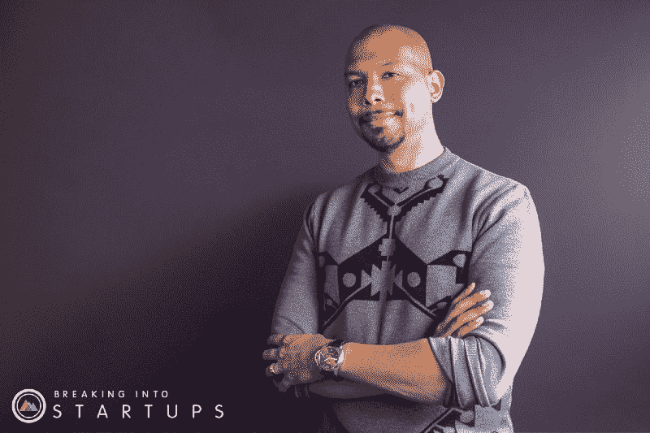
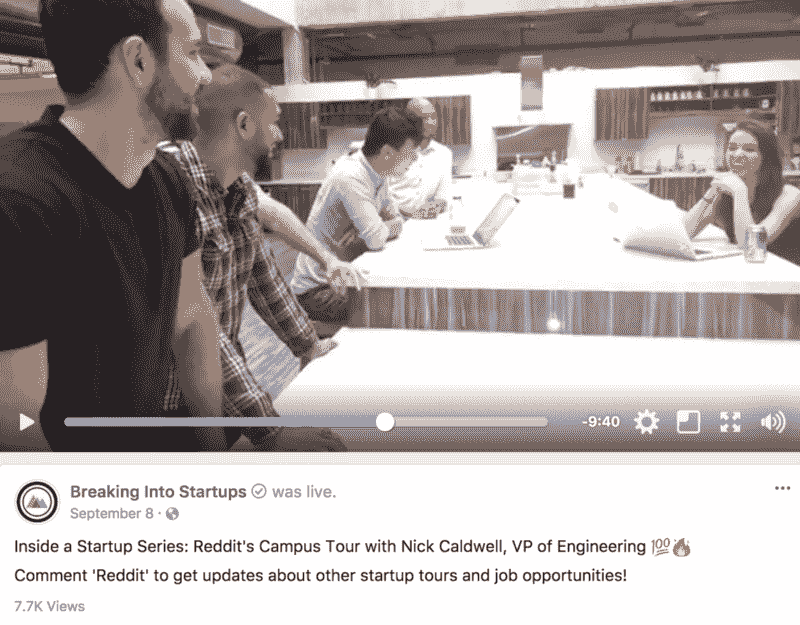
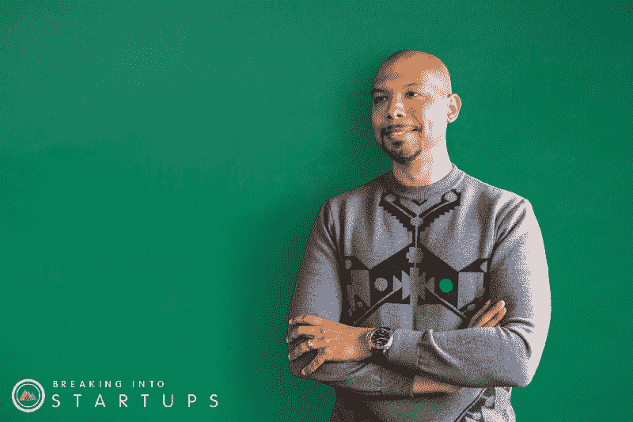
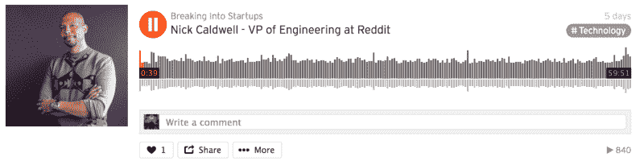

# Reddit 如何大规模构建功能:采访其工程副总裁

> 原文：<https://www.freecodecamp.org/news/how-reddit-builds-features-at-scale-an-interview-with-the-vp-of-engineering-f92b67974fd6/>

作者:艾里斯·内文斯

# Reddit 如何大规模构建功能:采访其工程副总裁

**Nick Caldwell, VP of Engineering at Reddit**

Reddit 的工程副总裁 [Nick Caldwell](https://breakingintostartups.com/68-nick-caldwell-vp-engineering-reddit) ，最近与[闯入创业团队](https://breakingintostartups.com/)坐下来谈论领导力、公司文化、机器学习、时间管理等等。

对于那些不知道 Reddit 有多棒的人来说，它是一个拥有 110 万活跃社区的在线论坛。这些社区由讨论板组成，讨论几乎所有你能想到的话题，从[、](https://www.reddit.com/r/OldLadiesBakingPies/)[动物是混蛋](https://www.reddit.com/r/AnimalsBeingJerks/)、[一切科学](https://www.reddit.com/r/EverythingScience/)和[时尚](https://www.reddit.com/r/fashion/)。

Reddit 是美国第四大最受欢迎的网站，也是世界第七大最受欢迎的网站。最值得注意的是，Reddit 拥有数亿用户，这意味着它的软件问题相当独特。

?? Watch the Fu[ll Video Tour of Reddit’s HQ in San Francisco ?](https://www.facebook.com/BreakingIntoStartups/videos/508857829458678/)

例如，Reddit 最近试图通过[建立一个系统](https://redditblog.com/2017/05/24/view-counting-at-reddit/)向用户“更好地传达 Reddit 的规模”,该系统显示一篇帖子的浏览量，而不仅仅是 upvotes。

有些帖子的浏览量高达数百万，这意味着准确统计浏览量是非常棘手的。Reddit 不仅要实时维护一个精确的计数，还要跟踪特定用户之前是否访问过该帖子。

对于浏览量达到数百万的帖子来说，在一个集合中存储数百万个用户 id 会非常耗费内存和 CPU，然后每次有新的浏览量时检查这个集合。Reddit 工程师能够确定，基于[超对数](http://algo.inria.fr/flajolet/Publications/FlFuGaMe07.pdf) (HLL)的计数方法将需要存储数百万用户 id 所需内存的 0.15%。

随着业务及其平台的持续增长，Reddit 工程师面临着这些有趣的问题。

Legacy user profile display (left) and new profile page (right), for u/Kn0thing.

这是 Reddit 的规模在其工程师工作中发挥作用的另一个例子。Reddit 最近使用新的前端堆栈创建了个人资料页面。他们决定在测试阶段，用户可以选择加入新的个人资料体验。这意味着要弄清楚如何跨不同的堆栈路由请求，允许一些用户被路由到原始的个人资料页面，而其他用户被路由到新的个人资料页面。

Reddit 的工程师们发现，快速使用定制的 [VCL 让他们能够做到这一点。截至 2017 年 8 月，他们已经能够在测试期间](https://docs.fastly.com/guides/vcl/guide-to-vcl)[“动态路由 75，000 个用户档案”](https://redditblog.com/2017/08/04/dynamically-routing-requests-across-different-stacks-with-vcl/)(点击了解更多关于 Reddit 新前端堆栈[)。](https://redditblog.com/2017/06/30/why-we-chose-typescript/)

### 认识一下 Nick，他是开发人员出身的工程副总裁

Nick Caldwell’s [Full Interview with Breaking Into Startups Podcast](https://soundcloud.com/breakingintostartups/nick-caldwell-vp-of-engineering-at-reddit) ?

尼克·考德威尔管理着一百名工程师，他们每天都在解决类似这样的复杂问题。那么尼克是如何成为 Reddit 的工程副总裁的呢？他的故事始于童年。

尼克的父母是一名公设辩护人和一名教师，他们让尼克接触到了思想、书籍和计算机技术，但最有趣的是，他们知道外面有比他眼前的环境更多的可能性。

当尼克对计算机产生兴趣时，他的父亲给他买了一本名为《c++ 12 节简单课程》的书。但是学 C++花的时间比那本书多得多。

尼克对计算机有着浓厚的兴趣，有着目标导向的天性，渴望进入一所资源丰富的学校。这使他对科学技术产生了兴趣。在那之后，他于 90 年代在麻省理工学院学习机器学习，在大学一年级时获得了他的第一份计算机科学工作。

尼克指出，对于我们这些处于软件工程师初级阶段的人来说，最重要的事情是选择一个我们热爱的领域(他的机器学习专业极大地促进了他找到工作的能力)。

一旦我们选择了一个专业，我们就必须“精炼我们的工艺”，并且“花大量的时间来应对复杂的编码挑战。”

如果我们决定走上管理道路，下一步就是成为一名工程经理，在那里“少做一点日常编码”，以便更多地关注团队的“人”的方面。

从那里我们可以成为总监，这意味着管理多个工程经理和协调资源。之后是工程副总裁，这意味着管理多个董事，同时专注于业务战略和公司的方向。

在整个[采访过程中](https://breakingintostartups.com/68-nick-caldwell-vp-engineering-reddit) Nick 提到了管理工程师的一些具体挑战，比如决定谁来领导某个项目，或者决定哪些潜在项目最符合公司的使命。他处理诸如“技术债务”、突然的高流量时期和复杂的操作系统之类的事情。

尼克花了 13 年爬上领导的阶梯，他的自律发挥了很大的作用。尼克一天吃一顿大餐，因为这给他更多的时间去做其他事情。他还对目标设定进行优先排序，甚至保留了一份文件，记录他过去十年左右的所有目标。

提升到尼克的管理水平意味着用花在编码上的时间换取对商业决策、公司文化和招聘流程的影响。

Nick 谈到了“snoos day”，这是 Reddit 公司文化的一大亮点。整个公司的工程师每季度有两天时间可以从事激情项目，有时他们会产生对整个公司产生积极影响的[项目](https://redditblog.com/2017/08/10/snoos-day-a-reddit-tradition/)。经理和主管有权力执行这样的事情。定下基调。来改变环境。

我经常想我是否会走上管理道路。我是愿意发展我的技术技能直到退休，还是愿意成为一名领导，培养并指导程序员走向成功——一名积极影响整个公司方向的领导？

我不确定我会走哪条路，但尼克让领导力听起来非常有意义和令人满足。

[《闯入创业公司》采访](https://breakingintostartups.com/68-nick-caldwell-vp-engineering-reddit)的内容比我在这里介绍的要多得多，所以你一定要看看尼克的采访，当你完成后，让《闯入创业公司》知道你的想法。

Nick Caldwell’s [Full Interview with Breaking Into Startups Podcast](https://soundcloud.com/breakingintostartups/nick-caldwell-vp-of-engineering-at-reddit) ?

我是 Iris Nevins，一名自学成才的软件工程师。如果你喜欢我的文章，请分享并给我一些掌声。=)

你可以在这里关注我的故事。欢迎[给我发邮件](mailto:nevinsiris@gmail.com)。