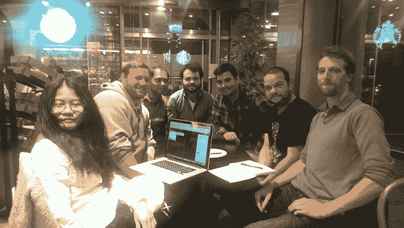

# Reddit 如何设计和编码其精心制作的愚人节体验，/r/place

> 原文：<https://www.freecodecamp.org/news/how-reddit-designed-and-coded-its-elaborate-april-fools-experience-r-place-97eb520b08e2/>

这里有三个值得你花时间的链接:

1.  Reddit 如何设计和编码其精心制作的愚人节体验，/r/place ( [17 分钟阅读](http://bit.ly/2nNeEiX))
2.  这些黑客马拉松骗子以公司编码竞赛为生( [7 分钟阅读](https://bloom.bg/2octHPc)
3.  “最小可行产品”到底是什么意思？( [5 分钟读数](http://bit.ly/2ocugsg))

额外收获:后 JavaScript 启示录 JavaScript:好的部分作者道格拉斯·克洛克福特( [47 分钟观察](http://bit.ly/2oHKwF3))

### 想到这一天:

> “我不害怕电脑。我担心他们的缺乏。”—艾萨克·阿西莫夫

### 今日趣事:

来源: [Reddit](https://www.reddit.com/r/funny/comments/65bsf3/we_can_repair_anything/)

### 今日学习小组:

[都柏林自由代码营](http://bit.ly/2pfmOk1)

编码快乐！

–昆西·拉森，自由代码营的老师

如果你从这些邮件中获得了价值，你应该[支持我们的非营利组织](http://bit.ly/donate-to-fcc)。？