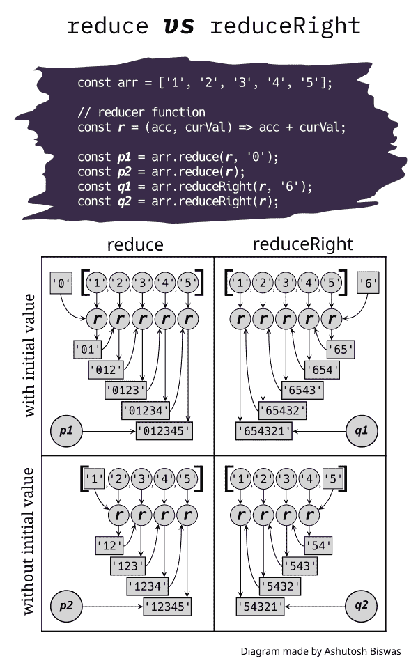

# JavaScript reduce 和 reduceRight 方法如何工作

> 原文：<https://www.freecodecamp.org/news/how-reduce-reduceright-works-javascript/>

`reduce`和`reduceRight`是两个内置的 JavaScript 数组方法，它们的学习曲线有点陡峭。

但是这些方法的本质就像下面的算术计算一样简单。

假设我们有一组数字:

```
[1, 2, 3, 4]
```

我们想得到它们的总和。

获得总和的`reduce`方法类似于:

((((1) + 2) + 3) + 4)

而获得总和的`reduceRight`方法类似于:

((((4) + 3) + 2) + 1)

有了`reduce`和`reduceRight`，你就可以定义自己的+。数组元素也可以是任何东西。听起来很刺激，对吧？

把`reduce`和`reduceRight`看作是上述算术模式的概括。在这篇文章中，我们将涵盖所有重要的细节。

本文采用一种易于理解的算法方法向您展示简化在 JavaScript 中是如何工作的。

我还制作了一个视频来展示这些方法是如何工作的。如果您想从更直观的角度学习这些概念，请查看:

[https://www.youtube.com/embed/o43livPsWn4?feature=oembed](https://www.youtube.com/embed/o43livPsWn4?feature=oembed)

## 目录

*   1 [到底是什么沦落为什么？](#what-is-reduced-to-what)
*   2 [参数`reduce` / `reduceRight`](#parameters-of-reduce-reduceright)
*   3 [用图表理解`reduce`/`reduceRight`](#understanding-reduce-reduceright-with-a-diagram)
*   [`reduce`/`reduceRight`](#the-algorithm-of-reduce-reduceright)的算法
*   5 [演习](#excercises)
    *   5.1 [平嵌套数组](#flat-nested-array)
    *   5.2 [从数组中移除重复项](#remove-duplicate-items-from-an-array)
    *   5.3 [反转一个没有变异的数组](#reverse-an-array-without-mutating-it)
*   6 [结论](#conclusion)

## 1 什么被还原成什么？[](#what-is-reduced-to-what)

你可能想知道，“当使用`reduce`或`reduceRight`时会发生什么样的减少？”

这里，归约反映了一种将数组中的元素转换为单个值的特殊方式(我们将详细介绍这种方式),类似于我们在上面看到的算术计算。

但是请注意，输出值可以是任何值。因此它可以是一个看起来比调用该方法的原始数组大的值。

在*函数式编程*语言中，化简的思想有许多[别称](https://en.wikipedia.org/wiki/Fold_(higher-order_function))如**折叠**、**累加**、**聚合**、**压缩**甚至**注入**。

## 2 参数`reduce`/`reduceRight`[](#parameters-of-reduce-reduceright)

这两种方法都有相同的调用规则。所以一起学很容易。让我们看看如何称呼它们:

```
let myArray      = [/* an array */];
let callbackfn   = /* A function value */ ;
let initialvalue = /* any value */ ;

myArray.reduce(callbackfn)
myArray.reduce(callbackfn, initialValue)

myArray.reduceRight(callbackfn)
myArray.reduceRight(callbackfn, initialValue) 
```

这里通过`callbackfn`和`initialValue`变量解释`reduce` / `reduceRight`参数的用法:

**`callbackfn`** :必须是函数。在遍历数组时，对于每个元素，`reduce` / `reduceRight`用 4 个参数调用`callbackfn`。让我们假设变量`previousValue`、`currentElement`、`index`和`array`分别保存这些参数的值。因此对`callbackfn`的内部调用如下所示:

```
callbackfn(previousValue, currentElement, index, array) 
```

现在让我们看看这些值的含义:

1.  `previousValue`:这也称为*蓄能器*。长话短说，这个值代表方法返回值的“进行中的工作”。当您研究本文后面介绍的算法时，这个值由什么组成将变得完全清楚。
2.  `currentElement`:当前元素。
3.  `index`:当前元素的索引。
4.  `array` : `myArray`。

**`callbackfn`**的返回值:对于`callbackfn`的最后一次调用，其返回值为`reduce` / `reduceRight`的返回值。否则，它的返回值将作为`previousValue`给出，用于下一次对`callbackfn`的调用。

最后， **`initialValue`** :这是`previousValue`(累加器)的可选初始值。如果它是给定的，并且`myArray`中有一些元素，那么对`callbackfn`的第一次调用将接收这个值作为它的`previousValue`。

**注**:通常称`callbackfn`为**减速器功能**(或简称**减速器**)。

## 3 理解`reduce` / `reduceRight`用图[](#understanding-reduce-reduceright-with-a-diagram)

`reduce`和`reduceRight`的唯一区别是迭代的方向。`reduce`从左到右遍历数组元素。而`reduceRight`从右到左遍历元素。

让我们看看如何使用`reduce` / `reduceRight`来连接字符串数组。请注意如何通过在两个方向上逐步连接数组元素来获得最终输出:



A diagram showing the differences between `reduce` and `reduceRight`

这里请注意:

*   `acc`用于访问`previousValue`。
*   `curVal`用于访问`currentElement`。
*   输入到 ***`r`*** 的圆形代表`curVal`。
*   输入到 ***`r`*** 的矩形表示`acc`或累加器。
*   初始值为矩形，因为它们由`***r***`作为`acc` s 接收。

## 4`reduce`/`reduceRight`[的算法](#the-algorithm-of-reduce-reduceright)

下面的 29 行算法乍看起来可能令人生畏。但是你可能会发现理解它比消化大量解释这些方法的复杂细节的长句要容易得多。

**注意**:此处描述的算法与“reduce/reduceRight 部分的[参数有关。(也就是说，变量`myArray`、`callbackfn`和`initialValue`都来自那个截面。)](https://www.freecodecamp.org/news/how-reduce-reduceright-works-javascript/#parameters-of-reduce-reduceright)

因此，请放松，享受这些步骤，不要忘记在控制台中进行实验:

*   1如果`initialValue`出现，

    *   2如果`myArray`没有元素

        *   3返回`initialValue`。

    *   4目不斜视

        *   T3 5 设`accumulator`为`initialValue`。
        *   6如果方法是`reduce`

            *   7设`startIndex`为`myArray`最左边元素的索引。

        *   8如果方法是`reduceRight`

            *   9设`startIndex`为`myArray`最右边元素的索引。

    *   10目不斜视

    *   11如果`myArray`没有元素

        *   12扔`TypeError`。

    *   13否则如果`myArray`只有一个元素，

        *   14返回那个元素。

    *   15目不斜视

        *   16如果方法是`reduce`

            *   17让`accumulator`成为`myArray`最左边的元素。
            *   18让`startIndex`成为紧跟在`myArray`最左边元素之后的元素的索引。

        *   19如果方法是`reduceRight`

            *   20设`accumulator`为`myArray`最右边的元素。
            *   21设`startIndex`为紧接在`myArray`最右边元素之前的元素的索引。

    *   22*   23如果方法是`reduce`

    *   24按从左到右的顺序，对于`myArray`的每个元素，使其索引为`i` ≥ `startingIndex`，

        *   25设置`accumulator`为`callbackfn(accumulator, myArray[i], i, myArray)`。

    *   26如果方法是`reduceRight`

    *   27按从右到左的顺序，对于`myArray`的每个元素，使其索引`i` ≤ `startingIndex`，

        *   28设置`accumulator`为`callbackfn(accumulator, myArray[i], i, myArray)`。

    *   二十九返回`accumulator`。

**注意**:一个数组可以有大于`0`的长度，但是没有元素。数组中这样的空位置通常被称为数组中的*孔*。例如:

```
let arr = [,,,,];
console.log(arr.length);
// 4

// note that trailing comma doesn't increase the length.
// This feature enables us to add a new element quickly. 
```

这些方法只对实际存在的`myArray`的元素调用`callbackfn`。例如，如果你有一个像`[1,,3,,5]`这样的数组，他们不会考虑索引`1`和`3`处不存在的元素。尝试猜测运行以下命令后将会记录什么:

```
[,,,3,,,4].reduce((_, cv, i) => {
  console.log(i);
});
```

如果你说`6`，你就对了！

⚠️ **警告**:不建议在`callbackfn`内部修改`myArray`，因为这会使你的代码逻辑变得复杂，从而增加出现 bug 的可能性。

如果你已经阅读并理解了，那么恭喜你！现在，您应该对`reduce` / `reduceRight`的工作原理有了深入的了解。

解决一些问题来习惯`reduce` / `reduceRight`是很好的时机。在看到解决方案之前，自己解决或者至少花些时间思考一下。

## 5 演习[](#excercises)

### 5.1 平嵌套数组[](#flat-nested-array)

写一个函数`flatten`可以展平嵌套数组。

```
let arr = [1, [2, [3], [[4], 5], 6]];
console.log(flatten(arr));
// [1, 2, 3, 4, 5, 6] 
```

<details style="align-self: flex-start; margin: 0 0 1.5em; width: 100%;"><summary>**Solution**</summary>

```
    const flatten = (arr) => 
  arr.reduce((acc, curVal) =>
    acc.concat(Array.isArray(curVal) ? flatten(curVal) : curVal), []); 

```</details> 

### 5.2 从数组中移除重复项[](#remove-duplicate-items-from-an-array)

编写一个函数`rmDuplicates`来删除重复项，如下所示:

```
console.log(rmDuplicates([1, 2, 2, 3, 4, 4, 4]));
// [1, 2, 3, 4]
```

<details style="align-self: flex-start; margin: 0 0 1.5em; width: 100%;"><summary>**Solution**</summary>

```
    const rmDuplicates = arr => 
  arr.reduce((p, c) => p.includes(c) ? p : p.concat(c), []); 

```</details> 

### 5.3 反转一个没有变异的数组[](#reverse-an-array-without-mutating-it)

有一个内置的`reverse`数组方法来反转数组。但是它改变了原来的数组。使用`reduceRight`反转一个数组而不改变它。

<details style="align-self: flex-start; margin: 0 0 1.5em; width: 100%;"><summary>**Solution**</summary>

```
    let arr = [1, 2, 3];

let reversedArr = arr.reduceRight((acc, curVal) => [...acc, curVal], []);

console.log(arr);
// [1, 2, 3]

console.log(reversedArr);
// [3, 2, 1] 

```

请注意，通过这种方式反转数组，您将丢失数组中的所有孔。</details> 

## 6 结论[](#conclusion)

当`reduce` / `reduceRight`在内部调用`callbackfn`时，我们可以称这些调用模式为“正常行为”,我们可以将其他场景视为边缘情况。这些可以总结在下表中:

| 基础资料 | 元素数量 | 输出 |
| --- | --- | --- |
| 礼物 | Zero | **边缘情况**:初始值 |
| 礼物 | 大于 0 | **正常行为** |
| 缺席的 | Zero | **边缘情况**:类型错误 |
| 缺席的 | one | **边缘情况**:元素 |
| 缺席的 | 大于 1 | **正常行为** |

学习`reduce` / `reduceRight`比其他高阶数组方法稍微复杂一点。但是值得你花时间把它学好。

感谢您的阅读！我希望这篇文章是有帮助的。如果你愿意，你可以查看我的[网站](https://www.ashutoshbiswas.dev/)，在[推特](https://twitter.com/ashutoshbw)和 [LinkedIn](https://www.linkedin.com/in/ashutosh-biswas/) 上关注我。

快乐减肥😃