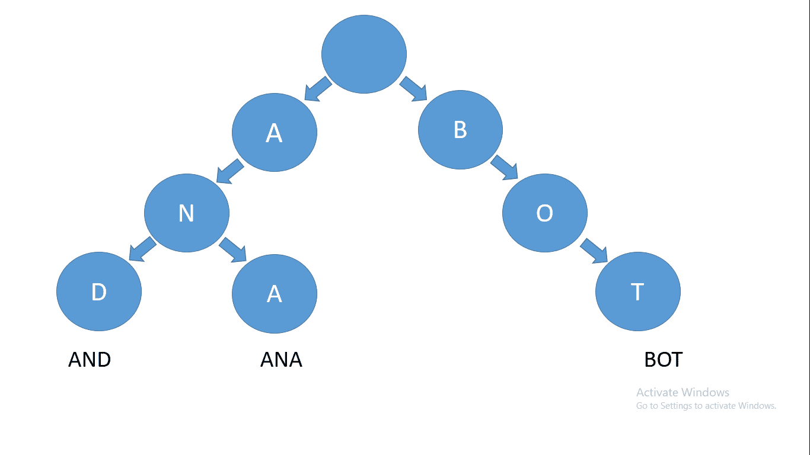
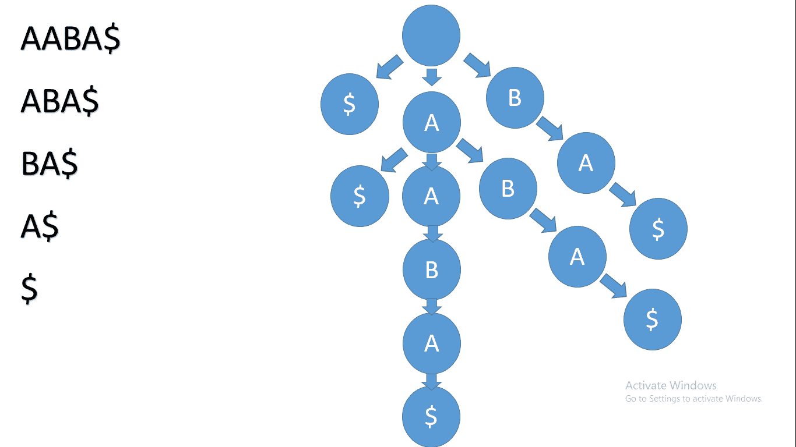
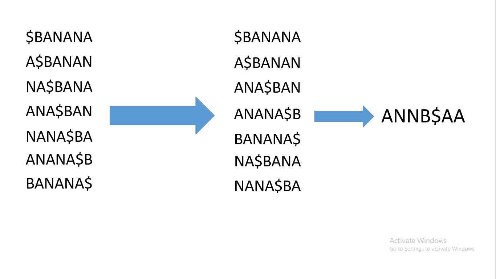
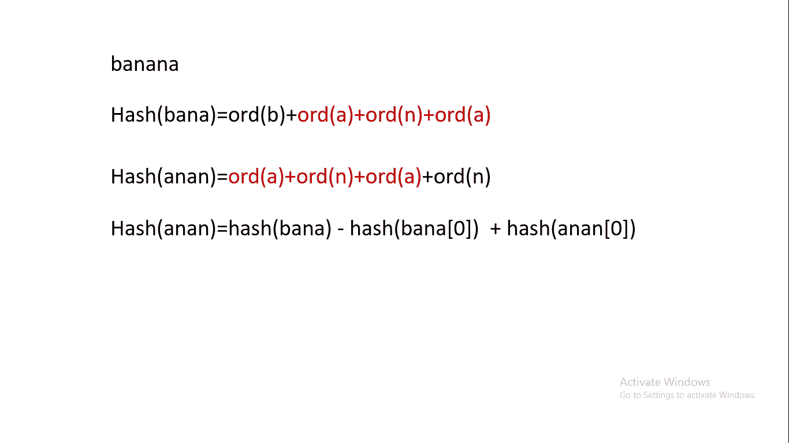
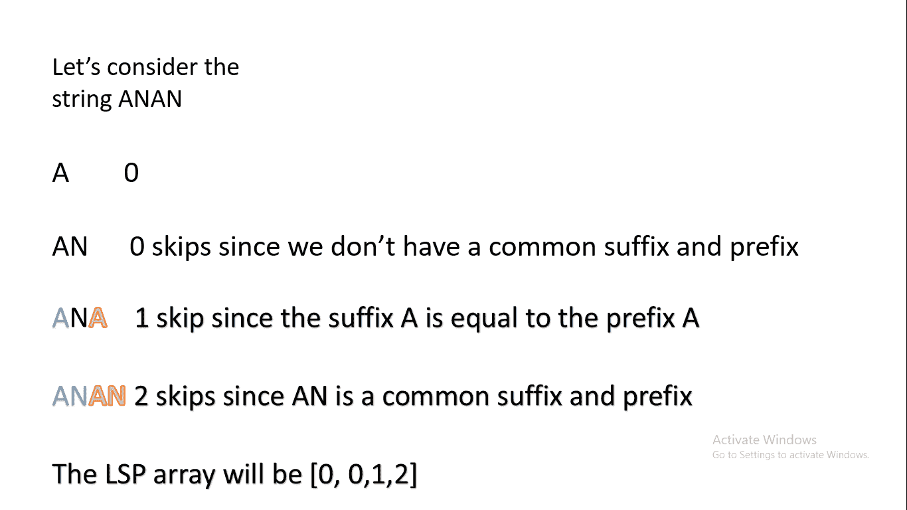

# 搜索是如何工作的——解释数据结构和搜索算法

> 原文：<https://www.freecodecamp.org/news/how-searching-works-under-the-hood/>

搜索是人们每天都在做的事情。无论是在文档和数据库中进行单词搜索，还是在生物信息学中进行模式匹配以检测 DNA 中的异常，搜索的应用都是无穷无尽的。

这些应用需要大量的计算。想象一下，从数百万个 DNA 序列中搜索一个特定的 DNA 序列，或者在谷歌的数据库中搜索一个用户。

这就是为什么我们需要一个运行速度非常快而不消耗大量内存的算法。这就是你将在这里学到的东西。

在本教程中，我们将深入研究两种著名的搜索算法:Rabin-Karp 算法和 Knuth-Morris-Pratt 算法。我们还将讨论它们的时间和空间复杂度，这相当于一个算法消耗的时间和空间，取决于它的输入大小。您还将了解用于搜索的常见数据结构。

需要非常基本的编程知识才能跟上。在本教程中，我们将使用 Python 示例。

## 目录

*   [用于生物信息学和搜索的数据结构](#data-structures-for-bioinformatics-and-searching)
*   [天真的搜索算法](#na-ve-search-algorithm)
*   [拉宾-卡普的算法](#rabin-karp-s-algorithm)
*   [克努特-莫里斯-普拉特算法](#knuth-morris-pratt-algorithm)
*   [结论](#conclusion)

## 生物信息学和搜索的数据结构

让我们首先讨论一些你应该知道的数据结构，即使我们没有深入这个话题。

### Trie 数据结构

一个 **trie** 是一个树状数据结构，其中每个节点存储一个字母表的字母。您可以以某种方式构建节点，以便通过遍历树的分支(路径)从结构中检索单词和字符串。

让我们以单词 **ANA** 、**和**以及 **BOT** 为例——它们的前缀树或 trie 将如下所示:



How a trie looks like

尝试广泛用于:

*   自动完成
*   拼写检查器
*   最长前缀匹配
*   浏览器历史记录

### **后缀树**

后缀树是基于树的数据结构，但是我们将使用单个世界的后缀，而不是用多个单词来构建树。

如果我们考虑字符串 **AABA** ，我们将首先在字符串的末尾添加一个 **$** 符号。那个 **$** 会让字符串比较更容易。现在字符串是 **AABA$** 。

我们将考虑它的所有后缀，树将如下所示:



**A suffix tree**

### 布伦斯·惠勒变换

现在我们将讨论 burrows wheeler 变换，它对于字符串压缩是非常有用的数据结构。

这种数据结构在生物信息学中被广泛使用是因为一个非常特殊的原因。我想让你想象一个字符串代表一个基因组。它可能很长，像 2000 万个字符。

但是实际上有一种方法可以有效地存储基因组。想象一下字符串**aaaaabbbbaaa**。这个字符串有很多重复，我们可以把它压缩成这样: **A5B3A3** 。这对于具有许多重复特征的基因组也非常有用。

现在让我们拿一串香蕉。我们将首先在字符串的开头添加一个 **$** 符号，然后计算 **$BANANA** 的所有循环旋转。然后将对循环旋转进行排序——这就是美元符号的重要性:排序时，该值小于所有字母值，因此这将使排序更容易。

在我们对循环旋转进行排序后，由排序后的循环旋转的最后一个字符形成的字符串就是 burrows wheeler 变换。它看起来会像这样:



**Burrows wheeler transform**

如你所见，burrows wheeler 变换有很多重复。你可能还会问如何反转操作。要做到这一点，看看排序循环旋转的第一个字符。它们与 burrows wheeler transform 中的角色相同，但排序不同。

因此，通过对 burrows wheeler 变换进行排序，我们将获得第一个和最后一个字母，并计算原始字符串。

## 天真的搜索算法

现在让我们来看一个在字符串中寻找模式的强力解决方案。这种方法不是最佳的，因为它以 **O(n*m)** 的时间复杂度运行(其中 m 是模式的长度，n 是字符串的长度)。

我们将考虑两个指针， **I** 和 **J** 。首先我们将初始化 **I** 和 **J** 为 0。然后我们将运行一个 while 循环，当 I 小于字符串的长度时，这个循环将一直运行。

每次循环运行时，我们将比较字符串中索引 **I+J** 处的字符和模式中索引 **J** 处的字符。如果它们相等，我们将增加 **J** ，但是 mpt。我们将增加 **I** 并将 **J** 重置为 **0** 。如果 j 超过了模式的长度，那么就有匹配。

其代码如下所示:

```
def Find_Match(pattern,string): 

  #initialise i and j
  i=0
  j=0

  while i<len(string):
   if string[i+j] == pattern[j]:
     j+=1
   if string[i] != pattern[j]:
     j=0  
     i+=1
   #Let's say j is equal to the length of the pattern. Then to reach the first match index we can go back a number of steps equal to the length of the pattern.
   if j==len(pattern):
    return i-j

  #Incase there is no match  
  return -1
```

## 拉宾-卡普算法

这种天真方法的问题在于，它运行在 O(n**2)时间复杂度中，这对于像基因组这样的大输入来说是可怕的。这意味着我们需要更好的东西。

比较两个字符串是线性时间，因为我们需要比较每个索引的每个字符。但是，如果我们不需要这样做，如果我们把字符串转换成数字呢？

这里是这个算法的主要思想。假设有一个函数返回一个与字母表中每个字符串相关的数字。为此，我们将使用字符串的 ASCII 值。

然后，为了将一个字符串转换成一个数字，我们将计算所有字符的 ASCII 值之和。这是一个简单的散列函数:

```
def hash(string):
 count=0
 # in python ord return the ascii value of a character
 for i in string:
  count+=ord(i)

 return count
```

现在假设我们想要在**香蕉**中找到**一个**。然后我们将首先比较 **hash(an)** 和 **hash(ba)** ，然后再比较 hash(an)等等，直到我们到达字符串的末尾。当哈希值匹配时，我们可以比较模式和子串，因为 **hash(na)** 和 **hash(an)** 相等，所以我们需要额外的检查。

你可能会认为这很傻——为什么我们需要做所有这些？计算散列函数需要迭代字符串，所以我们没有获得更好的时间复杂度。你完全正确。

但是如果我们可以从一个子串的前一个子串中计算出这个子串的哈希值呢？区别在于起始字符和结束字符，这被称为滚动哈希。这就是为什么这个算法运行在 **O(n*m)** 最坏情况和 **O(n+m)** 平均情况:因为碰撞。

比如 **hash(na)** 等于 **hash(an)** ，那么这里就需要比较 na 和 an。我向您展示的散列函数非常简单。哈希函数越好，冲突就越少。但是我不想让它太花哨，所以我将使用这个散列函数。



rolling hash

```
def Rabin_Karp(string, pattern):
 #compute the hash value of the pattern
 hashed_pattern=hash(pattern)

 #compute the hash value of the first substring with length equal to the length of the pattern

 first_hash=hash(string[0:len(pattern)])

 for i in range(len(string)-len(pattern)+1):
  if i !=0:
   first_hash-= hash(string[i-1])
   first_hash+= hash(string[i+len(pattern)-1])

  if hashed_pattern == first_hash:
   #second check
   if pattern == string[i:len(pattern)]:
    return i

 #in case no matches are found 
 return -1 
```

## 克努特-莫里斯-普拉特算法

现在我们将讨论今天的最后一个算法。这个很复杂，但我会尽量让它简单。

这种算法背后的想法是，除非字符串和模式有许多重复，否则天真的方法是很好的——例如在**aaaxaa**中搜索 **AAAB** 。在这种情况下，我们真的需要在第一次不匹配后将 j 指针重置为 0 吗？事实上，我们没有，我会告诉你为什么。

当我们分析这种模式时，我们可以看到它很特别。假设我们从 i=0 开始，一直到 j=3。然后下一次迭代我们得到了一个不匹配。

我们真的不需要重置 j，因为对于这个给定的模式，我们有两个第一个字符等于第二个和第三个字符。因为 j 已经是 3，所以字符串中的前 3 个字符等于模式中的前 3 个字符。并且字符串中的第二个和第三个字符等于模式中的第一个和第二个字符。所以我们可以通过将 j 重置为 2 而不是 0 来跳过两个位置。

现在你可能会问我们怎么知道不匹配后 j 的值。答案取决于模式。例如 **abac** 如果当我们到达 j=3 时(当我们到达 c 时)我们得到一个不匹配，并且由于 **ab** 等于 **ba** ，我们实际上可以跳过 b 进行下一次迭代。

正如你所看到的，当我们在一个模式的子串中有一个共同的后缀和前缀时，这是可行的，所以我们需要预处理这个字符串。对于该子串的每个索引，我们可以计算跳过的次数，并将其存储在一个称为最长后缀前缀数组的数组中。



现在我们将编写计算 **LSP** 数组的函数。但首先我会解释我要做什么:

*   数组中的第一个元素总是 0
*   我们将创建一个与模式长度相同的数组 LSP
*   我们将有 twp 指针 I 和 prevlps。I 是一个迭代变量，最初设置为 1，因为数组中的第一个元素总是 0。prevlps 跟踪先前最长的前缀后缀。
*   我们将运行一个 while 循环，当 I 小于模式长度时，它将一直运行。它将比较模式[i]和模式[prevLps]。如果它们匹配，我们将 LCP[i]设置为 prevlps +1，并将 I 和 prevlps 递增 1。
*   如果它们不匹配并且 prevlps 已经是 0，我们将把 LCP[i]设置为 0 并增加 I。
*   如果 prevlps 不为 0，我们将把 prevlps 设置为 LCP[prevlcp-1]。

让我们举一个使用字符串 ANAN 的例子。一开始我是 1，prevlps 是 0。第一次迭代发生，A 不等于 n，prevlps 为 0，因此 LCP 现在为[0，0，0，0]。

现在，在第二次迭代中，我们将比较模式[prevlps],它是 A，而 A 的值为 true。所以现在 I 是 3，prevlps 是 1，LCP 是[0，0，1，0]。

最后，在最后一次迭代中，我们将比较 N 和 N。与上一次迭代发生的情况相同，LCP 为[0，0，1，2]。

LCP 的代码如下:

```
def LCP(pattern):
 LCP_array=[0]* len(pattern)

 i=1
 prevlcp=0

 while i<len(pattern):
  if pattern[i]==pattern[prevlcp]:
   LCP_array[i]=prevlcp+1
   i+=1
   prevlcp+=1

  elif prevlcp == 0:
   LCP_array[i]=0

  else:
   prevlcp=LCP_array[prevlcp-1]

 return LCP_array 
```

现在，由于我们有了 LCP 阵列，我们可以运行 KMP 算法。它类似于天真的算法，但有一些改进。它看起来会像这样:

```
def KMP(pattern,string): 

  LCP_array=LCP(pattern)

  #initialise i and j
  i=0
  j=0

  while i<len(string):
   if string[i+j] == pattern[j]:
     j+=1
   if string[i] != pattern[j]:
     #The line that changed
     j=LCP_array[j-1] 
     i+=1
   #Let's say j is equal to the length of the pattern. Then to reach the first match index we can go back a number of steps equal to tje length of the pattern.
   if j==len(pattern):
    return i-j

  #In case there is no match  
  return -1
```

这个算法的时间复杂度是 O(n+m ),这很好，但是有点复杂。如果你注意到，几乎没有什么变化(只是在计算 LCP 时，有一行发生了变化)。这一行就是算法如此高效的原因。

## 结论

最后，我希望你能从这篇文章中学到一些新的东西。我们学习了用于搜索的数据结构以及一些著名的搜索算法。

本教程是两周研究的成果。有很多事情我想涵盖，但我想保持这是可控的。

如果你觉得这很有用，并想获得更多精彩内容，请在 LinkedIn 上关注我。会有很大帮助。