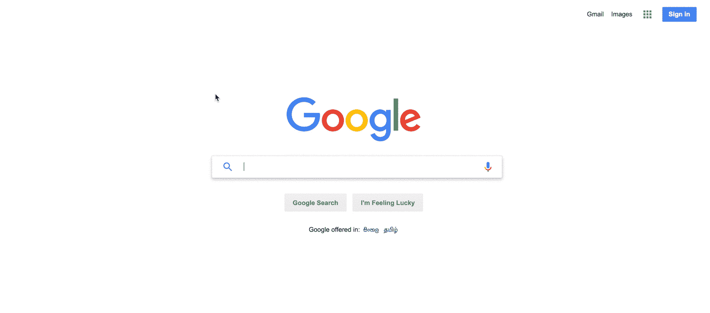
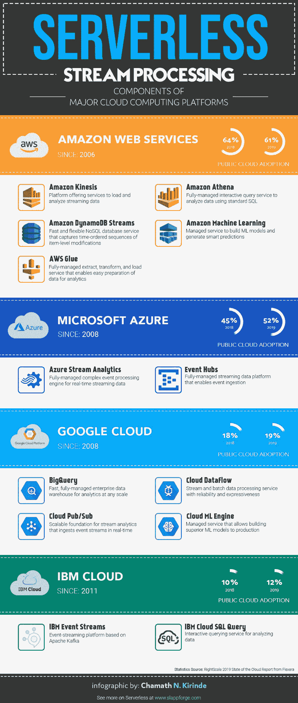

# 无服务器流处理如何使决策更容易

> 原文：<https://www.freecodecamp.org/news/how-serverless-stream-processing-will-make-decision-making-easier-d929502b43c8/>

作者:查马斯·基林德

# 无服务器流处理如何使决策更容易

大约一年前，我们开始成为数字化转型的一部分，推出了第一个基于云的 [IDE](https://sigma.slappforge.com/?utm_source=freecodecamp&utm_medium=blog&utm_campaign=guide&utm_content=Chamath) ，用于无服务器开发。这可不是一件容易的事——我们一直在努力覆盖 AWS[无服务器堆栈](https://aws.amazon.com/serverless/#The_AWS_Serverless_Platform)的大部分内容。与 AWS Kinesis 合作让我意识到了无服务器的美妙之处——当然，与 Kafka 的流媒体数据接触让我节省了一些时间来浏览基础知识。

Rational decision making: Photo by [Raj Eiamworakul](https://unsplash.com/photos/o4c2zoVhjSw?utm_source=unsplash&utm_medium=referral&utm_content=creditCopyText) on [Unsplash](https://unsplash.com/search/photos/rational-decisions?utm_source=unsplash&utm_medium=referral&utm_content=creditCopyText)

### TL；速度三角形定位法(dead reckoning)

你有没有想过…

*   当你正在半输入你的查询时,**“谷歌搜索”**如何向你建议东西？
*   在你搜索了一个国家之后,**最便宜的航空公司是怎么开始到处出现的？**
*   **网络角色扮演游戏如何根据你的决定进行调整？**
*   **赌博网站如何预测现场比赛的赔率？**
*   **当波特兰遭遇勇士队 73 胜赛季中最大的失败时，为什么库里和汤普森坐在板凳上？**

**

Google’s (sometimes so annoying) query autocomplete** 

**实时流数据分析的力量确实令人惊讶。现在，由于无服务器技术正在获得一些动力，也许你根本不用担心自己做出有风险的决定。这篇文章涵盖了“无服务器流数据处理”的基础知识，以及它将如何影响我们未来的决策。**

### **数据，到处都是数据**

**生活是一系列无止境的事件。我们周围的技术已经使它成为一系列的数字行为，发出一系列的数据。如果你回头非常仔细地调查你的生活，你会看到你的每一个数字行为产生的永无止境的数据串。一开始可能会有很多东西需要消化，但是让我们探索一些场景，并尝试找到适用于你我的场景。**

*   **网上银行和便捷的电子商务购买能力**
*   **共乘、现代旅行和交通**
*   **工业设备和农业用例，如监控机械、自动拖拉机和精准农业**
*   **自动化发电和智能电网、零网建筑、智能计量**
*   **基于地理位置、预测性维护的房地产推荐**
*   **依赖于复杂个性模式和属性分布的在线约会和配对**

**

Rational Romance: Will you be my Valentine?** 

*   **金融交易根据股票市场的实时变化，分析风险管理**
*   **电影、歌曲和其他数字媒体，根据人口统计、偏好和情感提供更好的体验**
*   **基于使用的改进的 web 和移动应用程序体验**
*   **在线游戏中的动态和个性化体验**
*   **借助超个性化和预测分析增强社交媒体体验**
*   **来自连接设备的遥测，或来自地理空间或空间服务(如天气、资源评估)的远程数据中心**
*   **体育分析可提高运动员的表现，降低健康风险**

**

Welcome Analytics** 

**所有这些事件都会产生大量的数据。由于这种数据发射的频率，它已经成为数字空间的日益增加的负担。**

### **什么是流数据？**

**在去年进行的一项关于数据的调查中，据估计以目前的数据生成速度，**

> **到 2020 年，地球上每个人每秒将产生 1.7 MB 的数据**

**每秒钟从无数来源源源不断涌出的数据已经成为我们不能忽视的事实。大数据学科让科技界大开眼界，将这些曾经令人恼火的数据用于做一些有用的事情。同样令人厌烦的数据是由一个新的物种，即数据科学家收集和分析的？。由于连续性的本质，并且通常很小(千字节量级)，这些数据流(通常被称为流数据)作为记录被同时收集，并被发送以供进一步处理。**

### **从流处理到明智决策**

**流数据处理结构通常由两层组成——存储层和处理层。前者负责对大型记录流进行排序，并促进高速的持久性和可访问性。处理层负责数据消费、执行计算，并通知存储层删除已经处理过的记录。对每条记录的数据处理是增量完成的，或者通过在滑动时间窗口内进行匹配来完成。然后，经过处理的数据将接受流分析操作，而导出的信息将用于做出基于上下文的决策。**

**例如，公司可以通过持续分析社交媒体流来跟踪公众对其产品的情绪变化。世界上最有影响力的国家可以干预决定性事件，如其他强国的总统选举。移动应用可以根据设备的地理位置和用户情绪提供个性化的产品推荐。**

**

Poor data analytics — Poor decisions** 

**大多数应用程序从一开始就收集一部分数据，以生成简单的汇总报告，并做出简单的决策，如触发警报或计算移动平均值。随着时间的推移，这些变得越来越复杂，公司可能希望获得深刻的见解，进而在机器学习算法和数据分析技术的帮助下执行复杂的活动。**

**数据的持续增长使得数据科学家日以继夜地工作，提出开创性的解决方案，以利用尽可能多的数据来构建具有更好决策的替代未来。**

### **服务协调员**

**采用理想的云提供商来满足组织的需求可能是势不可挡的。然而，由于流处理无处不在的影响，所有主要的云服务提供商都配备了有竞争力的选项来适应流处理。这里列出了常用的无服务器服务，以支持高度依赖流数据的企业级应用程序。**

**

Infographic: Serverless Stream Processing Components** 

### **活生生的例子**

**许多公司使用流分析的见解来提高其业务的可见性。这使得他们能够为顾客提供个性化的体验。此外，近乎实时的透明度使这些公司能够灵活地迅速应对紧急情况。**

**新兴的无服务器架构推动所有领先的云服务平台提出互补的解决方案。流处理可用于无服务器应用程序开发，通过完全托管的基于云的服务对大型分布式数据流进行实时数据处理。**

#### **1.超个性化电视**

**

Netflix: Photo by [Jens Kreuter](https://unsplash.com/@jenskreuter?utm_source=medium&utm_medium=referral) on [Unsplash](https://unsplash.com?utm_source=medium&utm_medium=referral)** 

**世界领先的在线电视网络网飞开发了一个解决方案，使用亚马逊 Kinesis Streams 集中他们的流量日志[。作为一个每天处理数十亿流量的系统，这为他们消除了大量的复杂性，因为在架构中没有数据库。由于高可伸缩性和闪电般的速度，他们可以发现并解决出现的问题，并大规模监控应用程序。](https://aws.amazon.com/solutions/case-studies/netflix-kinesis-streams/)**

**借助升级的推荐算法、视频转码和流行媒体许可，这将为用户带来无缝体验。随着用户的指数级增长，公司的责任与日俱增。然而，对网飞来说似乎没什么问题，因为他们被认为有一个[合理的决策模型](https://www.forbes.com/sites/danpontefract/2019/02/04/the-netflix-decision-making-model-is-why-theyre-so-successful/#11a4e67273bc)。**

#### **2.改善决策者的决策**

**作为面向企业和专业人士的集成智能信息的领先来源，汤森路透为金融和风险、科学、法律、技术等广泛领域的决策者提供服务。这家公司建立了一个内部分析引擎来完全控制数据，并转向 AWS，因为他们熟悉其功能和规模。**

**连接到亚马逊 Kinesis stream 的新实时[管道通过准确的经济预测、受益者的财务趋势(包括一系列政府活动)在感知客户体验方面产生了更好的结果。](https://aws.amazon.com/solutions/case-studies/thomson-reuters/)**

#### **3.独角兽:交通拥堵的解决方案**

**

Unicorn: Photo by [Boudewijn Huysmans](https://unsplash.com/@boudewijn_huysmans?utm_source=medium&utm_medium=referral) on [Unsplash](https://unsplash.com?utm_source=medium&utm_medium=referral)** 

**雅加达已经成为一个严重拥堵的城市，摩托车被认为是最有效的交通方式。为了利用这一商机，GO-JEK——东南亚为数不多的独角兽企业之一——开始时是一个摩托车出租车预订呼叫中心。然而，为了满足超出预期的需求，公司不得不考虑扩张。现在在 Google Cloud Professional Services 的支持下，基于云数据流构建的用于流推理的业务架构使他们能够有效地预测需求的变化。**

**还有更多关于云平台的故事，比如 AWS、T2、谷歌、T4、微软 Azure、IBM Cloud 和 T7，这些平台被公司用来让他们的客户生活得更好、更安全。**

### **无服务器流处理的局限性**

**无服务器流处理日益成为决策引擎的重要组成部分。然而，对于当前的功能集，它对于某些场景来说并不是理想的解决方案。为滑动窗口和时态事件模式实现实时分析并不适合胆小的人。**

**吸收这种规模的永无止境的数据的最佳方式是通过实时仪表板，这需要额外的数据组织和持久化。这些策略在上下文中引入了不希望的延迟和数据管理问题。然而，技术正在发展，并试图赶上使用先进的云数据管理技术来产生物化视图的集成速度。**

**

Security: A major concern** 

**与基于批处理的处理相比，流处理通常使用基于时间或基于记录的窗口进行处理，这可能会给需要重新执行查询的用例带来挑战。**

**如今，应用程序需求的增长已经超越了聚合分析。增加窗口大小似乎是一个合适的临时解决方案，但是它产生了另一个棘手的问题——内存管理。现代的解决方案通常提供先进的内存管理和调度技术来克服这一点，但世界将会看到进一步的改进。**

### **结论**

**总而言之，很明显，无服务器的流处理已经在我们周围扮演了一个重要的角色，而我们却不知道。借助无服务器数据流处理的强大功能，应用程序可以从传统的批处理发展到实时分析。深刻见解的揭示将导致有效的决策制定，而无需管理基础架构。**

**即使在今天，许多组织仍在实施正统的决策策略，这些策略基于使用属于过去的大数据集群进行的分析。无服务器和实时数据处理的新领域现在具备了做出有效决策的能力，并在你周围创造一个更有生产力、更相关、最重要的是更安全的世界。**

**无服务器的流处理会使情感决策过时，计算机化的理性判断成为标准吗？**

**你怎么想呢?**

### **你现在应该做什么？**

*   ****拍手。**欣赏并让别人发现这篇文章。**
*   ****评论。**分享你的想法。**
*   **跟我来。 [Chamath Kirinde](https://medium.com/@jchamath) 接收此类文章的更新。**
*   **保持联系。 [领英](https://www.linkedin.com/in/jchamath/)，[推特](https://twitter.com/JChamath)，[密友魔咒](https://chummycharms.blogspot.com)**
*   **考虑无服务器。 [打假](https://slappforge.com/blog)**

***最初发表于[chummycharms.blogspot.com](https://chummycharms.blogspot.com/2019/03/serverless-stream-processing.html)。***