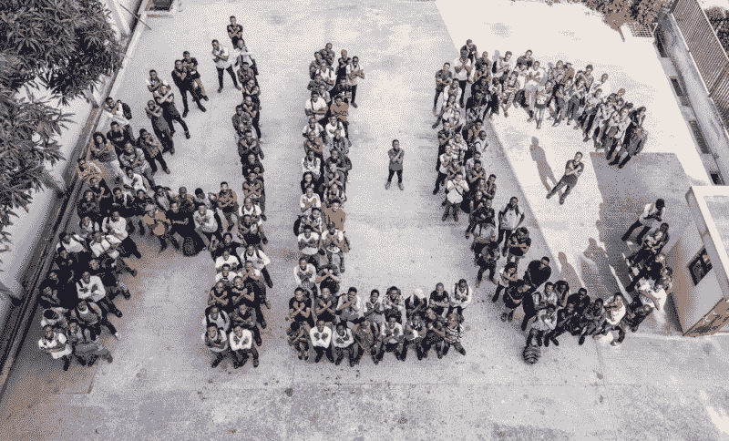
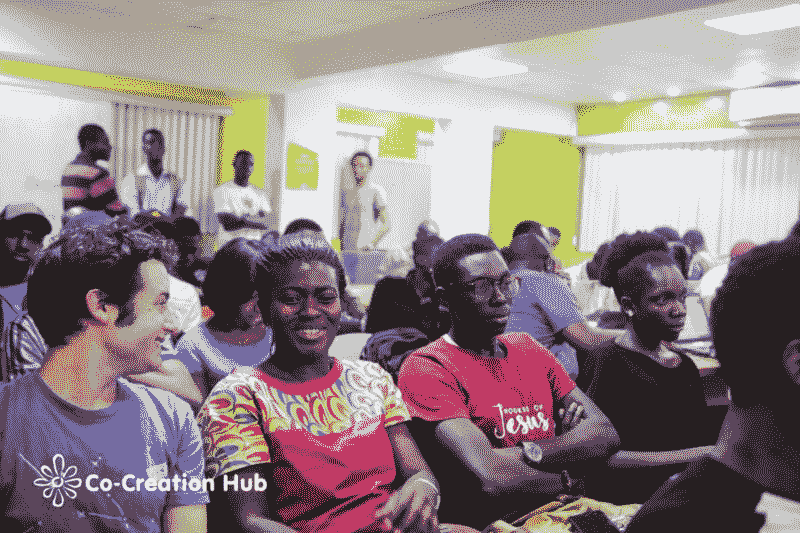
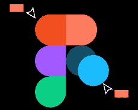
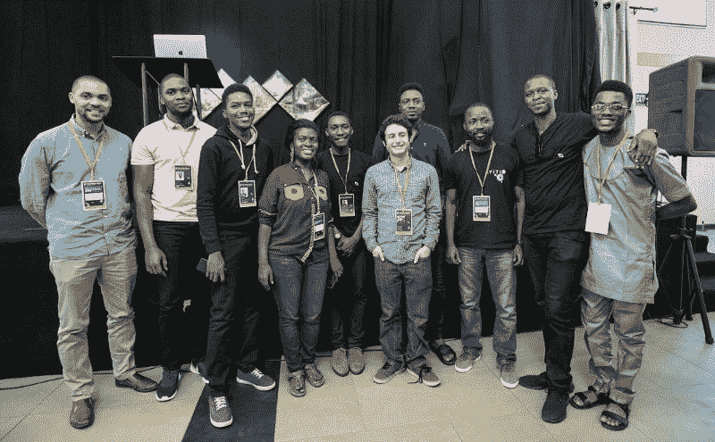
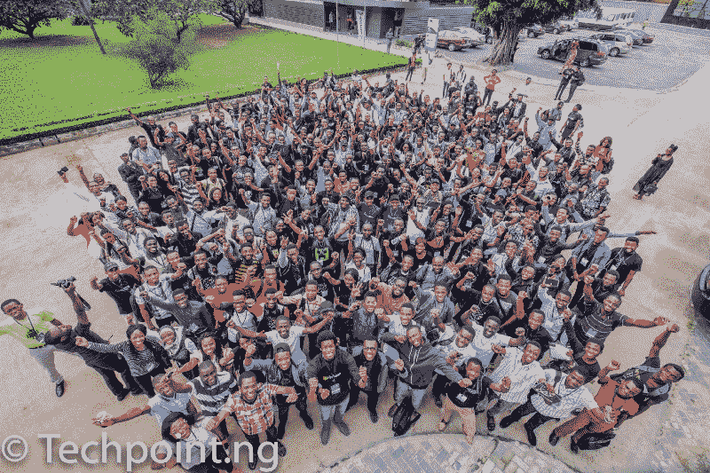

# 科技社区如何改变撒哈拉以南非洲的叙事

> 原文：<https://www.freecodecamp.org/news/how-tech-communities-are-changing-the-narrative-across-sub-saharan-africa-8ad1391558fa/>

通过 Mustohpher

# **科技社区如何改变撒哈拉以南非洲的叙事**

[Credit](https://medium.com/@chimdi2000/alc-announcing-google-africa-scholarships-with-the-andela-learning-community-ae4a3472ae30) : Andela Nigeria

我曾经读过 Ayo Isaiah 关于开发者可以听的最好的播客的帖子。我在这些播客中发现了如此巨大的价值，以至于我开始寻找发生在尼日利亚和非洲大陆的类似对话。

引发社会创新和创业的有趣讨论正在发生。从加纳阿克拉的融水到尼日利亚拉各斯的共创中心和肯尼亚内罗毕车库。如果你和我一样，你可能想听听这些对话并参与进来。

我所研究的大多数社区和对话的特点要么是相关人员使用的技术，要么是促进开源开发的动力。

有趣的是，谷歌开发团队( [GDG](https://developers.google.com/programs/community/gdg/) )是分布最广的技术团队。你可以在非洲大陆的每个地区找到它们。但是一个正在形成势头并获得大量追随者的新运动是**随着聚会在非洲各地举行。**

**这篇文章的目的是引导你进入不同领域的社区，包括设计、开发、DevOps、测试、业务开发，甚至工作机会。如果你在非洲大陆之外，你想感受一下发生的事件，你会发现这很有用。**

#### ****设计****

**设计领域正在成长，许多挑战鼓励和培育着这个领域。**

**一些受欢迎的设计社区有:**

**1.可用的**

****

**Usable 是尼日利亚运行时间最长的 UI/UX 设计师聚会。它成立于 2012 年，是一个由对设计功能性产品感兴趣的设计师、开发人员和爱好者组成的社区。**

**他们每个月的最后一个星期四都会在拉各斯和阿布贾的 600 多名成员聚会。**

**

[Credit](https://twitter.com/usable_/status/956865830440095745) : Usable** 

**这个社区由[预订](https://www.booking.com/)的界面设计师 [Udeze Kene](https://www.udezekene.com/) 组织。你可以通过他们的官方[网站](https://usable.ng/)或[推特](https://twitter.com/usable_)关注他们的更新。他们还管理着一个优秀的博客，如果你对设计师在尼日利亚的收入感兴趣，可以看看这篇文章。要了解最新的设计新闻，请查看他们的[邮件列表](https://us15.campaign-archive.com/home/?u=0d6cab992a9d9bdaada60aaa8&id=d8b7b6cec5)。**

**2.非洲无花果树**

****

**在设计界掀起风暴的工具之一是协作和创新的 Figma。Hotelsng 去年在 T2 举办了远程实习，并广泛使用。参与该计划的 1000 多名开发人员和设计人员继续使用该工具为自己创造挑战。事实上，今年早些时候 Figma 的首席执行官飞到尼日利亚召开了一次会议。**

**

[Credit](https://twitter.com/figma_africa) : Figma Africa Conference** 

**这个设计小组的目标是设计新手或热衷于使用该工具的人。他们定期举办挑战赛，帮助会员学习如何在 Figma 中设计球场平台。这个社区背后的仁慈独裁者是[纳姆索·乌克帕纳](https://twitter.com/namnsoukpanah)。**

**你可以在这里加入松弛频道[或者在](https://figma-africa.slack.com/)[推特](https://twitter.com/figma_africa)上查看它们。**

#### ****时事通讯|开发者内容****

**制作文本内容，无论是博客文章还是时事通讯，都是接触整个技术社区最简单的方式。**

**1.比特索夫科**

****

**这是你期待阅读的关于前端开发的博客。Ire Aderinokun 始终为博客提供高质量的内容。她过去每周发布文章，但现在决定在写作之前花时间探索技术。**

**Bitsofcode 包含了关于设计模式和个人项目的文章，比如 [Bitsofcode PWA](https://bitsofco.de/bitsofcode-pwa-part-1-offline-first-with-service-worker/) 和[重建 GitHub 图表](https://bitsofco.de/github-contribution-graph-css-grid/)。**

**如果你对视频教程感兴趣，那么你一定会喜欢，因为这个博客在 YouTube 上有一个[频道](https://www.youtube.com/channel/UCaJvzHE_y3MhbDLrsa4FfJQ)，里面有很好的思想分解和现场编码会话。所有你通常需要付费的套餐都是免费的。**

**2.技术中心**

****

**如果你想深入了解整个非洲的科技行业，可以阅读这份时事通讯。媒体公司为这样的讨论提供了各种平台，包括雷达。**

**他们还为你的收件箱策划了非洲最全面的技术综述。查看[简讯](https://us7.campaign-archive.com/home/?u=516543d20461f295636a963ec&id=ebb229e161)。**

**3.特定空间**

****

**[Certaspace](https://certaspace.com/) 为开发人员、高管和初创公司撰写经过深入研究的技术文章。你可以在那里找到关于[网页设计](https://certaspace.com/front/web_design)和[手机应用开发](https://certaspace.com/front/mobile_app_dev)的内容。如果你对尼日利亚的创业现场有着固执己见和有趣的见解，那么他们的[琐碎部分](https://certaspace.com/blog/blog_category_home/9)正适合你。如果你喜欢分析，你可以在这里阅读尼日利亚创业公司的数据共享文化。**

**此外，他们主办活动并提供免费的主办计划来鼓励开发者测试他们的想法和创业。如果你需要的服务器空间能够容纳你期望访问你网站的流量，你绝对应该看看他们的[黄金服务](https://certaspace.com/front/shared)，提供无限数据传输和专用 IP 地址。**

#### ****社区****

**结识你所选择领域的人很有价值。除了分享想法和了解最新的技术趋势，你还可以获得工作机会或工作。**

**下面列出了一些在线和离线的热门技术社区，排名不分先后。**

**1.发展中心**

****

**这是撒哈拉以南非洲的皇冠上的宝石开发者社区，有 3000 多位才华横溢的人在分享想法。你可以在这里加入[群。我喜欢这个论坛的一点是框架通道，在这里你可以就你选择的任何开发栈中的挑战提出问题，比如迷你栈溢出。](https://www.devcenter.co/community#join-community)**

**DC 还策划了一些拓展项目，比如针对初创公司的资源和向我提问(A.M.A ),与行业专家就选定的主题进行交流。**

**第二步**

****

**所有社区的科技社区— [*forloop*](http://forloop.africa/) 。自从人们开始通过这个平台做志愿者以来，开发者拓展和培训已经呈现出一种新的形式和维度。它在尼日利亚、加纳和肯尼亚的高等教育机构中设有分支机构。**

**

[Credit](https://twitter.com/rotimiokungbaye/status/978298576072859653) : Rotimi Okungbaye** 

**CNN 报道[称 *forloop* 是“…全非洲最大的软件开发者和爱好者聚会”](https://edition.cnn.com/2018/03/26/africa/ubuntu---the-african-concept-of-community-/index.html)**

**召集人 [Ridwan Olalera](https://twitter.com/ridwan_olalere) 、 [Prosper Otemuyiwa](https://twitter.com/unicodeveloper) 和 [Christian Nwanba](https://twitter.com/codebeast) 正在建立一个真正的泛非开发者社区，定期举办[活动](https://forloop.africa/meetups)。**

**你绝对应该加入邮件列表，因为为 forLoop 每周时事通讯撰稿的所罗门·奥萨多罗(Solomon Osadolo)以制作最佳内容为乐。这里是[简讯](https://us15.campaign-archive.com/home/?u=d502200cb811736ebb7c2e122&id=f4e0e2c6fd)。**

**如果你有兴趣了解软件开发商如何为非洲消费者开发产品，他们的解决方案背后的原因，或者他们面临的挑战，那么你应该在 YouTube 上查看该集团的[频道](https://www.youtube.com/channel/UCUF8xUKZzH09WkCj4DCNGog)。有很多见解。**

**3.gdg lagos**

****

**谷歌开发团队是尼日利亚最大的技术社区，拉各斯分公司是其中最大的。去年，在年度峰会上，超过 600 名开发者出席了会议(见此处[的报道](https://medium.com/@adewaleyusuf/history-was-made-the-largest-gathering-of-nigerian-developers-f783a6734b79))。如果你在拉各斯，你一定要参加他们的下一次聚会，或者在拉各斯以外的地方，通过[聚会](https://www.meetup.com/pro/gdg/)寻找你附近的 GDG 分会。**

**

[Credit](https://cdn-media-1.freecodecamp.org/images/1*jbWWfVLk_lmCeCDVCBgiaA.jpeg) : Adewale Yusuf of Techpoint.ng** 

**4.安德拉学习社区**

****

**安德拉在开发者教育方面一直处于领先地位。通过与谷歌、Udacity 和微软建立伙伴关系，他们负责培养下一代工程师、设计师和经理。**

**该社区接受了 web 或 Android 开发方面的培训。Chimdindu 的[案例研究](https://medium.com/@chimdi2000/andela-and-googles-android-learning-community-alc-the-case-for-investing-in-communities-of-35cda2b276b5)表明，许多人通过参加课程和与志同道合的人互动而成为优秀的开发人员。**

**在这里你会发现最大的开发者/设计师新手集合。如果你正在营销一个产品，你一定要检查他们。**

**5.CcHub**

****

**如果不写 CcHub，这篇文章是不完整的。它集多种功能于一身，是技术人员交流的中心、工作空间、创新中心和孵化平台。但它最受欢迎的地方是作为尼日利亚科技活动的实际活动场所。**

**上面列出的许多聚会都定期在这里聚会——包括 Usable 和 *forloop* 。因此，如果你在拉各斯，想要参与进来，这里是结识构建下一代产品和创业公司的人的地方。**