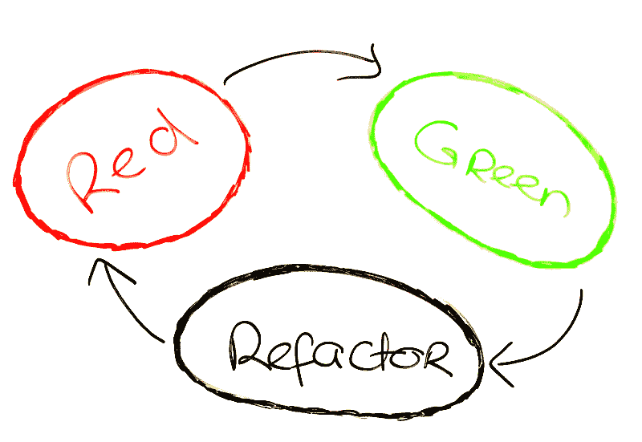
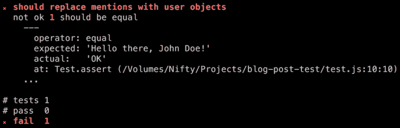
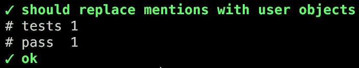

# 动作要快，不要弄坏东西

> 原文：<https://www.freecodecamp.org/news/how-test-driven-development-increased-my-confidence-of-shipping-new-code-without-breaking-things-a759a570bd95/>

吉多·施密茨

Red light, green light, refactor — Test Driven Development’s three steps

# 动作要快，不要弄坏东西

#### 测试驱动开发简介

当我开始写代码的时候，我从来没有写过任何测试。我假设我的代码不包含任何错误。我想，当我在这里或那里更改一行代码，或者完全发布新功能时，一切都会继续工作。

伙计，我错了。

当我的应用程序保持正常运行时，奇怪的错误开始出现。随着我的代码库的增长，事情变得越来越糟。

很快，每当向我的代码库添加新代码时，我都会感到焦虑，认为我的下一行代码可能会导致整个应用程序崩溃。

那时我发现了测试驱动开发(TDD)。

TDD 是一种方法，可以在发布新特性时增加您的信心。这降低了您破坏应用程序的可能性。

当开始 TDD 时，有三个简单的规则你应该遵守:

1.  在编写任何生产代码之前，先编写一个失败的测试
2.  一次写一个测试，在继续之前确保它失败
3.  除了通过当前失败的测试所必需的，不要写更多的产品代码

然后你可以进去重构你写的产品代码。

整个过程通常被称为红灯(测试失败)->绿灯(通过测试)->重构

### 收获利益

通过遵循这三条规则，TDD 可以帮助您:

*   **调试。想象一下，在一个项目中，你*永远不会*以几个模块被撕成碎片而告终，希望你能在截止日期前将它们重新组装起来。**
*   **勇气。**如果你有一个漂亮的设计和架构，但是没有测试，你仍然害怕改变代码。同时，如果你有一套广泛的测试，你可以回去安全地重构不合标准的代码。
*   **文档。单元测试就像代码示例。当您想知道如何调用一个方法时，您可以随时准备好调用该方法的测试，并且这些测试不会与您的产品代码不同步。**
*   **设计。根据定义，**每个模块都是*可测试的*。而*可测试*的另一个说法是*解耦*。为了首先编写您的测试，您必须将您正在测试的单元与系统的其余部分分离。这种做法是非常宝贵的。
*   **专业精神。**鉴于这些好处是真实的，底线是不采用产生这些好处的实践将是*不专业的*。

### 构建您的测试

每个测试都应该遵循这样的结构:

*   **设置:**模仿一个函数或向数据库添加一些行
*   **执行:**调用您想要测试的方法
*   **断言:**验证你的结果是正确的
*   **拆除:**清理修改过的数据库记录或被模仿的对象

如果你想了解更多关于测试结构的知识，这里有一个很好的读物，它将向你展示一些编写单元测试的最佳(和最差)实践:

[**编写伟大的单元测试:最佳和最差的实践**](http://blog.stevensanderson.com/2009/08/24/writing-great-unit-tests-best-and-worst-practises/)
[*好的单元测试和差的单元测试有什么区别？你如何学习如何写好单元测试？很远…*blog.stevensanderson.com](http://blog.stevensanderson.com/2009/08/24/writing-great-unit-tests-best-and-worst-practises/)

### 将 TDD 融入您的工作流程

让我带您看一个真实世界中一步一步的 TDD 示例。

我们将创建一个函数来检测字符串中的特定提及格式，并用用户名替换它。提及格式如下所示:

@(用户标识)

现在我们有了一个简单的案例，我们将为它编写一个测试。在这个例子中，我将使用 JavaScript [Tape](https://github.com/substack/tape) 测试框架，因为它相对容易使用:

我创建了一个名为*parse-mentionable-text . js*的文件，它返回“OK”。

#### 红灯

让我运行测试，看看它是否失败。

很好。当测试失败时，我们可以确定功能在我们开始时不起作用。

这是重要的一步。在一个大的代码库中，你有时可以为一个逻辑编写一个测试，但是由于一些副作用，当你预期它会失败时，它会让你吃惊，并且实际上通过了。这意味着你需要重新设计你的测试。记住——你必须从失败的测试开始。

#### 绿灯

在我们的测试失败后，我们必须用最少的代码通过这个测试:

为了检查我们的实现是否满足我们的需求，我们必须再次运行测试:

#### 重构

太好了！一切都按照我们想要的方式运行。现在是时候清理代码了，让它更漂亮，更易读:

最好的部分是在你重构了你的代码之后，你可以通过再次运行测试来检查这个函数是否仍然满足你的需求。

首先编写测试将会改变你的编码方式。在发布新代码时，它会增加您的信心。这会减少你对打碎东西的恐惧，帮助你更快地移动。

你想了解更多关于测试驱动开发的知识吗？

如果你正在使用 ReactJS，我也写了一篇关于测试你的 React 组件的文章，你可以在这里查看[。](https://medium.com/javascript-world/testing-your-react-components-with-enzyme-5f1c7f185b58#.nsfy9ymuk)

我每周都会发一些关于 JavaScript & ReactJS 的有趣文章。
*[**您可以在这里订阅获得免费的 JavaScript 知识**](http://bit.ly/1R9Qwd9d2) **。***

*哦，又点击了？下面，所以其他人会看到这篇文章在媒体上。感谢阅读。*

